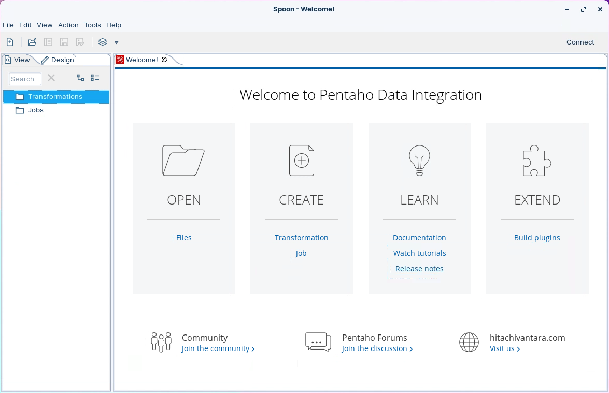
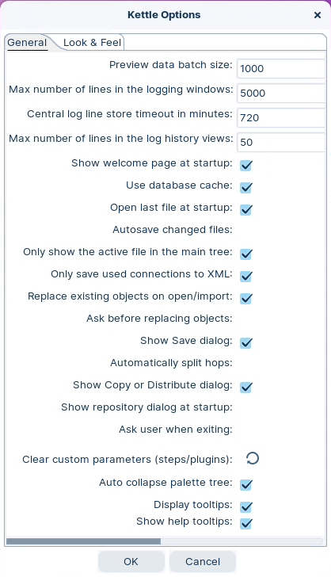
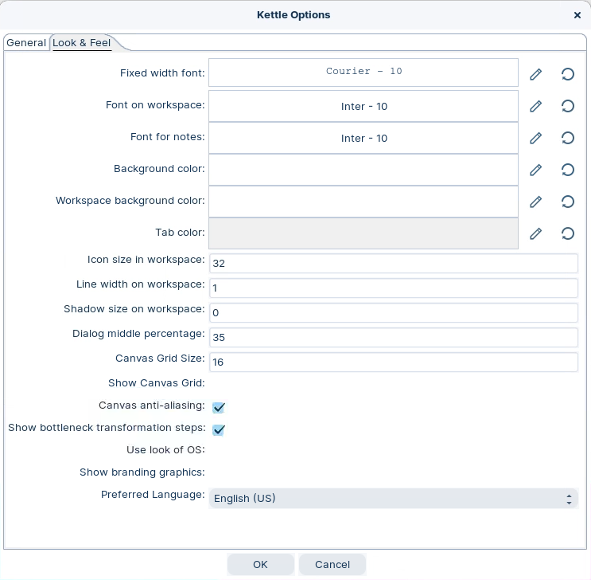
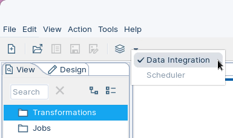

# Configuring PDI UI

> **Warning:**
>
> #### Workshop - Configuring PDI
>
> Configure Spoon before you build transformations and jobs. Set a few defaults that speed up daily work.
>
> You will start Spoon, review the Welcome page, and update UI options.
>
> **What you'll do**
>
> * Start Spoon and confirm your install.
> * Find docs and community links from the Welcome page.
> * Update General and Look & Feel options.
> * Switch perspectives and understand what changes.
>
> You will finish with a clean, predictable workspace. You will know where to change these settings later.
>
> **Prerequisites:** Pentaho Data Integration installed and ready to launch
>
> **Estimated Time:** 15 minutes

---

> **Note:**
>
> #### **Configuring PDI UI**
>
> Use **Tools > Options** to configure Spoon. Start with **General** and **Look & Feel**.

:::: tabs

### 1. Welcome Page

> **Note:**
>
> #### **Welcome page**
>
> The Welcome page has links to:
>
> * Documentation
> * Community Forum

1. Start Pentaho Data Integration.

> **Note:**

::: tabs

### Windows (PowerShell)

> ```powershell
> Set-Location C:\Pentaho\design-tools\data-integration
> .\spoon.bat
> ```

### macOS / Linux

> ```bash
> cd ~/Pentaho/design-tools/data-integration
> ./spoon.sh
> ```

:::

<button data-launch="spoon" data-path="">Start: Pentaho Data Integration</button>

2. The Pentaho Data Integration UI - Spoon will be displayed.

<figure><figcaption><p>Welcome screen</p></figcaption></figure>

### 2. Modify Look & Feel

> **Note:**
>
> #### **Kettle Options**
>
> Set a few defaults once. It reduces prompts and visual noise.

1. In Spoon, click **Tools > Options**.
2. Open the **General** tab.

<div align="center"><figure><figcaption><p>kettle options - general</p></figcaption></figure></div>

* [ ] Uncheck the ‘Show tips at startup?’ checkbox.
* [ ] Uncheck the ‘Use database cache’ checkbox.
* [ ] Uncheck the ‘Show repository dialog at startup?’ checkbox.
* [ ] Uncheck the ‘Ask user when exiting?’ checkbox.

> **Under the hood:**
>
> #### That checkbox controls a metadata cache, not your data
>
> **Use database cache** tells Spoon to remember what it learns about a
> connection — table names, column names and types — and save it to
> disk in your `.kettle` folder, so the next **Get Fields** or SQL
> preview doesn't have to ask the database again. It never caches
> rows; only the *shape* of tables.
>
> Unchecking it means every dialog re-reads the live schema. That is a
> touch slower on a large database and exactly what you want while you
> are still creating and altering tables, as the workshops ahead do: a
> cached column list can lag behind an `ALTER TABLE` and make a step
> insist a column doesn't exist when it plainly does.
>
> **Why it matters:** when a step "can't see" a column you just added,
> the cache is the first suspect. Right-click the connection in the
> **View** tab and choose **Clear DB Cache** — no restart needed.

3. Open the **Look & Feel** tab.
4. Review these settings and update as needed:
   * **Grid size** and **snap** behavior.
   * Canvas look (colors, anti-aliasing).
   * **Preferred language** and **alternative language**.

<figure><figcaption><p>Kettle options - look & feel</p></figcaption></figure>

<div class="pcm-embed-card" data-href="https://docs.pentaho.com/pdia-data-integration/get-started-with-the-pdi-client-1/customize-the-pdi-client" data-title="View external resource"></div>

### 3. Perspectives

> **Note:**
>
> #### **Perspectives**
>
> Use perspectives to switch your workspace. You can move between design and scheduling views.
>
> Switch between:
>
> * Designing ETL jobs and transformations
> * Scheduling jobs and transformations
>
> Click the **Perspective** icon in the toolbar to switch.

<div align="center"><figure><figcaption><p>Perspectives</p></figcaption></figure></div>

> **Note:** You must connect to a repository to schedule jobs and transformations.

<div class="pcm-embed-card" data-href="https://docs.pentaho.com/pdia-data-integration/get-started-with-the-pdi-client-1/use-the-pdi-client-perspectives" data-title="View external resource"></div>

::::

## Lab Files

_No bundled files for this lab._
