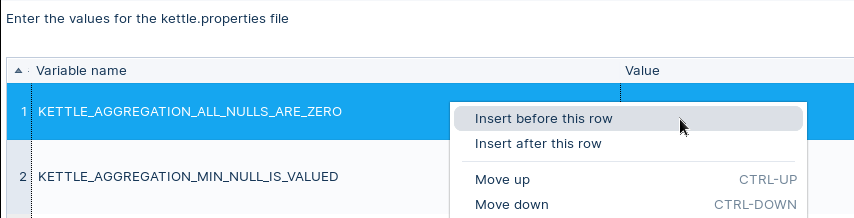
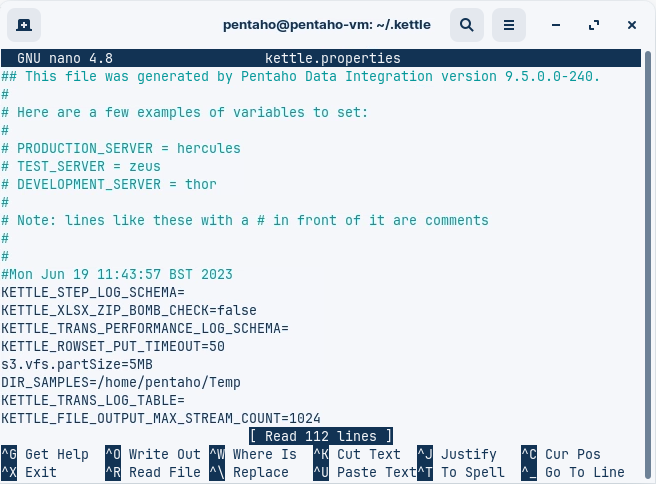
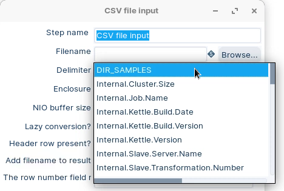

# KETTLE Variables

> **Warning:**
>
> #### Workshop - Kettle Variables
> 
> Use variables to avoid hardcoded paths and values.
> 
> Use `kettle.properties` to store global variables for Spoon.
> 
> In this workshop, you will create a global variable. You will then use it in a transformation.
> 
> **What you'll do**
> 
> * Access and edit the kettle.properties configuration file
> * Define a global variable for jobs and transformations
> * Use both variable formats (`${VAR}` and `%%VAR%%`)
> * Insert variables with `Ctrl+Space`
> 
> **Prerequisites:** Pentaho Data Integration installed and configured
> 
> **Estimated Time:** 10 minutes

> **Note:**
>
> #### **Global Variables - kettle.properties**
> 
> Variables can be used throughout Pentaho Data Integration, including in transformation steps and job entries. You define variables by setting them with the Set Variable step in a transformation or by setting them in the kettle.properties file in the directory.
> 
> Use variables by either retrieving them with the Get Variable step or by using metadata strings like:
> 
> * `${VARIABLE}`
> * `%%VARIABLE%%`
> 
> You can mix both formats. The first is Unix-style. The second is Windows-style.
> 
> Fields that support variables show the blue `${}` icon.
> 
> Press `Ctrl+Space` to insert a variable in those fields. Hover over the icon to see help.

<div class="pcm-embed-card" data-href="https://www.loom.com/share/89d5419da317432eb272b583e30f8904?hideEmbedTopBar=true&amp;hide_owner=true&amp;hide_share=true&amp;hide_title=true" data-title="Defining and Managing Variables in Kettle.Properties" data-description="In this video, I demonstrate how to define variables in the Kettle.Properties file and view the variables currently loaded into memory using Spoon. I guide you through the process of editing the Kettle.Properties file to add new variables, specifically for our sales database server name and database name, while emphasizing the importance of using case sensitivity. After editing, I show you how these new variables appear in the run dialog, confirming they are loaded into memory. Please remember that this file is meant for global variables across environments, and I recommend creating separate properties files for specific transformations or jobs. Your action is to review the steps and consider how you might implement variable definitions in your own projects." data-thumb="../_assets/embeds/2d94cd73b9b2.png"></div>

1. Start Pentaho Data Integration.

> **Note:** 

::: tabs

### Windows (PowerShell)

> 
> ```powershell
> Set-Location C:\Pentaho\design-tools\data-integration
> .\spoon.bat
> ```
> 
>

### macOS / Linux

> 
> ```bash
> cd ~/Pentaho/design-tools/data-integration
> ./spoon.sh
> ```
> 
>

:::

<button data-launch="spoon" data-path="">Start PDI</button>

2. Select Edit -> Edit the kettle.properties file
3. Highlight the first row and right mouse click, and select the following option.



4. Add a `DIR_SAMPLES` variable for your OS.

::: tabs

### Windows

Add this line:

```properties
DIR_SAMPLES=C:/Temp
```

### Linux/macOS

Add this line:

```properties
DIR_SAMPLES=/home/pentaho/Temp
```

:::

5. Save.

> **Note:** Spoon loads `kettle.properties` on startup.
> 
> If variables do not show up, restart Spoon.

> **Note:** You can also edit `kettle.properties` manually.
> 
> Default locations:
> 
> * Windows: `C:\Users\<username>\.kettle\kettle.properties`
> * Linux/macOS: `~/.kettle/kettle.properties`
> 
> The PowerShell script uses [nano](https://github.com/okibcn/nano-for-windows) which was installed using [scoop](https://scoop.sh/)

6. Open a terminal.

::: tabs

### Windows (PowerShell)

```powershell
cd \
cd Workshop--Data-Integration\Scripts
.\edit-kettle.properties.ps1
```

### Linux/macOS

```bash
cd
cd ~/.kettle
nano kettle.properties
```

:::



> **Note:** Verify in Spoon:
> 
> 1. Open any step property that shows the blue `${}` icon.
> 2. Press `Ctrl+Space`.
> 3. Search for `DIR_SAMPLES`.
> 4. Insert it into the field.



<div class="pcm-embed-card" data-href="https://docs.pentaho.com/pdia-data-integration/data-integration-perspective-in-the-pdi-client/advanced-topics-pdi-perspective/pdi-run-modifiers/variables/kettle-variables" data-title="Kettle Variables | Pentaho" data-thumb="../_assets/embeds/267325a87400.png"></div>

## Lab Files

Click a file to download. For `.ktr` and `.kjb` files, **Open in Pentaho Data Integration** launches PDI with the file loaded. If PDI is already running, the path is copied to your clipboard — switch to PDI and use Ctrl+O, Ctrl+V, Enter.

[kettle.properties](./files/kettle.properties)
