# Hello World

> **Warning:**
>
> #### Workshop - Hello World
> 
> Build a minimal transformation in Spoon. Use steps, hops, and notes. Preview data and review execution metrics.
> 
> **What you’ll do**
> 
> * Create a transformation
> * Add and configure **Generate Rows** and **Dummy**
> * Connect steps with hops
> * Add a note to document the flow
> * Preview data from a step
> * Run the transformation and review results
> 
> **Prerequisites:** Pentaho Data Integration installed and configured
> 
> **Estimated time:** 10 minutes

<div class="pcm-embed-card" data-href="https://www.loom.com/share/cb9fa033ddcf46c6b7d17c532c16ac66?hideEmbedTopBar=true&amp;hide_owner=true&amp;hide_share=true&amp;hide_title=true" data-title="Introduction to Data Transformation with PDI" data-description="In this demonstration, I introduced you to your first transformation, showcasing its execution and results. We explored a CSV file input step that reads sales territory data, filtering records based on the EMEA territory for separate database table outputs. After executing the transformation, we verified that the data was inserted correctly into the respective tables. I encourage you to familiarize yourself with the Spoon Log and Step Metrics as we progress through the course. This overview sets the stage for deeper learning about PDI and its components in future lessons." data-thumb="../_assets/embeds/e58507fe6110.png"></div>

> **Note:** **Create a new transformation**
> 
> Use any of these options to open a new transformation tab:
> 
> * Select **File** > **New** > **Transformation**
> * Use `Ctrl+N` (Windows/Linux) or `Cmd+N` (macOS)


:::: tabs

### 1. Generate Rows

> **Note:**
>
> #### **Generate Rows**
> 
> Generate Rows outputs a specified number of rows. By default, the rows are empty. You can also generate static fields for test data. For example, generate 12 rows for 12 months.
> 
> Generate Rows is also useful as a single-row “starter” step.

1. Start Pentaho Data Integration (Spoon).

> **Note:** 

::: tabs

### Windows (PowerShell)

> 
> ```powershell
> Set-Location C:\Pentaho\design-tools\data-integration
> .\spoon.bat
> ```
> 
>

### macOS / Linux

> 
> ```bash
> cd ~/Pentaho/design-tools/data-integration
> ./spoon.sh
> ```
> 
>

:::

<button data-launch="spoon" data-path="">Start PDI</button>

2. In the **Design** tab, expand the `Input` category.
3. Drag **Generate Rows** onto the canvas.

> **Note:** Tip: You can also search for `Generate Rows`.

<div align="center"><figure>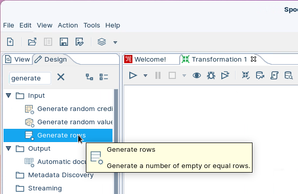<figcaption><p>Generate rows</p></figcaption></figure></div>

4. Double-click **Generate Rows** to open the step properties.

<figure>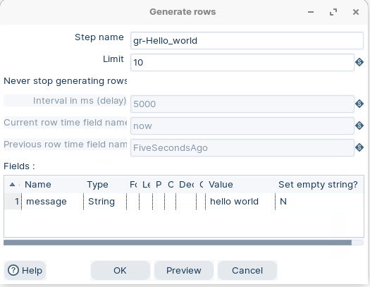<figcaption><p>Generate rows - settings</p></figcaption></figure>

Ensure the following details are configured:

| **Step name** | gr\_hello-world |
| ------------- | --------------- |
| **Limit**     | 10              |
| **Name**      | message         |
| **Type**      | string          |
| **Value**     | hello world     |

> **Note:** Before you close the dialog, preview the data.

5. Select **Preview**. The **Enter preview size** dialog opens.

<figure>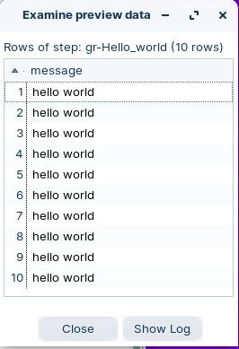<figcaption><p>Preview rows</p></figcaption></figure>

6. In **Enter preview size**, select **OK**.
7. Verify the 10 rows. Then select **OK** to close the preview dialog.
8. Select **OK** to close the **Generate Rows** dialog.

### 2. Dummy

> **Note:**
>
> #### **Dummy**
> 
> The Dummy step does not process records. Use it as a placeholder during development. It is handy when you need a second step to connect.

1. In the **Design** tab, expand the `Flow` category.
2. Drag **Dummy** onto the canvas.

<div align="center"><figure>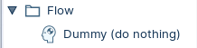<figcaption><p>dummy step</p></figcaption></figure></div>

### 3. Hops, Annotations, etc

> **Note:**
>
> #### **Hops**
> 
> Hops define row flow between steps. PDI buffers rows between steps as the transformation runs.

1. Select the `gr_hello-world` step.
2. Hold down the Shift key.
3. Drag and drop the hop onto the Dummy step.
4. Release the Shift key.

**Add a note**

1. Right-click anywhere on the Spoon canvas.
2. Select **New note**.

<div align="left"><figure>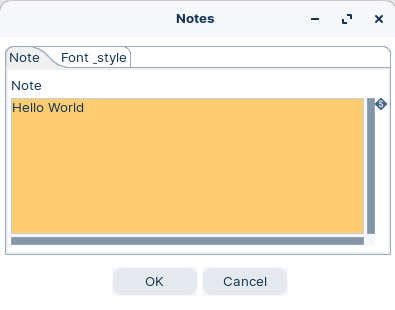<figcaption><p>Notes</p></figcaption></figure> <figure>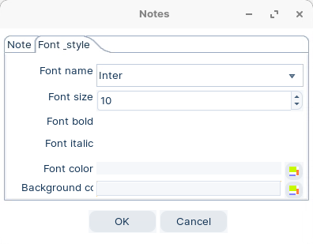<figcaption><p>Notes - Style</p></figcaption></figure></div>

**Transformation properties**

To view the transformation properties:

1. Double-click anywhere on the canvas.

<div align="center"><figure>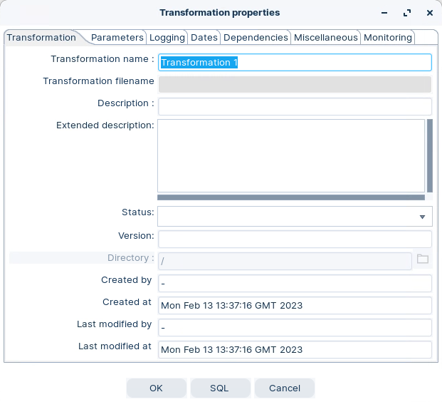<figcaption><p>transformation properties</p></figcaption></figure></div>

> **Note:** Tip: Add details in **Extended description**.

### 4. Run

> **Note:**
>
> #### Run the transformation
> 
> Run the transformation locally.

1. In Spoon, select **Action** > **Run this transformation**.

> **Note:** You can also select **Run** in the toolbar.
> 
> The **Execute a transformation** window opens. For this workshop, keep **Local** execution.

2. In the run dialog, open **Run options**.

<div align="center"><figure>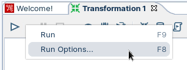<figcaption><p>Run Options</p></figcaption></figure></div>

> **Note:** In the Run Options panel you can set:
> 
> * **Run configuration** (local, remote, or cluster)
> * **Log level**
> * **Automatically save** the transformation

<div align="center"><figure>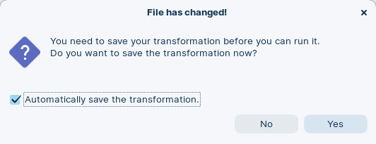<figcaption><p>Automatically save transformation</p></figcaption></figure></div>

The transformation executes.

<figure>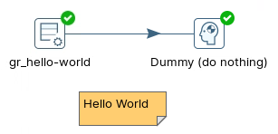<figcaption><p>Green ticks indicate successful execution</p></figcaption></figure>

> **Warning:** A green tick confirms the transformation's execution, but doesn't guarantee the success of the underlying operations.

> **Note:** **Execution Results**
> 
> The Execution Results section of the window contains several different tabs that help you to see how the transformation executed, pinpoint errors, and monitor performance.

<div align="center"><figure>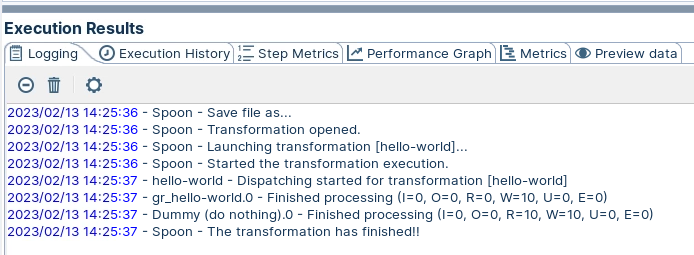<figcaption><p>Logging</p></figcaption></figure></div>

Logging tab displays logging information for each of the steps in the transformation.

<figure>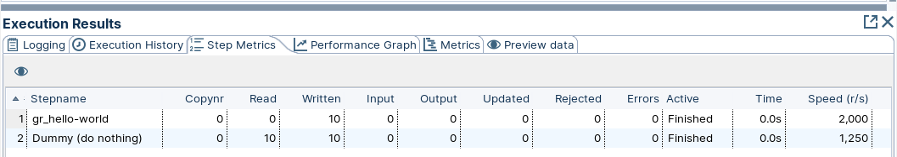<figcaption><p>Step Metrics</p></figcaption></figure>

> **Note:** Step Metrics tab provides statistics for each step in your transformation including how many records were read, written, caused an error, processing speed (rows per second) and more. This tab also indicates whether an error occurred in a transformation step.

<figure>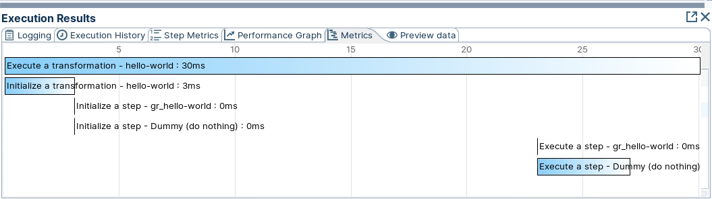<figcaption><p>Metrics</p></figcaption></figure>

> **Note:** Metrics can help identify bottlenecks (back pressure). In this example, the transformation took 30 ms. Notice `gr_hello-world` and `Dummy` initialize at the same time. Steps run in parallel in separate threads.

<figure>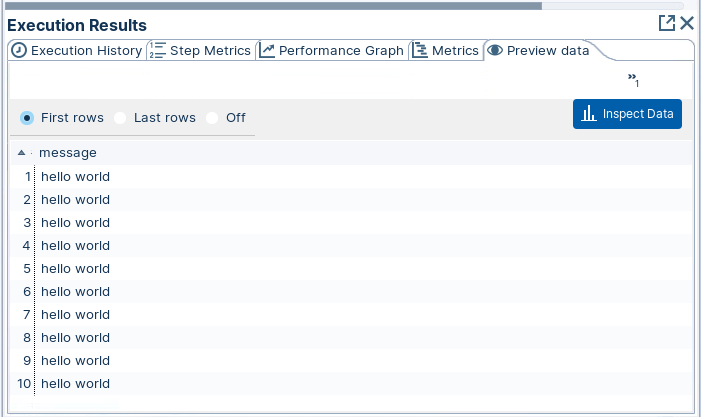<figcaption><p>Preview data</p></figcaption></figure>

> **Note:** Preview tab displays the records.

> **Note:** **Viewing the Transformation structure**
> 
> Select the **View** icon (upper-left). The tree switches to the structure of the transformation.

<div align="center"><figure>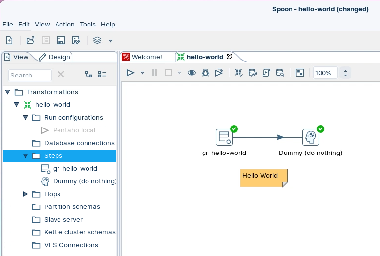<figcaption><p>View</p></figcaption></figure></div>

::::

## Lab Files

Click a file to download. For `.ktr` and `.kjb` files, **Open in Pentaho Data Integration** launches PDI with the file loaded. If PDI is already running, the path is copied to your clipboard — switch to PDI and use Ctrl+O, Ctrl+V, Enter.

[tr_hello_world.ktr](./files/tr_hello_world.ktr) <button data-launch="spoon" data-path="files/tr_hello_world.ktr">Open in Pentaho Data Integration</button> <button data-graph="files/tr_hello_world.ktr">View graph</button>
