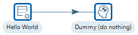
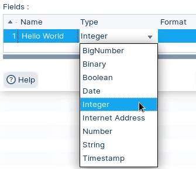
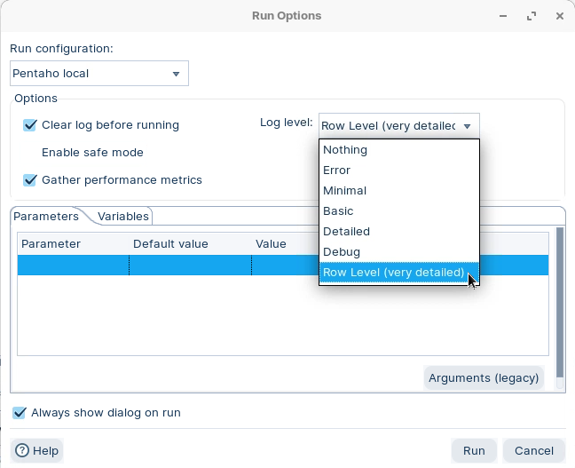
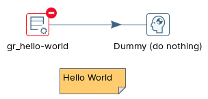
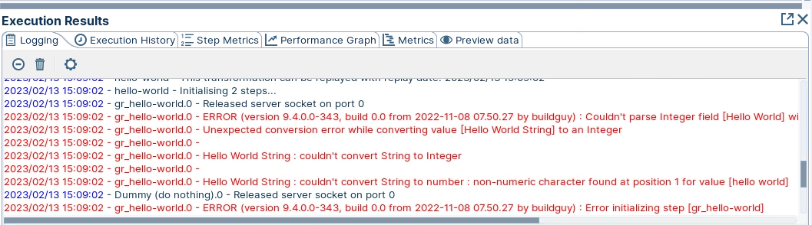
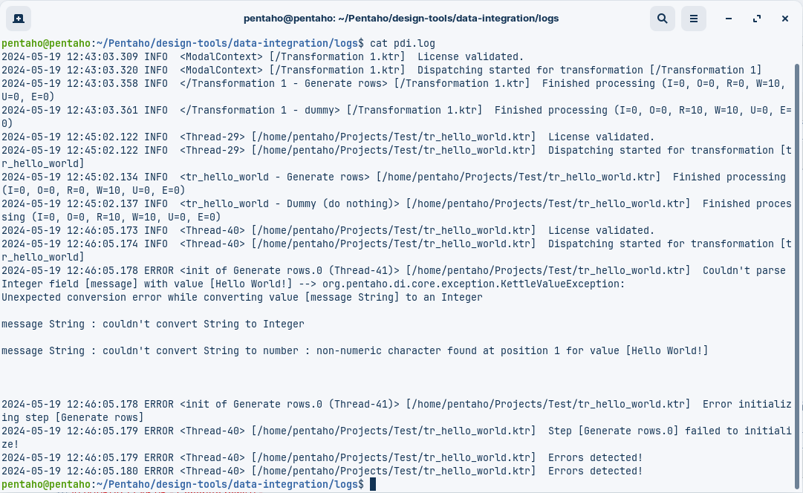

# Logging

> **Warning:**
>
> #### Workshop - Logging
> 
> Use logging to diagnose transformation problems. Create a controlled type mismatch error. Use log level and output to find the cause.
> 
> **What you’ll do**
> 
> * Change field metadata to trigger an error
> * Run with **Basic** and **Row level** logging
> * Use **Execution results** to find the failing step
> * Locate the same error in `pdi.log`
> 
> **Prerequisites:** Complete the **Hello World** workshop
> 
> **Estimated time:** 5 minutes

> **Note:** **Create a new transformation**
> 
> Use any of these options to open a new transformation tab:
> 
> * Select **File** > **New** > **Transformation**
> * Use `Ctrl+N` (Windows/Linux) or `Cmd+N` (macOS)

:::: tabs

### 1. Modify Generate Rows

> **Note:** Start from the transformation you built in **Hello World**.

> **Note:**
>
> #### **Generate Rows**
> 
> Generate Rows is a test-data step. It is a quick way to validate logging and error handling.

> **Warning:** To create an error, change the field type for `message` from **String** to **Integer**.

1. Double-click the **Generate Rows** step.
2. Change the type for `message` to **Integer**.

<figure><figcaption>
Change data type
</figcaption></figure>

3. Select **OK**.

### 2. Run

> **Note:**
>
> #### Run the transformation
> 
> Run with a higher log level to see row-level detail.

1. Select **Run** in the canvas toolbar.
2. Set **Log level** to **Basic**.
3. Select **Run**.
4. Run again with **Log level** set to **Row level**.

<figure><figcaption>
Set row level debugging
</figcaption></figure>

5. Select **Run**. The failing step is highlighted.

<figure><figcaption>
Error in step
</figcaption></figure>

6. In **Execution results**, open the **Log** tab.

<figure><figcaption>
Logging - error
</figcaption></figure>

The error text is in the log output. Look for the first **ERROR** entry.

> **Note:** Tip: Select the minus icon to show errors only.
> 
> The same error is written to `pdi.log`:
> 
> 

::: tabs

### Windows

> `C:\\Pentaho\\design-tools\\data-integration\\logs\\pdi.log`
>

### macOS / Linux

> `~/Pentaho/design-tools/data-integration/logs/pdi.log`
>

:::

<figure><figcaption>
pdi.log - Linux
</figcaption></figure>

::::

Next workshop: **Error Handling**

## Lab Files

_No bundled files for this lab._
