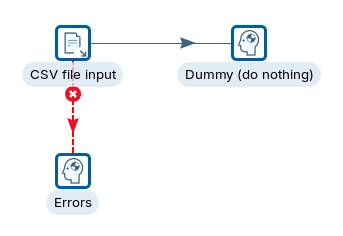
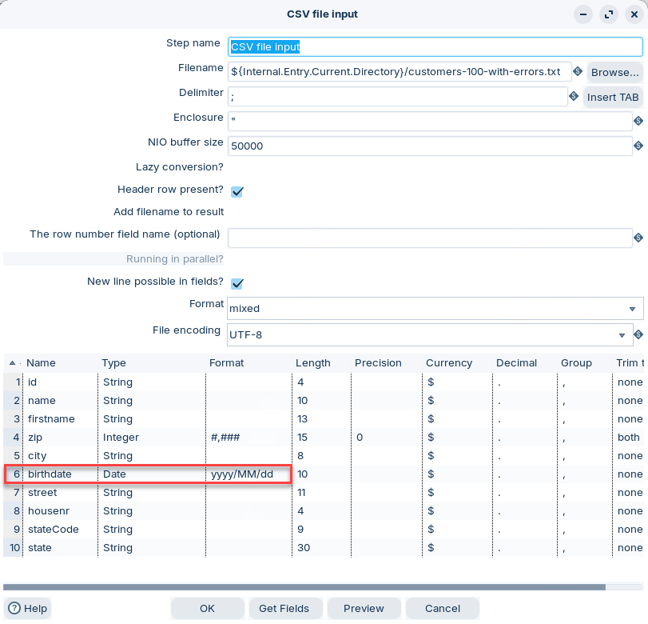
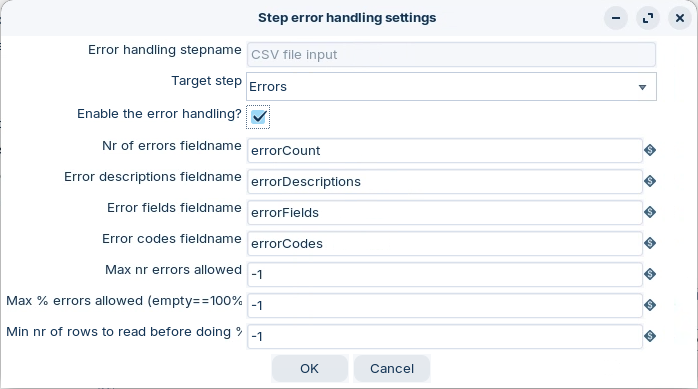
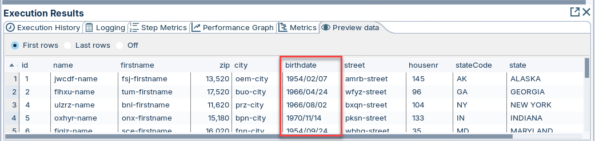
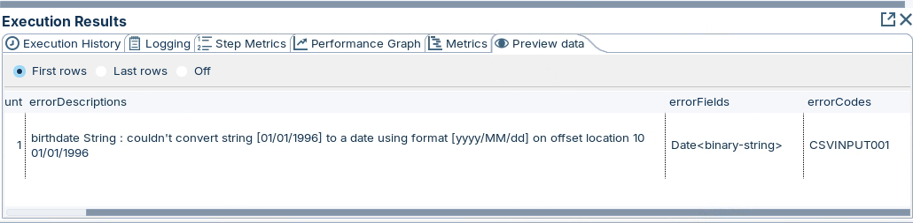

# Error Handling

> **Warning:**
>
> #### Workshop - Error Handling
> 
> Bad data happens. Don’t fail the whole transformation because of a few rows. Route error rows to a separate stream for review and cleanup.
> 
> **What you’ll do**
> 
> * Read a CSV with a date field
> * Trigger a controlled date parsing error
> * Configure an error hop to capture failing rows
> * Review the error metadata fields (description, field name, error code)
> * Fix the date format and verify success
> 
> **Prerequisites:** Complete the **Hello World** and **Logging** workshops
> 
> **Estimated time:** 10 minutes

> **Note:** **Create a new transformation**
> 
> Use any of these options to open a new transformation tab:
> 
> * Select **File** > **New** > **Transformation**
> * Use `Ctrl+N` (Windows/Linux) or `Cmd+N` (macOS)

::: tabs

### 1. CSV file input

> **Note:**
>
> #### **CSV file input**
> 
> The CSV File Input step reads data from delimited text files into a PDI transformation. While this step is called CSV File Input, you can also use CSV File Input with many other separator types, such as pipes, tabs, and semicolons.
> 
> **Note:** The semicolon (;) is set as the default separator type for this step.

1. Double-click to edit the CSV file input step.

<figure><figcaption>
CSV file input
</figcaption></figure>

2. Set the following metadata properties for: birthdate

| Fieldname | Type | Format     |
| --------- | ---- | ---------- |
| birthdate | date | yyyy/MM/dd |

> **Warning:** If your CSV uses a different date pattern, keep `yyyy/MM/dd` for now. This mismatch is what triggers the error rows in the next step.

### 2. Error hop

> **Note:**
>
> #### Error hop
> 
> An error hop routes rows that fail in a step to a separate target step. This lets you keep processing valid rows. You also get extra error fields in the error stream.

1. Double-click the white diagonal cross on the red error hop.

<figure><figcaption>
Hop - Error handling
</figcaption></figure>

2. Set the error field names (you can pick your own).

* **Nr of errors fieldname**: Number of errors for the row.
* **Error descriptions fieldname**: Human-readable error message.
* **Error field fieldname**: The field that caused the error.
* **Error codes fieldname**: A code you can filter or group by.

### 3. Run

> **Note:**
>
> #### Run the transformation
> 
> Preview both streams. One contains valid rows. One contains error rows plus error metadata.

1. Select **Run** in the canvas toolbar.
2. Preview the **Dummy** step:

<figure><figcaption>
Correct birthdate format
</figcaption></figure>

3. Preview the **Dummy - Errors** step:

<figure><figcaption>
Errors for incorrectly formatted birthdates
</figcaption></figure>

4. Scroll to the end of the **Execution results** pane.

> **Note:** Use `errorCodes` to route errors into targeted cleanup logic.

**Fix the format and verify**

1. Open **CSV file input** again.
2. Update the **Format** value for `birthdate` to match your CSV.

> **Note:** Example: if your data looks like `2026-02-17`, use `yyyy-MM-dd`.

3. Run the transformation again.
4. Preview **Dummy - Errors**. You should see fewer rows, or none.

:::

## Lab Files

_No bundled files for this lab._
