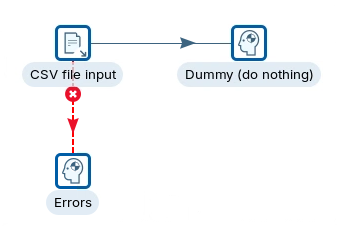
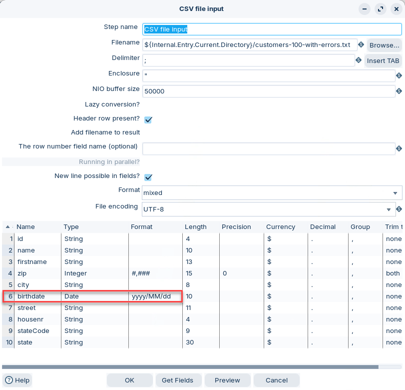
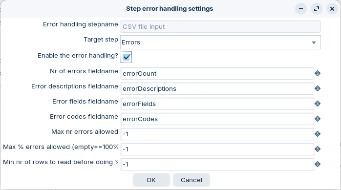
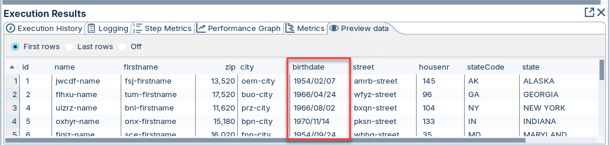
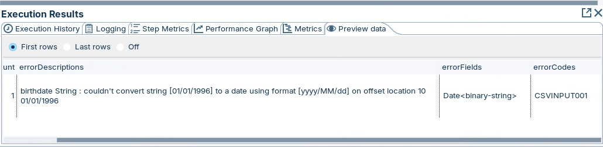

# Error Handling

> **Warning:**
>
> #### Workshop - Error Handling
> 
> Bad data happens. Don’t fail the whole transformation because of a few rows. Route error rows to a separate stream for review and cleanup.
> 
> **What you’ll do**
> 
> * Read a CSV with a date field
> * Trigger a controlled date parsing error
> * Configure an error hop to capture failing rows
> * Review the error metadata fields (description, field name, error code)
> * Decide what to do with the rows that fail
> 
> **Prerequisites:** Complete the **[Hello World](../03-mod2-hello-world/guide.md)** and **[Logging](../04-mod2-logging/guide.md)** workshops
> 
> **Estimated time:** 10 minutes

> **Note:** **Create a new transformation**
> 
> Use any of these options to open a new transformation tab:
> 
> * Select **File** > **New** > **Transformation**
> * Use `Ctrl+N` (Windows/Linux) or `Cmd+N` (macOS)

::: tabs

### 1. CSV file input

> **Note:**
>
> #### **CSV file input**
> 
> The CSV File Input step reads data from delimited text files into a PDI transformation. While this step is called CSV File Input, you can also use CSV File Input with many other separator types, such as pipes, tabs, and semicolons.
> 
> **Note:** The semicolon (;) is set as the default separator type for this step.

1. Save the transformation as `tr_error_handling.ktr` in the lab folder, `C:\Workshop-DI-Practitioner\02-components-concepts\02-key-concepts\05-mod2-error-handling`, next to `customers-100-with-errors.txt` (or download the file from **Lab Files** below into the folder you save in). Saving first gives `${Internal.Entry.Current.Directory}` a value.
2. Drag **CSV file input** onto the canvas and double-click it.
3. Set **Filename** to `${Internal.Entry.Current.Directory}/customers-100-with-errors.txt`, keep the **Delimiter** `;`, and select **Get Fields**.

<figure><figcaption>
CSV file input
</figcaption></figure>

4. Set the following metadata properties for: birthdate

| Fieldname | Type | Format     |
| --------- | ---- | ---------- |
| birthdate | date | yyyy/MM/dd |

> **Warning:** Keep `yyyy/MM/dd`. Almost every row uses it; the few that don't are what trigger the error rows in the next step.

5. Add two **Dummy (do nothing)** steps. Hop **CSV file input** to the first. Name the second `Errors`.

### 2. Error hop

> **Note:**
>
> #### Error hop
> 
> An error hop routes rows that fail in a step to a separate target step. This lets you keep processing valid rows. You also get extra error fields in the error stream.

1. Right-click **CSV file input**, choose **Error Handling...**, and set **Target step** to `Errors`. The hop to `Errors` turns red with a white diagonal cross; double-click that cross to come back to these settings.

<figure><figcaption>
Hop - Error handling
</figcaption></figure>

2. Set the error field names (you can pick your own).

* **Nr of errors fieldname**: Number of errors for the row.
* **Error descriptions fieldname**: Human-readable error message.
* **Error field fieldname**: The field that caused the error.
* **Error codes fieldname**: A code you can filter or group by.

### 3. Run

> **Note:**
>
> #### Run the transformation
> 
> Preview both streams. One contains valid rows. One contains error rows plus error metadata.

1. Select **Run** in the canvas toolbar.
2. Preview the **Dummy (do nothing)** step: 97 rows.

<figure><figcaption>
Correct birthdate format
</figcaption></figure>

3. Preview the **Errors** step: 3 rows, each with the four error fields.

<figure><figcaption>
Errors for incorrectly formatted birthdates
</figcaption></figure>

4. Scroll to the end of the **Execution results** pane.

> **Note:** Use `errorCodes` to route errors into targeted cleanup logic.

> **Under the hood:**
>
> #### The row failed; the step didn't
>
> Without an error hop, a value that won't parse throws an exception
> inside the step, the step stops, and the whole transformation stops
> with it. Defining error handling changes what the engine does with
> that exception: the step catches it, appends the four fields you
> named — count, description, field, code — to the offending row,
> pushes that row onto the red hop's row set, and carries on with the
> next row. The normal hop only ever sees rows that parsed.
>
> Nothing about *how* the date is validated changed. The same
> `yyyy/MM/dd` mask is applied to every row; only the fate of a row
> that fails it is different.
>
> **Why it matters:** one bad row in a million no longer costs you the
> other 999,999. And because rejects arrive as ordinary rows with the
> reason attached, "what do we do with bad data" becomes a visible
> branch on the canvas — a file, a table, an email — rather than a
> stack trace at 3am.

**Decide what to do with the error rows**

Read the three rows in **Errors**. Each one is bad *data*, not a wrong setting:

| Customer | Field       | Value        | Why it fails                                |
| -------- | ----------- | ------------ | ------------------------------------------- |
| 3        | `birthdate` | `01/01/1996` | Day/month/year, not the `yyyy/MM/dd` mask   |
| 18       | `id`        | `#18`        | Not an Integer                              |
| 66       | `housenr`   | `#11`        | Not an Integer                              |

Don't change the mask to make customer 3 pass: it is right for the other 97 rows, and changing it would send *them* to the error stream instead. In a real pipeline the `Errors` stream goes somewhere a person can act on it, such as a reject file or a table, while the good rows carry on.

:::

## Lab Files

Click a file to download. For `.ktr` and `.kjb` files, **Open in Pentaho Data Integration** launches PDI with the file loaded. If PDI is already running, the path is copied to your clipboard — switch to PDI and use Ctrl+O, Ctrl+V, Enter.

[customers-100-with-errors.txt](./files/customers-100-with-errors.txt) (PDI's own sample, from `data-integration\samples\transformations\files`)

### Solution <!-- no-step -->

The finished transformation for this lab. Open it alongside your own to compare, or run it to see the expected result: 97 rows to **Dummy (do nothing)** and 3 to **Errors**.

Also on disk at `C:\Workshop-DI-Practitioner\02-components-concepts\02-key-concepts\05-mod2-error-handling\solution`.

[tr_error_handling.ktr](./files/tr_error_handling.ktr) <button data-launch="spoon" data-path="files/tr_error_handling.ktr">Open in Pentaho Data Integration</button> <button data-graph="files/tr_error_handling.ktr">View graph</button>
