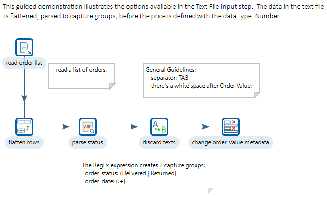
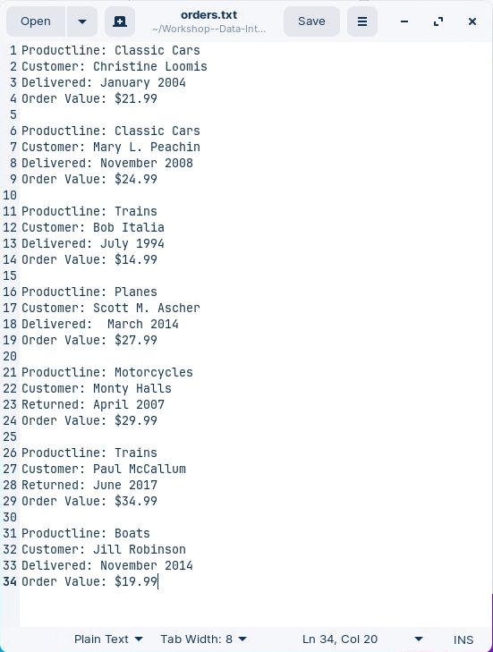
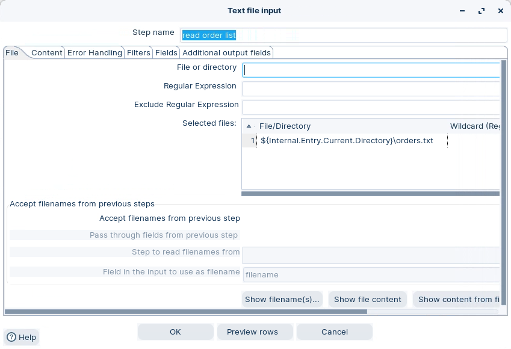
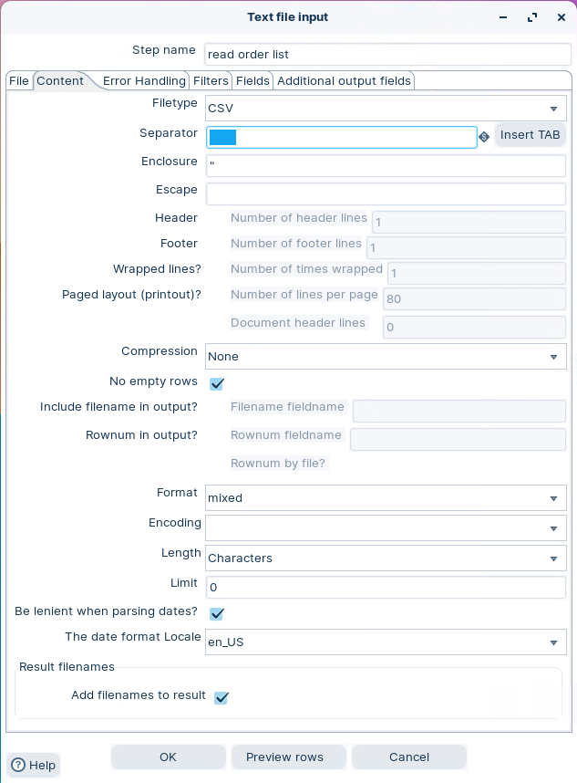
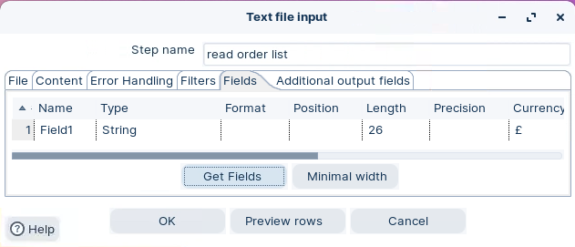
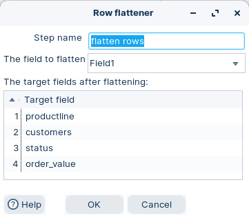
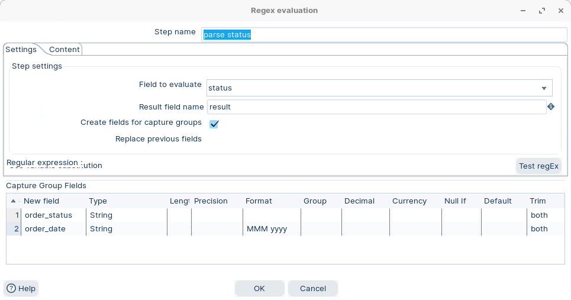
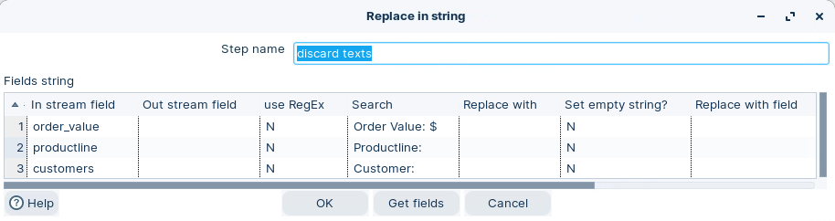
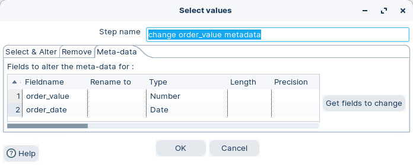
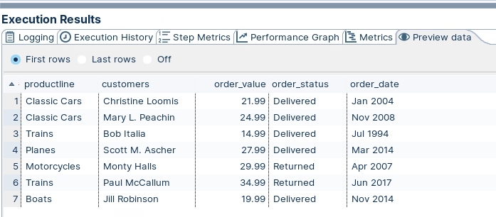

# Text File Input

> **Warning:**
>
> #### Workshop - Text File Input
> 
> Real-world data rarely arrives ready for loading. Text files often need parsing and cleansing before they can be analyzed.
> 
> In this workshop, you build a transformation that turns messy, multi-line Steel Wheels order records into clean, structured rows suitable for a database.
> 
> **What you'll do**
> 
> * Read unstructured text with Text file input
> * Convert multi-line records into single rows with the Flattener
> * Extract data patterns into capture groups with RegEx Evaluation
> * Clean strings by removing labels and symbols with Replace in string
> * Set data types and formats with Select values
> 
> **Prerequisites:** Understanding of basic transformation concepts (steps, hops, preview). Pentaho Data Integration installed and configured.
> 
> **Estimated time:** 30 minutes

<div class="pcm-embed-card" data-href="https://www.loom.com/share/6b3348c091764d08806280206bd53434?hideEmbedTopBar=true&amp;hide_owner=true&amp;hide_share=true&amp;hide_title=true" data-title="Defining Parameters in Transformations for Effective Data Management 📊" data-description="In this video, I demonstrate how to define parameters within a transformation using Spoon, highlighting their role as local variables compared to global variables. I walk you through viewing the current parameters and variables in memory, and I create two parameters: one for the delimiter character and another for the output file's extension. It's crucial to provide default values and descriptions for these parameters to avoid potential issues. I also explain how a parameter can override a variable if they share the same name. Please pay attention to these concepts, as they will be applied in the next demonstration video." data-thumb="../_assets/embeds/2d94cd73b9b2.png"></div>

> **Note:** **Create a new transformation**
> 
> Use any of these options to open a new transformation tab:
> 
> * Select **File** > **New** > **Transformation**
> * Use `Ctrl+N` (Windows/Linux) or `Cmd+N` (macOS)



> **Note:** Review the input file first. It will guide your parsing approach.



> **Note:** What to notice:
> 
> * Each order spans multiple lines.
> * Line 3 contains two values: order status and order date.
> * Order value includes a currency symbol ($).
> * There is inconsistent whitespace.

> **Note:** **Approach**
> 
> You will:
> 
> * Flatten multi-line records into a single row.
> * Extract values into new fields (capture groups).
> * Clean strings (remove labels and currency symbols).
> * Set data types and formats (date and number).

<div class="pcm-embed-card" data-href="https://www.loom.com/share/0646ed96c4734d16b6721c902f9c7e0e?hideEmbedTopBar=true&amp;hide_owner=true&amp;hide_share=true&amp;hide_title=true" data-title="String Operations for Data Cleaning and Transformation" data-description="In this video, I demonstrate how to use the string operation step to modify string values effectively. We focus on cleaning up the product code field by removing trailing spaces and retaining only numeric characters, while also addressing the country field by trimming spaces and converting all characters to uppercase. I guide you through configuring the string operation step, including naming conventions and the specific operations required for each field. Please ensure you follow along and replicate these steps in your own work to achieve similar results. Thank you for watching!" data-thumb="../_assets/embeds/2d94cd73b9b2.png"></div>

:::: tabs

### 1. Text File Input

> **Note:**
>
> #### Text File Input
> 
> Use **Text file input** to read the raw lines from `orders.txt`. Treat each line as a single string field for now.

1. Start Pentaho Data Integration (Spoon).

> **Note:** 

::: tabs

### Windows (PowerShell)

> 
> ```powershell
> Set-Location C:\Pentaho\design-tools\data-integration
> .\spoon.bat
> ```
> 
>

### macOS / Linux

> 
> ```bash
> cd ~/Pentaho/design-tools/data-integration
> ./spoon.sh
> ```
> 
>

:::

<button data-launch="spoon" data-path="">Start PDI</button>

2. In the **Design** tab, expand the `Input` category.
3. Drag **Text file input** onto the canvas.

> **Note:** Tip: You can also search for `Text file input`.

4. Double-click the step. Configure the file path:

<figure><figcaption><p>Add path to file</p></figcaption></figure>

> **Note:** Use a system variable so the path stays location-independent:
> 
> `${Internal.Transformation.Filename.Directory}/orders.txt`

5. Select the **Content** tab. Configure it like this:

<figure><figcaption><p>Text file input - Content</p></figcaption></figure>

6. Select **Fields**. Select **Get Fields**.

<figure><figcaption><p>Text File input - Fields</p></figcaption></figure>

> **Note:** The step returns one field named `Field1`. It has type **String**.

7. Optional: rename the step to **Read orders**.
8. Select **OK**.

### 2. Row flattener

> **Note:**
>
> #### Row Flattener
> 
> Use **Flattener** to turn repeating lines into a single output row.

1. Drag **Flattener** onto the canvas.
2. Create a hop from **Read orders**.
3. Double-click the step. Configure it like this:

<figure><figcaption><p>Row flattener</p></figcaption></figure>

4. Optional: rename the step to **Flatten rows**.
5. Select **OK**.

> **Note:** Each target field maps to one repeating line — target field 1 to line 1, and so on.

### 3. RegEx Evaluation

> **Note:**
>
> #### RegEx Evaluation
> 
> Use **RegEx Evaluation** to match a field against a regular expression and capture substrings into new fields.
> 
> Here you create two capture groups — `order_status` and `order_date` — with the pattern `(Delivered|Returned):(.+)`.

1. Drag **RegEx Evaluation** onto the canvas.
2. Create a hop from **Flatten rows**.
3. Double-click the step. Configure it like this:

<figure><figcaption><p>RegEx Evaluation</p></figcaption></figure>

> **Warning:** Set **Trim** to **both** for each field. This removes leading and trailing whitespace.

4. Optional: rename the step to **Parse status and date**.
5. Select **OK**.

> **Note:** **Summary**
> 
> * This RegEx uses 2 constructs, denoted by the brackets, and separated by a full colon.
> * `(Delivered|Returned)` matches either status.
> * `(.+)` matches any character sequence.
> * Use **Test RegEx** to verify capture groups.

A good introduction can be found at:

<div class="pcm-embed-card" data-href="https://regex101.com/" data-title="regex101: build, test, and debug regex" data-description="Regular expression tester with syntax highlighting, explanation, cheat sheet for PHP/PCRE, Python, GO, JavaScript, Java, C#/.NET, Rust." data-thumb="../_assets/embeds/c264d50371b0.png"></div>

### 4. Replace in String

> **Note:**
>
> #### Replace in string
> 
> Use **Replace in string** for search-and-replace, with optional regex and group references (`$n`).
> 
> Here you replace the `Order Value:` label with an empty string to clean the `order_value` field.

1. Drag **Replace in string** onto the canvas.
2. Create a hop from **Parse status and date**.
3. Double-click the step. Configure it like this:

<figure><figcaption><p>Replace in String</p></figcaption></figure>

4. Optional: rename the step to **Clean order value**.
5. Select **OK**.

> **Danger:** Use the exact label text, including the trailing space. If you enable regular expressions, use `Order Value:\s*`.

### 5. Select Values

> **Note:**
>
> #### Select values
> 
> The Select Values step is useful for selecting, removing, renaming, changing data types and configuring the length and precision of the fields on the stream. These operations are organized into different categories:
> 
> * Select and Alter — Specify the exact order and name in which the fields should be placed in the output rows
> * Remove — Specify the fields that should be removed from the output rows
> * Metadata — Change the name, type, length, and precision (the metadata) of one or more fields

1. Drag **Select values** onto the canvas.
2. Create a hop from **Clean order value**.
3. Double-click the step. Configure it like this:

<figure><figcaption><p>Select values</p></figcaption></figure>

| Fieldname    | Data Type | Format   |
| ------------ | --------- | -------- |
| order\_value | Number    | #.00     |
| order\_date  | Date      | MMM yyyy |

> **Note:** Optional: rename the step to **Set data types**.

### 6. RUN

> **Note:**
>
> #### Run the transformation
> 
> Run the transformation locally.

1. Click the Run button in the Canvas Toolbar.
2. Select the **Preview data** tab.

<figure><figcaption><p>Preview data</p></figcaption></figure>

> **Success:** You should now have clean fields such as `order_date`, `order_status`, and `order_value`.

::::

## Lab Files

Click a file to download. For `.ktr` and `.kjb` files, **Open in Pentaho Data Integration** launches PDI with the file loaded. If PDI is already running, the path is copied to your clipboard — switch to PDI and use Ctrl+O, Ctrl+V, Enter.

[orders.txt](./files/orders.txt)

[tr_read_text.ktr](./files/tr_read_text.ktr) <button data-launch="spoon" data-path="files/tr_read_text.ktr">Open in Pentaho Data Integration</button> <button data-graph="files/tr_read_text.ktr">View graph</button>
