# Text File Output

> **Warning:**
>
> #### Workshop - Text File Output
> 
> Reading files is only half the job. You also need to generate files for users and systems.
> 
> In this workshop, you build a transformation that writes a customer survey for Steel Wheels. You will build the survey from multiple streams. You will parameterize it with a runtime customer name.
> 
> **What you'll do**
> 
> * Read a customer name from a transformation argument
> * Build header and body sections with static rows and file-driven rows
> * Format text using User Defined Java Expression
> * Merge streams in a predictable order with Append streams
> * Write the final output with Text file output
> 
> **Prerequisites:** Understanding of basic transformation concepts (steps, hops, preview). Complete **Text File Input** first.
> 
> **Estimated time:** 35 minutes

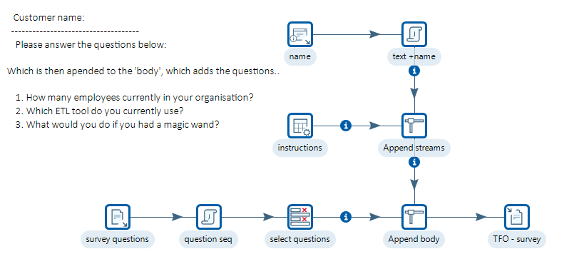

> **Note:** **Create a new transformation**
> 
> Use any of these options to open a new transformation tab:
> 
> * Select **File** > **New** > **Transformation**
> * Use `Ctrl+N` (Windows/Linux) or `Cmd+N` (macOS)

:::: tabs

### 1. Get System Info

> **Note:**
>
> #### Get System Info
> 
> Use **Get System Info** to read a runtime argument. We will treat the argument as the customer name.

<div class="pcm-embed-card" data-href="https://www.loom.com/share/de06920fdcd84bc2b1fe63454afc8df8?hideEmbedTopBar=true&amp;hide_owner=true&amp;hide_share=true&amp;hide_title=true" data-title="Using the Get System Info Step in Pentaho Data Integration" data-description="In this demonstration, I showcased two scenarios using the Get System Info step in Pentaho Data Integration (PDI). First, I retrieved a single row of system data, including the current date and JVM memory statistics, which can be useful for monitoring system health. In the second scenario, I illustrated how to append the current date and time to each row of order data coming from a CSV file input step. I encourage you to practice using the Get System Info step in your own Pentaho environment and experiment with retrieving various information types. This will enhance your transformations and provide valuable insights for auditing and batch processing." data-thumb="../_assets/embeds/2d94cd73b9b2.png"></div>

1. Start Pentaho Data Integration (Spoon).

> **Note:** 

::: tabs

### Windows (PowerShell)

> 
> ```powershell
> Set-Location C:\Pentaho\design-tools\data-integration
> .\spoon.bat
> ```
> 
>

### macOS / Linux

> 
> ```bash
> cd ~/Pentaho/design-tools/data-integration
> ./spoon.sh
> ```
> 
>

:::

<button data-launch="spoon" data-path="">Start PDI</button>

2. Drag **Get System Info** onto the canvas.
3. Double-click the step. Configure it like this:

<figure>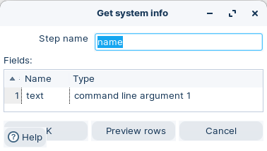<figcaption><p>Get system info</p></figcaption></figure>

4. Select **OK**.

### 2. User Defined Java Expression

> **Note:**
>
> #### User Defined Java Expression
> 
> Use **User Defined Java Expression** to format the header line. It will combine a label with the customer name.

1. Drag **User Defined Java Expression** onto the canvas.
2. Create a hop from **Get System Info**.
3. Double-click the step. Configure it like this:

<figure>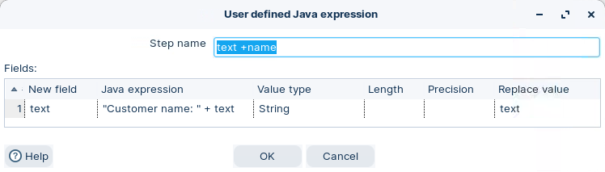<figcaption><p>UDJE</p></figcaption></figure>

4. Select **OK**.

> **Note:** This replaces the original argument value with formatted text. The output field is still named `text`.

<div class="pcm-embed-card" data-href="https://docs.oracle.com/javase/tutorial/java/nutsandbolts/opsummary.html" data-title="Summary of Operators (The Java&amp;trade; Tutorials >        
            Learning the Java Language > Language Basics)"></div>

### 3. Data Grid

> **Note:**
>
> #### Data Grid
> 
> Use **Data Grid** to add static survey header lines. This keeps the top-of-file content inside the transformation.
> 
> Configure the field metadata on **Meta**. Enter the rows on **Data**.

1. Drag **Data Grid** onto the canvas.
2. Double-click the step. Configure it like this:

<div><figure>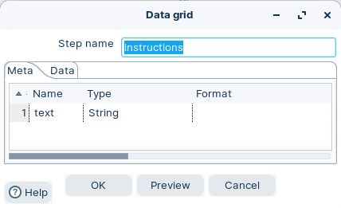<figcaption><p>Data grid - text</p></figcaption></figure> <figure>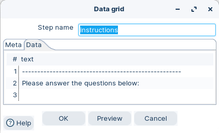<figcaption><p>Data grid - data</p></figcaption></figure></div>

3. Select **OK**.

### 4. Append streams (head)

> **Note:**
>
> #### Append streams
> 
> Use **Append streams** when order matters. It outputs all rows from the first hop. It then outputs all rows from the second hop.
> 
> Both input streams must have the same field names and types.

1. Drag **Append streams** onto the canvas.
2. Create hops from **User Defined Java Expression** and **Data Grid**.
3. Double-click the step. Configure it like this:

<figure>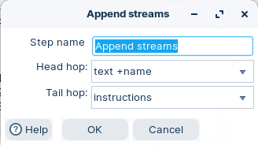<figcaption><p>Append</p></figcaption></figure>

4. Select **OK**.

> **Note:** To append streams, keep the layout consistent. In this workshop, every stream uses a single `text` field.

> **Note:** If order does not matter, use a step that performs a union of streams instead.

> **Warning:** Make sure the header stream is the **first** input hop. Append streams will output that stream first.

> **Under the hood:**
>
> #### Most steps read their inputs round-robin; Append is the exception
>
> When two hops enter an ordinary step, the engine gives it two row
> sets and the step takes rows from whichever has one ready,
> alternating between them. Both upstream steps are running at once,
> so the interleaving depends on timing — run it twice and the order
> can differ.
>
> **Append streams** deliberately breaks that rule. It reads its head
> hop's row set until that stream is exhausted and only then starts on
> the tail hop. It cannot pass a single tail row early, which is why
> it needs to know which hop is which, and why the header lines
> reliably come out on top.
>
> **Why it matters:** if output order matters — a report header, a
> file trailer, a sequence a downstream system checks — a plain merge
> is a bug waiting for a busy server. Append is the guarantee.

### 5. Text file input (questions)

> **Note:**
>
> #### Text file input
> 
> Use **Text file input** to read the question list from a file. Each question becomes one row.

1. Drag **Text file input** onto the canvas.
2. Double-click the step. Configure it like this:

<figure>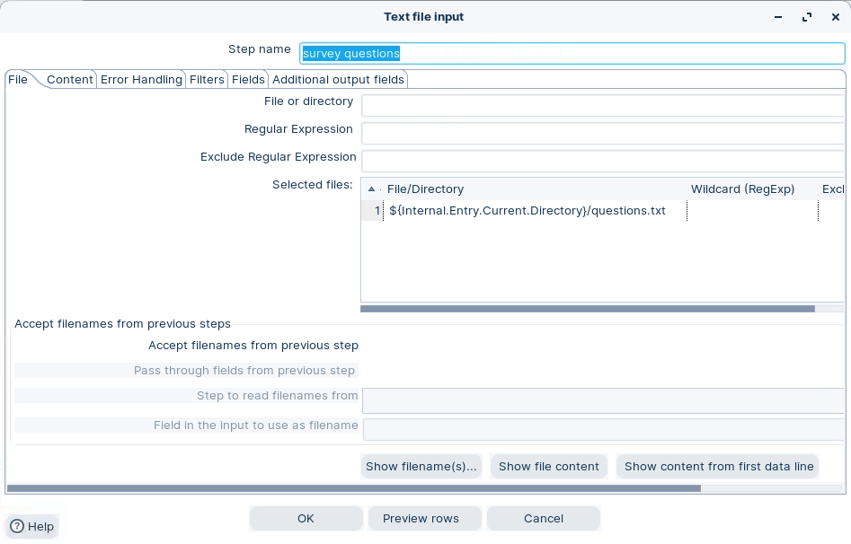<figcaption><p>Text file input</p></figcaption></figure>

File: `${Internal.Transformation.Filename.Directory}/questions.txt`

<figure>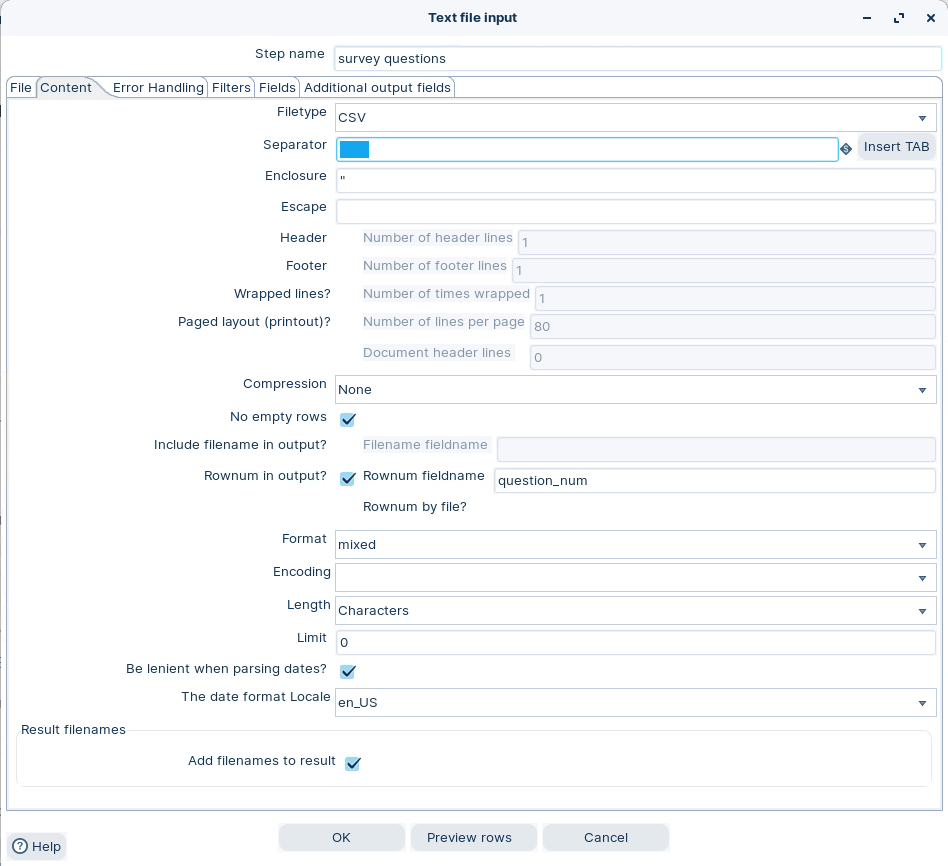<figcaption><p>Text file input - Content</p></figcaption></figure>

> **Note:** Use a **Tab** delimiter. Enable **row numbers** to generate question numbers.

3. On **Fields**, rename the output field to `text`:

<figure>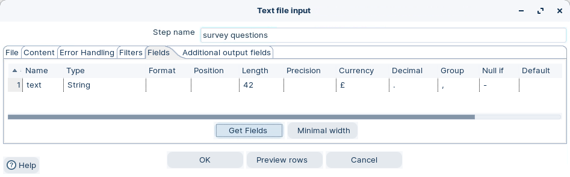<figcaption><p>Text file input - Fields</p></figcaption></figure>

4. Select **OK**.

> **Note:** Each row now contains a question in `text`. The row number field (for example `question_num`) identifies the question number.

### 6. User Defined Java Expression (number questions)

> **Note:**
>
> #### User Defined Java Expression
> 
> Use a second **User Defined Java Expression** to prefix each question line with its question number.

1. Drag **User Defined Java Expression** onto the canvas.
2. Create a hop from **Text file input (questions)**.
3. Double-click the step. Configure it like this:

<figure>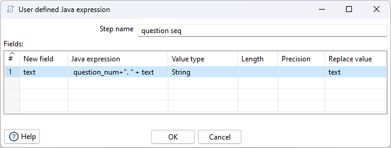<figcaption><p>UDJE - concat question numbers</p></figcaption></figure>

4. Select **OK**.

> **Note:** This overwrites `text` with a numbered question like `1. How did we do?`.

### 7. Select values

> **Note:**
>
> #### Select values
> 
> The Select Values step is useful for selecting, removing, renaming, changing data types and configuring the length and precision of the fields on the stream.
> 
> These operations are organized into different categories:
> 
> * Select and Alter — Specify the exact order and name in which the fields should be placed in the output rows
> * Remove — Specify the fields that should be removed from the output rows
> * Meta-data — Change the name, type, length, and precision (the metadata) of one or more fields

1. Drag **Select values** onto the canvas.
2. Create a hop from **User Defined Java Expression (number questions)**.
3. Double-click the step. Configure it like this:

<figure>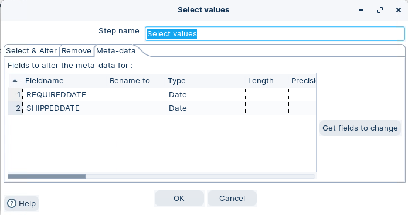<figcaption><p>Select values - remove question_num</p></figcaption></figure>

4. Select **OK**.

> **Note:** Remove the question number field so both streams have the same layout. You need a single `text` field before you append.

### 8. Append streams (body)

> **Note:**
>
> #### Append streams
> 
> Append the survey header stream to the numbered question stream.

1. Drag **Append streams** onto the canvas.
2. Create hops from **Append streams (head)** and **Select values**.
3. Double-click the step. Configure it like this:

<figure>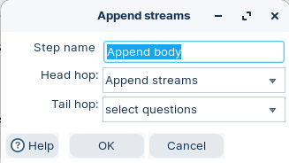<figcaption><p>Append</p></figcaption></figure>

4. Select **OK**.

> **Note:** You now have one stream. It contains one field named `text`.

### 9. Text file output

> **Note:**
>
> #### Text file output
> 
> Use **Text file output** to write the survey file to disk.

> **Warning:** Do not run multiple copies of this step against the same output file. Use **Include stepnr in filename** if you need parallel output.

1. Drag **Text file output** onto the canvas.
2. Create a hop from **Append streams (body)**.
3. Double-click the step. Set the file name:

`Filename: ${Internal.Transformation.Filename.Directory}/survey`

> **Note:** Set **Extension** to `txt` if your output should be `survey.txt`.

<figure>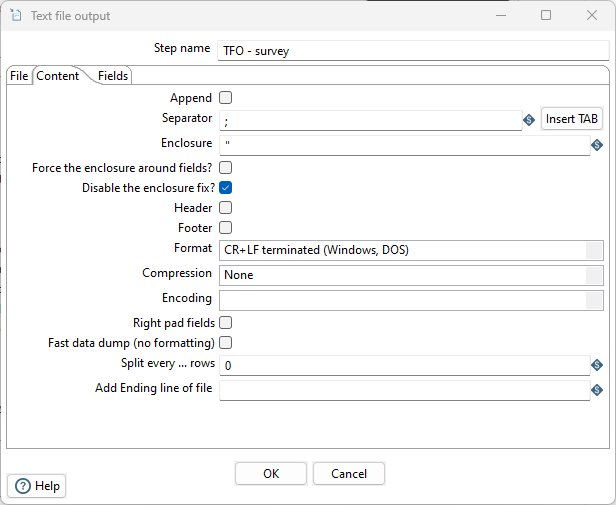<figcaption><p>Text file output - Content</p></figcaption></figure>

4. On **Fields**, select **Get Fields**.

<figure>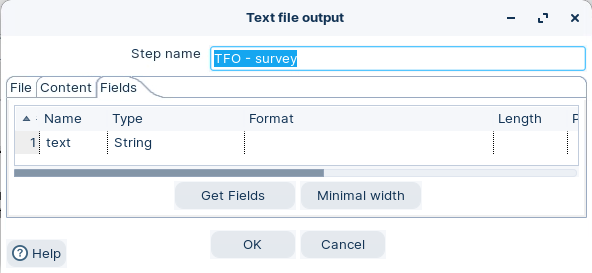<figcaption><p>Text file output - Fields</p></figcaption></figure>

5. Select **OK**.

> **Under the hood:**
>
> #### The file was open before the first row arrived
>
> **Text file output** creates and opens `survey.txt` when the step
> initialises — that is, when the transformation starts — not when the
> first row reaches it. Rows are then written through a buffered
> stream as they arrive, and the file is closed when the upstream
> steps finish. Nothing is collected in memory first.
>
> Two consequences you will meet in real work: a run that fails early
> still leaves a zero-byte file behind (the **Do not create file at
> start** option exists for exactly that case), and two step copies
> pointed at the same filename fight over one handle — hence the
> warning above.
>
> **Why it matters:** an output file appearing is not proof the run
> succeeded; the row count in Step Metrics is. And because the writer
> streams, a ten-million-row extract costs no more memory than this
> survey does.

### 10. RUN

> **Note:**
>
> #### Run the transformation
> 
> Run the transformation locally. Pass a customer name as an argument.

1. Select **Run** in the canvas toolbar.
2. Open **Arguments (legacy)**. Enter a customer name.

<figure>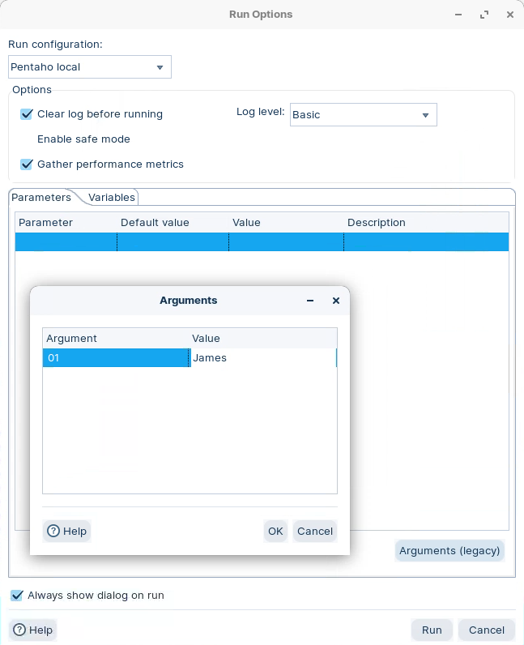<figcaption><p>Enter argument</p></figcaption></figure>

3. Select **Run**.
4. Open the **Preview data** tab.

<figure>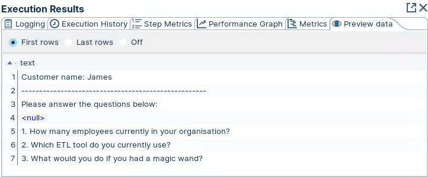<figcaption><p>Preview data</p></figcaption></figure>

5. Open the generated survey file in your transformation folder.

> **Under the hood:**
>
> #### Where the argument came from
>
> **Get System Info** has no input hop, so it produced exactly one
> row, and the field you configured as *command line argument 1* was
> filled from the run dialog's **Arguments (legacy)** box. The engine
> treats that box as a stand-in for what a scheduler would pass on the
> command line — `pan.sh -file=tr_write_output.ktr "Acme Ltd"` — so
> the transformation is already runnable unattended, unchanged.
>
> Arguments are positional and, as the label says, legacy; modern
> transformations use named **parameters** (right-click the canvas,
> **Parameters** tab), which you will meet in Module 5. The principle
> is the same either way: values that vary per run come in from
> outside, get materialised as a field, and the steps never know the
> difference.
>
> **Why it matters:** the `.ktr` you just ran by hand is the one the
> scheduler runs tonight. There is no "productionised" version to
> maintain — only the input changes.

> **Note:** This workshop reinforces the rule for merging streams:
> 
> * Keep the same field layout (names and order).
> * Keep matching data types.

::::

## Lab Files

Click a file to download. For `.ktr` and `.kjb` files, **Open in Pentaho Data Integration** launches PDI with the file loaded. If PDI is already running, the path is copied to your clipboard — switch to PDI and use Ctrl+O, Ctrl+V, Enter.

[questions.txt](./files/questions.txt)

[survey.txt](./files/survey.txt)

[tr_write_output.ktr](./files/tr_write_output.ktr) <button data-launch="spoon" data-path="files/tr_write_output.ktr">Open in Pentaho Data Integration</button> <button data-graph="files/tr_write_output.ktr">View graph</button>
