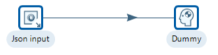
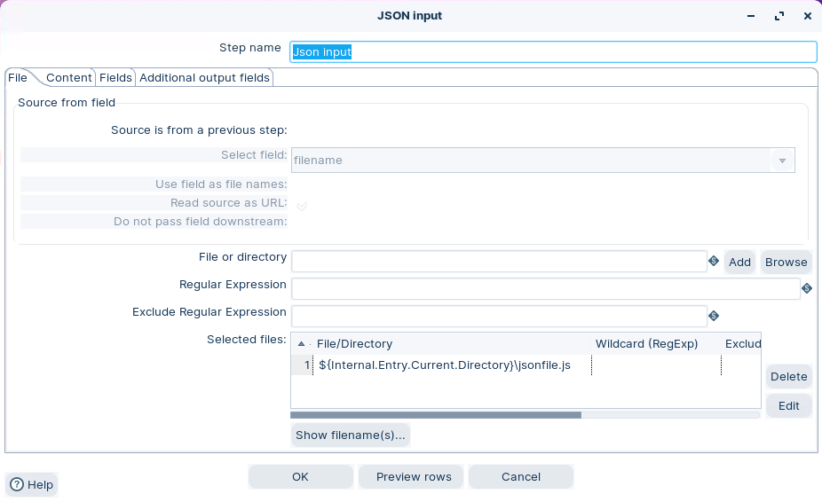
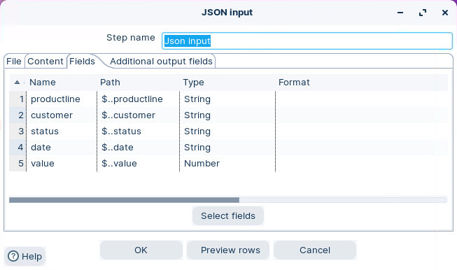
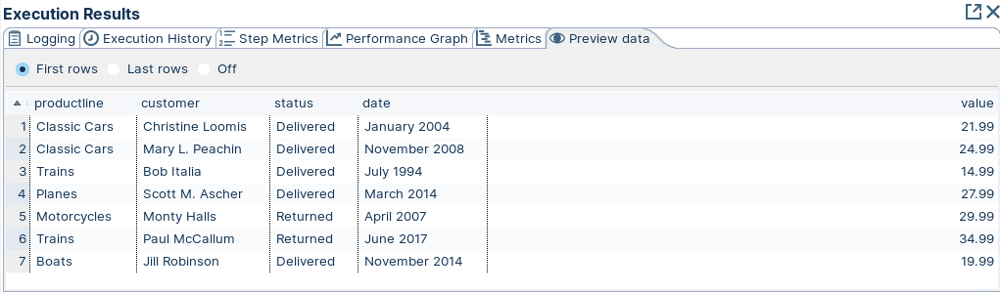

# Read JSON

> **Warning:**
>
> #### Workshop - Read JSON
> 
> Parse a JSON file into rows. Use **JSON Input**.
> 
> **What you’ll do**
> 
> * Read a JSON file from disk.
> * Set a loop path for an array.
> * Extract fields with JSONPath.
> * Use **Get Fields** to infer metadata.
> * Preview rows and validate types.
> 
> **Prerequisites:** Basic transformations. Basic JSON (objects, arrays). PDI installed.
> 
> **Estimated time:** 15 minutes

<div class="pcm-embed-card" data-href="https://www.loom.com/share/992afd2bbf75465ab70ae76d895ea4f3?hideEmbedTopBar=true&amp;hide_owner=true&amp;hide_share=true&amp;hide_title=true" data-title="Using the JSON Input Step to Retrieve Data from Files 📂" data-description="In this video, I demonstrate how to use the JSON input step to read data from a JSON file located in the Sample's folder of Spoon. We focus on retrieving specific elements for books, including the title, category, and author, while noting that some books may also have an ISBN number. I guide you through configuring the step, including selecting the file and manually entering the required fields. After completing the setup, we preview the data to ensure everything is correct. Please take a moment to review the configuration and familiarize yourself with the process." data-thumb="../_assets/embeds/2d94cd73b9b2.png"></div>



> **Note:** **Create a new transformation**
> 
> Use any of these options to open a new transformation tab:
> 
> * Select **File** > **New** > **Transformation**
> * Use `Ctrl+N` (Windows/Linux) or `Cmd+N` (macOS)

1. Open `jsonfile.js` in an editor. You will extract fields from this array:

```json
{ "document": {
    "order": [ 
      { "productline": "Classic Cars",
        "customer": "Christine Loomis",
        "status": "Delivered",
        "date": "January 2004",
        "value": 21.99
      },
      { "productline": "Classic Cars",
        "customer": "Mary L. Peachin",
        "status": "Delivered",
        "date": "November 2008",
        "value": 24.99
      },
      { "productline": "Trains",
        "customer": "Bob Italia",
        "status": "Delivered",
        "date": "July 1994",
        "value": 14.99
      }
    ]
  }
}
```

> **Note:** `status` can be `Delivered` or `Returned`.

:::: tabs

### 1. JSON Input

> **Note:**
>
> #### JSON Input
> 
> JSON Input reads JSON and outputs rows.
> 
> You set one loop path. It outputs one row per loop element.

1. Start Pentaho Data Integration.

> **Note:** 

::: tabs

### Windows (PowerShell)

> 
> ```powershell
> Set-Location C:\Pentaho\design-tools\data-integration
> .\spoon.bat
> ```
> 
>

### macOS / Linux

> 
> ```bash
> cd ~/Pentaho/design-tools/data-integration
> ./spoon.sh
> ```
> 
>

:::

<button data-launch="spoon" data-path="">Start PDI</button>

2. Drag **JSON Input** onto the canvas.
3. Open the step.
4. On the **File** tab, select your `jsonfile.js`.

> **Note:** Save your transformation near `jsonfile.js`. Then use a portable path.

Example:

```
${Internal.Transformation.Filename.Directory}/jsonfile.js
```

5. Set **Loop path** to:

```
$.document.order[*]
```

6. Open the **Fields** tab.
7. Select **Get Fields**.
8. Verify these field paths and types:

* `productline` (String)
* `customer` (String)
* `status` (String)
* `date` (String)
* `value` (Number)

<figure><figcaption><p>JSON input - file</p></figcaption></figure>

<figure><figcaption><p>JSON input - fields</p></figcaption></figure>

> **Note:** Need help writing JSONPath? Use a tester like: <https://jsonpath.com/>

> **Under the hood:**
>
> #### Whole document in memory, then one JSONPath per column
>
> **JSON Input** doesn't stream. It reads `jsonfile.js` completely,
> parses it into an in-memory tree, and then evaluates each field's
> path against that tree — one query per field. The loop path decides
> how many rows come out: `$.document.order[*]` selects three objects,
> so each field path must yield three values, and the step zips them
> together positionally into three rows.
>
> That positional zip is why the step is strict about shape. If one
> order had no `customer` key, that path would return two values
> against three for the others and the step stops with "the data
> structure is not the same inside the resource" — a wrong-shape error
> rather than a silently misaligned row.
>
> **Why it matters:** memory is bounded by the *file* size, not the
> row count, so very large JSON is better split, or read one record per
> field. And a structure error is the engine refusing to hand you a row
> whose values have slid one column to the left.

### 2. Dummy

> **Note:**
>
> #### Dummy
> 
> Dummy does not do anything. Use it as a preview target.

1. Expand **Flow** in the Design palette.
2. Drag **Dummy** onto the canvas.
3. Create a hop from **JSON Input** to **Dummy**.

### 3. Run

> **Note:**
>
> #### Run the transformation
> 
> Run locally and preview the output rows.

1. Select **Run** in the canvas toolbar.
2. After it finishes, right-click **Dummy**.
3. Select **Preview**.

> **Success:** You should see one row per order in the JSON array.

<figure><figcaption><p>Preview data</p></figcaption></figure>

::::

### Troubleshooting

<details>

<summary>No rows returned</summary>

Check the **Loop path** first. For this file, it must point to the array:

```
$.document.order[*]
```

If the JSON structure changes, update the loop path.

</details>

<details>

<summary>Fields are null</summary>

Confirm field paths match the JSON keys. If you loop over `order[*]`, use `productline`, not `$.document.order.productline`.

</details>

<details>

<summary>Wrong data types</summary>

Use **Get Fields** as a starting point. Then set types explicitly.

Example: keep `status` as **String**.

</details>

## Lab Files

Click a file to download. For `.ktr` and `.kjb` files, **Open in Pentaho Data Integration** launches PDI with the file loaded. If PDI is already running, the path is copied to your clipboard — switch to PDI and use Ctrl+O, Ctrl+V, Enter.

[jsonfile.js](./files/jsonfile.js)

[tr_json.ktr](./files/tr_json.ktr) <button data-launch="spoon" data-path="files/tr_json.ktr">Open in Pentaho Data Integration</button> <button data-graph="files/tr_json.ktr">View graph</button>
