# Read XML

> **Warning:**
>
> #### Workshop - Read XML
> 
> Read XML from a file, a URL, or a field value. Use **Get data from XML**.
> 
> **What you’ll do**
> 
> * Read XML from a local file.
> * Read XML from a URL (URI).
> * Use **XPath** to select nodes and fields.
> * Use **Get Fields** to infer the XML structure.
> * Debug a data type mismatch using the logs.
> 
> **Prerequisites:** Basic transformations. Basic XML (elements, attributes, hierarchy). PDI installed.
> 
> **Estimated time:** 30 minutes

<div class="pcm-embed-card" data-href="https://www.loom.com/share/85ad9973848041b9b8447ed45cffc09c?hideEmbedTopBar=true&amp;hide_owner=true&amp;hide_share=true&amp;hide_title=true" data-title="Getting Started with the Get Data from XML Step in PDI" data-description="In this demonstration, I walk you through the process of using the &amp;#34;get data from XML&amp;#34; step to read an existing XML file containing breakfast and dinner menus. I show how to configure the step in Spoon, including selecting the file, defining the loop X-Path for the breakfast menu, and specifying the elements to read as fields. We also verify the configuration by previewing the data, ensuring everything is set up correctly. Please make sure to follow along and replicate these steps in your own environment. This will enhance your ability to work with XML data effectively." data-thumb="../_assets/embeds/2d94cd73b9b2.png"></div>

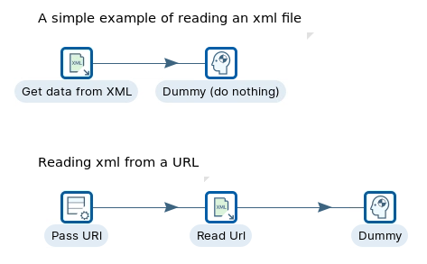

> **Note:** **Create a new transformation**
> 
> Use any of these options to open a new transformation tab:
> 
> * Select **File** > **New** > **Transformation**
> * Use `Ctrl+N` (Windows/Linux) or `Cmd+N` (macOS)

::::: tabs

### 1. XML - File

> **Note:**
>
> #### **XML - File**
> 
> In this workflow, an XML **file** is parsed via **XPath** to retrieve the dataset.

<figure>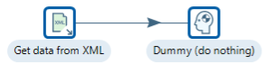<figcaption><p>Get data from XML - file</p></figcaption></figure>

<figure>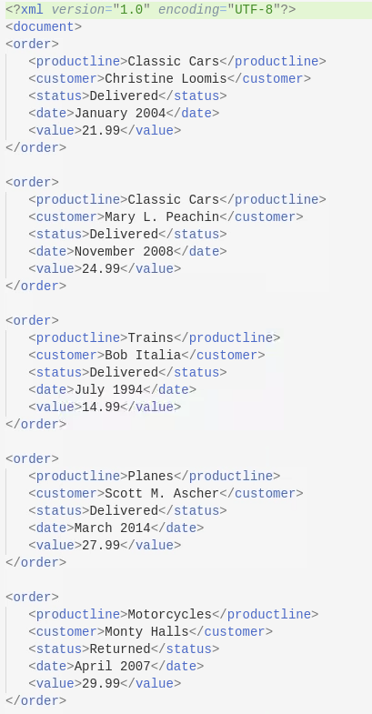<figcaption><p>orders.xml</p></figcaption></figure>

:::: tabs

### 1. Get data from XML

> **Note:**
>
> #### **Get data from XML**
> 
> This step provides the ability to read data from any type of XML file using XPath specifications.

1. Start Pentaho Data Integration.

> **Note:** 

::: tabs

### Windows (PowerShell)

> 
> ```powershell
> Set-Location C:\Pentaho\design-tools\data-integration
> .\spoon.bat
> ```
> 
>

### macOS / Linux

> 
> ```bash
> cd ~/Pentaho/design-tools/data-integration
> ./spoon.sh
> ```
> 
>

:::

<button data-launch="spoon" data-path="">Start PDI</button>

2. Drag the ‘Get data from XML’ step onto the canvas.
3. Double-click on the step, and configure the following properties:

<figure>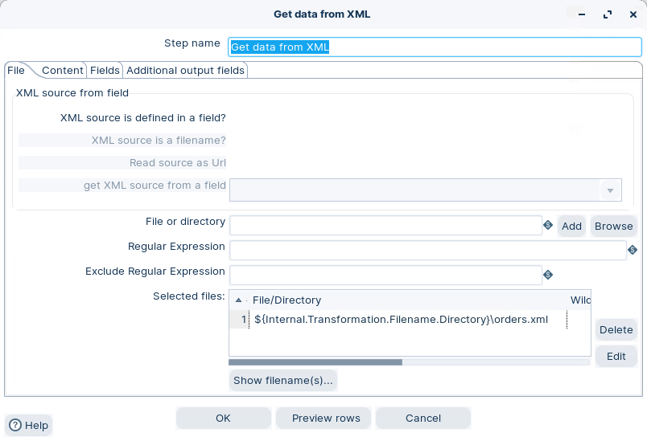<figcaption><p>XML - file</p></figcaption></figure>

4. Click on the Content tab, and configure the following properties:

<figure>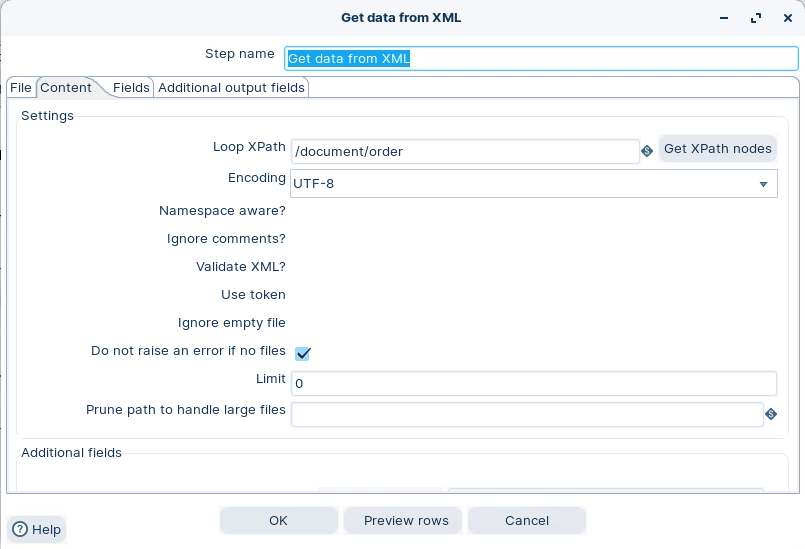<figcaption><p>XPath</p></figcaption></figure>

5. Click on the Fields tab, and then on the ‘Get Fields’ button.

<figure>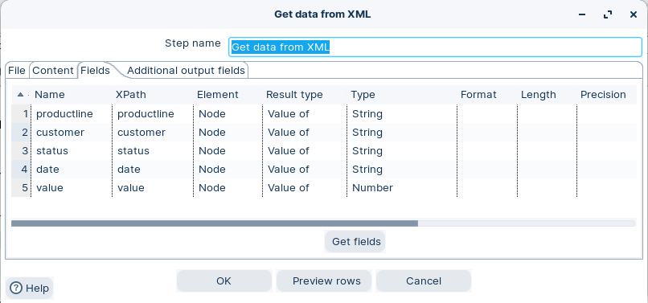<figcaption><p>XML - fields</p></figcaption></figure>

6. Click OK.

### 2. Dummy

> **Note:**
>
> #### **Dummy**
> 
> The Dummy step does not do anything. Its primary function is to be a placeholder for testing purposes. For example, to have a transformation, you need at least two steps connected to each other.

1. Drag a ‘Dummy’ step onto the canvas.
2. Create a hop from the ‘Get data from XML’ step.
3. Close the Step.

### 3. RUN

> **Note:**
>
> #### **RUN Transformation**
> 
> The workshop illustrates how to ingest an XML data source. The XML can either stream from:
> 
> * a previous step (typically a URL)
> * a file
> * a stream field (XML stored in a field)

> **Warning:** Remember to disable the hops on the second workflow.

1. Click the Run button in the Canvas Toolbar.
2. Preview the data.

<figure>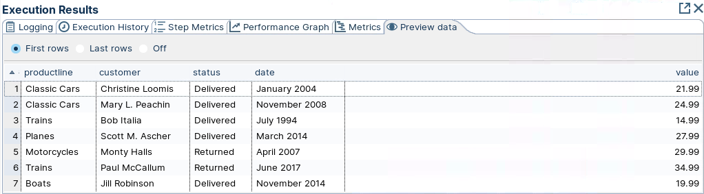<figcaption><p>Preview data</p></figcaption></figure>

::::

### 2. XML - URI

> **Note:** In this workflow, a **URL** to an XML data source is parsed via **XPath** to retrieve the dataset.

<figure>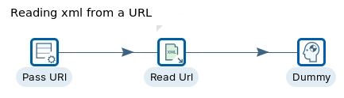<figcaption><p>Get XML - URL</p></figcaption></figure>

<figure>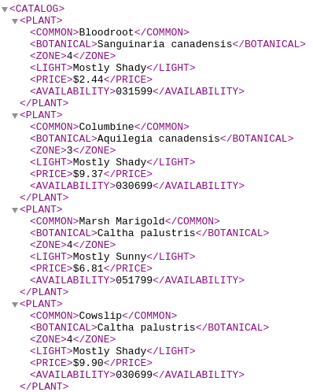<figcaption><p><a href="../_assets/files/plant_catalog.xml">../_assets/files/plant_catalog.xml</a></p></figcaption></figure>

::: tabs

### 1. Generate rows - Pass URL

> **Warning:** In this workshop, you pass the URL in a data stream field.
> 
> Copy the URL to your clipboard. You will paste it into the XPath dialog.

> **Note:**
>
> #### Generate rows
> 
> Generate rows outputs a specified number of rows. By default, the rows are empty; however, they can contain several static fields. This step is used primarily for testing purposes. It may be useful for generating a fixed number of rows, for example, you want exactly 12 rows for 12 months.

1. Drag the ‘Generate Rows’ step onto the canvas.
2. Double-click on the step, and configure the following properties:

<figure>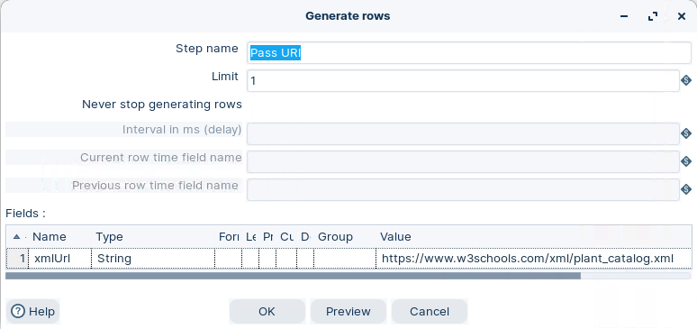<figcaption><p>Pass URL in data stream field</p></figcaption></figure>

### 2. Get data from XML - Read URL

> **Note:**
>
> #### Get data from XML
> 
> The dataset is being parsed from a stream field xmlUrl that’s being passed on from the ‘Pass URL’ step.

1. Drag the ‘Get Data from XML’ step onto the canvas.
2. Create a hop from the ‘Pass URL’ step.
3. Double-click on the step, and configure the following properties:

<figure>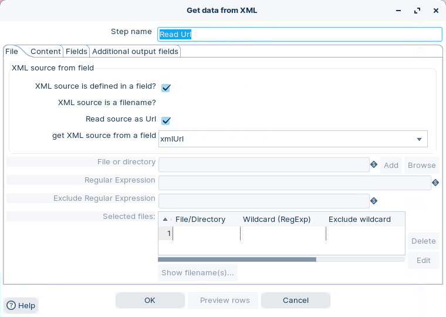<figcaption><p>Read URL</p></figcaption></figure>

4. Click on the ‘Content’ tab and configure the following properties:

<figure>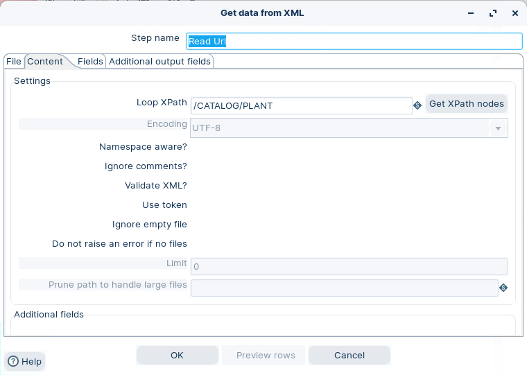<figcaption><p>Select XPath</p></figcaption></figure>

5. Click on the ‘Fields’ tab and configure the following properties:

<figure>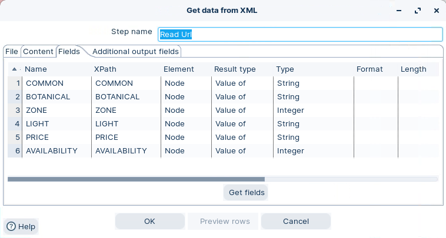<figcaption><p>Configure fields</p></figcaption></figure>

6. Click on the ‘Get Fields’ button.

Next: open the **Dummy** tab.

### 3. Dummy

> **Note:**
>
> #### Dummy
> 
> The Dummy step does not do anything. Its primary function is to be a placeholder for testing purposes. For example, to have a transformation, you need at least two steps connected to each other.

1. Drag a ‘Dummy’ step onto the canvas.
2. Create a hop from the ‘Get data from XML’ step.
3. Close the Step.

### 4. RUN

> **Danger:**
>
> #### **RUN the Transformation**
> 
> Remember to enable the hops and disable the hop in Workflow 1: XML - File
> 
> The workflow will fail .. do you know why.?

1. Click the Run button in the Canvas Toolbar

<figure>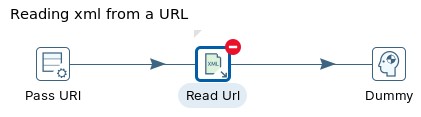<figcaption><p>Invalid data type</p></figcaption></figure>

2. Check the logs.

<figure>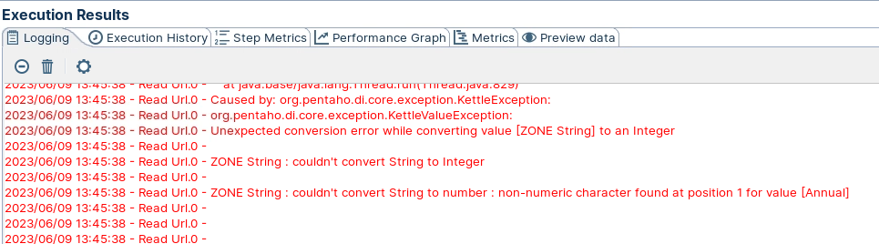<figcaption><p>Logs</p></figcaption></figure>

> **Warning:** Looks like Zone data type is alphanumeric (string), not integer.

3. Change Zone data type to string and re-run transformation.
4. Click on the Dummy step and Preview data.

<figure>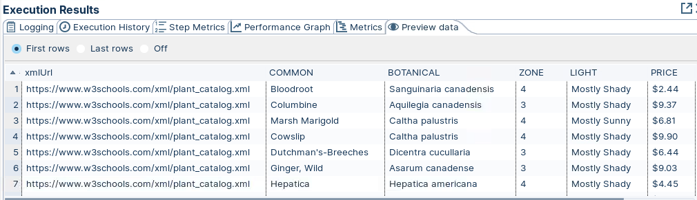<figcaption><p>Preview Plant Catalog</p></figcaption></figure>

:::

:::::

## Lab Files

Click a file to download. For `.ktr` and `.kjb` files, **Open in Pentaho Data Integration** launches PDI with the file loaded. If PDI is already running, the path is copied to your clipboard — switch to PDI and use Ctrl+O, Ctrl+V, Enter.

[orders.xml](./files/orders.xml)

[tr_read_xml.ktr](./files/tr_read_xml.ktr) <button data-launch="spoon" data-path="files/tr_read_xml.ktr">Open in Pentaho Data Integration</button> <button data-graph="files/tr_read_xml.ktr">View graph</button>
