# Excel Writer

> **Warning:**
>
> #### Workshop - Excel Writer
> 
> Excel reports often need templates, charts, and fixed layouts.
> 
> Here you populate a pre-formatted Sales and Expenses report. You will write multiple sections into one workbook. You will control execution order so writers do not conflict.
> 
> **What you'll do**
> 
> * Use a template workbook and write to fixed cell positions
> * Write a report header with **Generate rows**
> * Read sales and expense rows from text files
> * Block parallel flows before writing to the same file
> * Write multiple sections with **Microsoft Excel Writer**
> 
> By the end, you will know how to write into an Excel template safely. You will also know when to block parallel flows.
> 
> **Prerequisites:** Understanding of basic transformation concepts (steps, hops, preview). Complete **Text File Input** first.
> 
> **Estimated time:** 35 minutes

<div class="pcm-embed-card" data-href="https://www.loom.com/share/770dd4bae75049eeab247bec2bf6fbcc?hideEmbedTopBar=true&amp;hide_owner=true&amp;hide_share=true&amp;hide_title=true" data-title="Advanced Excel File Creation with Microsoft Excel Writer Step 📊" data-description="In this video, I demonstrate the advanced features of the Microsoft Excel Writer Step, focusing on how to create a formatted Excel file using a template, comments, hyperlinks, and formulas. We will be generating a fictional report that includes a logo, a hyperlink to documentation, and arbitrary numbers to illustrate how to insert formulas, specifically a running total. I guide you through the transformation process, including configuring the necessary steps and fields. I encourage you to follow along and replicate this process in your own projects. By the end, you'll see how the final Excel file matches our template design and includes all the required elements." data-thumb="../_assets/embeds/2d94cd73b9b2.png"></div>

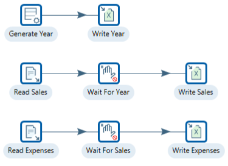

> **Note:** **Create a new transformation**
> 
> Use any of these options to open a new transformation tab:
> 
> * Select **File** > **New** > **Transformation**
> * Use `Ctrl+N` (Windows/Linux) or `Cmd+N` (macOS)

::::: tabs

### 1. Excel Template

> **Note:**
>
> #### Excel template
> 
> The various stages of the transformation write data to a template.xlsx. The template has 2 worksheets:
> 
> * Sales Chart - this worksheet creates a 3D stacked graph
> * SourceData - worksheet

1. Open `template.xlsx` in Excel:

<figure>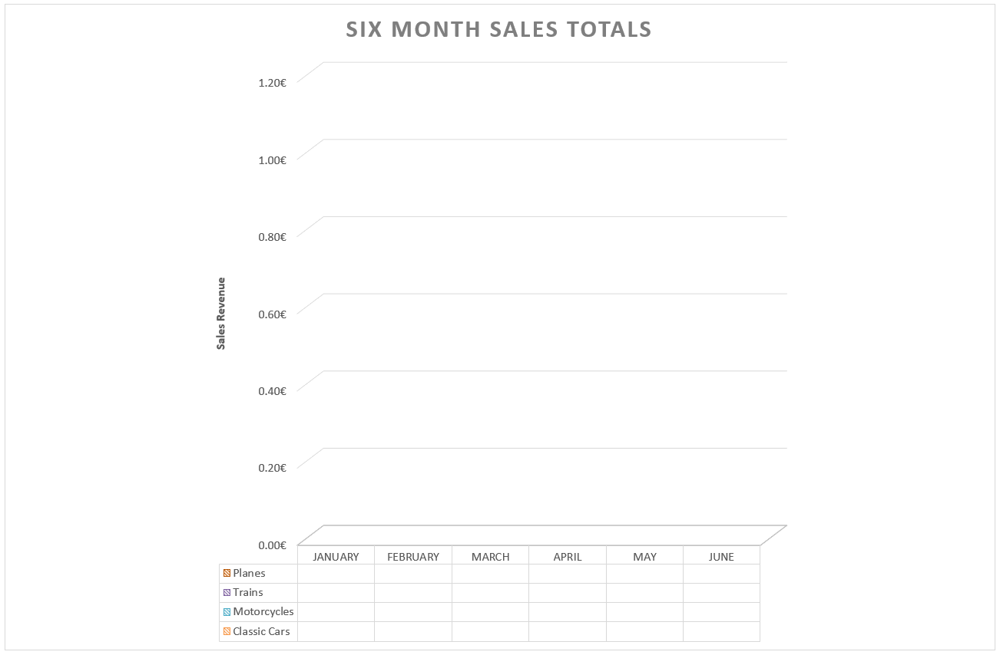<figcaption><p>Blank template</p></figcaption></figure>

> **Note:** SourceData - the datasheet. Transformations write to the required cells that are used to create the graph.

<figure>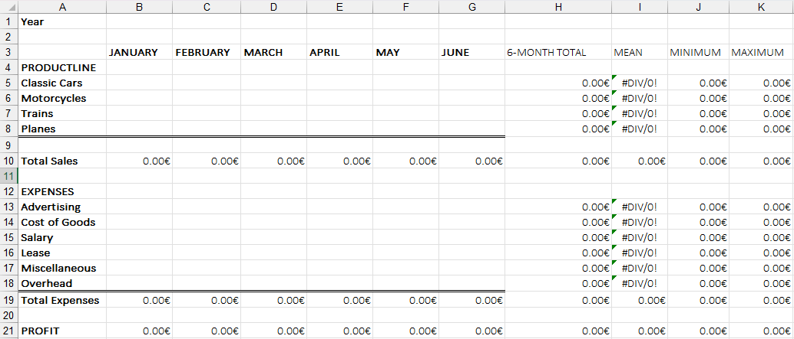<figcaption><p>Blank SourceData</p></figcaption></figure>

### 2. Write Year

> **Note:**
>
> #### Write year
> 
> The first workflow is to write the current Year to the SourceData worksheet in the template.xlsx
> 
> You can change the year value.

<figure>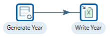<figcaption><p>Year</p></figcaption></figure>

:::: tabs

### 1. Generate Rows - Year

> **Note:**
>
> #### Generate rows - year
> 
> Generate rows outputs a fixed number of rows. Here you output a single row that contains the report year.

1. Start Pentaho Data Integration (Spoon).

> **Note:** 

::: tabs

### Windows (PowerShell)

> 
> ```powershell
> Set-Location C:\Pentaho\design-tools\data-integration
> .\spoon.bat
> ```
> 
>

### macOS / Linux

> 
> ```bash
> cd ~/Pentaho/design-tools/data-integration
> ./spoon.sh
> ```
> 
>

:::

<button data-launch="spoon" data-path="">Start PDI</button>

2. Drag the ‘Generate Rows’ step onto the canvas.
3. Double-click on the step, and configure the following properties:

<figure>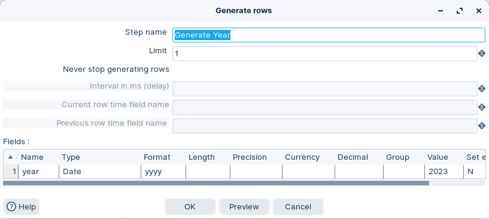<figcaption><p>Generate rows - Year</p></figcaption></figure>

4. Close Step.

> **Note:** **Summary**
> 
> * Generates a record that holds the Year value – 2023 – in the year stream field.
> * The Excel template will also need to be formatted yyyy to interpret the Date.

### 2. Excel Writer - Year

> **Note:**
>
> #### Excel Writer - year
> 
> Microsoft Excel Writer writes incoming rows into an Excel workbook. Use `xlsx` when you work with templates and charts.

1. Drag the ‘Excel writer’ step onto the canvas.
2. Create a hop from the ‘Year’ step.
3. Double-click on the step, and configure the following properties:

<figure>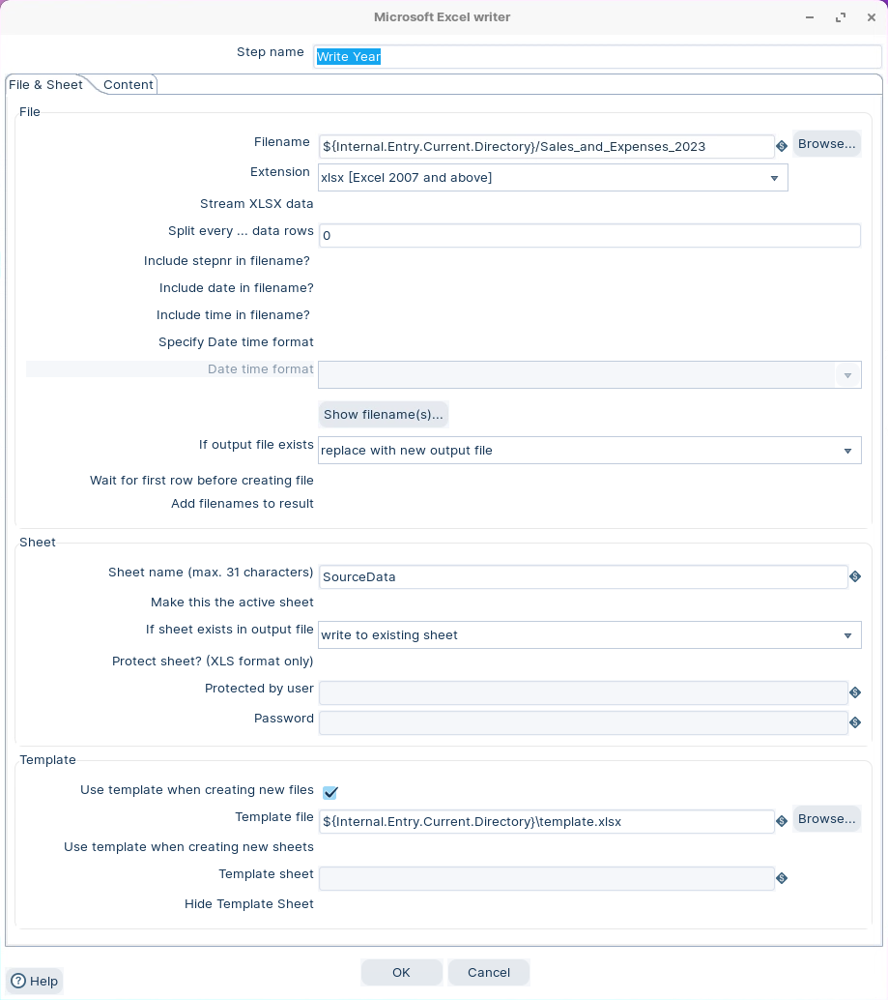<figcaption><p>Excel writer - Year</p></figcaption></figure>

> **Note:** Use these paths:
> 
> * Output: `${Internal.Transformation.Filename.Directory}/Sales_and_Expenses_2023.xlsx`
> * Template: `${Internal.Transformation.Filename.Directory}/template.xlsx`
> 
> Select **Replace with new output file** while you develop. It resets the workbook on every run.

4\. Click on the Content tab, and configure the following properties:

<figure>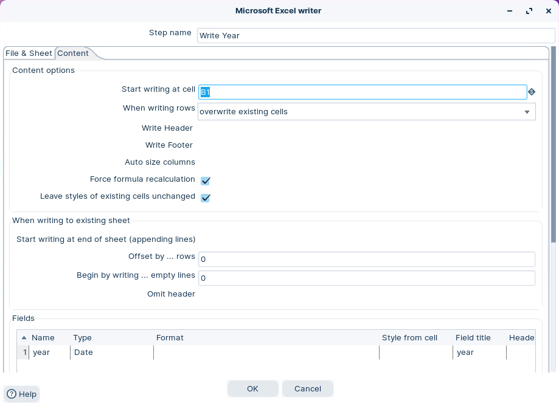<figcaption><p>Excel writer - cell</p></figcaption></figure>

5. Click on ‘Get Fields’ button.
6. Click OK.

> **Under the hood:**
>
> #### The template's chart survives because the writer edits cells, not files
>
> **Microsoft Excel Writer** opened `template.xlsx` with Apache POI,
> the Java library that understands the `.xlsx` object model. It
> copied the workbook — sheets, styles, and the chart on *Sales
> Chart* — into the output file, located the cell you named, and wrote
> the year into it. Everything it didn't touch is preserved.
>
> The chart itself contains no data. It holds *references* to ranges
> on *SourceData*, so when Excel opens the finished file and
> recalculates, the chart draws whatever the transformation put in
> those ranges. That is why the template can be designed entirely in
> Excel by someone who never opens Spoon.
>
> **Why it matters:** the presentation layer — formatting, formulas,
> charts, logos — lives in the template, owned by the report's
> consumer. The transformation only ever supplies numbers, so a
> restyle never touches the pipeline.

::::

### 3. Write Sales

> **Note:**
>
> #### Write sales
> 
> Write sales rows into the same workbook. Use a blocking step so the year write completes first.

<figure>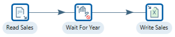<figcaption><p>Write Sales</p></figcaption></figure>

::: tabs

### 1. Text File Input - Read Sales

> **Note:**
>
> #### Text file input - read sales
> 
> Read the sales dataset from the workshop file. Keep the header row enabled so field names match the template.

1. Drag the ‘Text file input’ step onto the canvas.
2. Double-click on the step, and configure the following properties:

<figure>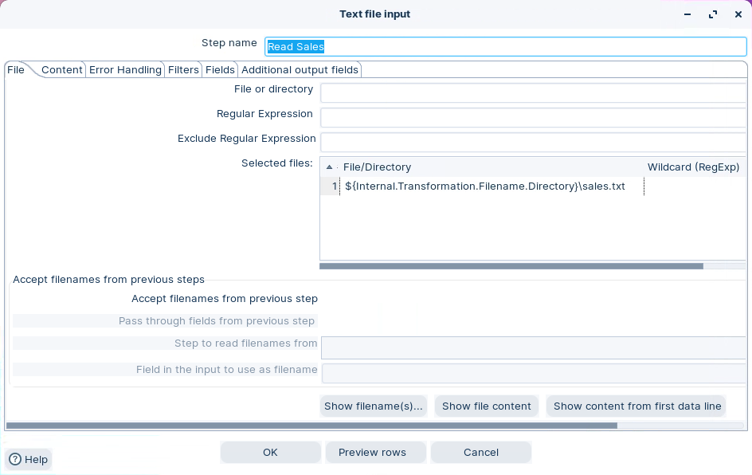<figcaption><p>Text file input - sales</p></figcaption></figure>

3. Click on the Content tab, and configure the following properties:

<figure>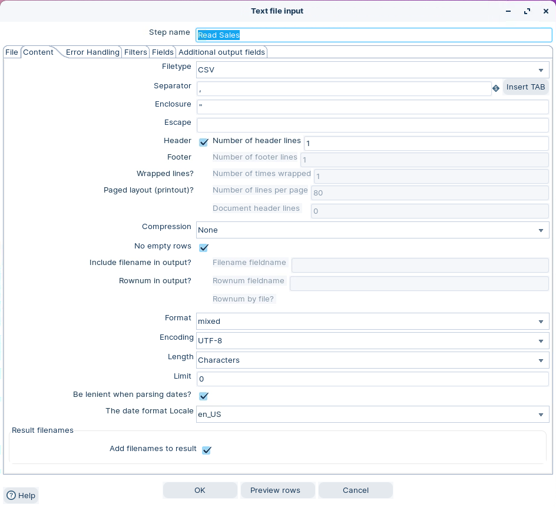<figcaption><p>Text file input - Content</p></figcaption></figure>

> **Note:** * Ensure the Header is selected.
> * No empty rows
> * Mixed Format

4. Click on the Fields tab, and click on ‘Get Fields’ button:

> **Note:** Returns the Header values as stream fields.

5. Click OK.

### 2. Block until Step Finish - Wait Year

> **Note:**
>
> #### Block until steps finish - wait year
> 
> This step waits for specific steps to finish. Use it to prevent parallel writers.

1. Drag the ‘Block this step until steps finish’ step onto the canvas.
2. Create a hop from the ‘Read Sales’ step.
3. Double-click on the step, and configure the following properties:
   * Watch step: the step that writes the year (copy `0`)
   * If you used **Get steps**, remove everything except the year writer step

<figure>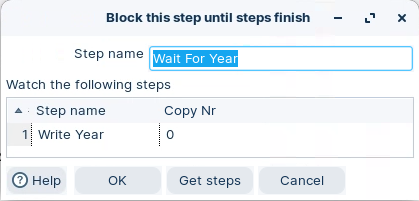<figcaption><p>Block step</p></figcaption></figure>

> **Note:** This will result in the workflow being blocked until the Write Year step has been completed.

> **Under the hood:**
>
> #### Blocking works through back-pressure, not by pausing threads
>
> **Block this step until steps finish** doesn't suspend anything.
> When the transformation starts, its thread simply doesn't take any
> rows from its input; instead it polls the status of the step you
> listed — the year writer — until that step reports finished. Only
> then does it start reading, and every row it reads passes straight
> through unchanged.
>
> Meanwhile **Read Sales** keeps running. It fills the row set between
> the two steps (10,000 rows by default), then blocks on the full
> buffer — the same back-pressure that governs every hop. Nothing is
> copied or buffered specially; the pipeline just stalls at that point
> until the gate opens.
>
> **Why it matters:** the year cell is guaranteed to be written before
> the sales writer opens the same workbook, without a job, a second
> transformation or a sleep. Whenever two writers must not overlap —
> same file, same table after a truncate — this one step is the
> ordering primitive.

### 3. Excel Writer - Write Sales

> **Note:**
>
> #### Excel Writer - write sales
> 
> Write sales rows into the existing workbook. Use **Use existing file for writing**.

1. Drag the ‘Excel writer’ step onto the canvas.
2. Create a hop from the ‘Wait Year’ step.
3. Double-click on the step, and configure the following properties:

<figure>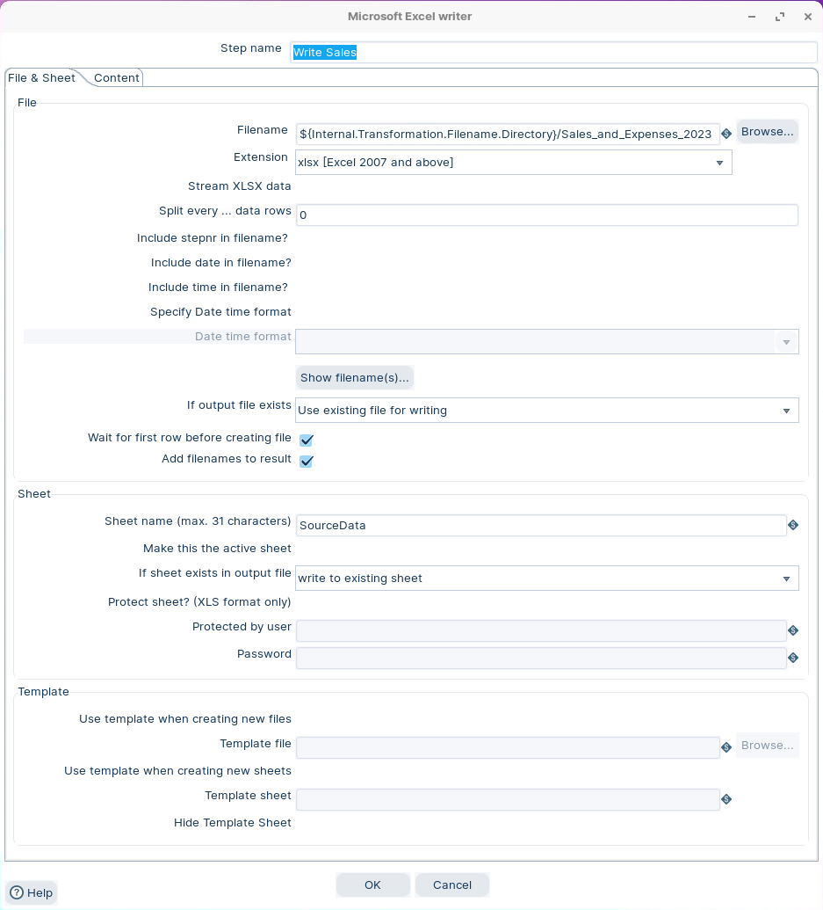<figcaption><p>Excel writer - Sales</p></figcaption></figure>

> **Note:** Use the same output path you used in the year writer:
> 
> * Output: `${Internal.Transformation.Filename.Directory}/Sales_and_Expenses_2023.xlsx`
> 
> Select **Use existing file for writing**.

4. Click on the Content tab, and configure the following properties:

<figure>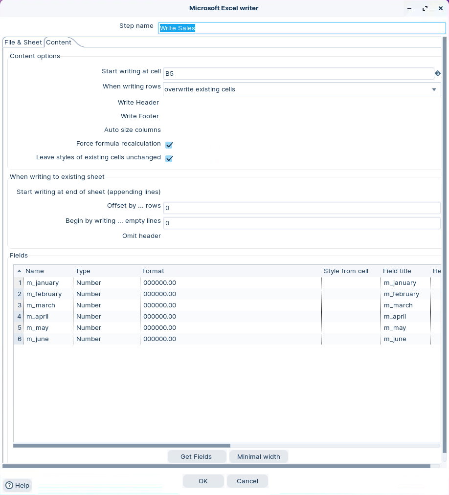<figcaption><p>Excel writer - Content</p></figcaption></figure>

5. Click on the ‘Get Fields’ button.
6. Delete the productline field, as its not required. The template already has the fieldname and you are just writing the data, starting at cell B5.
7. Click OK.

:::

### 4. Write Expenses

> **Note:**
>
> #### Write expenses
> 
> Write expense rows into the same workbook. Block until the sales write completes.

<figure>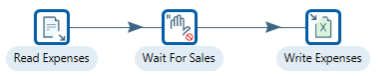<figcaption><p>Write Expenses</p></figcaption></figure>

::: tabs

### 1.  Text File Input - Read Expenses

> **Note:**
>
> #### Text file input - read expenses
> 
> Start with loading the Expenses data into the data stream.

<figure>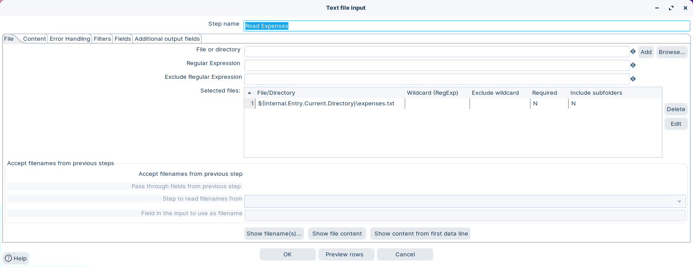<figcaption><p>Text File input - Expenses</p></figcaption></figure>

<figure>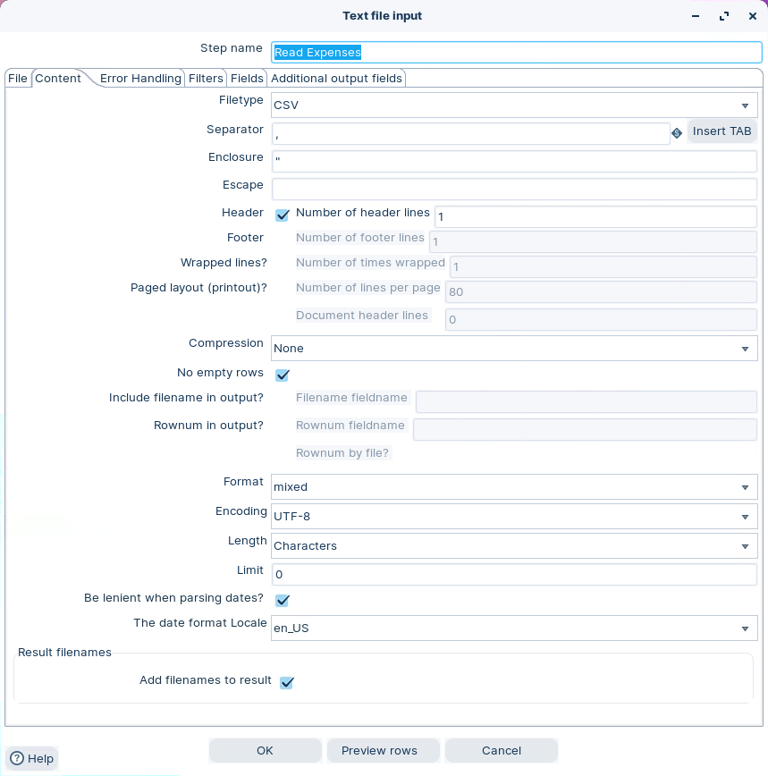<figcaption><p>Text File input - Content</p></figcaption></figure>

<figure>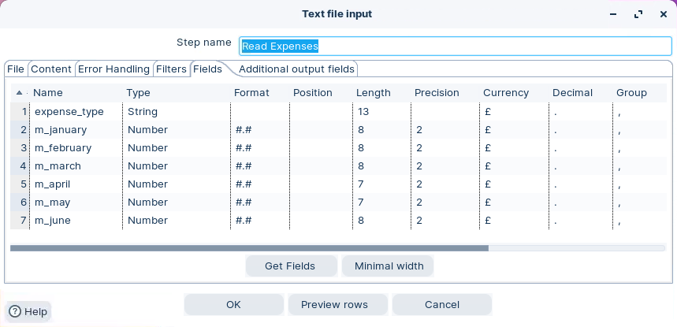<figcaption><p>Text File input - Fields</p></figcaption></figure>

### 2. Block until Step finish - Sales

> **Note:**
>
> #### Block until steps finish - wait sales
> 
> Wait until sales data has finished writing to the workbook.

<figure>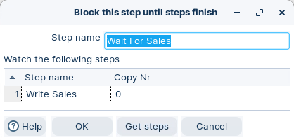<figcaption><p>Block 'Write Sales'</p></figcaption></figure>

### 3. Excel Writer - Expenses

> **Note:**
>
> #### Excel Writer - Expenses
> 
> Write expenses to `SourceData`.

<figure>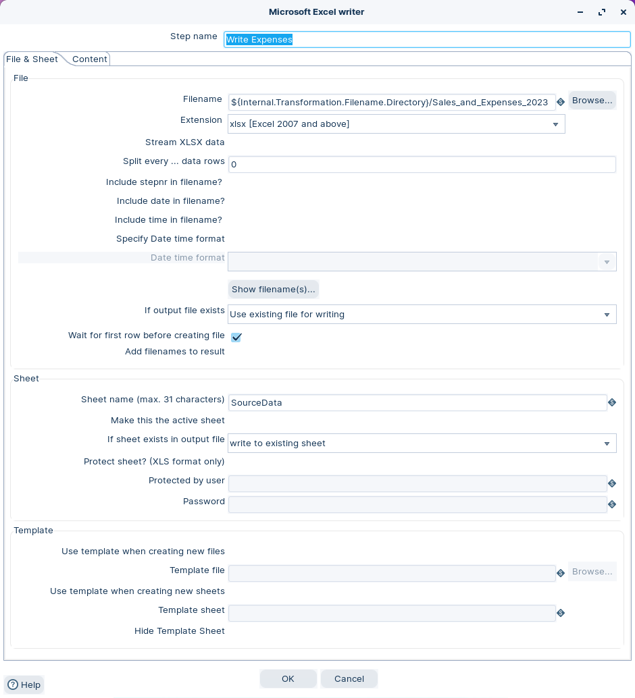<figcaption><p>Excel writer - Expenses</p></figcaption></figure>

<figure>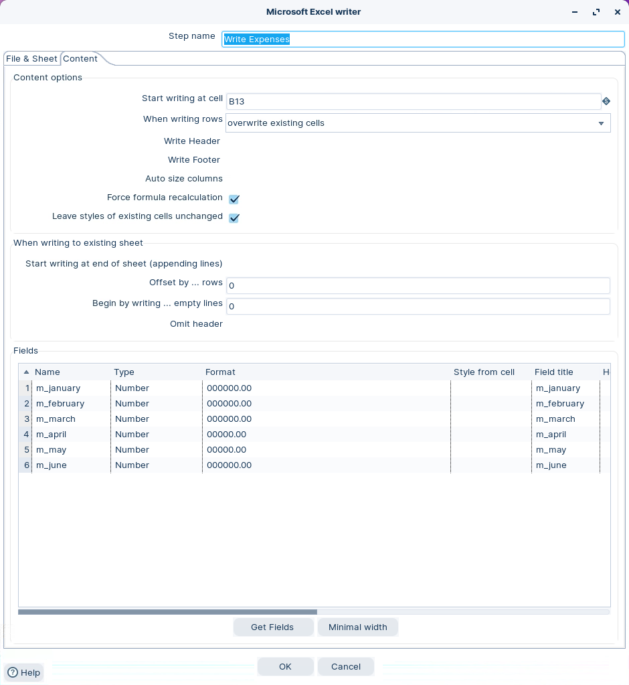<figcaption><p>Excel writer - Content</p></figcaption></figure>

:::

### 5. RUN

> **Note:**
>
> #### Run the transformation
> 
> Steps initialize in parallel. Use blocking steps to prevent concurrent writes to the workbook.

1. Click the Run button in the Canvas Toolbar.
2. Open the Sales\_and\_Expenses\_2023.xlsx file.

<figure>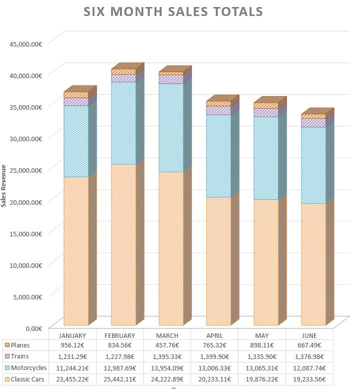<figcaption><p>Excel Book</p></figcaption></figure>

:::::

## Lab Files

Click a file to download. For `.ktr` and `.kjb` files, **Open in Pentaho Data Integration** launches PDI with the file loaded. If PDI is already running, the path is copied to your clipboard — switch to PDI and use Ctrl+O, Ctrl+V, Enter.

[expenses.txt](./files/expenses.txt)

[Sales_and_Expenses_2017.xlsx](./files/Sales_and_Expenses_2017.xlsx)

[sales.txt](./files/sales.txt)

[template.xlsx](./files/template.xlsx)

[tr_write_excel.ktr](./files/tr_write_excel.ktr) <button data-launch="spoon" data-path="files/tr_write_excel.ktr">Open in Pentaho Data Integration</button> <button data-graph="files/tr_write_excel.ktr">View graph</button>
