# Database Connections

> **Warning:**
>
> #### Workshop - Database connections
> 
> Create a reusable MySQL connection to the Steel Wheels `sampledata` database.
> 
> **What you’ll do**
> 
> * Validate the database is reachable (optional, using DBeaver)
> * Install a JDBC driver (only if PDI does not include it)
> * Create, test, share, and explore a PDI database connection
> 
> **Prerequisites**
> 
> * PDI (Spoon) installed and working
> * A running **MySQL** `sampledata` database on port `3306` (Docker
>   setup recommended) — **not** the HSQLDB/Hypersonic `sampledata`
>   bundled with Pentaho, which is read-only and cannot serve the
>   CRUID workshops that follow
> * Basic understanding of schemas, tables, and authentication
> 
> **Estimated time:** 15 minutes

<div class="pcm-embed-card" data-href="https://www.loom.com/share/3ec2d5123814460d92085851c18daaee?hideEmbedTopBar=true&amp;hide_owner=true&amp;hide_share=true&amp;hide_title=true" data-title="Understanding Dimension Lookup Update Steps in Data Integration" data-description="In this video, I walk you through the dimension lookup update step, highlighting its key features and how to use them effectively. We start by reading customer dimension data from a delimited file and then add the current system date before performing the lookup and update in our database table. I demonstrate how to configure the keys and fields for the dimension data, and we observe the insertion of five rows, including an empty row due to the table being initially empty. I also show how to handle updates when a customer's location changes, which increments the version number in our records. Please refer to the Pentaho data integration documentation for further details on additional capabilities and configurations." data-thumb="../_assets/embeds/2d94cd73b9b2.png"></div>

> **Note:**
>
> ### Create a new transformation
> 
> Use any of these options to open a new transformation tab:
> 
> * Select **File** > **New** > **Transformation**
> * Use `Ctrl+N` (Windows/Linux) or `Cmd+N` (macOS)

:::: tabs

### 1. DBeaver

> **Note:**
>
> #### **DBeaver**
> 
> DBeaver is optional.\
> Use it to confirm the database is reachable before you touch PDI.
> 
> DBeaver CE ships with most drivers.\
> That makes it a fast connectivity check.

> **Warning:** Pentaho no longer ships a writable sample database user by default.\
> Use the containerised MySQL `sampledata` for hands-on database workshops.
>
> On a workshop VM it is already running. To start it yourself, run
> `scripts\setup-services.ps1` from the repo root: that brings up
> MySQL on `3306` with Steel Wheels loaded and the `pentaho_admin`
> account used below. Workshop VMs run **Podman** rather than Docker
> Desktop (free for commercial use); the commands are interchangeable.

::: tabs

### MySQL

> **Note:**
>
> #### **MySQL Database**
> 
> The workshop-services stack gives you a MySQL container exposed on\
> port `3306` with the `sampledata` database loaded. Verify it with
> `scripts\check-environment.ps1`.

1. Launch DBeaver and select **MySQL**.

<figure>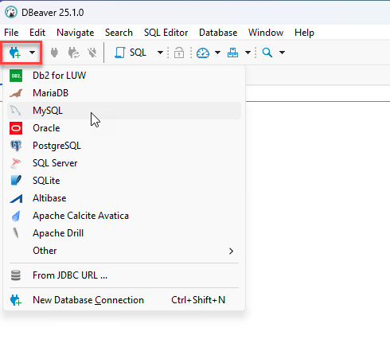<figcaption><p>MySQL</p></figcaption></figure>

2. Configure the connection:

* **Username:** `root`
* **Password:** `password`

<figure>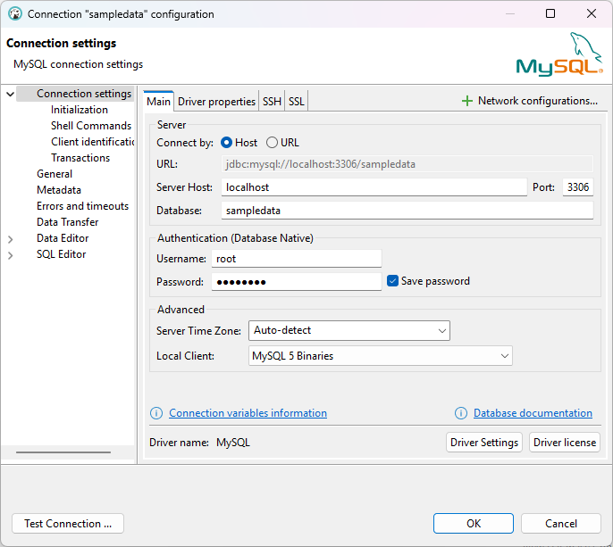<figcaption><p>Configure &#x26; Test MySQL connection - sampledata</p></figcaption></figure>

> **Warning:** You might need to download the supported driver version.
> 
> If the test fails, enable `allowPublicKeyRetrieval`.

<figure>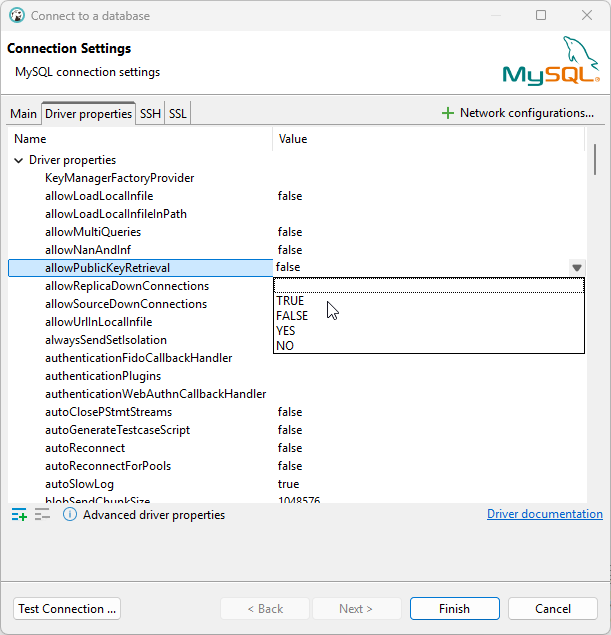<figcaption><p>Enable: allowPublicKeyRetrieval</p></figcaption></figure>

3. Test the connection.

<figure>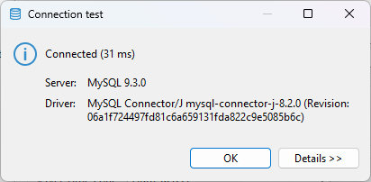<figcaption><p>Test connection</p></figcaption></figure>

4. Expand **Databases** > **sampledata** > **Tables**.

<figure>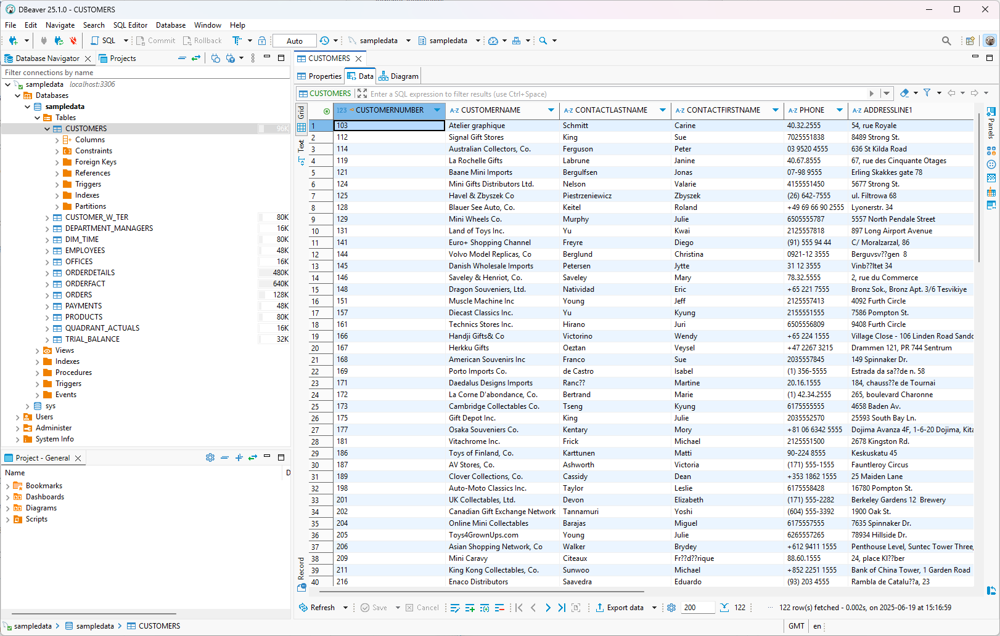<figcaption><p>Customer Data</p></figcaption></figure>

5. Open a SQL window and run a test query:

```sql
select * from CUSTOMERS
where COUNTRY = 'USA' and CITY = 'NYC';
```

<figure>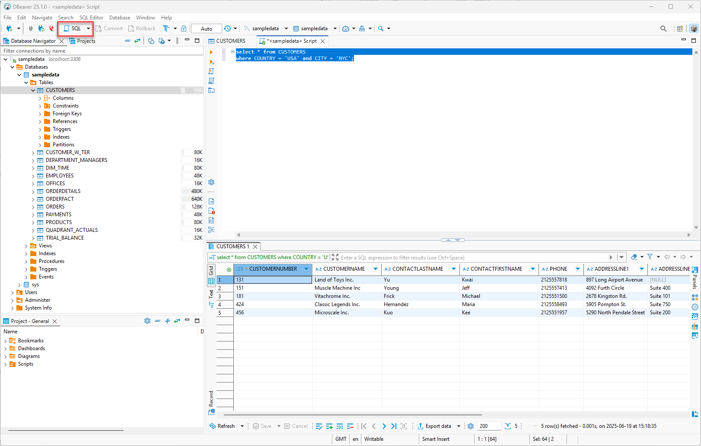<figcaption><p>Sql query - NYC Customers</p></figcaption></figure>

> **Success:** Checkpoint: you can browse tables and run a query against `CUSTOMERS`.

:::

### 2. JDBC Driver

> **Note:**
>
> #### **Download JDBC Driver**
> 
> PDI does not ship all JDBC drivers.\
> If your database type is missing, add the driver JAR.

<div class="pcm-embed-card" data-href="https://docs.pentaho.com/install/jdbc-drivers-reference" data-title="JDBC drivers reference | Pentaho" data-thumb="../_assets/embeds/1c4d9f7d98fc.png"></div>

1. Download the JDBC driver for your database.

<div class="pcm-embed-card" data-href="https://dbschema.com/databases.html" data-title="DbSchema Supported Databases" data-description="Explore all SQL and NoSQL databases supported by DbSchema. Visually design schemas, create ER diagrams, synchronize changes, and document your database — for any database engine." data-thumb="../_assets/embeds/6c6ef7a1bcc8.png"></div>

2. Copy the driver JAR into your PDI install:

::: tabs

### Windows

`C:\Pentaho\design-tools\data-integration\lib\`

### macOS / Linux

`~/Pentaho/design-tools/data-integration/lib/`

:::

3. Restart Spoon.

> **Note:** If your install uses `lib/jdbc/`, place the JAR there instead.

### 3. Data Integration

> **Note:**
>
> #### **Pentaho Data Integration Connection**
> 
> Create the connection once.\
> Reuse it in steps like **Table input**, **Table output**, and **Database lookup**.
> 
> In this lab, you connect to the Steel Wheels `sampledata` database (MySQL).

**Define a database connection (MySQL)**

1. Create a transformation.
2. In Spoon, select **File** > **New** > **Database connection**.

The **Database connection** dialog opens.

<figure>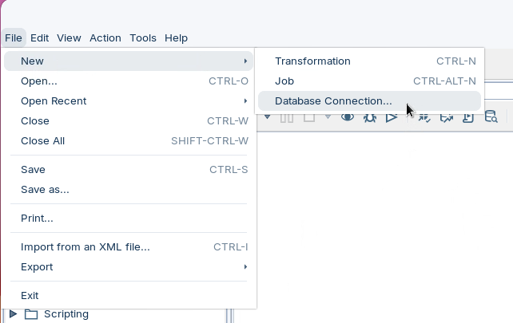<figcaption></figcaption></figure>

3. Enter the following details:

> **Danger:** If you use a MariaDB driver newer than `2.7.x`, you might see a **fetch size** error.\
> If that happens, use the **MySQL** driver instead.

* **Connection name:** `MySQL: sampledata`
* **Connection type:** **MySQL**
* **Access:** **Native (JDBC)**
* **Host name:** `localhost`
* **Database name:** `sampledata`
* **Username:** `pentaho_admin`
* **Password:** `password`

<figure>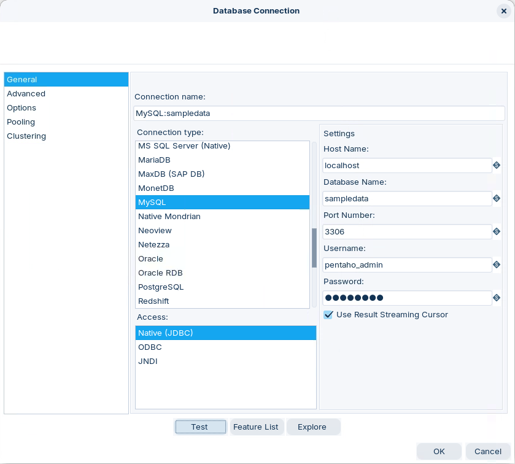<figcaption><p>MySQL - sampledata</p></figcaption></figure>

4. Select **Test**.

> **Note:** Checkpoint: Spoon shows a success message.

> **Under the hood:**
>
> #### Test opened a real JDBC connection, and every step will open its own
>
> Spoon assembled a JDBC URL from the fields you filled in —
> `jdbc:mysql://localhost:3306/sampledata` — loaded the MySQL driver
> from `lib/`, opened a connection, checked it and closed it again.
> The connection you saved is *metadata*: the recipe, not a live
> socket.
>
> At run time each step that uses it — **Table input**, **Table
> output**, **Database lookup** — opens its own physical connection
> from that recipe, with its own transaction. That is what lets a
> reader and a writer on the same database run concurrently on
> separate threads; it is also why a failed **Table output** doesn't
> roll back anything another step did. (**Transformation properties >
> Miscellaneous > Make the transformation database transactional**
> puts them all on one connection when you need all-or-nothing.)
>
> **Why it matters:** connections are cheap to define and reuse, but
> every database step is a client of your database. Ten database steps
> is ten sessions — size connection pools accordingly.

::: tabs

### 1. Share Connection

> **Note:** **Share Database Connection**
> 
> Share the connection so other transformations can reuse it.

1. Click OK to save your entries and exit the Database Connection dialog box.
2. From within the View tab, right-click on the connection and select Share from the list that appears.

<figure>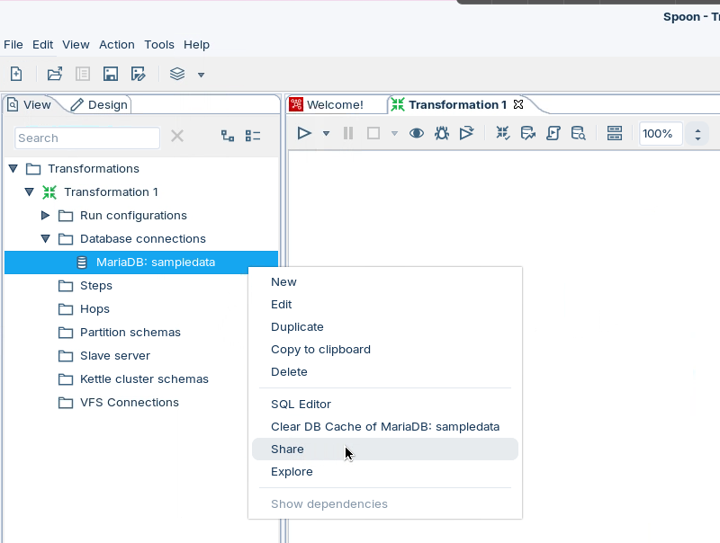<figcaption><p>Share database connection</p></figcaption></figure>

> **Note:** Shared connections show up for other users and projects.\
> Use **Explore** to confirm schemas and tables.

> **Under the hood:**
>
> #### Share copied the definition into `shared.xml`
>
> An ordinary connection lives inside the transformation's own XML —
> open the `.ktr` in a text editor and you will find a `<connection>`
> block with the host, port and an encrypted password. **Share**
> copies that block into `shared.xml` in your `.kettle` folder,
> alongside `kettle.properties`, and from then on every transformation
> and job you open in this Spoon sees it in the **View** tree as if it
> were its own.
>
> Nothing changes at run time: a `.ktr` still carries the connections
> it uses, so it runs stand-alone on a server. Sharing is a design-time
> convenience, and it lives *per machine* — a colleague gets it by
> copying `shared.xml`, or by connecting to a repository, where
> connections are shared for real.
>
> **Why it matters:** one connection definition, defined once, reused
> by every workshop that follows — and the password never has to be
> typed again.

### 2. Explore Database

> **Note:** **Explore Database**
> 
> Use **Database Explorer** to browse schemas, preview rows, and run SQL.

1. Click on the View tab, expand Database Connections.
2. Right-click MySQL:sampledata and choose Explore from the menu options:

|                                   | Action                                                                |
| --------------------------------- | --------------------------------------------------------------------- |
| Preview the first 100 rows of ..  | Return the first 100 rows of the selected table.                      |
| Preview first .. rows of ..       | Enter the number of rows to preview                                   |
| Number of rows ..                 | Displays number of rows                                               |
| Generate DDL                      | Displays DDL statement that creates table.                            |
| Generate DDL for other connection | Select connection to display DDL. Syntax is based on database engine. |
| Open SQL for ..                   | Edit SELECT statement                                                 |
| Truncate table                    | Deletees all the rows from selected table                             |

3. In the Database Explorer window, expand Sampledata > Tables

<figure>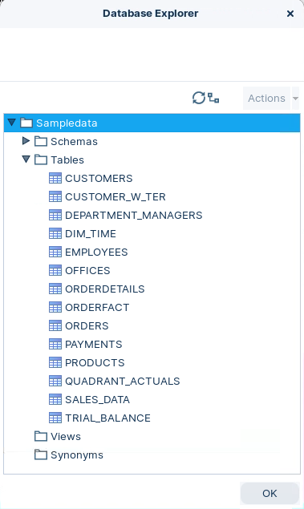<figcaption><p>Database Explorer - sampledata</p></figcaption></figure>

4. Right-click the `CUSTOMERS` table and choose **Preview first 100**.
5. Examine the customer data.
6. Select **View SQL**.

<figure>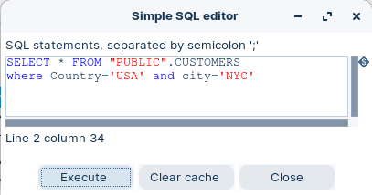<figcaption><p>SQL</p></figcaption></figure>

7. Click Execute.

<figure>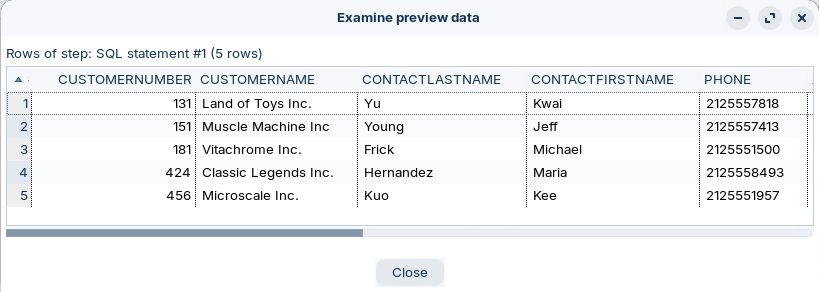<figcaption><p>Execute SQL statement</p></figcaption></figure>

> **Success:** Checkpoint: you can preview `CUSTOMERS` and execute SQL in Database Explorer.

:::

::::

## Lab Files

Click a file to download. For `.ktr` and `.kjb` files, **Open in Pentaho Data Integration** launches PDI with the file loaded. If PDI is already running, the path is copied to your clipboard — switch to PDI and use Ctrl+O, Ctrl+V, Enter.

[tr_connect_database.ktr](./files/tr_connect_database.ktr) <button data-launch="spoon" data-path="files/tr_connect_database.ktr">Open in Pentaho Data Integration</button> <button data-graph="files/tr_connect_database.ktr">View graph</button>
