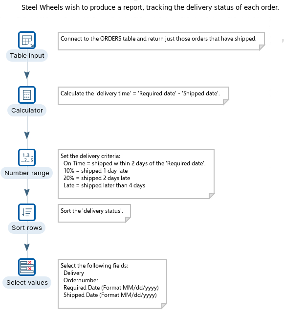
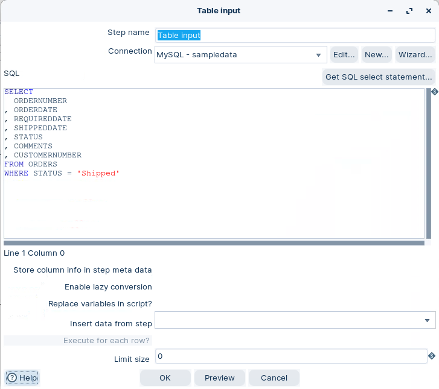
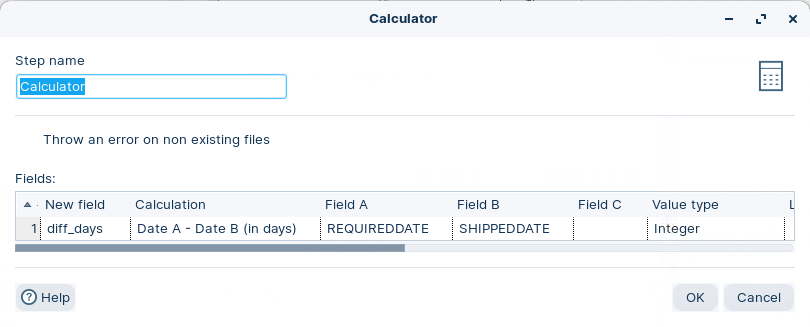
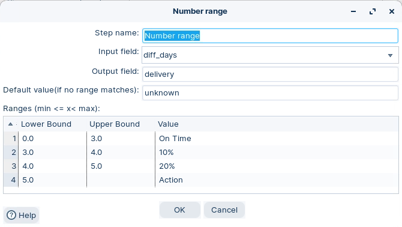
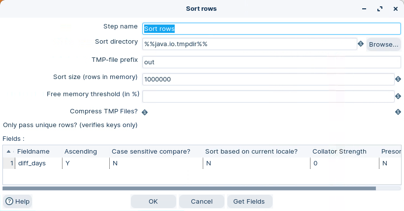
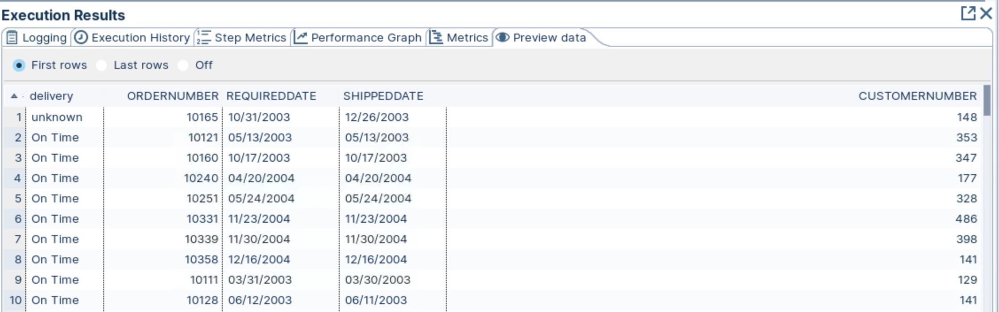

# Read DB table

> **Warning:**
>
> #### Workshop - Read DB table
> 
> Build a transformation that reads `ORDERS` rows from a database.\
> Filter to shipped orders, calculate lead time, and label late shipments.
> 
> **What you’ll do**
> 
> * Read rows with **Table Input**
> * Generate SQL with **Get SQL select statement**
> * Add a calculated field with **Calculator**
> * Bucket values with **Number range**
> * Sort and format output for review
> 
> **Prerequisites**
> 
> * Pentaho Data Integration installed and configured
> * A working database connection. See [Database Connections](https://academy.pentaho.com/pentaho-data-integration/data-integration/data-sources/databases/cruid/database-connections).
> * Basic `SELECT` and `WHERE`
> 
> **Estimated time:** 20 minutes



> **Note:** **Create a new transformation**
> 
> Use any of these options to open a new transformation tab:
> 
> * Select **File** > **New** > **Transformation**
> * Use `Ctrl+N` (Windows/Linux) or `Cmd+N` (macOS)

:::: tabs

### 1. Table input

> **Note:**
>
> #### Table Input
> 
> Read rows from a database using a connection and SQL.\
> In this workshop, filter to orders with `STATUS = 'Shipped'`.

1. Start Spoon.

> **Note:** 

::: tabs

### Windows (PowerShell)

> 
> ```powershell
> Set-Location C:\Pentaho\design-tools\data-integration
> .\spoon.bat
> ```
> 
>

### macOS / Linux

> 
> ```bash
> cd ~/Pentaho/design-tools/data-integration
> ./spoon.sh
> ```
> 
>

:::

<button data-launch="spoon" data-path="">Start PDI</button>

2. Drag **Table Input** onto the canvas.
3. Open the step properties.
4. Configure the step to match your environment:
   * Select your database **Connection**
   * Use **Get SQL select statement** to generate a base query
   * Add a `WHERE` clause for shipped orders

> **Note:** Example filter:
> 
> ```sql
> WHERE STATUS = 'Shipped'
> ```

<figure><figcaption><p>Table input</p></figcaption></figure>

5. Select **Preview**. Confirm you get shipped orders.
6. Select **OK**.

> **Success:** Checkpoint: Preview shows only rows with `STATUS = 'Shipped'`.

### 2. Calculator

> **Note:**
>
> #### Calculator
> 
> Add a derived field using built-in functions.\
> Use Calculator for speed and simple expressions.

1. Add a hop from **Table Input** to **Calculator**.
2. Drag **Calculator** onto the canvas.
3. Open the step properties.
4. Configure the calculation shown in the screenshot.

<figure><figcaption><p>Calculate diff days</p></figcaption></figure>

5. Select **OK**.

> **Note:** This creates `order_time`.\
> It represents the day difference between required and shipped dates.

### 3. Number range

> **Note:**
>
> #### Number range
> 
> Map numeric values into named buckets.\
> This makes reports easier to scan.

1. Add a hop from **Calculator** to **Number range**.
2. Drag **Number range** onto the canvas.
3. Open the step properties.
4. Configure the ranges as shown.

<figure><figcaption><p>Number range</p></figcaption></figure>

> **Note:** This writes an output label (for example, `order_status`) based on `order_time`.\
> Use the same labels and thresholds as the screenshot.

5. Select **OK**.

### 4. Sort rows

> **Note:**
>
> #### Sort rows
> 
> Sort output to match how you want to read it.\
> This is also a common prerequisite for merge-style steps.

1. Add a hop from **Number range** to **Sort rows**.
2. Drag **Sort rows** onto the canvas.
3. Open the step properties.
4. Configure the sort keys as shown.

<figure><figcaption><p>Sort rows</p></figcaption></figure>

5. Select **OK**.

> **Note:** If you hit memory errors, lower the sort size.\
> PDI spills to temp files when needed.

### 5. Select values

> **Note:**
>
> #### Select values
> 
> Keep only fields you need.\
> Fix types, lengths, and formats for downstream steps.

1. Add a hop from **Sort rows** to **Select values**.
2. Drag **Select values** onto the canvas.
3. Open the step properties.
4. Configure the field selection and type changes shown.

<figure><figcaption><p>Set data type</p></figcaption></figure>

5. Select **OK**.

> **Note:** This formats `REQUIREDDATE` and `SHIPPEDDATE`.

### 6. RUN

> **Note:**
>
> #### Run and validate
> 
> Run the transformation and inspect the final stream.

1. In Spoon, select **Run**.
2. In **Execution Results**, open **Preview data** for **Select values**.

<figure><figcaption><p>Status of 'shipped' orders</p></figcaption></figure>

> **Success:** Checkpoint: You see shipped orders plus your derived fields (`order_time`, and the range label).

::::

<details>

<summary>Troubleshooting</summary>

**Preview shows zero rows**\
Confirm the `WHERE STATUS = 'Shipped'` filter matches your source values.

**SQL errors**\
Select **Get SQL select statement** again. Then re-apply your `WHERE` clause.

**Date or number conversion issues**\
Fix types in **Select values**. Re-run the preview.

**Out of memory during sort**\
Lower the sort size in **Sort rows**, or increase JVM memory.

</details>

## Lab Files

Click a file to download. For `.ktr` and `.kjb` files, **Open in Pentaho Data Integration** launches PDI with the file loaded. If PDI is already running, the path is copied to your clipboard — switch to PDI and use Ctrl+O, Ctrl+V, Enter.

[tr_reading_database_warehouse.ktr](./files/tr_reading_database_warehouse.ktr) <button data-launch="spoon" data-path="files/tr_reading_database_warehouse.ktr">Open in Pentaho Data Integration</button> <button data-graph="files/tr_reading_database_warehouse.ktr">View graph</button>
