# Create DB table

> **Warning:**
>
> #### Workshop - Create DB table
> 
> Create a table from a stream definition.\
> Load rows into that table in the same run.
> 
> **What you’ll do**
> 
> * Read a delimited file into a stream
> * Map stream fields to table columns
> * Generate and run `CREATE TABLE` SQL from **Table Output**
> * Insert rows with commit and batch settings
> 
> **Prerequisites**
> 
> * A working database connection. See **Database Connections**.
> * Basic understanding of tables and SQL data types
> 
> **Estimated time:** 30 minutes

<div class="pcm-embed-card" data-href="https://www.loom.com/share/ebcc69cd2a9347f8bec1620259952df7?hideEmbedTopBar=true&amp;hide_owner=true&amp;hide_share=true&amp;hide_title=true" data-title="Loading Sales Data into a Database Table 📊" data-description="In this video, I walk you through the process of loading sales data from a delimited text file into a new database table using Spoon. We connect to our repository, create a transformation, and configure the CSV file input step to read the sales data. After setting up the table output step and executing the transformation, we successfully inserted 2,823 records into the new table. I also demonstrate how to verify the data loaded correctly by checking the row count in the table. Please ensure to follow along with the steps to replicate this process effectively." data-thumb="../_assets/embeds/2d94cd73b9b2.png"></div>

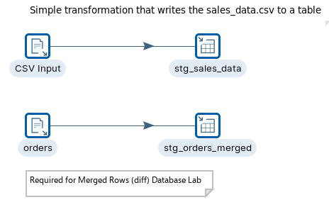

> **Note:**
>
> ### Create a new transformation
> 
> Use any of these options to open a new transformation tab:
> 
> * Select **File** > **New** > **Transformation**
> * Use `Ctrl+N` (Windows/Linux) or `Cmd+N` (macOS)

::::: tabs

### Workflow 1 - Sales Data

> **Note:**
>
> #### **Load Sales Data**
> 
> Load sales data from a CSV file into `STG_SALES_DATA`.
> 
> Adjust field lengths to avoid truncation.

<figure>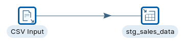<figcaption><p>Load sales data</p></figcaption></figure>

Follow the steps outlined below:

:::: tabs

### 1. CSV File Input

> **Note:** **CSV File Input**
> 
> Read a delimited file into a stream.\
> Use **Text File Input** if you need more format options.

1. Start Pentaho Data Integration.

> **Note:** **Start Spoon**
> 
> 

::: tabs

### Windows (PowerShell)

> 
> ```powershell
> Set-Location C:\Pentaho\design-tools\data-integration
> .\spoon.bat
> ```
> 
>

### macOS / Linux

> 
> ```bash
> cd ~/Pentaho/design-tools/data-integration
> ./spoon.sh
> ```
> 
>

:::

<button data-launch="spoon" data-path="">Start PDI</button>

2. Drag the CSV file input step onto the canvas.
3. Open the CSV file input properties dialog box.

Configure these key fields:

* **Step name:** `csvi-sales_data`
* **File name:** `${Internal.Transformation.Filename.Directory}/sales_data.csv`
* **Delimiter:** `,` (comma)
* **Lazy conversion:** clear
* **Header row present:** select

> **Note:** If `${Internal.Transformation.Filename.Directory}` is empty, save the transformation first.

> **Danger:** CSV File Input infers field lengths from a sample.\
> Increase string lengths before you generate table DDL.

4. Ensure the following details are configured, as outlined below:

<figure>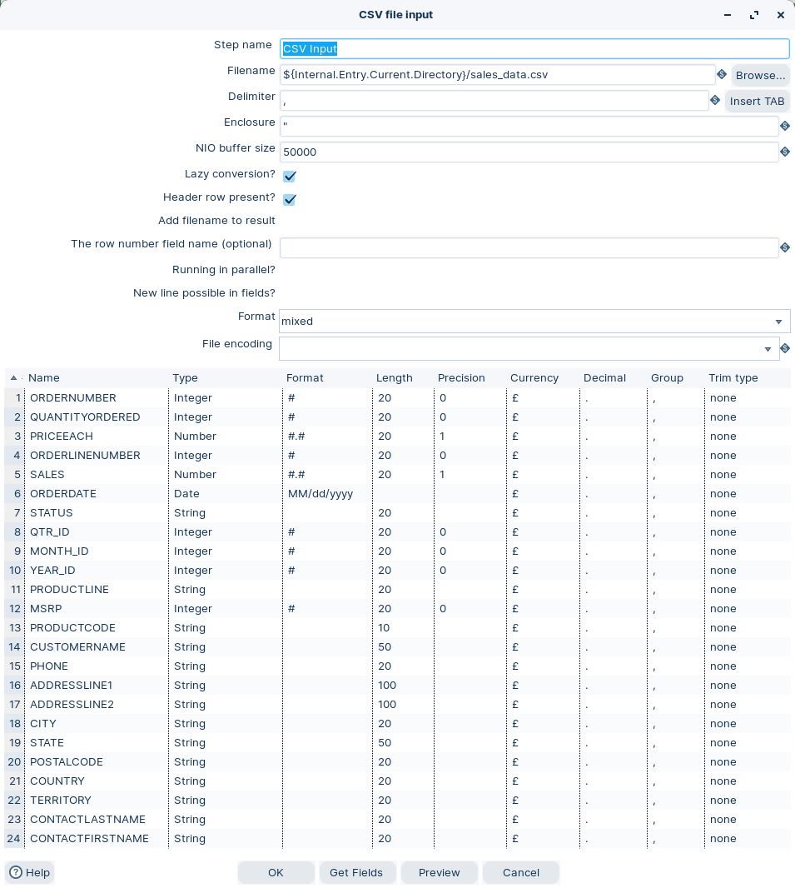<figcaption><p>CSV file input</p></figcaption></figure>

5. Click on the Get Fields button.
6. Select **OK**.

### 2. Table Output

> **Note:** **Table Output**
> 
> Load rows into a database table.\
> This step uses SQL `INSERT`.

1. Drag the Table Output step onto the canvas.
2. Open the Table Output properties dialog box. Ensure the following details are configured, as outlined below:

<figure>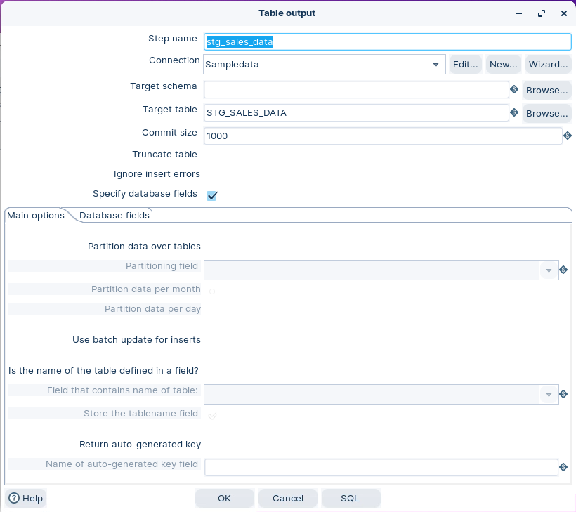<figcaption><p>Table output - options</p></figcaption></figure>

3. Click on the Database fields.
4. Click on the ‘Get Fields’ button.

<figure>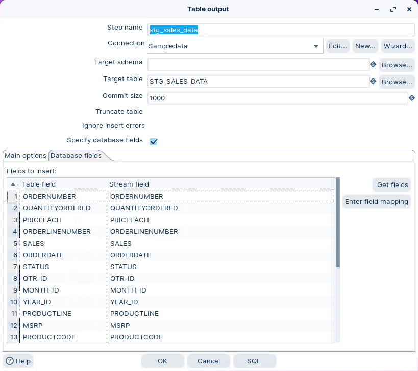<figcaption><p>Table output - fields</p></figcaption></figure>

> **Warning:** Confirm the mappings between **Table fields** and **Stream fields**.

5. Click on the SQL button.

<figure>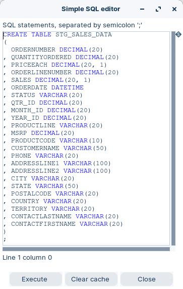<figcaption><p>SQL editor</p></figcaption></figure>

6. Select **Execute**.
7. Select **OK** to close all dialogs.

> **Success:** Checkpoint: `STG_SALES_DATA` exists in the database.

### 3. RUN

> **Note:** **RUN and validate**
> 
> Use a database tool to verify results (DBeaver, Workbench, or your IDE).\
> In production, you usually manage DDL with migrations or scripts.

1. Click the Run button in the Canvas Toolbar.
2. Confirm the table exists in your `sampledata` database.

<figure>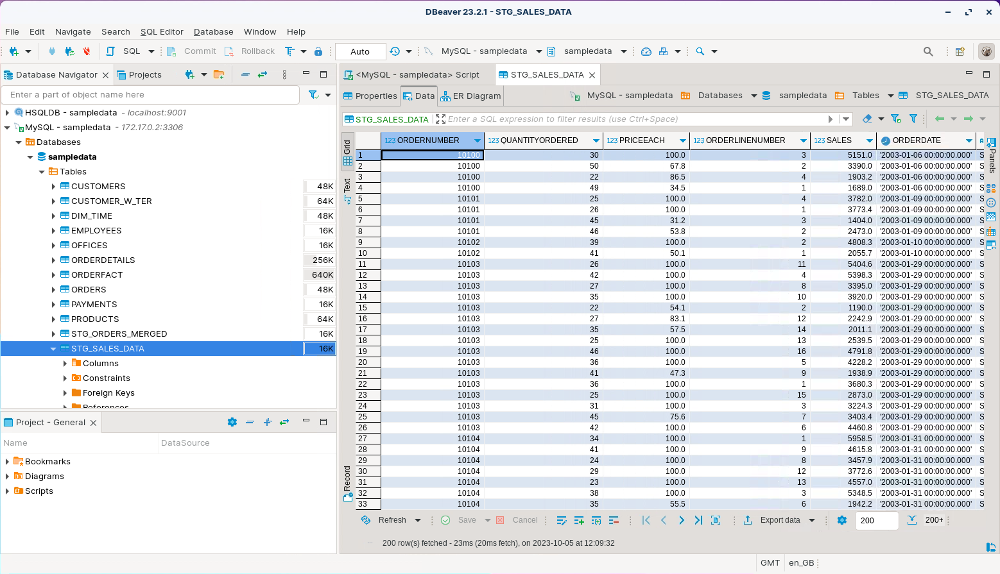<figcaption><p>STG_SALES_DATA</p></figcaption></figure>

::::

### Workflow 2 - Orders

> **Note:**
>
> #### **Load Orders**
> 
> Load orders data from a delimited file into `STG_ORDERS_MERGED`.
> 
> Adjust field lengths to avoid truncation.

<figure>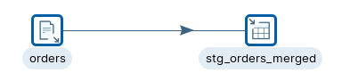<figcaption><p>Load orders data</p></figcaption></figure>

Follow the steps outlined below:

::: tabs

### 1. CSV File Input

> **Note:** **CSV File Input**
> 
> Same setup as Workflow 1, but point to your orders file.

1. Drag the CSV file input step onto the canvas.
2. Open the CSV file input properties dialog box.

Ensure the following details are configured, as outlined below:

<figure>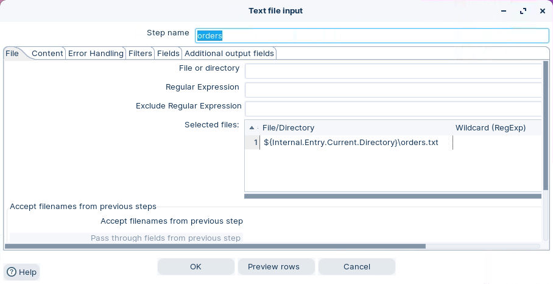<figcaption><p>Add path to orders.txt</p></figcaption></figure>

<figure>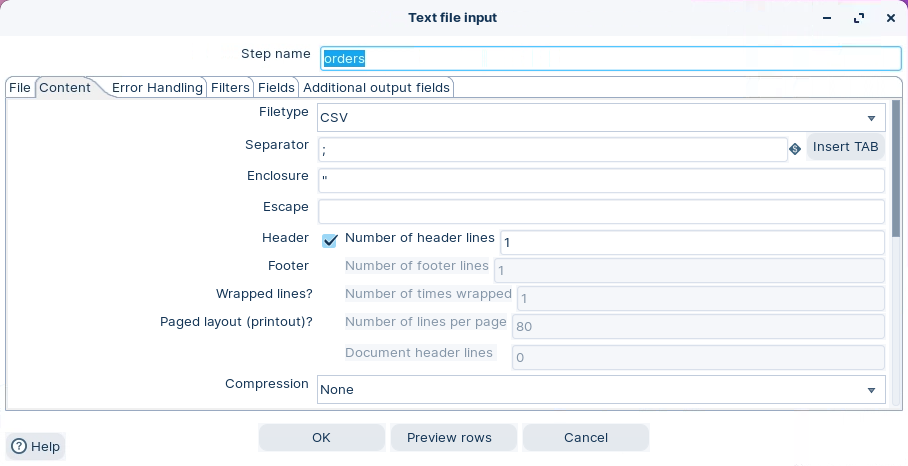<figcaption><p>Set Content</p></figcaption></figure>

<figure>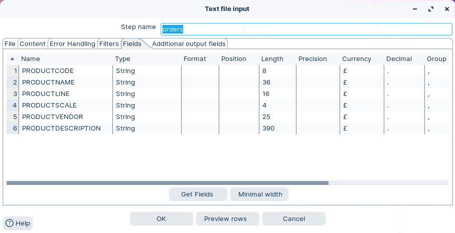<figcaption><p>Get Fields</p></figcaption></figure>

### 2. Table Output

> **Note:** **Table Output**
> 
> Load rows into a database table.\
> This step uses SQL `INSERT`.

1. Drag the Table Output step onto the canvas.
2. Open the Table Output properties dialog box. Ensure the following details are configured, as outlined below:

<figure>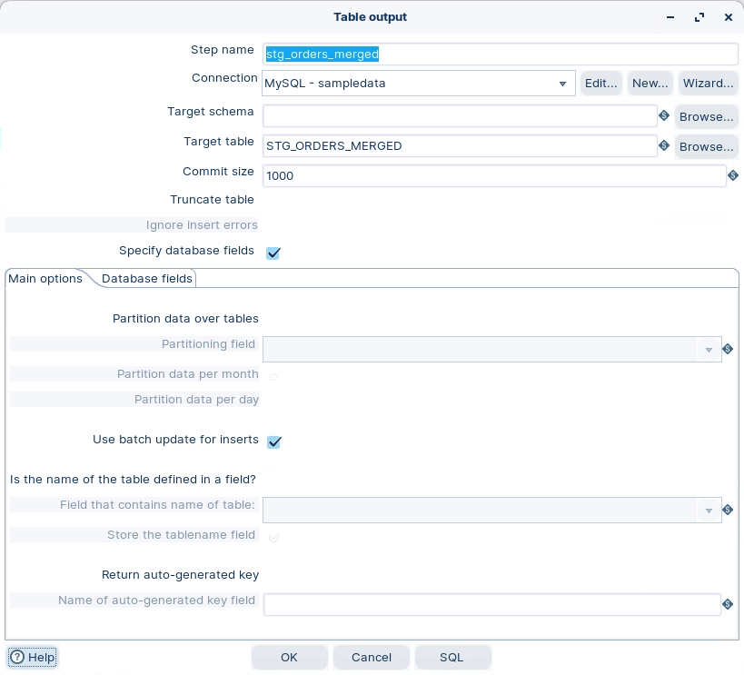<figcaption><p>Table output - options</p></figcaption></figure>

3. Click on the Database fields.
4. Click on the ‘Get Fields’ button.

<figure>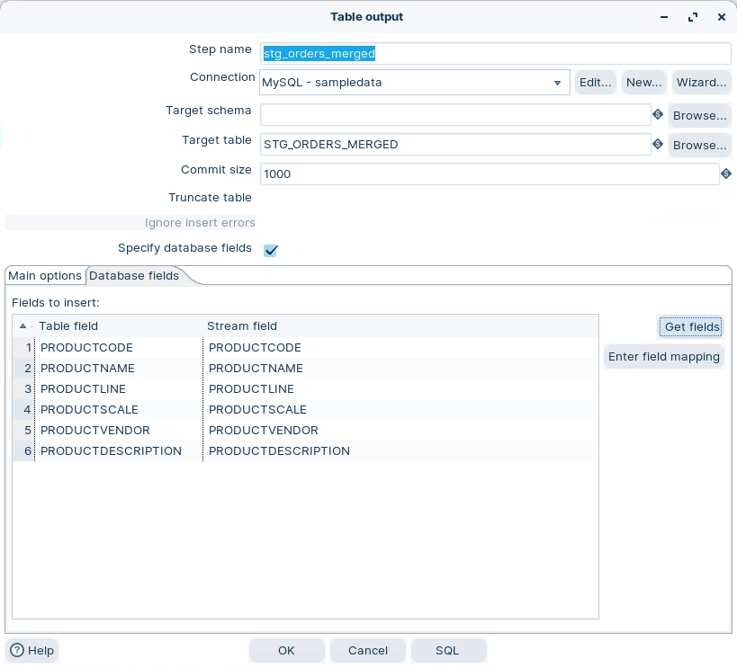<figcaption><p>Table output -fields</p></figcaption></figure>

5. Click on the SQL button.

<figure>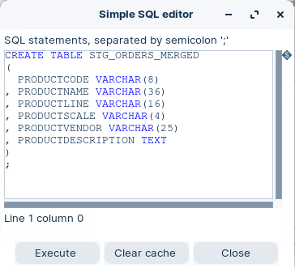<figcaption><p>SQL editor</p></figcaption></figure>

6. Click Execute.
7. Select **OK** to close all dialogs.

> **Success:** Checkpoint: `STG_ORDERS_MERGED` exists in the database.

### 3. RUN

> **Note:** **RUN and validate**
> 
> Use a database tool to verify results.

1. Click the Run button in the Canvas Toolbar.
2. Confirm the table exists in your `sampledata` database.

<figure>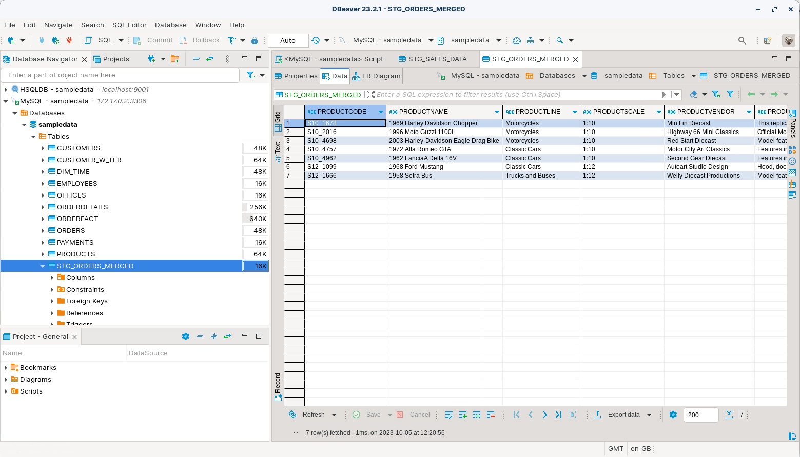<figcaption><p>STG_ORDERS_MERGED</p></figcaption></figure>

:::

:::::

<details>

<summary>Troubleshooting</summary>

**“Table already exists”**\
Disable table creation in **Table Output**, or drop the table first.

**String truncation / data too long**\
Increase field lengths in **CSV File Input** before you generate SQL.

**SQL window is empty**\
Select **Get fields** on the **Database fields** tab first.

</details>

## Lab Files

Click a file to download. For `.ktr` and `.kjb` files, **Open in Pentaho Data Integration** launches PDI with the file loaded. If PDI is already running, the path is copied to your clipboard — switch to PDI and use Ctrl+O, Ctrl+V, Enter.

[orders.txt](./files/orders.txt)

[sales_data.csv](./files/sales_data.csv)

[tr_write_database.ktr](./files/tr_write_database.ktr) <button data-launch="spoon" data-path="files/tr_write_database.ktr">Open in Pentaho Data Integration</button> <button data-graph="files/tr_write_database.ktr">View graph</button>
