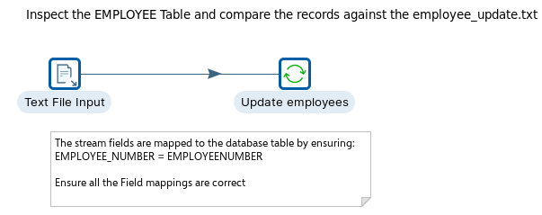
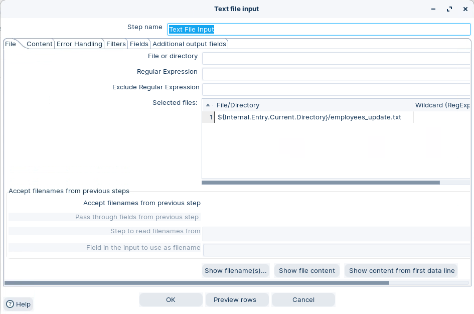
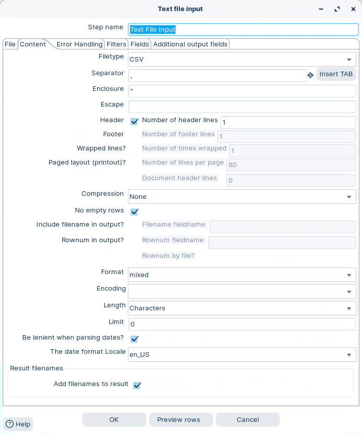
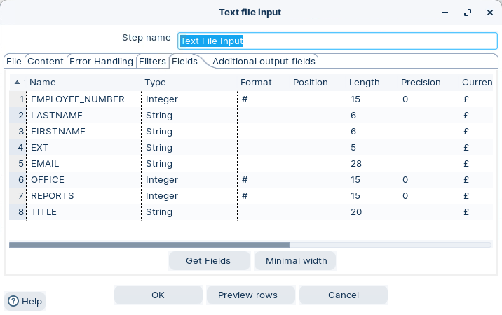
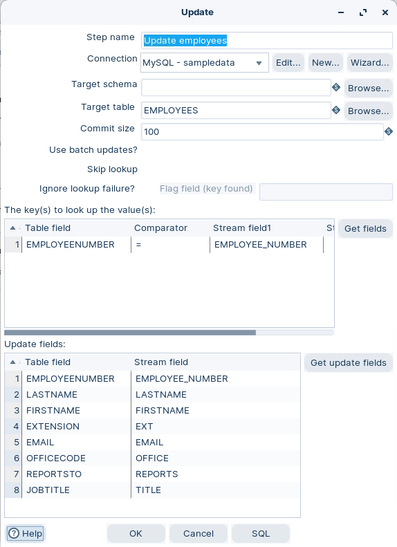
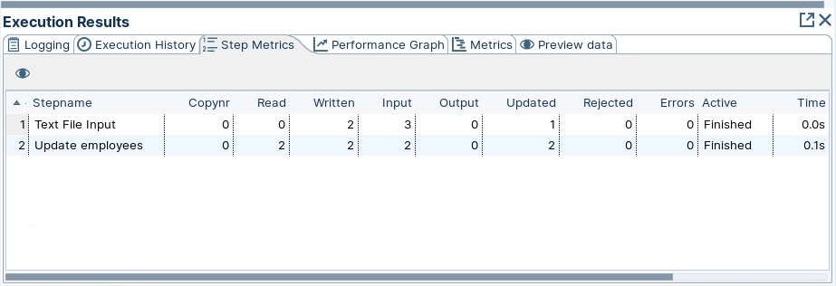
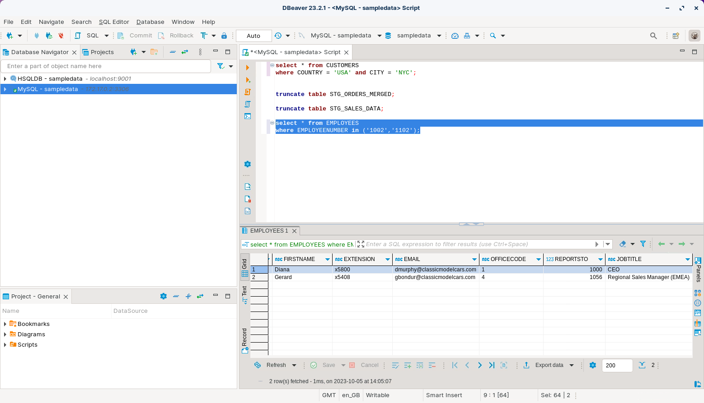

# Update DB table

> **Warning:**
>
> #### Workshop - Update DB table
> 
> Update existing rows in `EMPLOYEES` using a key lookup.\
> You will change job titles for two employees.
> 
> **What you’ll do**
> 
> * Read an update file with **Text file input**
> * Update matching rows with **Update**
> * Validate changes with SQL
> 
> **Prerequisites**
> 
> * A working database connection. See **Database Connections**.
> * Basic primary key concepts (`EMPLOYEENUMBER`)
> 
> **Estimated time:** 20 minutes



> **Note:** **Create a new transformation**
> 
> Use any of these options to open a new transformation tab:
> 
> * Select **File** > **New** > **Transformation**
> * Use `Ctrl+N` (Windows/Linux) or `Cmd+N` (macOS)

:::: tabs

### 1. Text file input

> **Note:**
>
> #### Text file input
> 
> Read the incoming updates from `employees_update.txt`.

1. Start Spoon.

> **Note:** 

::: tabs

### Windows (PowerShell)

> 
> ```powershell
> Set-Location C:\Pentaho\design-tools\data-integration
> .\spoon.bat
> ```
> 
>

### macOS / Linux

> 
> ```bash
> cd ~/Pentaho/design-tools/data-integration
> ./spoon.sh
> ```
> 
>

:::

<button data-launch="spoon" data-path="">Start PDI</button>

2. Drag **Text file input** onto the canvas.
3. Open the step properties.
4. Configure the file path:
   * **File:** `${Internal.Transformation.Filename.Directory}/employees_update.txt`

<figure><figcaption><p>Set file path</p></figcaption></figure>

> **Note:** If `${Internal.Transformation.Filename.Directory}` is empty, save the transformation first.

5. Select **Content**. Use the same delimiter settings as the screenshot.

<figure><figcaption><p>Text file input - Content</p></figcaption></figure>

6. Select **Get Fields**.
7. On **Fields**, confirm you have these stream fields:
   * `EMPLOYEE_NUMBER`
   * `LASTNAME`
   * `FIRSTNAME`
   * `EXTENSION`
   * `EMAIL`
   * `OFFICECODE`
   * `REPORTSTO`
   * `JOBTITLE`

<figure><figcaption><p>Text file input - Fields</p></figcaption></figure>

8. Optional: select **Preview**. Confirm you get 2 rows.
9. Select **OK**.

> **Success:** Checkpoint: Preview shows 2 employee rows.

### 2. Update

> **Note:**
>
> #### Update
> 
> Use **Update** to update existing database rows only.\
> If a key lookup does not match, the step skips that row.

> **Note:** If you also need inserts, use **Insert / Update DB**.

1. Drag **Update** onto the canvas.
2. Create a hop from **Text file input** to **Update**.
3. Open the step properties.
4. Select your database **Connection**.
5. Set **Target table** to `EMPLOYEES`.

<figure><figcaption><p>Update fields</p></figcaption></figure>

> **Note:** **Key lookup**
> 
> Map the table key `EMPLOYEENUMBER` to the stream field `EMPLOYEE_NUMBER`.
> 
> **Update fields**
> 
> Select **Get update fields**. Then confirm mappings are correct.
> 
> Do not add `EMPLOYEENUMBER` as an update field.

6. Select **OK**.

### 3. Run and validate

> **Note:**
>
> #### Run and validate
> 
> Run the transformation. Then validate the changes in the database.

1. Select **Run** in the canvas toolbar.
2. In **Execution Results**, open **Step Metrics**.

<figure><figcaption><p>Step metrics</p></figcaption></figure>

> **Note:** You should see **2 updated** rows for the Update step.

3. Verify the updated rows:

```sql
select * from EMPLOYEES
where EMPLOYEENUMBER in ('1002','1102');
```

<figure><figcaption><p>Update employees</p></figcaption></figure>

> **Success:** Checkpoint: `JOBTITLE` matches the values from `employees_update.txt`.

::::

<details>

<summary>Troubleshooting</summary>

**Step updates 0 rows**\
Confirm `EMPLOYEENUMBER` exists in `EMPLOYEES`. The Update step does not insert.

**Updates fail with data type errors**\
Make sure `EMPLOYEE_NUMBER` is numeric. Use **Select values** to cast if needed.

**Wrong rows updated**\
Confirm the key mapping is `EMPLOYEENUMBER` (table) = `EMPLOYEE_NUMBER` (stream).

</details>

## Lab Files

Click a file to download. For `.ktr` and `.kjb` files, **Open in Pentaho Data Integration** launches PDI with the file loaded. If PDI is already running, the path is copied to your clipboard — switch to PDI and use Ctrl+O, Ctrl+V, Enter.

[employee_table_backup.sql](./files/employee_table_backup.sql)

[employees_update.txt](./files/employees_update.txt)

[tr_employee_update.ktr](./files/tr_employee_update.ktr) <button data-launch="spoon" data-path="files/tr_employee_update.ktr">Open in Pentaho Data Integration</button> <button data-graph="files/tr_employee_update.ktr">View graph</button>
