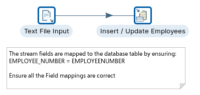
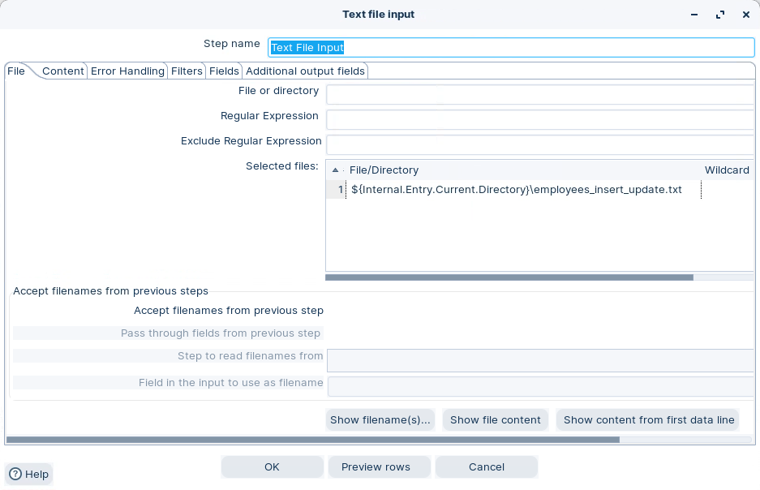
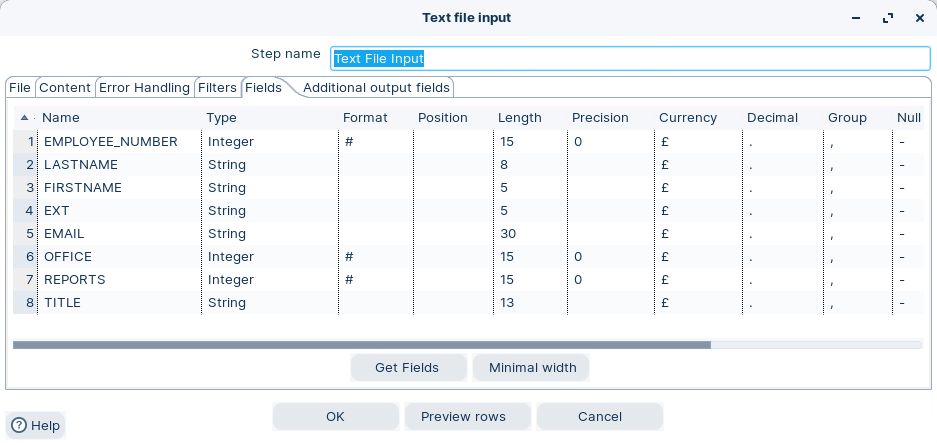
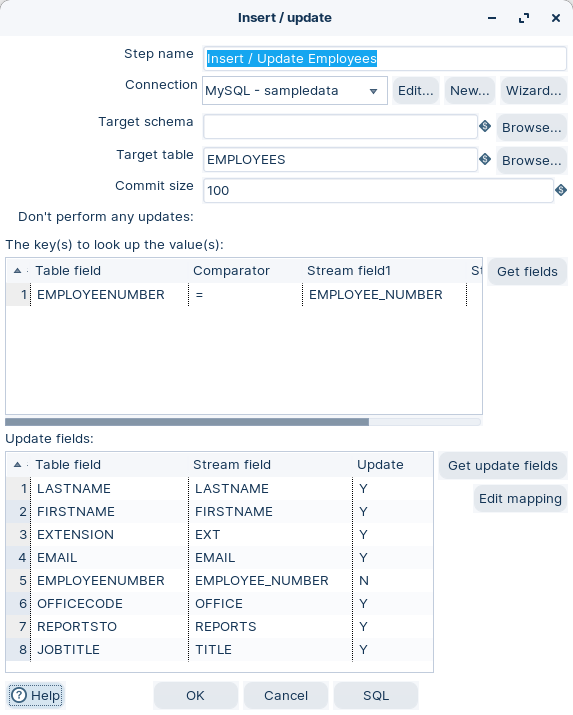
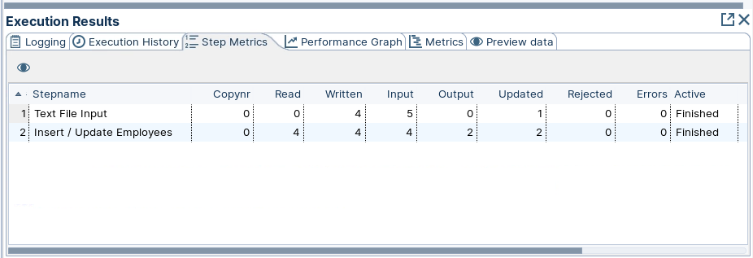
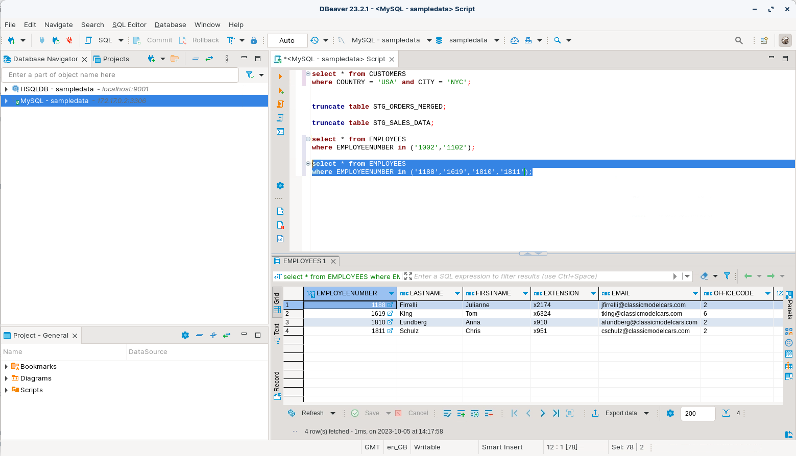

# Insert / Update DB

> **Warning:**
>
> #### Workshop - Insert / Update DB
> 
> Synchronize a file feed to the `EMPLOYEES` table.\
> Some rows already exist. Others are new.
> 
> This pattern is called **upsert**: update if found, insert if not.
> 
> **What you’ll do**
> 
> * Read a mixed employee feed with **Text file input**
> * Upsert into `EMPLOYEES` with **Insert/Update**
> * Validate inserted and updated rows with SQL
> 
> **Prerequisites**
> 
> * A working database connection. See **Database Connections**.
> * Basic primary key concepts (`EMPLOYEENUMBER`)
> 
> **Estimated time:** 20 minutes



> **Note:** **Create a new transformation**
> 
> Use any of these options to open a new transformation tab:
> 
> * Select **File** > **New** > **Transformation**
> * Use `Ctrl+N` (Windows/Linux) or `Cmd+N` (macOS)

:::: tabs

### 1. Text file input

> **Note:**
>
> #### Text file input
> 
> Read the incoming mixed feed from `employees_insert_update.txt`.

1. Start Spoon.

> **Note:** 

::: tabs

### Windows (PowerShell)

> 
> ```powershell
> Set-Location C:\Pentaho\design-tools\data-integration
> .\spoon.bat
> ```
> 
>

### macOS / Linux

> 
> ```bash
> cd ~/Pentaho/design-tools/data-integration
> ./spoon.sh
> ```
> 
>

:::

<button data-launch="spoon" data-path="">Start PDI</button>

2. Drag **Text file input** onto the canvas.
3. Open the step properties.
4. Configure the file path:
   * **File:** `${Internal.Transformation.Filename.Directory}/employees_insert_update.txt`

<figure><figcaption><p>Text File input - File</p></figcaption></figure>

> **Note:** If `${Internal.Transformation.Filename.Directory}` is empty, save the transformation first.

5. Select **Content**. Use the same delimiter settings as the screenshot.

<figure><figcaption><p>Text file input - Content</p></figcaption></figure>

6. Select **Get Fields**.
7. On **Fields**, confirm you have these stream fields:
   * `EMPLOYEE_NUMBER`
   * `LASTNAME`
   * `FIRSTNAME`
   * `EXTENSION`
   * `EMAIL`
   * `OFFICECODE`
   * `REPORTSTO`
   * `JOBTITLE`

<figure><figcaption><p>Text File input - Fields</p></figcaption></figure>

8. Optional: select **Preview**. Confirm you get 4 rows.
9. Select **OK**.

> **Success:** Checkpoint: Preview shows 4 employee rows.

### 2. Insert / Update

> **Note:**
>
> #### Insert / Update
> 
> Upsert into the `EMPLOYEES` table.

1. Drag **Insert / Update** onto the canvas.
2. Create a hop from **Text file input** to **Insert / Update**.
3. Open the step properties.
4. Select your database **Connection**.
5. Set **Target table** to `EMPLOYEES`.

<figure><figcaption><p>Insert / update options</p></figcaption></figure>

> **Note:** **Key lookup**
> 
> Map the table key `EMPLOYEENUMBER` to the stream field `EMPLOYEE_NUMBER`.
> 
> **Update fields**
> 
> Select **Get update fields**. Then confirm mappings are correct.
> 
> Do not add `EMPLOYEENUMBER` as an update field.

> **Warning:** Do not enable **Update the keys**.

6. Select **OK**.

### 3. Run and validate

> **Note:**
>
> #### Run and validate
> 
> Run the transformation. Then validate the results in the database.

1. Select **Run** in the canvas toolbar.
2. In **Execution Results**, open **Step Metrics**.

<figure><figcaption><p>Step metrics</p></figcaption></figure>

> **Note:** Expect a mix of inserts and updates, depending on your starting data.\
> You should see activity in the Insert/Update step metrics.

> **Under the hood:**
>
> #### Insert/Update isn't a MERGE statement
>
> MySQL has `INSERT ... ON DUPLICATE KEY UPDATE`; other databases have
> `MERGE`. This step uses neither, because it has to behave the same on
> all of them. Per row it runs a `SELECT` on the key, then one of three
> things: no match → `INSERT`; match with a differing value →
> `UPDATE`; match and identical → nothing. Every decision is made in
> the engine, one row and one round-trip pair at a time.
>
> That is also why the key must be unique in the table. Two matching
> rows means the lookup returns two, and the step cannot know which
> one you meant.
>
> **Why it matters:** for a daily feed of thousands of rows this is
> exactly right — simple, portable, re-runnable. For millions, the
> per-row lookup dominates: load to a staging table with **Table
> output** and let one SQL `MERGE` do the rest.

3. Verify the four employees exist:

```sql
select * from EMPLOYEES
where EMPLOYEENUMBER in ('1188','1619','1810','1811');
```

<figure><figcaption><p>Insert / Update Employees</p></figcaption></figure>

> **Success:** Checkpoint: All four `EMPLOYEENUMBER` values exist in `EMPLOYEES`.

::::

<details>

<summary>Troubleshooting</summary>

**All rows updated (no inserts)**\
Those employee numbers already exist in `EMPLOYEES`.

**All rows inserted (no updates)**\
Your `EMPLOYEENUMBER` values were not found, or key mapping is wrong.

**Duplicate key errors**\
You likely used **Table Output** instead of **Insert/Update**, or you mapped keys incorrectly.

**Updates affect too many rows**\
Ensure `EMPLOYEENUMBER` is unique in your table. Fix duplicates before you upsert.

</details>

## Lab Files

Click a file to download. For `.ktr` and `.kjb` files, **Open in Pentaho Data Integration** launches PDI with the file loaded. If PDI is already running, the path is copied to your clipboard — switch to PDI and use Ctrl+O, Ctrl+V, Enter.

[employees_insert_update.txt](./files/employees_insert_update.txt)

[tr_employee_insert_update.ktr](./files/tr_employee_insert_update.ktr) <button data-launch="spoon" data-path="files/tr_employee_insert_update.ktr">Open in Pentaho Data Integration</button> <button data-graph="files/tr_employee_insert_update.ktr">View graph</button>
