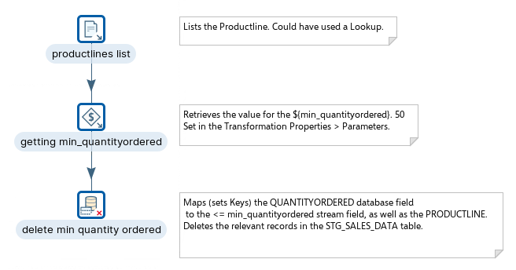
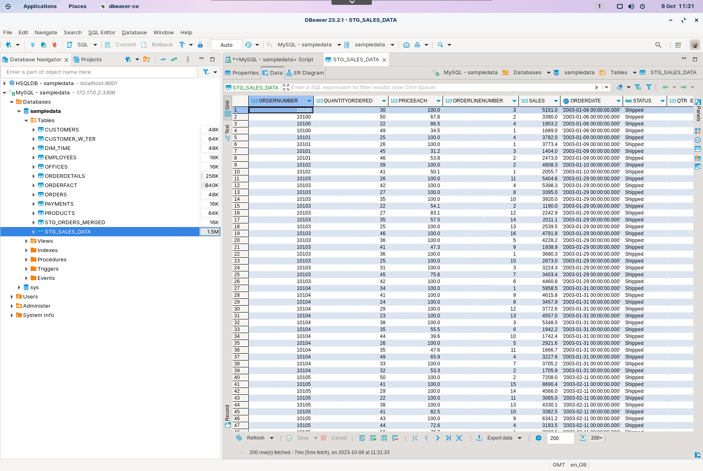
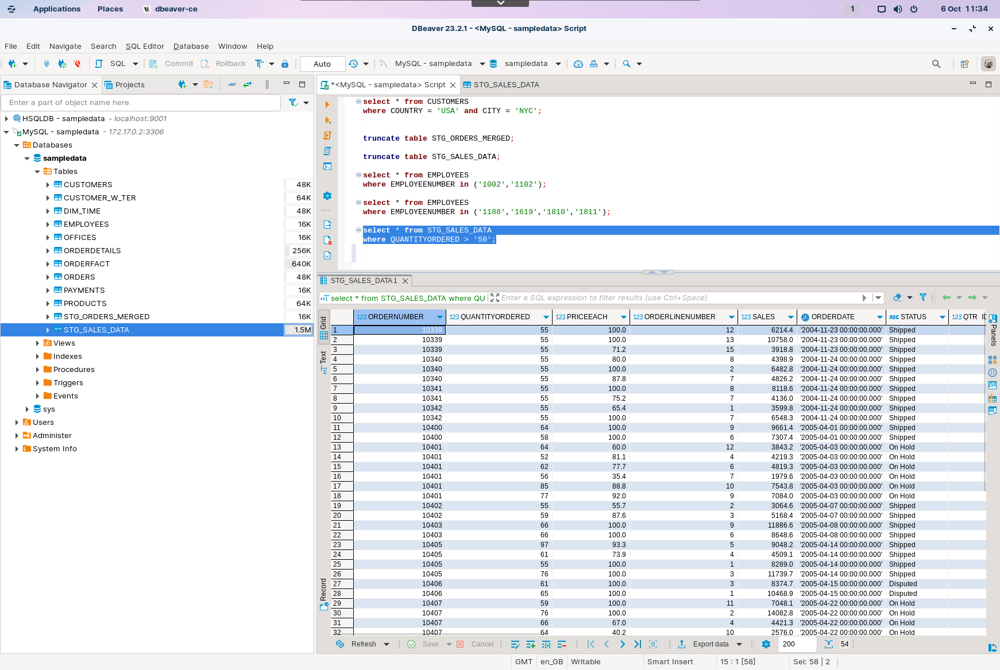
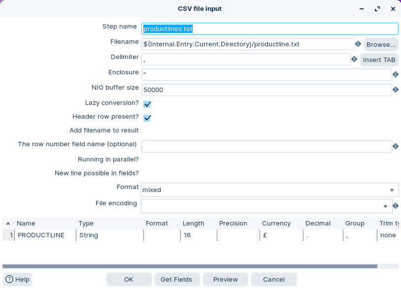
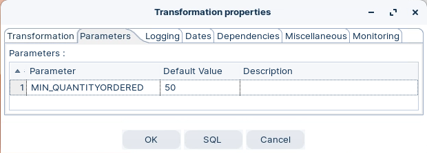
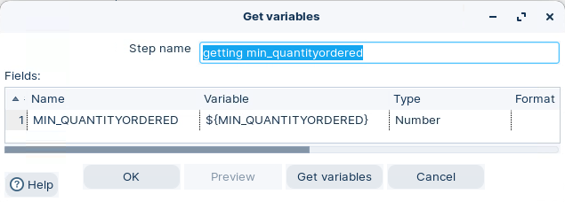
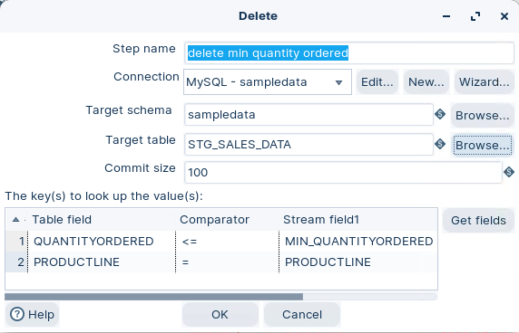
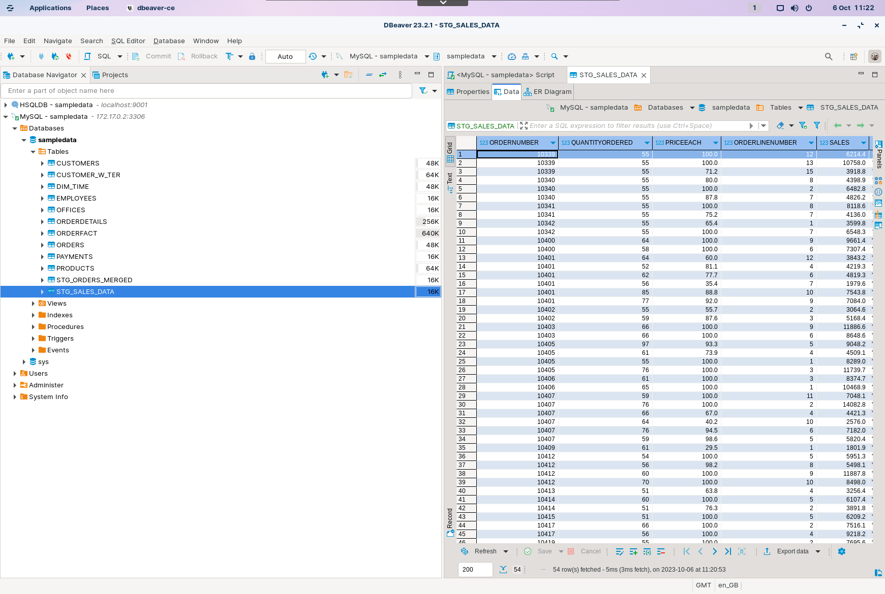

# Delete DB table

> **Warning:**
>
> #### Workshop - Delete DB table
> 
> Delete rows from `STG_SALES_DATA` based on criteria in a stream.\
> This workshop uses a product line list and a minimum quantity threshold.
> 
> Use this step when your delete logic is driven by transformation output.\
> Use **Execute SQL script** for simple deletes.
> 
> **What you’ll do**
> 
> * Inspect the target table before you delete
> * Build a delete criteria stream (product line + quantity)
> * Delete matching rows with **Delete**
> * Validate results with SQL
> 
> **Prerequisites**
> 
> * `STG_SALES_DATA` exists. Create it in **Create DB table**.
> * A working database connection. See **Database Connections**.
> 
> **Estimated time:** 20 minutes

> **Danger:** Back up your table before you run deletes.\
> You can copy the table, or use a database snapshot.



> **Note:** **Create a new transformation**
> 
> Use any of these options to open a new transformation tab:
> 
> * Select **File** > **New** > **Transformation**
> * Use `Ctrl+N` (Windows/Linux) or `Cmd+N` (macOS)

:::: tabs

### 1. Inspect data

> **Note:**
>
> #### Inspect the data
> 
> Inspect `STG_SALES_DATA` before you delete.\
> You need a baseline to validate the change.

1. In your database tool, view `STG_SALES_DATA`.

<figure><figcaption><p>STG_SALES_DATA</p></figcaption></figure>

> **Note:** You will filter deletes using `PRODUCTLINE` and `QUANTITYORDERED`.

2. Run a quick check for high-quantity rows:

```sql
select * from STG_SALES_DATA
where QUANTITYORDERED > 50;
```

<figure><figcaption><p>STG_SALES_DATA constraint QUANTITYORDERED > 50</p></figcaption></figure>

### 2. CSV File input

> **Note:**
>
> #### CSV File input
> 
> Read `productlines.csv`. Each row is one `PRODUCTLINE` value.

1. Start Spoon.

> **Note:** 

::: tabs

### Windows (PowerShell)

> 
> ```powershell
> Set-Location C:\Pentaho\design-tools\data-integration
> .\spoon.bat
> ```
> 
>

### macOS / Linux

> 
> ```bash
> cd ~/Pentaho/design-tools/data-integration
> ./spoon.sh
> ```
> 
>

:::

<button data-launch="spoon" data-path="">Start PDI</button>

2. Drag the CSV File Input step onto the canvas.
3. Open the CSV File Input properties dialog box.
4. Configure it to read: `${Internal.Transformation.Filename.Directory}/productlines.csv`
5. Select **Get Fields**.

<figure><figcaption><p>CSV File input - PRODUCTLINE list</p></figcaption></figure>

### 3. Parameters

> **Note:**
>
> #### Transformation parameters
> 
> Use a parameter for your minimum quantity threshold.\
> This keeps your transformation easy to reuse.

1. Double-click on the canvas and select the Parameter tab.
2. Create a parameter named `min_quantityordered`.
3. Set a default value (for example `50`).

<figure><figcaption><p>Set parameters</p></figcaption></figure>

### 4. Get Variables

> **Note:**
>
> #### Get variables
> 
> Bring `min_quantityordered` into the stream so the Delete step can use it.

1. Drag the Get variables step onto the canvas.
2. Open the Get variables properties dialog box.
3. Configure the step to output a field for `${min_quantityordered}`.

<figure><figcaption><p>Get variables</p></figcaption></figure>

> **Under the hood:**
>
> #### A parameter is a variable with a default; Get variables copies it into the row
>
> When the transformation initialises, every parameter you defined is
> registered in its variable space — the same space `kettle.properties`
> and `${Internal.Transformation.Filename.Directory}` live in — using
> the default unless the run dialog or a parent job supplied a value.
> Steps, though, only ever see *rows*. **Get variables** is the
> bridge: it reads `${min_quantityordered}` from that space, converts
> it to the type you set, and appends it as a field to each row
> passing through.
>
> From the Delete step's point of view the threshold is now just
> another column, indistinguishable from one read out of the CSV.
>
> **Why it matters:** anything that varies per run — a date, a
> threshold, a region — is a parameter with a default, materialised
> into the stream where it is needed. The `.ktr` never changes; the
> value does.

### 5. Delete

> **Note:**
>
> #### Delete
> 
> Delete is a **terminal** step. It does not pass rows downstream.\
> It builds `DELETE` statements from the input stream.

> **Danger:** Be careful with the comparators in this step.\
> Always validate your criteria before you run.

1. Drag the Delete step onto the canvas.
2. Open the Delete properties dialog box.
3. Configure the database **Connection** and set **Table name** to `STG_SALES_DATA`.
4. Map stream fields to table fields for your delete criteria.

<figure><figcaption><p>Delete step</p></figcaption></figure>

> **Note:** This workshop uses criteria based on:
> 
> * `QUANTITYORDERED` and the `min_quantityordered` value
> * `PRODUCTLINE` values from `productlines.csv`

### 6. Run and validate

> **Note:**
>
> #### Run and validate
> 
> Run the transformation, then validate the row counts and sample rows.

> **Warning:** Re-run your baseline queries from the first tab.\
> Confirm the results match your delete criteria.

1. Select **Run** in Spoon.
2. In your database tool, inspect `STG_SALES_DATA`.

<figure><figcaption><p>STG_SALES_DATA</p></figcaption></figure>

> **Under the hood:**
>
> #### One DELETE per incoming row, comparators and all
>
> The step prepared a single statement from the grid — `DELETE FROM
> STG_SALES_DATA WHERE PRODUCTLINE = ? AND QUANTITYORDERED > ?` — and
> executed it once for every row that arrived, binding that row's
> `PRODUCTLINE` and its `min_quantityordered` field into the markers.
> Three product lines in the CSV meant three statements, each free to
> remove thousands of rows, committed together every **Commit size**
> rows.
>
> No rows leave the step, and its Updated counter in Step Metrics
> counts *statements executed* — one per driving row — not rows
> removed. Only the database knows that number, which is why the
> workshop has you re-run the baseline query.
>
> **Why it matters:** a small driving stream can delete a large amount
> of data; that is both the point and the risk. Run with the hop into
> Delete disabled first and preview the driving rows — each one is a
> `WHERE` clause you are about to execute.

::::

<details>

<summary>Troubleshooting</summary>

**Nothing was deleted**\
Your criteria did not match any rows. Confirm your comparator and data types.

**Too many rows deleted**\
Your comparator is too broad, or you mapped the wrong field names.

**Delete step fails with type conversion errors**\
Cast `min_quantityordered` to a number with **Select values**.

</details>

## Lab Files

Click a file to download. For `.ktr` and `.kjb` files, **Open in Pentaho Data Integration** launches PDI with the file loaded. If PDI is already running, the path is copied to your clipboard — switch to PDI and use Ctrl+O, Ctrl+V, Enter.

[productline.txt](./files/productline.txt)

[tr_delete.ktr](./files/tr_delete.ktr) <button data-launch="spoon" data-path="files/tr_delete.ktr">Open in Pentaho Data Integration</button> <button data-graph="files/tr_delete.ktr">View graph</button>
