# SCDs

> **Warning:**
>
> #### Workshop - Slowly changing dimensions (SCDs)
> 
> Maintain a dimension table as attributes change over time.\
> Use **Dimension Lookup/Update** for both **Type 1** and **Type 2** behavior.
> 
> **What you’ll do**
> 
> * Create a `DIM_SCD` table in `sampledata`
> * Generate test rows with **Data Grid**
> * Add timestamps with **Get System Info**
> * Configure **Dimension Lookup/Update** for:
>   * Lookup mode (read-only enrichment)
>   * Update mode (writes)
> * Test field strategies:
>   * **Update** (Type 1 overwrite)
>   * **Insert** (Type 2 new version)
>   * **Punch through** (update all versions)
> 
> **Prerequisites**
> 
> * PDI installed and running
> * A working MySQL connection to `sampledata`
> * Familiarity with natural keys vs surrogate keys
> 
> **Estimated time:** 40 minutes

<div class="pcm-embed-card" data-href="https://www.loom.com/share/3ec2d5123814460d92085851c18daaee?hideEmbedTopBar=true&amp;hide_owner=true&amp;hide_share=true&amp;hide_title=true" data-title="Understanding Dimension Lookup Update Steps in Data Integration" data-description="In this video, I walk you through the dimension lookup update step, highlighting its key features and how to use them effectively. We start by reading customer dimension data from a delimited file and then add the current system date before performing the lookup and update in our database table. I demonstrate how to configure the keys and fields for the dimension data, and we observe the insertion of five rows, including an empty row due to the table being initially empty. I also show how to handle updates when a customer's location changes, which increments the version number in our records. Please refer to the Pentaho data integration documentation for further details on additional capabilities and configurations." data-thumb="../_assets/embeds/31bfeafa9446.png"></div>

> **Note:** **Create a new transformation**
> 
> Use any of these options to open a new transformation tab:
> 
> * Select **File** > **New** > **Transformation**
> * Use `Ctrl+N` (Windows/Linux) or `Cmd+N` (macOS)

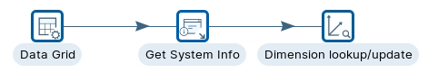

::::: tabs

### Transformation

> **Danger:**
>
> #### Transformation
> 
> Ensure the tr\_scd.ktr has been created before you explore the Workflows.

:::: tabs

### 1. DIM\_SCD Table

> **Note:**
>
> #### **SCD table**
> 
> First step in these series of workshops, is to create a simple DIM\_SCD table that has the required fields to illustrate a Type 1 change - just overwrite the value - and Type 2 - where you need to record when any change in the value occurs.

1. Start PDI.

> **Note:** 

::: tabs

### Windows (PowerShell)

> 
> ```powershell
> Set-Location C:\Pentaho\design-tools\data-integration
> .\spoon.bat
> ```
> 
>

### macOS / Linux

> 
> ```bash
> cd ~/Pentaho/design-tools/data-integration
> ./spoon.sh
> ```
> 
>

:::

<button data-launch="spoon" data-path="">Start PDI</button>

> **Warning:** Create the Table in MySQL sampledata database.

2. In your DB management tool, execute the following statement.

```sql
CREATE TABLE `DIM_SCD` (
  `TK` bigint(10) NOT NULL,
  `version` int(11) DEFAULT '0',
  `id` int(11) DEFAULT '0',
  `city` tinytext,
  `date_from` datetime DEFAULT NULL,
  `date_to` datetime DEFAULT NULL,
  `last_update` datetime DEFAULT NULL,
  PRIMARY KEY (`TK`),
  KEY `idx_DIM_SCD_lookup` (`id`)
) ENGINE=InnoDB DEFAULT CHARSET=latin1;
```

<figure>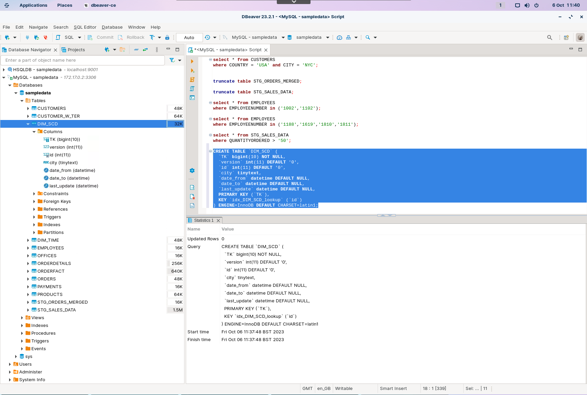<figcaption><p>DIM_SCD</p></figcaption></figure>

### 2. Data Grid

> **Note:**
>
> #### **Data grid**
> 
> This step allows you to enter a static list of rows in a grid. This is usually done for testing, reference or demo purposes.

1. Drag the Data Grid step onto the canvas.
2. Open the Data Grid properties dialog box.
3. Ensure the following details are configured, as outlined below:

<figure>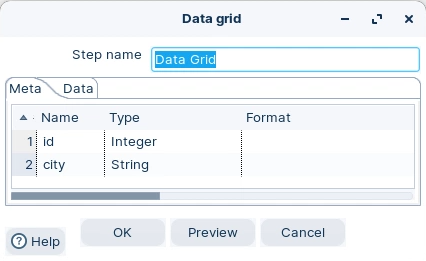<figcaption><p>Data grid - meta</p></figcaption></figure>

4. On the Data tab enter the following values:

<figure>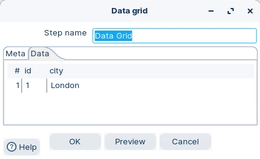<figcaption><p>Data grid - data</p></figcaption></figure>

### 3. Get System Info

> **Note:**
>
> #### **Get system info**
> 
> The Get System Info step retrieves information from the Kettle environment.
> 
> This step generates a single row with the fields containing the requested information. It also accepts input rows.

1. Drag the Get System Info step onto the canvas.
2. Open the Get System Info properties dialog box.
3. Ensure the following details are configured, as outlined below:

<figure>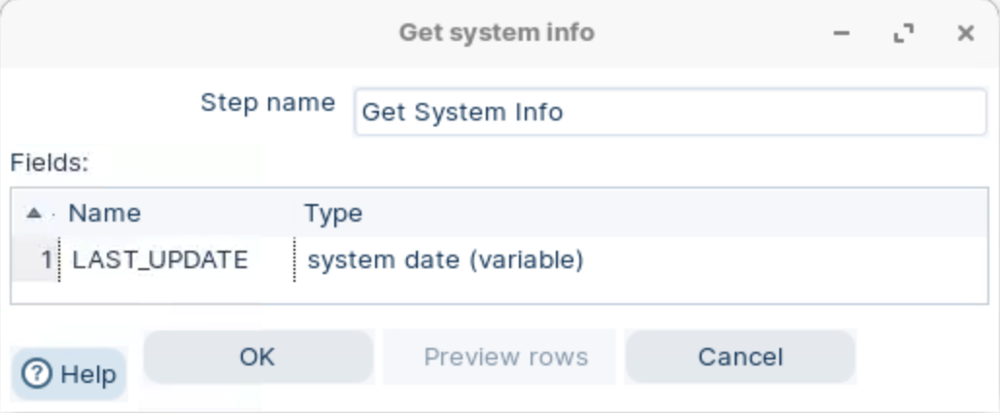<figcaption><p>Get system info</p></figcaption></figure>

### 4. Dimension lookup/update

> **Note:**
>
> #### **Dimension lookup/update**
> 
> The Dimension Lookup/Update step allows you to implement Ralph Kimball's slowly changing dimension for both types: Type I (update) and Type II (insert) together with some additional functions. Not only can you use this step to update a dimension table, it may also be used to look up values in a dimension.

1. Drag the Dimension lookup/update step onto the canvas.
2. Open the Dimension lookup/update properties dialog box.
3. Ensure the following details are configured, as outlined below:

* **Connection:** your `sampledata` connection
* **Target table:** `DIM_SCD`
* **Technical key field:** `TK`
* **Version field:** `version`
* **Lookup key:** `id`

> **Note:** You will switch between **Lookup mode** and **Update mode** in the workflows below.

::::

### Workflow 1 - Lookup

> **Note:** **Lookup**
> 
> This step is rarely used for lookups because specific steps exist. However, it does illustrate how referential integrity is maintained.

1. Add ‘London’ to the Data Grid.

<figure>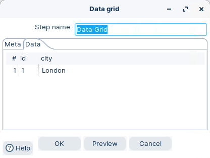<figcaption><p>Data grid - lookup</p></figcaption></figure>

> **Warning:** To initially configure the fields set the step to Update mode.
> 
> Once completed remember to reset to lookup mode.

<figure>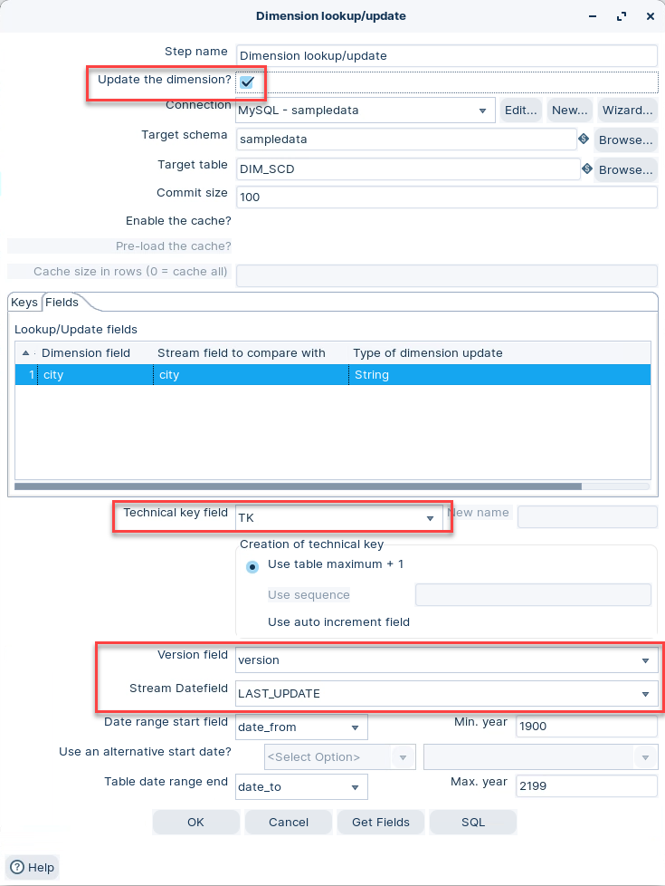<figcaption><p>Configure fields</p></figcaption></figure>

2. Ensure that the Dimension Lookup / Update is set to: Lookup Mode.

<figure>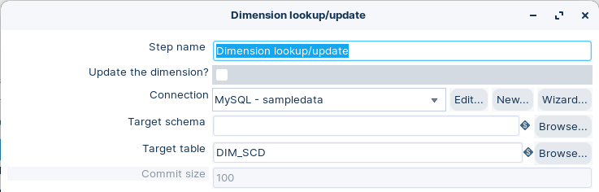<figcaption><p>set lookup mode</p></figcaption></figure>

> **Note:** Sets the step to Update Mode with lookup keys: id
> 
> There’s no point adding the `last_update` field because we’re dealing with Type 1 changes.

3. Click on the Fields tab.

<figure>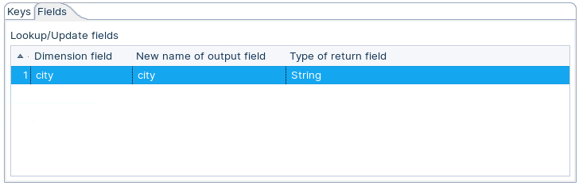<figcaption><p>Set city to string</p></figcaption></figure>

> **Note:** **Run the transformation**
> 
> Preview the output from **Dimension lookup/update**.

1. Click the Run button in the Canvas Toolbar.
2. Preview data for the **Dimension lookup/update** step.

<figure>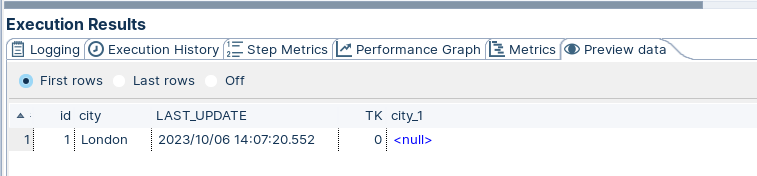<figcaption><p>Preview data</p></figcaption></figure>

> **Note:** **Why does London have a TK 0 and a value of NULL?**
> 
> To maintain referential integrity, the record is assigned a TK 0, and as it doesn’t exist in the database, the value returned is NULL. As this is a lookup, no record is written to the database table.

### Workflow 2 - Type 1

> **Note:** The Dimension Lookup/Update step allows you to implement Ralph Kimball's slowly changing dimension for both types:
> 
> **Type 1**
> 
> Overwriting the old value. In this method, no history of dimension changes is kept in the database. The old dimension value is simply overwritten with the new one. This type is easy to maintain and is often used for data where changes are caused by processing corrections (for example, removal of special characters, correcting spelling errors).

1. Open the Dimension Lookup / Update properties dialog box.
2. Ensure the following details are configured, as outlined below:

<figure>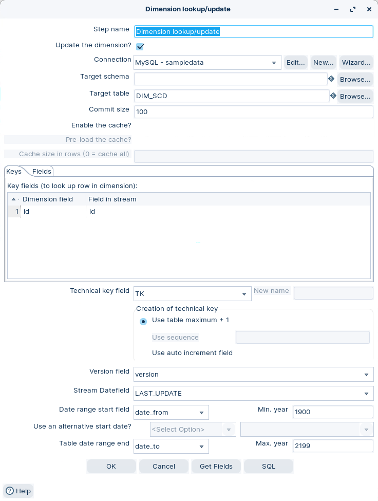<figcaption><p>Type 1</p></figcaption></figure>

3. Click on the Get Fields button.

> **Note:** This will add the key fields used in the Lookup.
> 
> The keys that map dimension table rows to stream rows are: `id`

4. Click on the Fields tab and map the stream name field to the dimension name field and ensure:

<figure>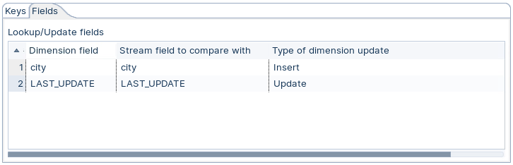<figcaption><p>Field mapping and set database strategy</p></figcaption></figure>

> **Note:** There are several options available to insert / update the dimension record (row).
> 
> **Insert:**
> 
> This option implements a Type I & II slowly changing dimension policy. If the difference is detected for one or more mappings that have the Insert option, then a row is added to the dimension table.
> 
> **Update:**
> 
> This option simply updates the matched row. It can be used to implement a Type I slowly changing dimension.
> 
> **Punch through:**
> 
> The punch through option also performs an update. But instead of only updating the matched dimension row, it will update all versions of the row in a Type II slowly changing dimension.
> 
> **Date of last insert or update (without stream field as source):**
> 
> Use this option to let the step automatically maintain a date field that records the date of the insert or update using the system date field as source.
> 
> **Date of last insert (without stream field as source):**
> 
> Use this option to let the step automatically maintain a date field that records the date of the last insert using the system date field as source.
> 
> **Date of last update (without stream field as source):**
> 
> Use this option to let the step automatically maintain a date field that records the date of the last update using the system date field as source.
> 
> **Last version (without stream field as source):**
> 
> Use this option to let the step automatically maintain a flag that indicates if the row is the last version.

> **Success:** **RUN Transformation**
> 
> At the moment it's all Type I changes .. Insert / Update record and Update when that record change occurred.

1. Click the Run button in the Canvas Toolbar.
2. Click on the Preview tab:

<figure>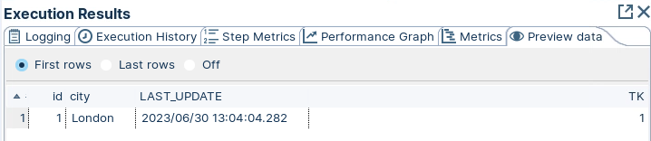<figcaption><p>Preview data</p></figcaption></figure>

3. Examine the table in your SQL Query Tool:

<figure>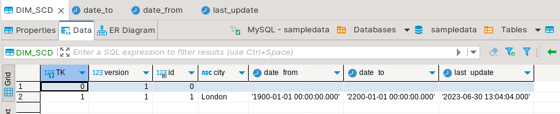<figcaption><p>DIM_SCD - view data</p></figcaption></figure>

> **Note:** **So what's happening behind TK 0?**
> 
> Kettle automatically inserts an additional record with a technical key of value 0 (for default or unknown values). This will only happen in the first execution. Below this record, you find the one record (London) from our sample dataset.
> 
> In update mode (update option is enabled) the step first performs a lookup of the dimension entry. The result of the lookup is different though. Not only the technical key is retrieved from the query, but also the dimension attribute fields. A field-by-field comparison then follows. The result can be one of the following situations:
> 
> * The record was not found, we insert a new record in the table.
> * The record was found and any of the following is true:
> * One or more attributes were different and had an "Insert" (Kimball Type II) setting: A new dimension record version is inserted.
> * One or more attributes were different and had a "Punch through" (Kimball Type I) setting: These attributes in all the dimension record versions are updated.
> * One or more attributes were different and had an "Update" setting: These attributes in the last dimension record version are updated.
> * All the attributes (fields) were identical: No updates or insertions are performed.
> 
> If you mix Insert, Punch Through and Update options in this step, this algorithm acts like a Hybrid Slowly Changing Dimension. (it is no longer just Type I or II, it is a combination)

**Try different scenarios**

::: tabs

### Insert / Update

1. Double-click on the Data Grid step.
2. Add the following City: Madrid

<figure>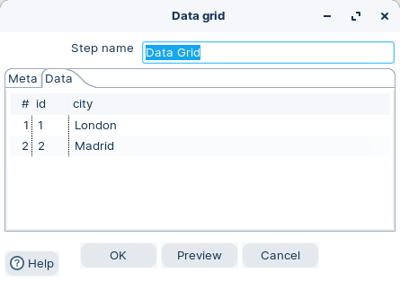<figcaption><p>data Grid - Madrid</p></figcaption></figure>

3. Double-click on the Dimension lookup/update step.
4. Click on the Fields tab and set the following:

<figure>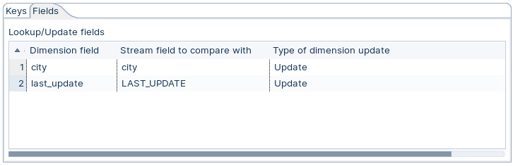<figcaption><p>Field mapping and set database operation</p></figcaption></figure>

5. Execute the transformation and view the results.

<figure>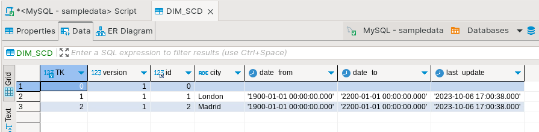<figcaption><p>DIM_SCD update</p></figcaption></figure>

> **Note:** Note that if the record does not exist (Madrid), then it gets inserted. Both records are updated with the same last\_update timestamp.

:::

### Workflow 3 - Type 2

> **Note:** The Dimension Lookup/Update step allows you to implement Ralph Kimball's slowly changing dimension for both types:
> 
> **Type 2**
> 
> Creating a new additional record. In this methodology, all history of dimension changes are kept in the database. You capture attribute change by adding a new row with a new surrogate key to the dimension table. Both the prior and new rows contain as attributes the natural key (or another durable identifier). Also 'effective date' and 'current indicator' columns are used in this method. There could be only one record with current indicator set to 'Y'. For 'effective date' columns, i.e. start\_date and end\_date, the end\_date for current record usually is set to value 9999-12-31. Introducing changes to the dimensional model in Type 2 could be very expensive database operation so it is not recommended to use it in dimensions where a new attribute could be added in the future.

1. Double-click on the Data Grid step.
2. Add the following City: Pariss (intentionally misspelled)

<figure>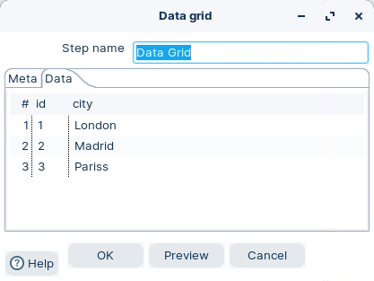<figcaption><p>Data grid - Pariss</p></figcaption></figure>

3. Keep the Fields strategy the same:

<figure><figcaption><p>Field mapping and set database strategy</p></figcaption></figure>

**RUN Transformation**

> **Success:** At the moment it's all Type I changes .. Insert / Update record and Update when that record change occurred.

1. Click the Run button in the Canvas Toolbar.
2. Click on the Preview tab:

<figure>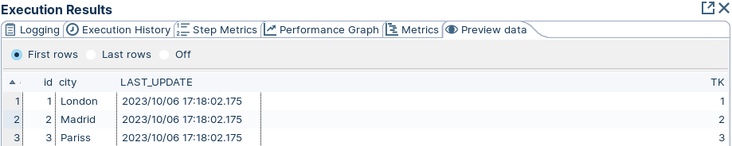<figcaption><p>Preview data</p></figcaption></figure>

3. Examine the table in your SQL Query Tool:
4. Execute the transformation and view the results.

<figure>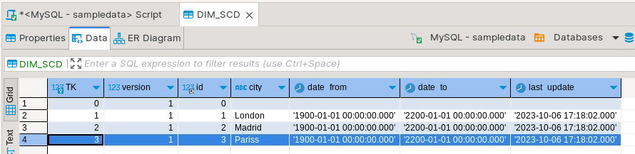<figcaption><p>DIM_SCD - view data</p></figcaption></figure>

> **Note:** As expected the Pariss record is inserted. Notice that the natural primary keys (id) are the same as the TK (Technical Key) and we're on version 1 for each record.

> **Warning:** Let's now do a bit of data entry .. Correct the entry: Pariss to Paris

**Try out different Strategies**

> **Note:** The workflows below will give you an idea of the different strategies that can be implemented.

::: tabs

### Type 2

> **Note:** Any records that are changed are:
> 
> * Archived with date\_from to date\_to timestamp.
> * Record is assigned Version 1. New record Version 2
> * Note the Keys.

1. Double-click on the Data Grid step.
2. Edit the Pariss value to: Paris

<figure>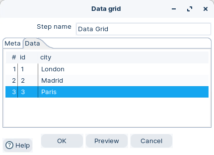<figcaption><p>Data grid - edit Paris</p></figcaption></figure>

3. Double-click on the Dimension lookup/update step.
4. Click on the Fields tab and set the following:

> **Warning:** The reason for selecting Insert is obvious.. you need to insert a new record that tracks the change. If you select Update, then a Type 1 change occurs; i.e. the original record is updated.

<figure>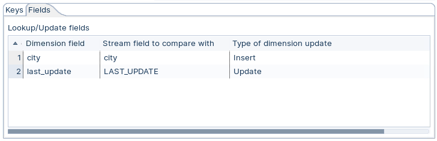<figcaption><p>Field mapping and set database strategy</p></figcaption></figure>

**RUN the Transformation**

1. Click the Run button in the Canvas Toolbar.
2. Examine the table in your SQL Query Tool:.

<figure>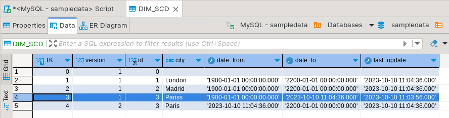<figcaption><p>DIM_SCD - view data</p></figcaption></figure>

> **Note:** * A new record has been inserted, with the value ‘Paris’, with an updated date\_from and last\_update timestamp, and version.
> * Notice that the `last_update` field has also been updated for the other records.

### Punch through

> **Note:** **Punch through:**
> 
> The punch through option also performs an update. But instead of only updating the matched dimension row, it will update all versions of the row in a Type II slowly changing dimension.
> 
> So let's update all versions to Paris.

1. Let's start with a clean table to clearly illustrate the results. Truncate the table.

```sql
TRUNCATE TABLE DIM_SCD;
```

2. Repeat the workflow above and check the results.

> **Warning:** * Ensure you have set 'Pariss' as the value for city in the data grid step.
> * Set update as your initial strategy.

<figure><figcaption><p>Preview data</p></figcaption></figure>

3. Double-click on the Data Grid step.
4. Edit the Pariss value to: Paris

   <figure><figcaption><p>Data grid - edit Paris</p></figcaption></figure>

5. Double-click on the Dimension lookup/update step.
6. Click on the Fields tab and set the following:

<figure>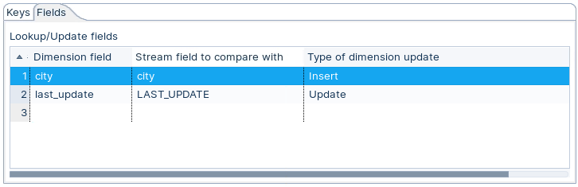<figcaption><p>Field mapping and set database strategy</p></figcaption></figure>

**RUN the Transformation**

1. Click the Run button in the Canvas Toolbar.
2. Examine the table in your SQL Query Tool:

<figure><figcaption><p>DIM_SCD - view data</p></figcaption></figure>

**Punch through**

1. Edit the Fields tab in the Dimension Lookup/update step to Punch through:

<figure>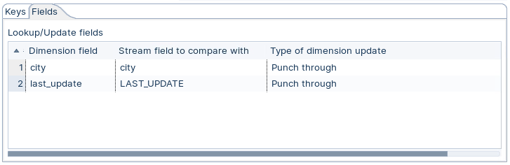<figcaption><p>Field mapping and set database strategy</p></figcaption></figure>

**RUN the Transformation**

1. Click the Run button in the Canvas Toolbar.
2. Examine the table in your SQL Query Tool:

<figure>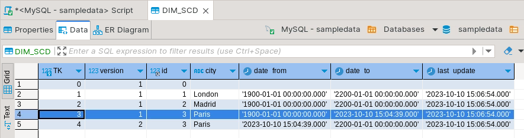<figcaption><p>DIM_SCD - view data</p></figcaption></figure>

> **Note:** What happened
> 
> Remember a Punch through updates the fields where the records match ..
> 
> * All the records have a last\_update field .. so this will be updated
> * As both our Pariss & Paris records have a matching key id=3 then the archived record will be updated with the current city value .. Paris

:::

:::::

## Lab Files

Click a file to download. For `.ktr` and `.kjb` files, **Open in Pentaho Data Integration** launches PDI with the file loaded. If PDI is already running, the path is copied to your clipboard — switch to PDI and use Ctrl+O, Ctrl+V, Enter.

[dim_scd script.txt](./files/dim_scd%20script.txt)

[tr_scd.ktr](./files/tr_scd.ktr) <button data-launch="spoon" data-path="files/tr_scd.ktr">Open in Pentaho Data Integration</button> <button data-graph="files/tr_scd.ktr">View graph</button>
