# MinIO

> **Warning:**
>
> #### Workshop series: PDI + MinIO (S3)
>
> Build hands-on Pentaho Data Integration (PDI) transformations that read from and write to **MinIO** using **VFS**.
>
> Workshops get harder as you go. Start with CSV joins. Then move into XML/JSON parsing, reconciliation, and multi-format ingestion.
>
> **Workshops in this series**
>
> * Sales Dashboard (CSV inputs + lookups + output)
> * Inventory Reconciliation (XML + CSV + variance detection)
> * Customer 360 (multi-source joins + metrics)
> * Fraud Detection (multi-table joins + rule-based risk scoring)
> * Log Parsing (regex + time-series checks)
> * Data Lake Ingestion (schema normalization + validation)
>
> **You’ll practice**
>
> * Connecting to MinIO buckets with VFS
> * Reading and writing objects with `pvfs://MinIO/...` paths
> * Joining and enriching streams (lookups and joins)
> * Parsing XML and JSON
> * Validating and shaping data for a curated layer
>
> **Prerequisites:** The MinIO container running and seeded (see [Before You Start](../00-before-you-start/guide.md)); basic transformation concepts; basic joins and aggregations
>
> **Estimated time:** 4–6 hours total (each workshop is \~20–60 minutes)

| Workshop | Key Skills |
| --- | --- |
| Sales Dashboard | joins, lookups, aggregations |
| Inventory Reconciliation | XML parsing, outer joins, variance |
| Customer 360 | multi-source, JSONL, calculations |
| Fraud Detection | stream lookup, joins, rule-based scoring |
| Log Parsing | regex, time-series analysis |
| Data Lake Ingestion | schema normalization, validation |

> **Danger:** Every path in these workshops starts `pvfs://MinIO/`, which means "the VFS connection named **MinIO**". Create it once, before the first workshop.

1. Check that MinIO is running and seeded: open the MinIO console at **http://127.0.0.1:9099** and sign in as `minioadmin` / `minioadmin`. The **raw-data** bucket holds `csv/`, `json/`, `xml/` and `finance/` folders, and the **logs** bucket holds `app/`, `web/` and `error/`.

```powershell
# Or check the S3 API from PowerShell
Invoke-WebRequest http://127.0.0.1:9000/minio/health/live -UseBasicParsing | Select-Object StatusCode
```

2. Start Pentaho Data Integration.

> **Note:** Start Pentaho Data Integration (Spoon).
>
>

::: tabs

### Windows (PowerShell)

>
> ```powershell
> Set-Location C:\Pentaho\design-tools\data-integration
> .\spoon.bat
> ```
>
>

### macOS / Linux

>
> ```bash
> cd ~/Pentaho/design-tools/data-integration
> ./spoon.sh
> ```
>
>

:::

3. Create the VFS connection. In Spoon's **View** tab, right-click **VFS Connections** and select **New**. In the **New VFS Connection** dialog enter:

| Setting                | Value                     |
| ---------------------- | ------------------------- |
| **Connection Name:**   | `MinIO`                   |
| **Connection Type:**   | Amazon S3/Minio/HCP       |
| **S3 Connection Type:** | Minio/HCP                |
| **Access Key:**        | `minioadmin`              |
| **Secret Key:**        | `minioadmin`              |
| **Endpoint:**          | `http://127.0.0.1:9000`   |
| **PathStyle Access:**  | ticked                    |

4. Select **Test**, then **OK**. The connection is saved for every transformation on this machine, so you create it once.

> **Under the hood:**
>
> #### `pvfs://` is a name, not an address
>
> PDI reads `pvfs://MinIO/raw-data/csv/sales.csv` as "bucket `raw-data`,
> object `csv/sales.csv`, through the connection called MinIO". The
> endpoint and keys live in the connection, not in the transformation.
> Point the same connection at AWS S3 and every transformation in this
> series runs there unchanged. **PathStyle Access** is what MinIO needs:
> it addresses buckets as `host/bucket` rather than `bucket.host`.
>
> **Why it matters:** credentials stay out of `.ktr` files, and moving
> between environments is one connection, not every path.


<button data-launch="spoon" data-path="">Start PDI</button>

::::: tabs

### Sales Dashboard

> **Warning:**
>
> #### Sales Dashboard
>
> The workshop demonstrates how Pentaho Data Integration enables organizations to rapidly create denormalized fact tables that power real-time business intelligence dashboards. By integrating data from multiple sources (customer data, product catalogs, and sales transactions), business users gain immediate access to actionable insights without waiting for IT to build complex data warehouses.
>
> **Scenario:** A mid-sized e-commerce company needs to track daily sales performance across products, customer segments, and regions. Currently, sales managers wait 24-48 hours for IT to generate reports from disparate systems. With PDI, they can automate this process and refresh dashboards hourly.
>
> **Key Stakeholders:**
>
> * Sales Directors: Need to identify top-performing products and regions
> * Marketing Teams: Require customer segmentation for targeted campaigns
> * Finance: Need accurate revenue reporting by product category
> * Operations: Must monitor inventory turnover rates

***

> **Note:** **Workshop files**
>
> These files are already in MinIO:
>
> * `pvfs://MinIO/raw-data/csv/sales.csv`
> * `pvfs://MinIO/raw-data/csv/products.csv`
> * `pvfs://MinIO/raw-data/csv/customers.csv`
>
> Output path used later: `pvfs://MinIO/staging/dashboard/`

***

<figure>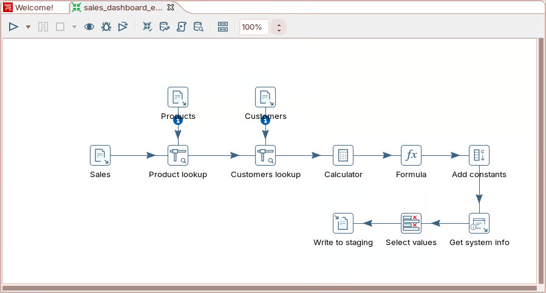<figcaption><p>Sales Dashboard</p></figcaption></figure>

> **Note:** Create a new transformation.
>
> Use any of these options:
>
> * Select **File** > **New** > **Transformation**
> * Use `Ctrl+N` (Windows/Linux) or `Cmd+N` (macOS)

***

Follow the steps to create the transformation:

::: tabs

### 1. Read Data Sources

> **Note:**
>
> #### **Text File Input**
>
> The Text File Input step is used to read data from a variety of different text-file types. The most commonly used formats include Comma Separated Values (CSV files) generated by spreadsheets and fixed width flat files.
>
> The Text File Input step provides you with the ability to specify a list of files to read, or a list of directories with wild cards in the form of regular expressions. In addition, you can accept filenames from a previous step making filename handling more even more generic.

<figure>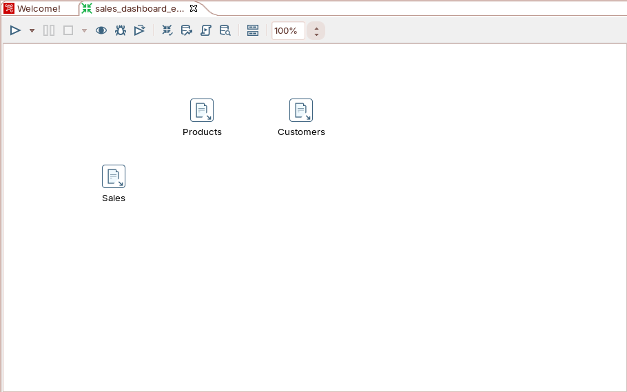<figcaption><p>Text file inputs</p></figcaption></figure>

> **Note:** VFS connection names are case-sensitive. These examples assume your connection name is `MinIO`.

1. Drag & drop 3 Text File Input Steps onto the canvas.
2. Save transformation as: `sales_dashboard_etl.ktr` in your workshop folder.

***

**Sales (Order Management)**

1. Double-click on the first TFI step, and configure with the following properties:

| Setting          | Value                                 |
| ---------------- | ------------------------------------- |
| Step name        | `Sales`                               |
| Filename         | `pvfs://MinIO/raw-data/csv/sales.csv` |
| Delimiter        | ,                                     |
| Head row present | ✅                                     |
| Format           | mixed                                 |

<figure>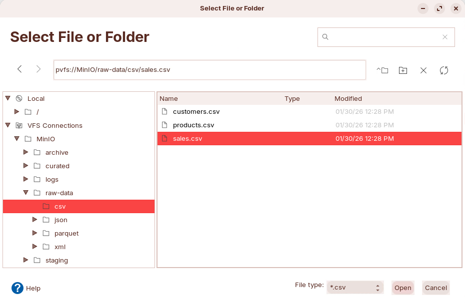<figcaption><p>Select - sales.csv from VFS connections</p></figcaption></figure>

2. Click: **Get Fields** to auto-detect columns.

> **Note:** **Business Logic:** Note that `sale_amount` may differ from `price * quantity` due to:
>
> * Volume discounts
> * Promotional pricing
> * Customer-specific pricing tiers
> * Currency conversion (for international sales)

<figure>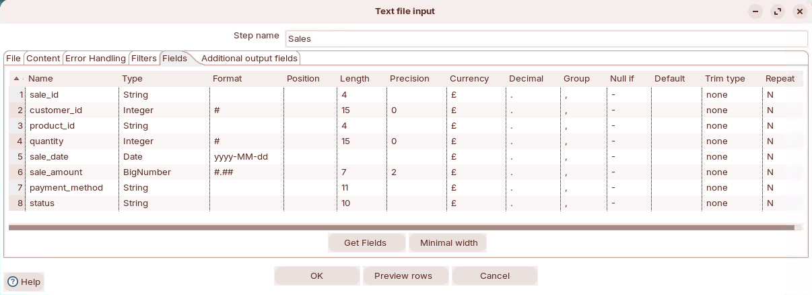<figcaption><p>Get Fields - Sales</p></figcaption></figure>

3. Preview data.

<figure>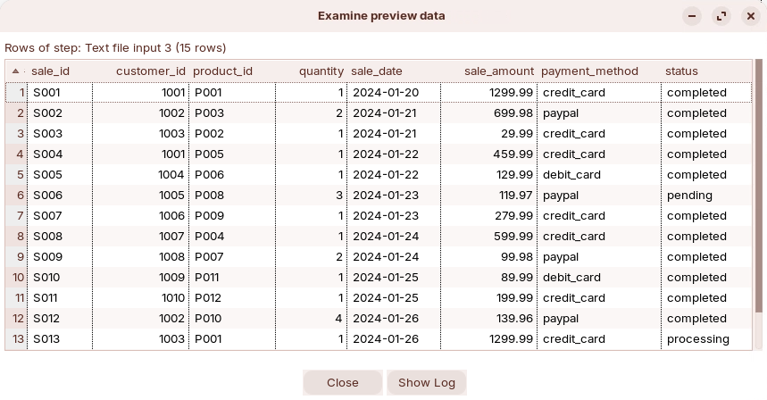<figcaption><p>Preview data - Sales</p></figcaption></figure>

> **Note:** **Business Significance:**
>
> * `sale_amount`: Actual revenue (may include discounts)
> * `quantity`: Volume metrics for demand planning
> * `payment_method`: Payment preference insights
> * `status`: Filter out cancelled/refunded orders

***

**Products (ERP system)**

1. Double-click on the second TFI step, and configure with the following properties:

<table><thead><tr><th width="165.5">Setting</th><th>Value</th></tr></thead><tbody><tr><td>Step name</td><td><code>Products</code></td></tr><tr><td>Filename</td><td><code>pvfs://MinIO/raw-data/csv/products.csv</code></td></tr><tr><td>Delimiter</td><td>,</td></tr><tr><td>Head row present</td><td>✅</td></tr><tr><td>Format</td><td>mixed</td></tr></tbody></table>

<figure>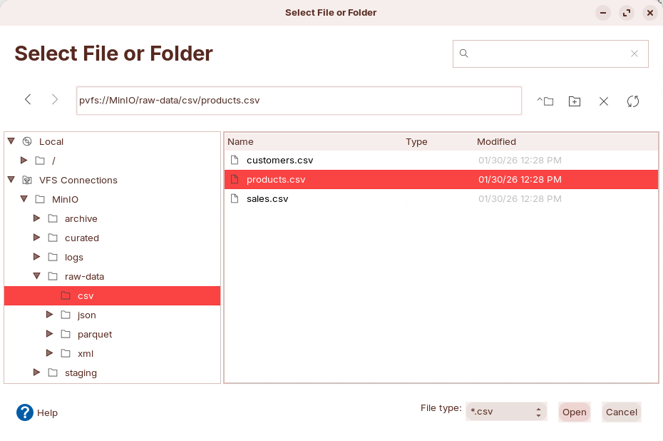<figcaption><p>Select - products.csv from VFS connections</p></figcaption></figure>

2. Click: **Get Fields** to auto-detect columns.

<figure>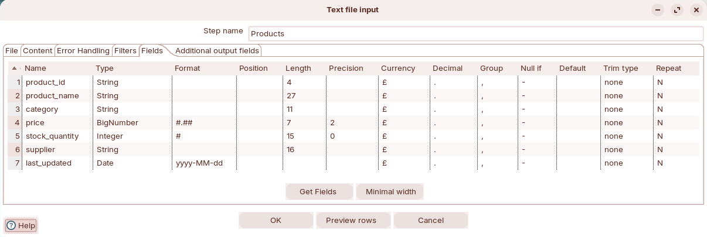<figcaption><p>Get Fields - Customers</p></figcaption></figure>

3. Preview the data.

<figure>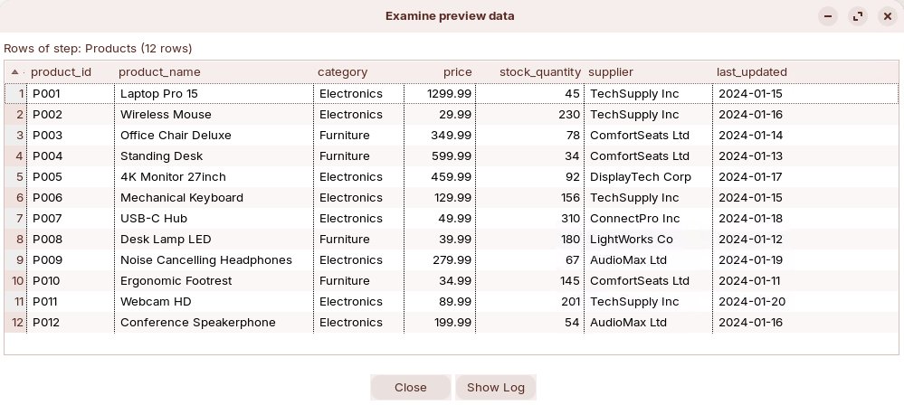<figcaption><p>Preview data - Products</p></figcaption></figure>

> **Note:** **Business Significance:**
>
> * `category`: Enables product performance analysis by segment
> * `price`: Base pricing for margin calculations
> * `stock_quantity`: Inventory turnover insights

***

**Customers (CRM System)**

1. Double-click on the third TFI step, and configure with the following properties:

<table><thead><tr><th width="186">Setting</th><th>Value</th></tr></thead><tbody><tr><td>Step name</td><td><code>Customers</code></td></tr><tr><td>Filename</td><td><code>pvfs://MinIO/raw-data/csv/customers.csv</code></td></tr><tr><td>Delimiter</td><td>,</td></tr><tr><td>Header row present</td><td>✅</td></tr><tr><td>Format</td><td>mixed</td></tr></tbody></table>

<figure>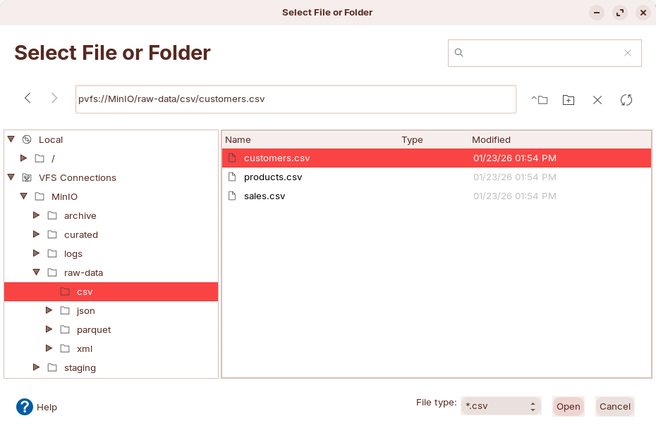<figcaption><p>Select - customers.csv from VFS connections</p></figcaption></figure>

2. Click: **Get Fields** to auto-detect columns.

<figure>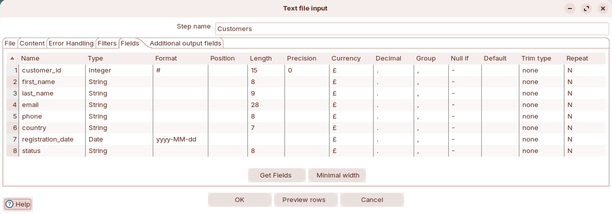<figcaption><p>Get Fields - Customers</p></figcaption></figure>

3. Preview the data.

<figure>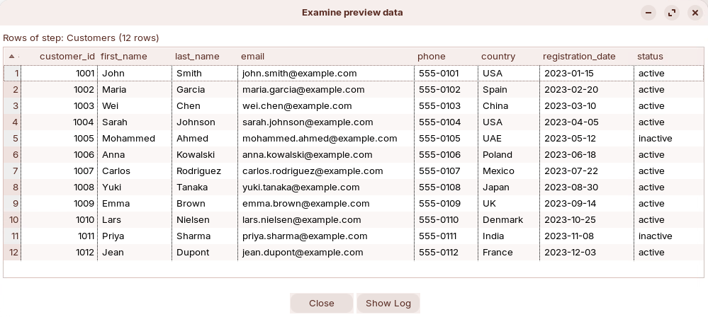<figcaption><p>Preview data - Customers</p></figcaption></figure>

> **Note:** **Business Significance:**
>
> * `customer_id`: Primary key for joining to sales
> * `country`: Critical for geographic segmentation
> * `status`: Identifies churned vs. active customers
> * `registration_date`: Enables customer tenure analysis

### 2. Stream Lookup

> **Note:**
>
> #### Stream Lookup
>
> A **Stream lookup** step enriches rows by looking up matching values from another stream.
>
> In a transformation, you feed your main rows into one hop and a reference dataset into the other hop. The step then matches rows using key fields and returns the lookup fields on the output. It’s the in-memory alternative to a database lookup, but the reference stream must be available in the same transformation flow.

<figure>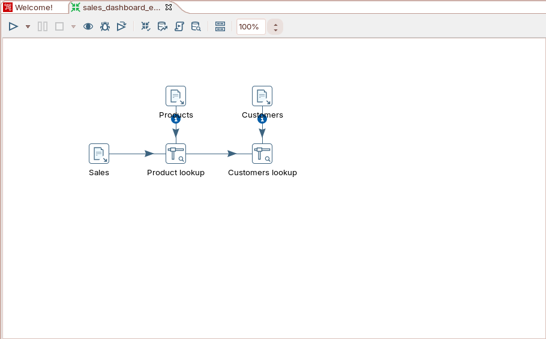<figcaption><p>Lookups</p></figcaption></figure>

1. Drag & drop 2 **Stream lookup** steps onto the canvas.
2. Save transformation as: `sales_dashboard_etl.ktr` in your workshop folder.

***

**Product Lookup**

1. Draw a hop between **Sales** and **Product Lookup**.
2. Draw a hop between **Products** and **Product Lookup**.

> **Note:** The Sales is acting as our Fact table. It holds the transaction data for our Products & Customers.

3. Double-click on the 'Product Lookup' step, and configure with the following properties:

| Tab     | Setting               | Value            |
| ------- | --------------------- | ---------------- |
| General | Step name             | `Product Lookup` |
| General | Lookup step           | `Products`       |
| Keys    | Field (from Sales)    | `product_id`     |
| Keys    | Field (from Products) | `product_id`     |

4. In **Values to retrieve**, add:
   * `product_name` (rename to `product_name`)
   * `category` (rename to `product_category`)
   * `price` (rename to `unit_price`)

<figure>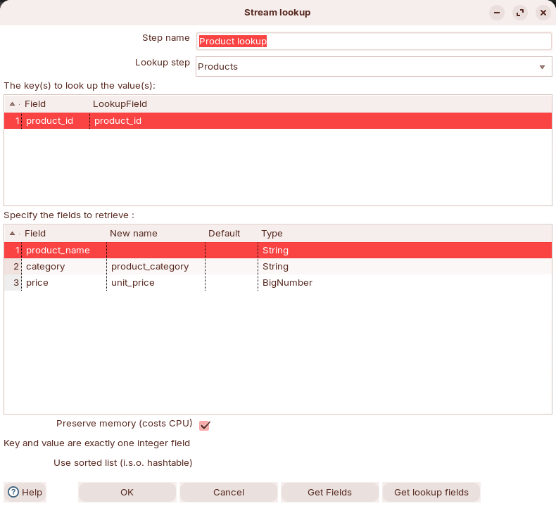<figcaption><p>Product Lookup</p></figcaption></figure>

***

**Customers Lookup**

1. Draw a hop between **Product Lookup** and **Customers Lookup**.
2. Draw a hop between **Customers** and **Customers Lookup**.
3. Double-click **Customers Lookup**, and configure the following properties:

| Setting            | Value              |
| ------------------ | ------------------ |
| Step name          | `Customers Lookup` |
| Lookup step        | `Customers`        |
| Key field (stream) | `customer_id`      |
| Key field (lookup) | `customer_id`      |

4. Values to retrieve:
   * `first_name`
   * `last_name`
   * `country` (rename to `customer_country`)
   * `status` (rename to `customer_status`)

<figure>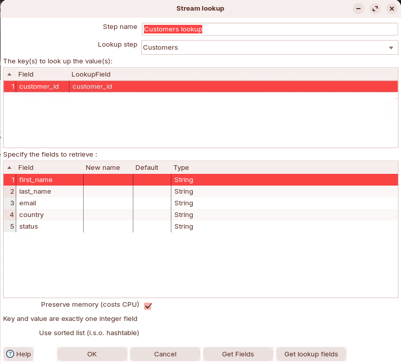<figcaption><p>Customers Lookup</p></figcaption></figure>

***

**Preview data**

1. Save the transformation.
2. RUN & Preview the data.

<figure>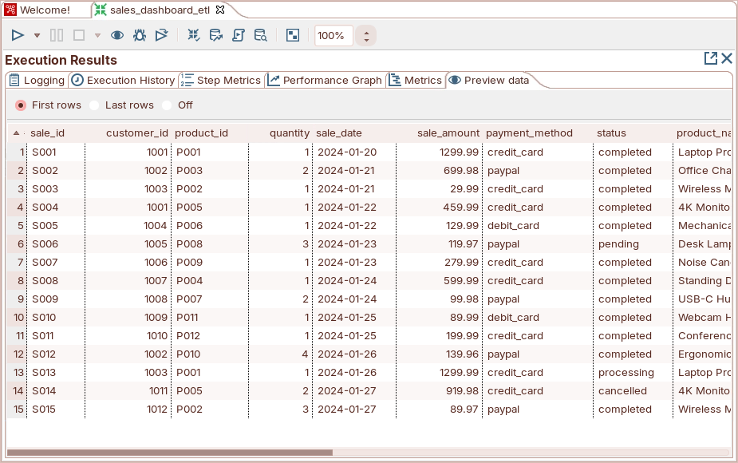<figcaption><p>Lookups - Preview data</p></figcaption></figure>

### 3. Calculator

> **Note:**
>
> #### Calculator
>
> The Calculator step provides predefined functions that you can run on input field values. Use Calculator as a quick alternative to custom JavaScript for common calculations.
>
> To use Calculator, specify the input fields and the calculation type, and then write results to new fields. You can also remove temporary fields from the output after all values are calculated.

<figure>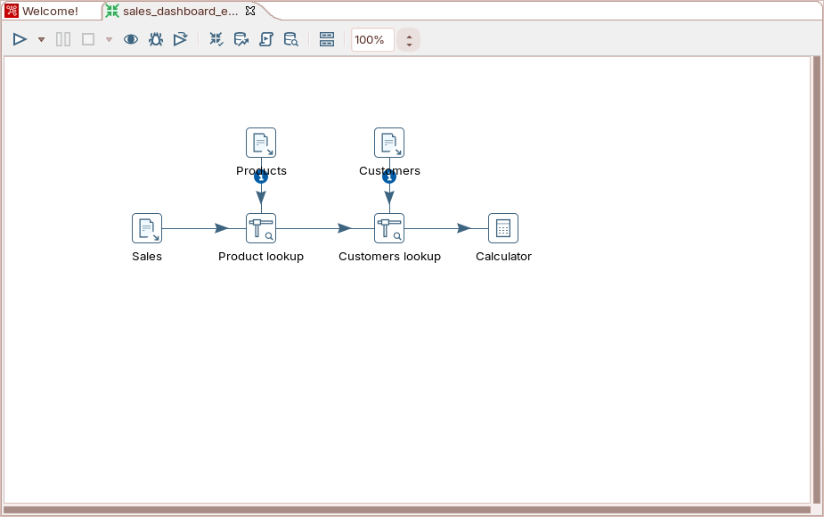<figcaption><p>Calculator step</p></figcaption></figure>

1. Drag & drop a 'Calculator' step onto the canvas.
2. Draw a Hop from the 'Customers Lookup' step to the 'Calculator' step.
3. Double-click on the 'Calculator' step, and configure the following properties:

<table><thead><tr><th width="161">New field</th><th>Calculation</th><th>Field A</th><th>Field B</th><th>Value type</th></tr></thead><tbody><tr><td><code>line_total</code></td><td>A * B</td><td>quantity</td><td>unit_price</td><td>Number</td></tr><tr><td><code>discount_amount</code></td><td>A - B</td><td>sale_amount</td><td>line_total</td><td>Number</td></tr></tbody></table>

<figure>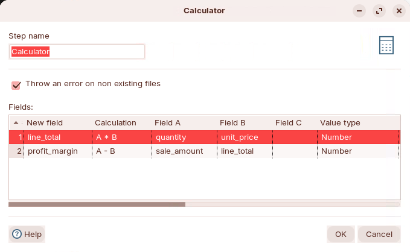<figcaption><p>Calculator</p></figcaption></figure>

***

**Preview data**

1. Save the transformation.
2. RUN & Preview the data.

<figure>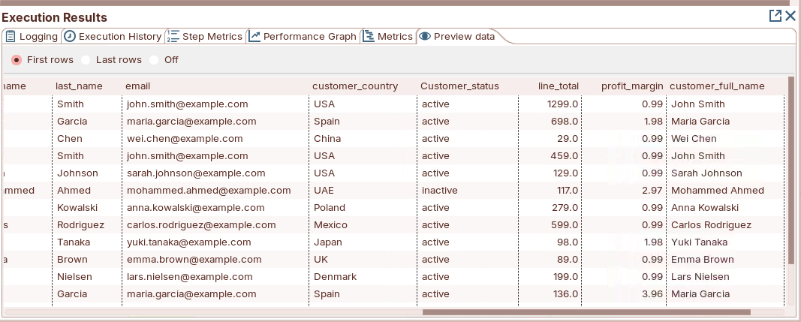<figcaption><p>Preview data</p></figcaption></figure>

> **Note:** **Business Insight Enabled:**
>
> * **Positive `discount_amount`:** Customer received a discount (common)
> * **Negative `discount_amount`:** Customer paid more than list price (expedite, premium, etc.)
> * **Zero `discount_amount`:** Sold at list price

### 4. Formula

> **Note:**
>
> #### Formula
>
> The Formula step can calculate Formula Expressions within a data stream. It can be used to create simple calculations like \[A]+\[B] or more complex business logic with a lot of nested if / then logic.

<figure>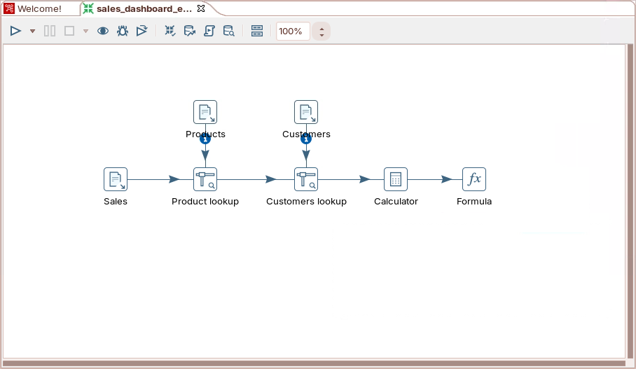<figcaption><p>Formula step</p></figcaption></figure>

1. Drag & drop a 'Formula' step onto the canvas.
2. Draw a Hop from the 'Calculator' step to the 'Formula' step.
3. Double-click on the 'Formula' step, and configure the following properties:

<table><thead><tr><th width="190">New Field</th><th>Formula</th></tr></thead><tbody><tr><td>customer_full_name</td><td>CONCATENATE([first_name];" ";[last_name])</td></tr><tr><td>is_high_value</td><td>IF([sale_amount]>500;"Yes";"No")</td></tr></tbody></table>

<figure>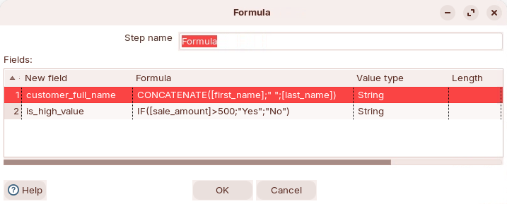<figcaption><p>Formula step</p></figcaption></figure>

***

**Preview data**

1. Save the transformation.
2. RUN & Preview the data.

<figure>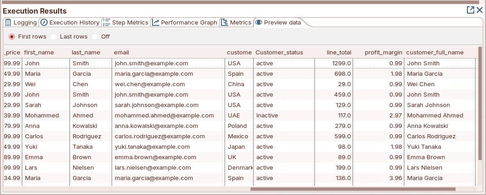<figcaption><p>Preview data</p></figcaption></figure>

> **Note:** **Business Applications:**
>
> * **is\_high\_value:** Trigger VIP customer service workflows

### 5. Add Constants

> **Note:**
>
> #### Add Constants
>
> The Add constant values step is a simple and high performance way to add constant values to the stream.

<figure>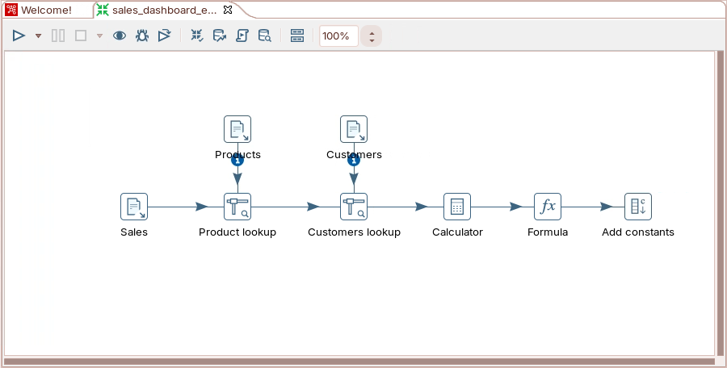<figcaption><p>Add constants</p></figcaption></figure>

1. Drag & drop 'Add constants' step onto the canvas.
2. Draw a Hop from the 'Formula' step to the 'Add constants ' step.
3. Double-click on the 'Add constants' step, and configure the following properties:

| Name          | Type   | Value            |
| ------------- | ------ | ---------------- |
| `data_source` | String | `minio_workshop` |

<figure>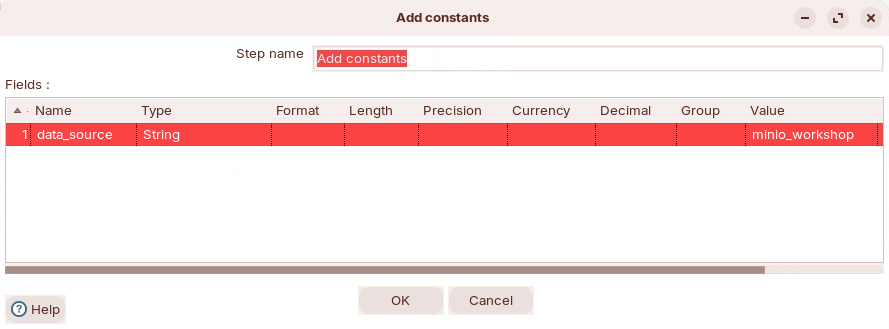<figcaption><p>Add constants</p></figcaption></figure>

### 6. Get System info

> **Note:**
>
> #### Get system info
>
> This step retrieves system information from the Kettle environment. The step includes a table where you can designate a name and assign it to any available system info type you want to retrieve. This step generates a single row with the fields containing the requested information.
>
> It can also accept any number of input streams, aggregate any fields defined by this step, and send the combined results to the output stream.

<figure>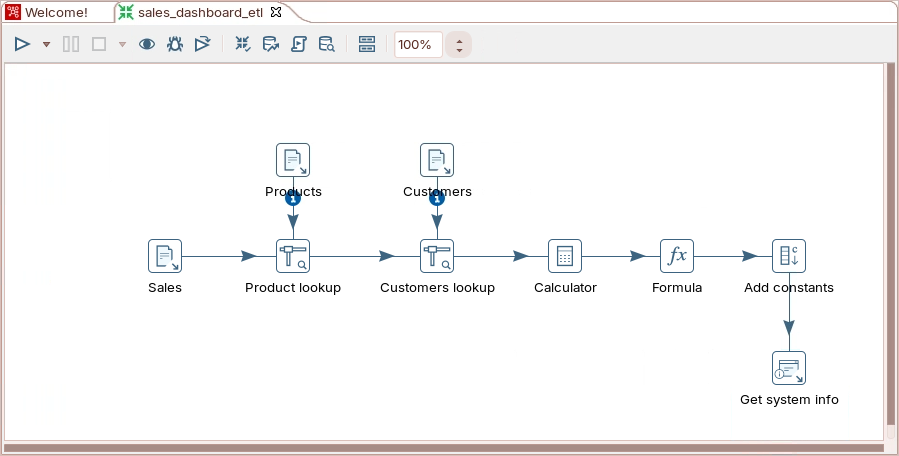<figcaption><p>get system info</p></figcaption></figure>

1. Drag & drop 'Get system info' step onto the canvas.
2. Draw a Hop from the 'Add constants' step to the 'Get system info ' step.
3. Double-click on the **Get system info** step, and configure the following properties:

| Name           | Type                   |
| -------------- | ---------------------- |
| etl\_timestamp | system date (variable) |

<figure>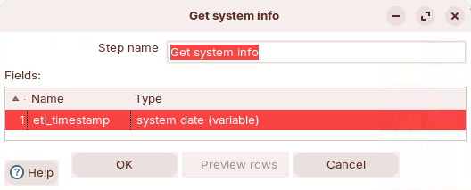<figcaption><p>Get system info</p></figcaption></figure>

### 7. Select Values

> **Note:**
>
> #### **Select Values**
>
> The Select Values step can perform all the following actions on fields in the PDI stream:
>
> **Select fields** - The Select Values step can perform all the following actions on fields in the PDI stream.
>
> **Remove fields** - Use this tab to remove fields from the input stream.
>
> **Meta-data** - Use this tab to change field types, lengths, and formats.

<figure>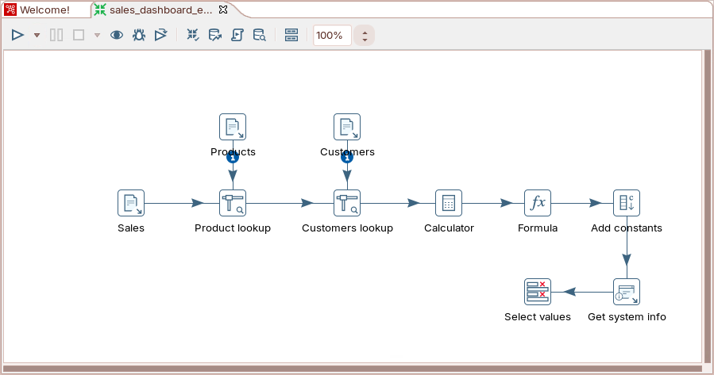<figcaption><p>Select values</p></figcaption></figure>

1. Drag & drop a 'Select values' step onto the canvas.
2. Draw a Hop from the 'Get system info' step to the 'Select values' step.
3. Double-click on the 'Select values' step, and configure the following properties:
4. On **Select & Alter** tab, choose fields in order:

* sale\_id
* sale\_date
* customer\_id
* customer\_full\_name
* customer\_country
* customer\_status
* product\_id
* product\_name
* product\_category
* quantity
* unit\_price
* sale\_amount
* line\_total
* discount\_amount
* is\_high\_value
* payment\_method
* status (rename to `sale_status`)
* etl\_timestamp
* data\_source

<figure>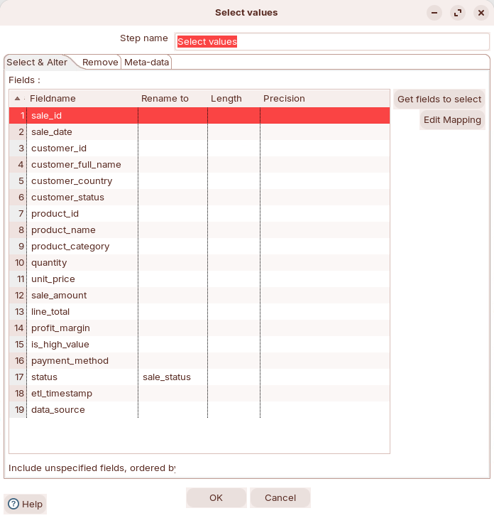<figcaption><p>Select</p></figcaption></figure>

***

**Preview data**

1. Save the transformation.
2. RUN & Preview the data.

<figure>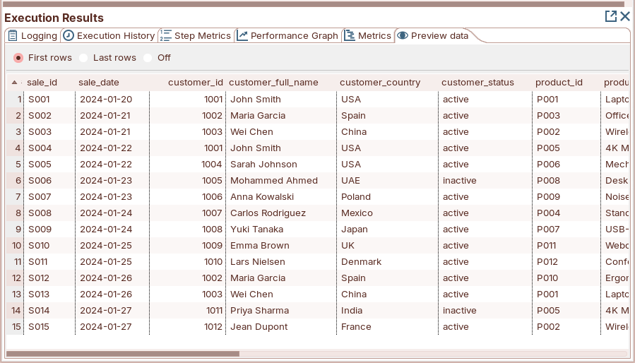<figcaption><p>Preview data</p></figcaption></figure>

### 8. Text File Output

> **Note:**
>
> #### Text file output
>
> The Text File Output step exports rows to a text file.
>
> This step is commonly used to generate delimited files (for example, CSV) that can be read by spreadsheet applications, and it can also generate fixed-length output.
>
> You can’t run this step in parallel to write to the same file.
>
> If you need to run multiple copies, select Include stepnr in filename and merge the resulting files afterward.

<figure>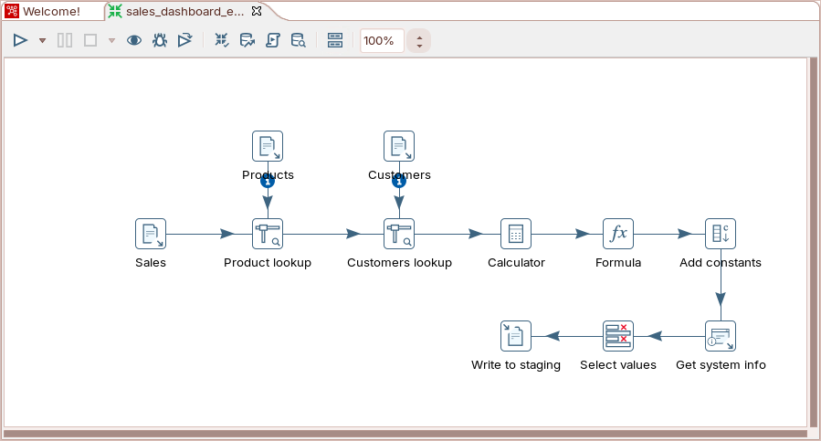<figcaption><p>Text File output</p></figcaption></figure>

1. Drag & drop a **Text file output** step onto the canvas.
2. Draw a Hop from the 'Select values' step to the 'Write to staging' step.
3. Double-click on the 'Write to staging' step, and configure with the following properties:

| Setting                       | Value                                       |
| ----------------------------- | ------------------------------------------- |
| Step name                     | `Write to Staging`                          |
| Filename                      | `pvfs://MinIO/staging/dashboard/sales_fact` |
| Extension                     | `csv`                                       |
| Include date/time in filename | ✅                                           |
| Separator                     | ,                                           |
| Add header                    | ✅                                           |

> **Warning:** Select **Get fields** to populate the output fields.

> **Note:** **Business Benefit:** Timestamped files enable:
>
> * **Historical tracking:** "What did the data look like last Tuesday?"
> * **Incremental processing:** Keep processing latest file without overwriting history
> * **Rollback capability:** "The 3pm run had bad data, revert to 2pm version"

***

**MinIO**

1. Save the transformation.
2. Log into MinIO:

<figure>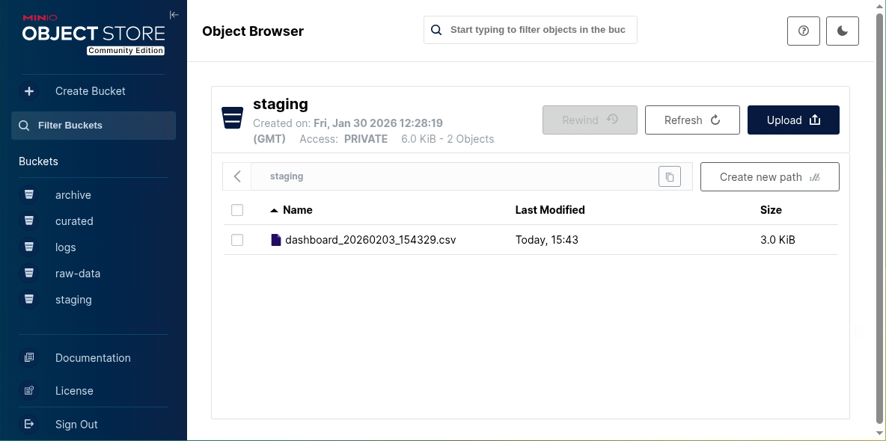<figcaption><p>MinIO - Dashboard data</p></figcaption></figure>

***

**Checklist**

* [ ] Three Text file inputs configured (reading CSV from S3)
* [ ] Product lookup working (no null product names)
* [ ] Customer lookup working (no null countries)
* [ ] Calculations producing correct values
* [ ] Fields in correct order
* [ ] Output file created in staging bucket
* [ ] All 15 sales records processed

:::

***

> **Note:** **Workshop files**
>
> Download the files for this workshop. For `.ktr` files, **Open in Pentaho Data Integration** launches PDI with the transformation loaded; if PDI is already running, the path is copied to your clipboard (Ctrl+O, Ctrl+V, Enter).

[sales_dashboard_etl.ktr](./files/sales_dashboard_etl.ktr) <button data-launch="spoon" data-path="files/sales_dashboard_etl.ktr">Open in Pentaho Data Integration</button> <button data-graph="files/sales_dashboard_etl.ktr">View graph</button>

### Inventory Reconciliation

> **Warning:**
>
> #### Inventory Reconciliation - XML + CSV Integration
>
> This workshop demonstrates how Pentaho Data Integration eliminates costly inventory discrepancies by automatically reconciling data between warehouse management systems (XML feeds) and ERP product catalogs (CSV files). Organizations lose millions annually due to inventory inaccuracies, stockouts, and overstocking. PDI's ability to parse complex XML and perform full outer joins enables real-time discrepancy detection that would require hours of manual spreadsheet work.
>
> **Business Value Delivered:**
>
> * **Cost Reduction:** Eliminate manual reconciliation labor ($75K-150K annually per analyst)
> * **Inventory Optimization:** Reduce excess inventory carrying costs by 15-25%
> * **Stockout Prevention:** Identify missing items before customers notice
> * **Compliance:** Audit trail for SOX, ISO 9001, and supply chain regulations
> * **Real-Time Visibility:** Know your actual inventory position within minutes, not days
>
> **Scenario:** A manufacturing company operates 12 distribution warehouses. Each warehouse uses a legacy WMS (Warehouse Management System) that exports XML inventory files nightly. The corporate ERP system maintains a CSV product master catalog. Discrepancies cause:
>
> * **Phantom stock:** ERP shows item in stock, warehouse says it's not → Lost sales
> * **Ghost inventory:** Warehouse has items ERP doesn't recognize → Dead capital
> * **Quantity variances:** Mismatches of 10+ units trigger expensive physical counts
>
> **Key Stakeholders:**
>
> * **Supply Chain Directors:** Need accurate inventory positions across all locations
> * **Warehouse Managers:** Require daily reconciliation reports to prioritize cycle counts
> * **Finance Teams:** Must report accurate inventory valuations for financial statements
> * **Procurement:** Need to identify slow-moving items and prevent overstocking

***

> **Note:** **Workshop files**
>
> These files are already in MinIO:
>
> * `pvfs://MinIO/raw-data/xml/inventory.xml`
> * `pvfs://MinIO/raw-data/csv/products.csv`
>
> Outputs: `pvfs://MinIO/staging/reconciliation/` (`urgent_actions`, `review_queue` and `low_priority` CSV files)

<figure>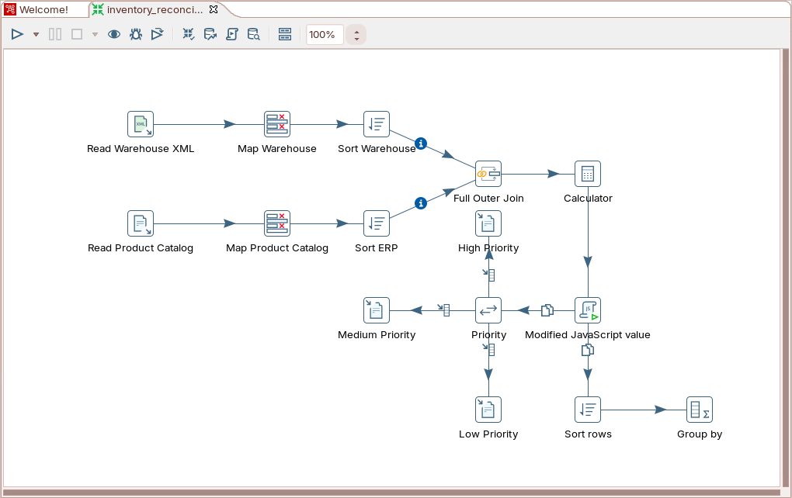<figcaption><p>Inventory reconciliation</p></figcaption></figure>

> **Note:** Create a new transformation.
>
> Use any of these options:
>
> * Select **File** > **New** > **Transformation**
> * Use `Ctrl+N` (Windows/Linux) or `Cmd+N` (macOS)

***

Follow the steps to create the transformation:

:::: tabs

### 1. Data Source streams

::: tabs

### 1. Read Warehouse

> **Note:**
>
> #### Get data from XML

1. Drag & drop 'Get data from XML' onto the canvas.
2. Save transformation as: `inventory_reconciliation.ktr` in your workshop folder.
3. Double-click on the 'Get data from XML' step, and configure with the following properties:

<table><thead><tr><th width="186">Setting</th><th>Value</th></tr></thead><tbody><tr><td>Step name</td><td>Read Warehouse XML</td></tr><tr><td>File or directory</td><td><code>pvfs://MinIO/raw-data/xml/inventory.xml</code></td></tr><tr><td>Loop XPath</td><td><code>/inventory/items/item</code></td></tr><tr><td>Encoding</td><td><code>UTF-8</code></td></tr><tr><td>Ignore comments</td><td>✅</td></tr><tr><td>Validate XML</td><td>No</td></tr><tr><td>Ignore empty file</td><td>✅</td></tr></tbody></table>

> **Note:** **XPath Explanation:**
>
> * `/inventory` = Start at root element
> * `/items` = Navigate to items container
> * `/item` = Loop over each item element

4. Browse & Add the path to the inventory.xml
5. Click on the Content tab

<figure>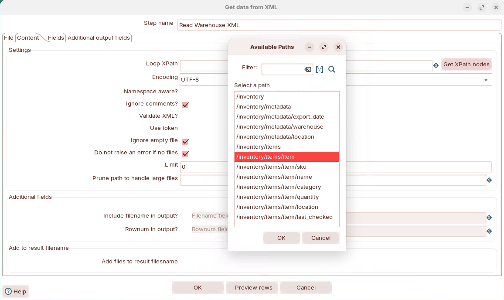<figcaption><p>Configure XPath</p></figcaption></figure>

6. Click on the Fields tab & Get Fields.
7. Remap the fields & Preview rows.

> **Note:** **Business Field Naming:**
>
> * Prefix with `warehouse_` to distinguish from ERP fields later
> * `warehouse_quantity` vs. `stock_quantity` makes joins clearer
> * Keep original field names in a data dictionary for auditing

| Name                  | XPath         |
| --------------------- | ------------- |
| warehouse\_item\_name | name          |
| warehouse\_quantity   | quantity      |
| warehouse\_location   | location      |
| last\_physical\_count | last\_checked |

<figure>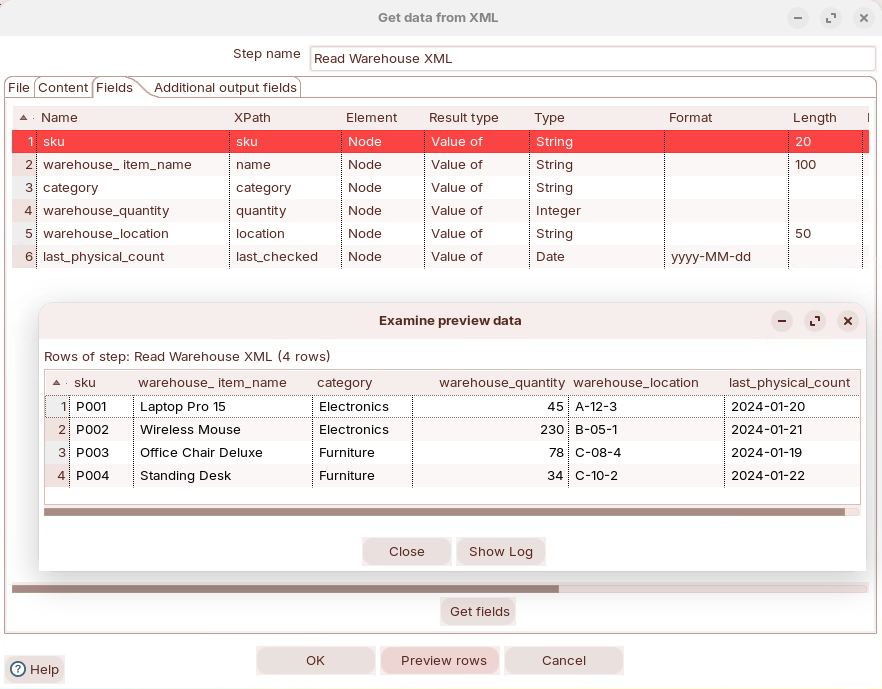<figcaption><p>Remap field names &#x26; Preview data</p></figcaption></figure>

> **Note:** Next: configure the product catalog input, then join the two streams.

### 2. Read Product Catalog

> **Note:**
>
> #### Text file input
>
> The ERP side: the product master, one row per product.

1. Drag **Text file input** onto the canvas and name it `Read Product Catalog`.
2. **File** tab: add `pvfs://MinIO/raw-data/csv/products.csv`.
3. **Content** tab: separator `,`, enclosure `"`, header row on.
4. **Fields** tab: **Get Fields**. Check the types: `product_id`, `product_name`, `category`, `supplier` String; `price` BigNumber; `stock_quantity` Integer; `last_updated` Date (`yyyy-MM-dd`).
5. Preview: 18 products, `P001` to `P018`.

:::

### 2. Join

> **Note:**
>
> #### Full outer join on the product id
>
> Rename both sides to one key, sort, then join so that items missing from *either* system still come through.

1. **Select values** `Map Warehouse` after `Read Warehouse XML`: on **Select && Alter** keep `sku` renamed to `product_id`, `warehouse_item_name` renamed to `warehouse_product_name`, and `category`, `warehouse_quantity`, `warehouse_location`, `last_physical_count`.
2. **Select values** `Map Product Catalog` after `Read Product Catalog`: rename `product_name` to `erp_product_name` and `stock_quantity` to `erp_quantity`, and keep `product_id`, `category`, `price`, `supplier`, `last_updated`.
3. **Sort rows** after each: `Sort Warehouse` and `Sort ERP`, both on `product_id`, ascending.
4. **Merge join** `Full Outer Join`: **First step** `Sort Warehouse`, **Second step** `Sort ERP`, **Join type** `FULL OUTER`, key `product_id` on both sides. Preview: 19 rows: 17 warehouse items plus 2 products only the ERP knows.
5. **Calculator**: `quantity_variance` = `warehouse_quantity` - `erp_quantity` (**A - B**), and `abs_variance` = **ABS(A)** of `quantity_variance`, both Integer.
6. **Modified JavaScript value**: classify each row. Copy the script from the solution's step of the same name; it sets:

| Output field          | Rule                                                                                   |
| --------------------- | -------------------------------------------------------------------------------------- |
| `discrepency_type`    | `MISSING_IN_WAREHOUSE` (no warehouse quantity), `MISSING_IN_CATALOG` (no ERP quantity), `MATCH` (within ±2), `OVERSTOCK` or `UNDERSTOCK` |
| `severity_level`      | HIGH for missing in warehouse, or a variance over 20%; MEDIUM otherwise; NONE for a match |
| `priority_rank`       | 1 for HIGH, 2 for MEDIUM, 3 for the rest                                                |
| `recommended_action`, `financial_impact`, `excess_carrying_cost`, `lost_sales_risk` | the work-queue text and cost estimates |

### 3. Output

> **Note:**
>
> #### Route by priority
>
> One work queue per priority, plus a summary by discrepancy type.

1. **Switch / case** `Priority` on `priority_rank` (type Number): `1` to `High Priority`, `2` to `Medium Priority`, `3` to `Low Priority`; default `Medium Priority`.
2. Three **Text file output** steps, extension `csv`:
   * `High Priority`: `pvfs://MinIO/staging/reconciliation/urgent_actions` (tick **Include date in filename?** and **Include time in filename?**)
   * `Medium Priority`: `pvfs://MinIO/staging/reconciliation/review_queue` (date and time too)
   * `Low Priority`: `pvfs://MinIO/staging/reconciliation/low_priority`
3. For the summary, a **Sort rows** on `discrepency_type` from the JavaScript step, then **Group by** `discrepency_type` with the sums of `financial_impact`, `excess_carrying_cost` and `lost_sales_risk` and a distinct count of `product_id`.
4. Run. In MinIO, `staging/reconciliation/` holds three files:

| File               | Rows | What is in it                                             |
| ------------------ | ---- | --------------------------------------------------------- |
| `urgent_actions_*` | 6    | 3 understock, 2 missing in the warehouse, 1 overstock      |
| `review_queue_*`   | 9    | 4 overstock, 4 understock, 1 missing in the catalog        |
| `low_priority`     | 4    | the matches                                                |

The Group by previews 5 rows, one per discrepancy type.

::::

***

> **Note:** **Workshop files**
>
> Download the files for this workshop. For `.ktr` files, **Open in Pentaho Data Integration** launches PDI with the transformation loaded; if PDI is already running, the path is copied to your clipboard (Ctrl+O, Ctrl+V, Enter).

[inventory_reconciliation.ktr](./files/inventory_reconciliation.ktr) <button data-launch="spoon" data-path="files/inventory_reconciliation.ktr">Open in Pentaho Data Integration</button> <button data-graph="files/inventory_reconciliation.ktr">View graph</button>

### Customer 360

> **Warning:**
>
> #### Customer 360
>
> Create unified customer profiles combining demographic data, purchase history, and behavioral events.
>
> **Skills:** Multiple joins, JSONL parsing, aggregations, calculated metrics

<figure>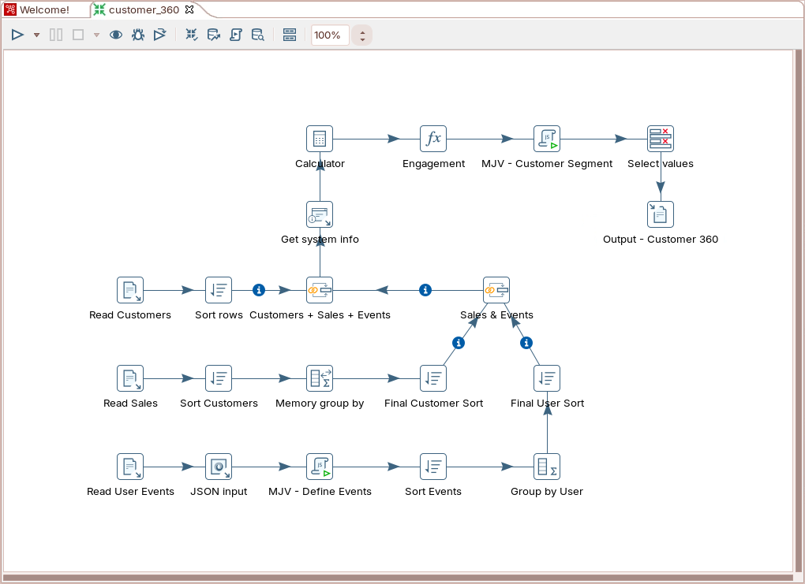<figcaption><p>Customer 360</p></figcaption></figure>

> **Note:** **Workshop files**
>
> These files are already in MinIO:
>
> * `pvfs://MinIO/raw-data/csv/customers.csv` (12 customers)
> * `pvfs://MinIO/raw-data/csv/sales.csv` (15 sales)
> * `pvfs://MinIO/raw-data/json/user_events.json` (46 events, one JSON object per line)
>
> Output: `pvfs://MinIO/curated/customer/customer_360`

> **Note:** Create a new transformation.
>
> Use any of these options:
>
> * Select **File** > **New** > **Transformation**
> * Use `Ctrl+N` (Windows/Linux) or `Cmd+N` (macOS)

:::: tabs

### 1. Customers

1. Save the transformation as `customer_360.ktr` in your workshop folder.
2. **Text file input** `Read Customers`: `pvfs://MinIO/raw-data/csv/customers.csv`, separator `,`, header row, **Get Fields** (`customer_id` Integer, `registration_date` Date `yyyy-MM-dd`, the rest String).
3. **Sort rows** `Sort rows` on `customer_id`.

### 2. Sales per customer

1. **Text file input** `Read Sales`: `pvfs://MinIO/raw-data/csv/sales.csv`, separator `,`, header row, **Get Fields** (`customer_id` Integer, `sale_date` Date, `sale_amount` BigNumber).

<figure><figcaption><p>Select - sales.csv from VFS connections</p></figcaption></figure>

2. **Sort rows** `Sort Customers` on `customer_id`.
3. **Memory group by** on `customer_id`: `total_orders` = Number of values (`sale_id`), `total_spent` = Sum (`sale_amount`), `first_purchase` = Minimum (`sale_date`), `last_purchase` = Maximum (`sale_date`), `avg_order_value` = Average (`sale_amount`). 15 sales become 12 rows.
4. **Sort rows** `Final Customer Sort` on `customer_id`.

> **Note:** Memory group by holds every group in memory, so unlike Group by it doesn't need the sort before it; `Final Customer Sort` is the one that matters, for the Merge join.

### 3. User events

1. **Text file input** `Read User Events`: `pvfs://MinIO/raw-data/json/user_events.json`, no header, one String field `json_line`, and a separator that never occurs in the data (the solution uses `|||DELIM|||`), so each line arrives whole.
2. **JSON input** `JSON input`: on **File**, tick **Source is from a previous step** and pick `json_line`. Fields: `event_id` `$.event_id`, `user_id` `$.user_id` (Integer), `event_type` `$.event_type`, `product_id` `$.product_id`, `timestamp` `$.timestamp`.
3. **Modified JavaScript value** `MJV - Define Events`: one 0/1 flag per event type (`is_page_view`, `is_add_to_cart`, `is_purchase`, `is_checkout`, `is_search`, `is_product_view`), e.g. `var is_page_view = (event_type == "page_view") ? 1 : 0;`
4. **Sort rows** `Sort Events` on `user_id`, then **Group by** `Group by User` on `user_id`: `total_events` = distinct count of `event_id`, and the Sum of each flag (`page_views`, `cart_additions`, `purchases`, `checkouts`, `searches`, `product_views`). 46 events become 12 rows.
5. **Sort rows** `Final User Sort` on `user_id`.

### 4. Join

1. **Merge join** `Sales & Events`: `Final Customer Sort` and `Final User Sort`, **INNER**, keys `customer_id` and `user_id`.
2. **Merge join** `Customers + Sales + Events`: `Sales & Events` and `Sort rows` (the customers), **LEFT OUTER**, key `customer_id` on both.
3. **Get system info** `todays_date` (system date (variable)), then **Calculator**: `days_since_last_purchase` = DATE_DIFF(`todays_date`, `last_purchase`) and `days_as_customer` = DATE_DIFF(`last_purchase`, `first_purchase`).
4. **Formula** `Engagement`: `engagement_score` = `[total_events]*0.3 + [cart_additions]*0.5 + [total_orders]*0.2`.
5. **Modified JavaScript value** `MJV - Customer Segment`: `customer_segment` = High Value (spent 1,000 or more), Medium Value (500 or more), Low Value (any spend) or Prospect.

### 5. Output

1. **Select values**: keep the customer details, the order metrics, the event counts, `engagement_score` and `customer_segment`.
2. **Text file output** `Output - Customer 360`: `pvfs://MinIO/curated/customer/customer_360`, extension `csv`, header row, date and time in the filename.
3. Run. The file holds one row per customer: 12 rows, 2 High Value, 3 Medium Value and 7 Low Value.

::::

***

> **Note:** **Workshop files**
>
> Download the files for this workshop. For `.ktr` files, **Open in Pentaho Data Integration** launches PDI with the transformation loaded; if PDI is already running, the path is copied to your clipboard (Ctrl+O, Ctrl+V, Enter).

[customer_360.ktr](./files/customer_360.ktr) <button data-launch="spoon" data-path="files/customer_360.ktr">Open in Pentaho Data Integration</button> <button data-graph="files/customer_360.ktr">View graph</button>

### Log Parsing

> **Warning:**
>
> #### Log Parsing and Anomaly Detection
>
> **Objective:** Parse application logs, extract metrics, and detect anomalies.
>
> **Skills:** Regex, timestamp parsing, time-series analysis, conditional logic

<figure>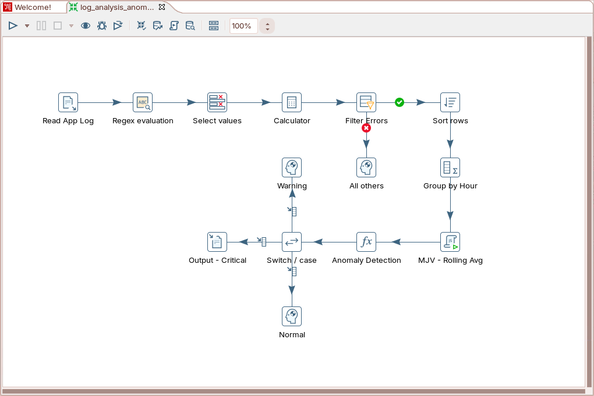<figcaption><p>Log Analysis</p></figcaption></figure>

> **Note:** **Workshop files**
>
> Input: `pvfs://MinIO/logs/app/application.log` (123 lines over four hours). Output: `pvfs://MinIO/logs/alerts/critical_alerts.csv`.

Build `log_analysis_anomaly.ktr`, step by step:

1. **Text file input** `Read App Log`: the log file, no header, one String field `log_line`, and a separator that never occurs (the solution uses `||||`) so each line arrives whole.
2. **Regex evaluation**: field `log_line`, regular expression `^(\d{4}-\d{2}-\d{2} \d{2}:\d{2}:\d{2})\s+(\w+)\s+\[([^\]]+)\]\s+(.*)$`, tick **Create fields for capture groups**, capture fields `timestamp_str`, `log_level`, `component`, `message` (String).
3. **Select values**: on **Meta-data**, change `timestamp_str` to `timestamp`, type Timestamp, format `yyyy-MM-dd HH:mm:ss`.
4. **Calculator**: `log_hour` = **Hour of Day of Date A** (`timestamp`).
5. **Filter rows** `Filter Errors`: `log_level` CONTAINS `ERROR` OR `log_level` = `WARN`. True to the next step; false to a **Dummy** `All others`. 58 of the 123 lines pass.
6. **Sort rows** on `log_hour`, then **Group by** `Group by Hour` on `log_hour`: `error_count` = Number of rows, `error_messages` = concatenated `message` values. 4 rows, one per hour.
7. **Modified JavaScript value** `MJV - Rolling Avg`: `rolling_avg_errors`, the average of this hour and the two before it (copy the script from the solution: it keeps the previous two counts in variables between rows).
8. **Formula** `Anomaly Detection`: `is_anomaly` = `IF([error_count] > ([rolling_avg_errors] * 1.2); "YES"; "NO")` and `anomaly_severity` = `IF([error_count] > ([rolling_avg_errors] * 1.5); "CRITICAL"; IF([error_count] > ([rolling_avg_errors] * 1.2); "WARNING"; "NORMAL"))`.
9. **Switch / case** on `anomaly_severity`: `CRITICAL` to a **Text file output** `Output - Critical` (`pvfs://MinIO/logs/alerts/critical_alerts`, extension `csv`), `WARNING` and `NORMAL` to two Dummy steps.
10. Run. Of the four hours, 1 is critical, 1 a warning and 2 normal; the critical one is written to `logs/alerts/`.

> **Under the hood:**
>
> #### A rolling average needs memory between rows
>
> Every other step here treats each row on its own. A rolling average
> cannot: it needs the last two hours' counts. The JavaScript step keeps
> them in script variables that survive from one row to the next, which
> is why the rows must arrive in hour order, and why the Sort rows comes
> first.
>
> **Why it matters:** "compared with recent history" is the core of
> most anomaly checks, and the order of the rows is part of the logic.

***

> **Note:** **Workshop files**
>
> Download the files for this workshop. For `.ktr` files, **Open in Pentaho Data Integration** launches PDI with the transformation loaded; if PDI is already running, the path is copied to your clipboard (Ctrl+O, Ctrl+V, Enter).

[log_analysis_anomaly.ktr](./files/log_analysis_anomaly.ktr) <button data-launch="spoon" data-path="files/log_analysis_anomaly.ktr">Open in Pentaho Data Integration</button> <button data-graph="files/log_analysis_anomaly.ktr">View graph</button>

### Fraud

> **Warning:**
>
> #### Transactions & Fraud Detection
>
> **Objective:** Process credit card transactions, enrich with account and merchant data, calculate transaction metrics, and detect suspicious patterns using rule-based fraud detection.
>
> **Skills:** Financial data processing, multi-table joins, running totals, rule-based fraud detection, transaction velocity analysis
>
> **Business Context:** A payment processor needs to analyze transaction data in real-time to detect potentially fraudulent activity before authorizing transactions. The system must flag high-risk transactions based on amount thresholds, unusual merchant activity, account balance checks, and transaction velocity patterns.

> **Note:** **Workshop files**
>
> Inputs (already in MinIO, and also under **Workshop files** below): `pvfs://MinIO/raw-data/finance/transactions.csv` (63 transactions), `accounts.csv` (13 accounts), `merchants.csv` (18 merchants).

Build `fraud_detection.ktr`, step by step:

1. Three **Text file input** steps, `Read Transactions`, `Read Accounts` and `Read Merchants`, one per finance file: separator `,`, header row, **Get Fields**. Make `amount`, `balance` and `credit_limit` BigNumber, and `transaction_date` (`yyyy-MM-dd HH:mm:ss`) and `open_date` (`yyyy-MM-dd`) Date.
2. **Stream lookup** `Lookup Accounts` after `Read Transactions`: **Lookup step** `Read Accounts`, key `account_id` = `account_id`, returning `customer_name`, `account_type`, `balance`, `credit_limit`, `open_date` and `risk_rating`.
3. **Sort rows** `Sort by Merchants` (after the lookup) and `Sort Merchants` (after `Read Merchants`), both on `merchant_id`.
4. **Merge join** `Join Merchants`: the sorted transactions first, merchants second, **LEFT OUTER**, key `merchant_id`. Every transaction keeps its row even if the merchant is unknown.
5. **Formula** `Metrics + Flags`: the metrics and six 0/1 flags:

| Field | Formula |
| --- | --- |
| `days_since_account_open` | `ABS(DAYS([transaction_date]; [open_date]))` |
| `balance_after_transaction` | `[balance] - [amount]` |
| `credit_utilization` | `IF([credit_limit] > 0; ([amount] / [credit_limit]) * 100; 0)` |
| `high_amount_flag` | `IF([amount] > 1000; 1; 0)` |
| `overlimit_flag` | `IF(AND([account_type]="CREDIT"; [balance_after_transaction] < 0); 1; 0)` |
| `high_risk_merchant_flag` | `IF([risk_level]="HIGH"; 1; 0)` |
| `velocity_flag` | `IF([status]="DECLINED"; 1; 0)` |
| `new_account_flag` | `IF([days_since_account_open] < 30; 1; 0)` |
| `high_utilization_flag` | `IF([credit_utilization] > 80; 1; 0)` |

6. **Formula** `Calculate Fraud Score`: `fraud_risk_score` = `([high_amount_flag] * 20) + ([overlimit_flag] * 30) + ([high_risk_merchant_flag] * 25) + ([velocity_flag] * 15) + ([new_account_flag] * 5) + ([high_utilization_flag] * 15)` (Integer).
7. **Formula** `risk_category`: `IF([fraud_risk_score] >= 80; "CRITICAL"; IF([fraud_risk_score] >= 50; "HIGH"; IF([fraud_risk_score] >= 20; "MEDIUM"; "APPROVE")))`.
8. Preview `risk_category`: of the 63 transactions, 45 APPROVE, 6 MEDIUM, 5 HIGH and 7 CRITICAL.

> **Under the hood:**
>
> #### Stream lookup for the small side, merge join for the sorted one
>
> The accounts are small, so **Stream lookup** reads all 13 into memory
> once and answers each transaction from there, with no sorting. The
> merchants go through **Merge join**, which needs both inputs sorted
> but never holds a whole side in memory. Two ways of enriching a
> stream, chosen by size.
>
> **Why it matters:** the score is plain arithmetic over flags, so every
> rating can be explained: a CRITICAL is a sum of named reasons.

***

> **Note:** **Workshop files**
>
> Download the files for this workshop. For `.ktr` files, **Open in Pentaho Data Integration** launches PDI with the transformation loaded; if PDI is already running, the path is copied to your clipboard (Ctrl+O, Ctrl+V, Enter).

[fraud_detection.ktr](./files/fraud_detection.ktr) <button data-launch="spoon" data-path="files/fraud_detection.ktr">Open in Pentaho Data Integration</button> <button data-graph="files/fraud_detection.ktr">View graph</button>

[data/accounts.csv](./files/data/accounts.csv)

[data/merchants.csv](./files/data/merchants.csv)

[data/transactions.csv](./files/data/transactions.csv)

### Data Lake Ingestion

> **Warning:**
>
> #### Data Lake Ingestion
>
> Modern data lakes often receive the same entities (products, customers, orders) from multiple sources in different formats. This workshop demonstrates how to ingest, normalize, validate, and deduplicate multi-format data into a unified schema - a common data engineering pattern.
>
> **Objective:** Combine data from CSV, JSON, and XML into a unified product schema.
>
> **Skills:** Multi-format parsing, schema normalization, data validation, deduplication

> **Note:** **Workshop files**
>
> These files are already in MinIO:
>
> * `pvfs://MinIO/raw-data/csv/products.csv`
> * `pvfs://MinIO/raw-data/json/api_response.json`
> * `pvfs://MinIO/raw-data/xml/inventory.xml`

> **Note:** Create a new transformation.
>
> Use any of these options:
>
> * Select **File** > **New** > **Transformation**
> * Use `Ctrl+N` (Windows/Linux) or `Cmd+N` (macOS)

:::: tabs

### 1. Define Target Schema

> **Note:**
>
> #### Define Target Schema
>
> **Objective:** Design a unified schema that accommodates all source formats.
>
> **Why Important:** Before ingesting data, you need a clear target schema. This ensures consistency across all sources and makes downstream analytics easier.

<table data-full-width="true"><thead><tr><th width="141">Field</th><th width="109">Type</th><th width="95">Length</th><th width="125">Description</th><th>Source Mapping</th></tr></thead><tbody><tr><td>product_id</td><td>String</td><td>50</td><td>Unique product identifier</td><td>CSV: product_id<br>JSON: product_id<br>XML: sku</td></tr><tr><td>product_name</td><td>String</td><td>200</td><td>Product display name</td><td>CSV: product_name<br>JSON: product_name<br>XML: name</td></tr><tr><td>category</td><td>String</td><td>100</td><td>Product category</td><td>CSV: category<br>JSON: (derived from order type)<br>XML: category</td></tr><tr><td>price</td><td>Number</td><td>15,2</td><td>Unit price in USD</td><td>CSV: price<br>JSON: unit_price<br>XML: null (not available)</td></tr><tr><td>quantity</td><td>Integer</td><td>10</td><td>Available stock quantity</td><td>CSV: stock_quantity<br>JSON: quantity<br>XML: quantity</td></tr><tr><td>source_system</td><td>String</td><td>10</td><td>Origin system identifier</td><td>Constant: 'csv', 'json', or 'xml'</td></tr><tr><td>ingestion_time</td><td>Timestamp</td><td>-</td><td>When record was ingested</td><td>System timestamp</td></tr></tbody></table>

***

> **Note:**
>
> #### Schema Discovery & Analysis
>
> **Objective:** Understand each source structure before you design the target schema.
>
> **Why it matters:** You can’t normalize what you haven’t inspected.

**Step 1.** **Inspect each Data Source**

Use real samples. Avoid guessing field names.

::: tabs

### CSV (products.csv)

**Inspect the file**

Open it in the MinIO console (**raw-data** > `csv/products.csv` > **Download**, or **Preview**).

**Sample**

```csv
product_id,product_name,category,price,stock_quantity,supplier,last_updated
P001,Laptop Pro 15,Electronics,1299.99,45,TechSupply Inc,2024-01-15
P002,Wireless Mouse,Electronics,29.99,230,TechSupply Inc,2024-01-16
```

**Findings**

* Has `product_id`, `product_name`, `category`, `price`, `stock_quantity` (plus `supplier`, `last_updated`); 18 products.
* Completeness looks high.
* Naming is consistent and explicit.

### JSON (api\_response.json)

**Inspect one nested item**

Open `json/api_response.json` in the MinIO console. Each order has an `items` array; one item:

**Sample**

```json
{
  "product_id": "P001",
  "name": "Laptop Pro 15",
  "quantity": 1,
  "unit_price": 1299.99
}
```

**Findings**

* Has `product_id`, and `name` for the product name; 2 orders, one item each.
* Uses `unit_price` instead of `price`.
* `quantity` is order quantity, not stock.
* `category` is missing.
* Path is `$.data.orders[*].items[*]`.

### XML (inventory.xml)

**Inspect one item node**

Open `xml/inventory.xml` in the MinIO console. Items sit under `/inventory/items/item`:

**Sample**

```xml
<item>
    <sku>P001</sku>
    <name>Laptop Pro 15</name>
    <category>Electronics</category>
    <quantity>45</quantity>
    <location>A-12-3</location>
    <last_checked>2024-01-20</last_checked>
</item>
```

**Findings**

* Uses `sku` for `product_id`.
* Uses `name` for `product_name`.
* Has `category` and warehouse `quantity`.
* `price` is missing.
* `location` is extra for a product master.

:::

**Step 2.** **Build a field mapping matrix**

This shows name differences and missing fields.

<table data-full-width="true"><thead><tr><th>Unified field</th><th>CSV</th><th>JSON</th><th width="109">XML</th><th>Notes</th></tr></thead><tbody><tr><td>Identifier</td><td><code>product_id</code></td><td><code>product_id</code></td><td><code>sku</code></td><td>Same meaning. Different name in XML.</td></tr><tr><td>Name</td><td><code>product_name</code></td><td><code>product_name</code></td><td><code>name</code></td><td>Same meaning. Different name in XML.</td></tr><tr><td>Category</td><td><code>category</code></td><td>❌</td><td><code>category</code></td><td>Missing in JSON.</td></tr><tr><td>Price</td><td><code>price</code></td><td><code>unit_price</code></td><td>❌</td><td>Different name in JSON. Missing in XML.</td></tr><tr><td>Stock quantity</td><td><code>stock_quantity</code></td><td><code>quantity</code></td><td><code>quantity</code></td><td>JSON <code>quantity</code> is not stock.</td></tr></tbody></table>

**What to watch**

* Missing data is normal in multi-source ingestion.
* Same name can mean different things.

**Step 3.** **Make schema decisions**

Write these down. You will forget them later.

**Field names**

* Use CSV naming as the standard.
* Map XML `sku → product_id` and `name → product_name`.
* Map JSON `unit_price → price`.

**Missing fields**

* Missing `category` in JSON: set a default like `E-commerce`.
* Missing `price` in XML: leave `NULL`.

**Data types**

* `product_id`: string. It contains `PROD-` prefix.
* `product_name`: string. Allow up to 200 chars.
* `category`: string. Allow up to 100 chars.
* `price`: decimal(15,2).
* `quantity`: integer.

**Metadata**

* Add `source_system` for lineage.
* Add `ingestion_time` for auditability.

**Step 4.** **Define a deduplication rule**

Same `product_id` can appear in multiple sources.

**Example collision**

```
CSV:  PROD-001, price=999.99, stock_quantity=50, category=Electronics
JSON: PROD-001, price=999.99, quantity=2,       category=NULL
XML:  PROD-001, price=NULL,   quantity=50,      category=Electronics
```

**Recommended rule**

1. Prefer CSV.
2. Then JSON.
3. Then XML.

Implement this with `source_priority` (CSV=1, JSON=2, XML=3).

**Step 5.** **Checklist**

* You inspected real records for each source.
* You captured paths for nested formats.
* You documented mappings and type choices.
* You decided how to handle missing data.
* You decided how to dedupe collisions.

### 2. Ingest Data Sources

> **Note:**
>
> #### Ingest Data Sources

> **Warning:** **Path convention used below:** `pvfs://MinIO/...`
>
> `MinIO` is the **VFS connection name**. It must match your connection exactly.

**Step 1.** **Ingest CSV products**

**Goal:** Read `products.csv` and map it to the unified schema.

**Path:** `pvfs://MinIO/raw-data/csv/products.csv`

1. Add a **Text file input** step.
   * Step name: `Read CSV Products`
   * File/directory: `pvfs://MinIO/raw-data/csv/products.csv`
   * Separator: `,`
   * Enclosure: `"` (double quote)
   * Header row present: enabled
2. On **Fields**, select **Get Fields**.
3. Add a **Select values** step.
   * Step name: `Map CSV to Target Schema`
   * Rename `stock_quantity` → `quantity`
4. Add **Add constants**.
   * Step name: `Add CSV Metadata`
   * Add field `source_system` = `csv`
5. Add **Get System Info**.
   * Step name: `Add Ingestion Timestamp`
   * Add field `ingestion_time` = `system date (variable)`

**Preview check**

* Expected rows: `12`
* `product_id`, `product_name`, `category` should be populated.

### Ingest JSON order items

**Goal:** Extract product fields from nested JSON order items.

**Path:** `pvfs://MinIO/raw-data/json/api_response.json`

> **Warning:** `quantity` in JSON is **order quantity**, not stock quantity.
>
> Keep it as `quantity` only if that’s what you want to model.

1. Add a **JSON Input** step.
   * Step name: `Read JSON Products`
   * File: `pvfs://MinIO/raw-data/json/api_response.json`
   * Ignore empty file: enabled
2. On **Fields**, use **explicit JSONPaths** (recommended):
   * `product_id`: `$.data.orders[*].items[*].product_id`
   * `product_name`: `$.data.orders[*].items[*].product_name`
   * `unit_price`: `$.data.orders[*].items[*].unit_price`
   * `quantity`: `$.data.orders[*].items[*].quantity`

<details>

<summary>Alternative approach (base path + relative field paths)</summary>

If your PDI build supports a base “Path” for the JSON Input step, set:\n\n- Base path: `$.data.orders[*].items[*]`\n\nThen set field paths relative to the base:\n\n- `product_id`: `product_id`\n- `product_name`: `product_name`\n- `unit_price`: `unit_price`\n- `quantity`: `quantity`\n

</details>

3. Add a **Select values** step.
   * Step name: `Map JSON to Target Schema`
   * Rename `unit_price` → `price`
4. Add **Add constants**.
   * Step name: `Add JSON Metadata`
   * `source_system` = `json`
   * `category` = `E-commerce` (default)
5. Add **Get System Info**.
   * Step name: `Add JSON Ingestion Timestamp`
   * `ingestion_time` = `system date (variable)`

**Preview check**

* Expected rows: `~10–15` (can vary with sample file).
* `product_name` should not be NULL.

### Ingest XML inventory items

**Goal:** Extract inventory items from XML using XPath.

**Path:** `pvfs://MinIO/raw-data/xml/inventory.xml`

1. Add **Get data from XML**.
   * Step name: `Read XML Products`
   * File: `pvfs://MinIO/raw-data/xml/inventory.xml`
   * Loop XPath: `/inventory/items/item`
2. On **Fields**, add:
   * `sku` (String)
   * `name` (String)
   * `category` (String)
   * `quantity` (Integer)

> **Note:** Field XPaths are **relative to the loop node**.
>
> Example: `sku` means “read the `<sku>` element under each `<item>`”.

3. Add a **Select values** step.
   * Step name: `Map XML to Target Schema`
   * Rename `sku` → `product_id`
   * Rename `name` → `product_name`
   * Add a new field `price` in **Meta-data** (type `Number`). Leave it empty (NULL).
4. Add **Add constants**.
   * Step name: `Add XML Metadata`
   * `source_system` = `xml`
5. Add **Get System Info**.
   * Step name: `Add XML Ingestion Timestamp`
   * `ingestion_time` = `system date (variable)`

**Preview check**

* Expected rows: `~8–10`
* If you get `0` rows, re-check the Loop XPath.

### 3. Merge streams

> **Note:**
>
> #### Merge Streams
>
> **Objective:** Merge all three data streams (CSV, JSON, XML) into one unified stream.
>
> **Why Append Streams:** This step stacks all rows from different sources vertically - like a SQL UNION ALL.

**Configuration:**

1. **Add a Dummy (do nothing) step**
   * **Name**: "Combine All Products"
   * **Append streams** takes only two inputs (a head and a tail). For three, hop them all into one step: PDI passes on every row that arrives on any hop.
2. **Connect all three streams** to this step:
   * "Add Ingestion Timestamp" (CSV branch) → Append streams
   * "Add JSON Ingestion Timestamp" (JSON branch) → Append streams
   * "Add XML Ingestion Timestamp" (XML branch) → Append streams
3. **Important:** All input streams MUST have the same fields with the same names and types:
   * product\_id (String)
   * product\_name (String)
   * category (String)
   * price (Number) - can be null
   * quantity (Integer)
   * source\_system (String)
   * ingestion\_time (Timestamp)

**Expected Output:**

* Row count: 37 rows (18 CSV + 2 JSON + 17 XML)
* All products from all sources combined
* Some products will appear multiple times (duplicates to be handled in Step 7)

**Preview Check:**

```
product_id   product_name      source_system  price
P001         Laptop Pro 15     csv            1299.99
P002         Wireless Mouse    csv            29.99
...
P001         Laptop Pro 15     json           1299.99   <- the same product again
...
P001         Laptop Pro 15     xml            null      <- again, and no price
```

### 4. Data Validation (extension)

> **Note:**
>
> #### Data Validation
>
> An extension beyond the solution, which stops at **Combine All Products**: check the unified rows before you publish them, and route the failures to an error file.

1. Add a **Data validator** step after **Combine All Products** and name it `Validate Product Data`.
2. Add validations: `product_id` and `product_name` must not be null or empty; `price` must be at least 0, with null allowed (the XML feed has no price).
3. Right-click the step, choose **Error Handling...**, and send the error rows to a **Text file output** `Write Error Records`: `pvfs://MinIO/curated/products/errors/validation_errors`, extension `csv`, **Include date in filename?** ticked. Give the error descriptions field a name such as `validation_errors`.
4. Rows that pass carry on from the validator's normal hop; write them on to `pvfs://MinIO/curated/products/`.

> **Note:** **Data validator** routes failing rows through its error hop; there is no "validation result" field on the good rows to filter on.

::::

***

> **Note:** **Workshop files**
>
> Download the files for this workshop. For `.ktr` files, **Open in Pentaho Data Integration** launches PDI with the transformation loaded; if PDI is already running, the path is copied to your clipboard (Ctrl+O, Ctrl+V, Enter).

[data_lake_ingestion.ktr](./files/data_lake_ingestion.ktr) <button data-launch="spoon" data-path="files/data_lake_ingestion.ktr">Open in Pentaho Data Integration</button> <button data-graph="files/data_lake_ingestion.ktr">View graph</button>

:::::

## Lab Files

Click a file to download. For `.ktr` and `.kjb` files, **Open in Pentaho Data Integration** launches PDI with the file loaded. If PDI is already running, the path is copied to your clipboard — switch to PDI and use Ctrl+O, Ctrl+V, Enter.

The sample data for these workshops is in `data/` beside them.

### Solution <!-- no-step -->

One finished transformation per workshop in the series. Open them alongside your own to compare, or run to see the expected result.

Also on disk at `C:\Workshop-DI-Practitioner\03-data-sources\03-storage\19-mod3-minio\solution`.

[customer_360.ktr](./files/customer_360.ktr) <button data-launch="spoon" data-path="files/customer_360.ktr">Open in Pentaho Data Integration</button> <button data-graph="files/customer_360.ktr">View graph</button>

[data_lake_ingestion.ktr](./files/data_lake_ingestion.ktr) <button data-launch="spoon" data-path="files/data_lake_ingestion.ktr">Open in Pentaho Data Integration</button> <button data-graph="files/data_lake_ingestion.ktr">View graph</button>

[fraud_detection.ktr](./files/fraud_detection.ktr) <button data-launch="spoon" data-path="files/fraud_detection.ktr">Open in Pentaho Data Integration</button> <button data-graph="files/fraud_detection.ktr">View graph</button>

[inventory_reconciliation.ktr](./files/inventory_reconciliation.ktr) <button data-launch="spoon" data-path="files/inventory_reconciliation.ktr">Open in Pentaho Data Integration</button> <button data-graph="files/inventory_reconciliation.ktr">View graph</button>

[log_analysis_anomaly.ktr](./files/log_analysis_anomaly.ktr) <button data-launch="spoon" data-path="files/log_analysis_anomaly.ktr">Open in Pentaho Data Integration</button> <button data-graph="files/log_analysis_anomaly.ktr">View graph</button>

[sales_dashboard_etl.ktr](./files/sales_dashboard_etl.ktr) <button data-launch="spoon" data-path="files/sales_dashboard_etl.ktr">Open in Pentaho Data Integration</button> <button data-graph="files/sales_dashboard_etl.ktr">View graph</button>
