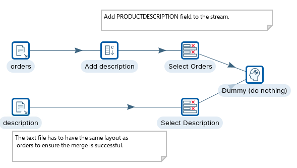
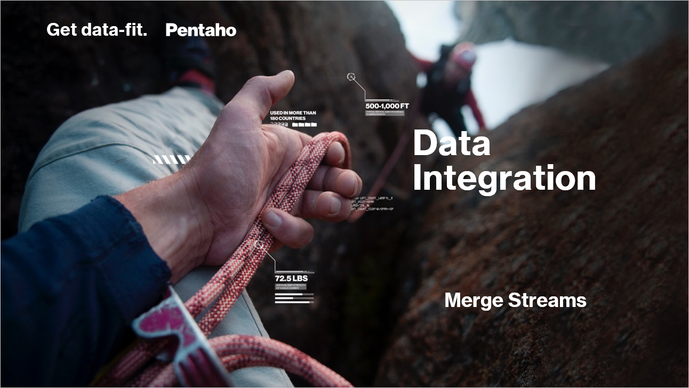
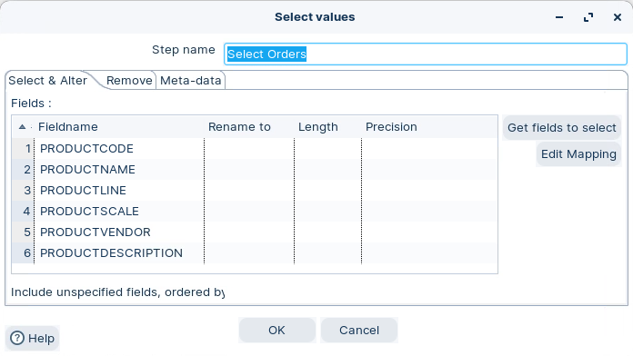
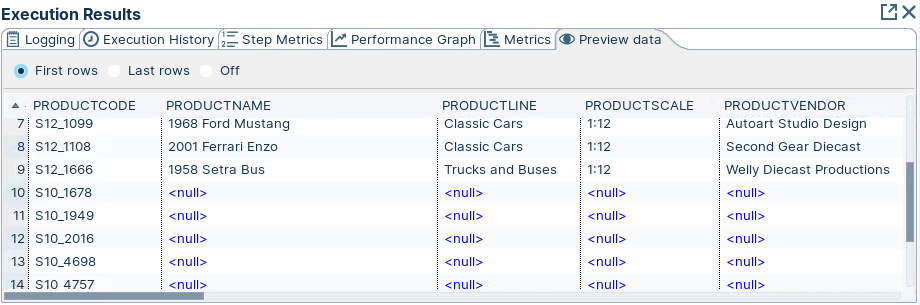

# Merge Streams

> **Warning:**
>
> #### Workshop - Merge Streams
> 
> Merging streams only works when every stream shares the same layout. Each stream must have the same fields, in the same order, with the same data types before it can be merged.
> 
> In this workshop, you align an orders stream with a separate description stream, then merge the two.
> 
> **What you'll do**
> 
> * Read two text files with Text file input
> * Add a matching field to a stream with Add constants
> * Align field order and types with Select values
> * Merge the streams and preview the result
> 
> **Prerequisites:** Understanding of basic transformation concepts (steps, hops, preview). Pentaho Data Integration installed and configured.
> 
> **Estimated time:** 25 minutes



<figure><figcaption><p>Merge data streams</p></figcaption></figure>

> **Note:** **Create a new transformation**
> 
> Use any of these options to open a new transformation tab:
> 
> * Select **File** > **New** > **Transformation**
> * Use `Ctrl+N` (Windows/Linux) or `Cmd+N` (macOS)

:::: tabs

### 1. Text File Input

> **Note:**
>
> #### Text file input
> 
> Use **Text file input** to read the `orders.txt` and `description.txt` files. Each becomes its own stream.

1. Start Pentaho Data Integration (Spoon).

> **Note:** 

::: tabs

### Windows (PowerShell)

> 
> ```powershell
> Set-Location C:\Pentaho\design-tools\data-integration
> .\spoon.bat
> ```
> 
>

### macOS / Linux

> 
> ```bash
> cd ~/Pentaho/design-tools/data-integration
> ./spoon.sh
> ```
> 
>

:::

<button data-launch="spoon" data-path="">Start PDI</button>

2. Examine both `orders.txt` and `description.txt`.
3. Drag two **Text file input** steps onto the canvas.
4. Configure each step to point to and retrieve the data from its file.

### 2. Add Constant

> **Note:**
>
> #### Add constants
> 
> Use **Add constants** to add a fixed value to every row in a stream. To merge two streams, both must have the same layout.

1. Drag **Add constants** onto the canvas.
2. Create a hop from the orders **Text file input**.
3. Add a `PRODUCTDESCRIPTION` field to the orders stream so it matches the description stream.

### 3. Select Values

> **Note:**
>
> #### Select values
> 
> The Select Values step is useful for selecting, removing, renaming, changing data types and configuring the length and precision of the fields on the stream. These operations are organized into different categories:
> 
> * Select and Alter — Specify the exact order and name in which the fields should be placed in the output rows
> * Remove — Specify the fields that should be removed from the output rows
> * Meta-data — Change the name, type, length, and precision (the metadata) of one or more fields

1. Drag a **Select values** step onto each stream.
2. Configure each step so both streams share the same field order and types.

<figure><figcaption><p>Select values</p></figcaption></figure>

> **Note:** Each **Select values** step makes its stream consistent in layout before merging. Fields must be in the same order in both streams for the merge to map correctly.

### 4. RUN

> **Note:**
>
> #### Run the transformation
> 
> Run the transformation locally and preview the merged output.

1. Select **Run** in the canvas toolbar.
2. Right-click the **Dummy** step and select **Preview**.

<figure><figcaption><p>Preview data</p></figcaption></figure>

> **Success:** You should see the two streams merged into one.

::::

## Lab Files

Click a file to download. For `.ktr` and `.kjb` files, **Open in Pentaho Data Integration** launches PDI with the file loaded. If PDI is already running, the path is copied to your clipboard — switch to PDI and use Ctrl+O, Ctrl+V, Enter.

[description.txt](./files/description.txt)

[orders.txt](./files/orders.txt)

[tr_merge_streams.ktr](./files/tr_merge_streams.ktr) <button data-launch="spoon" data-path="files/tr_merge_streams.ktr">Open in Pentaho Data Integration</button> <button data-graph="files/tr_merge_streams.ktr">View graph</button>
