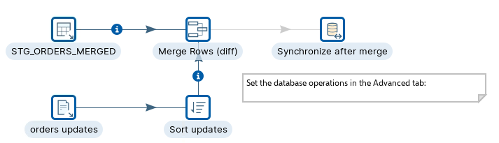
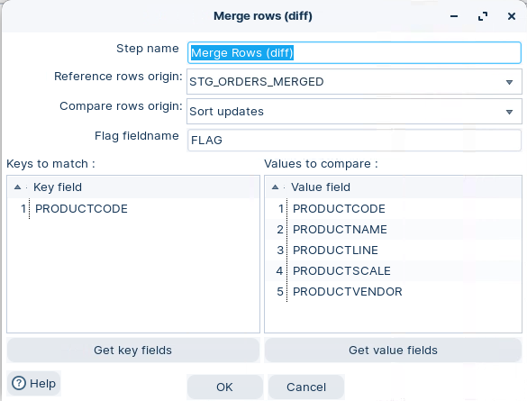
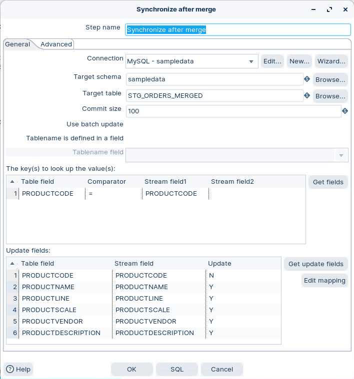
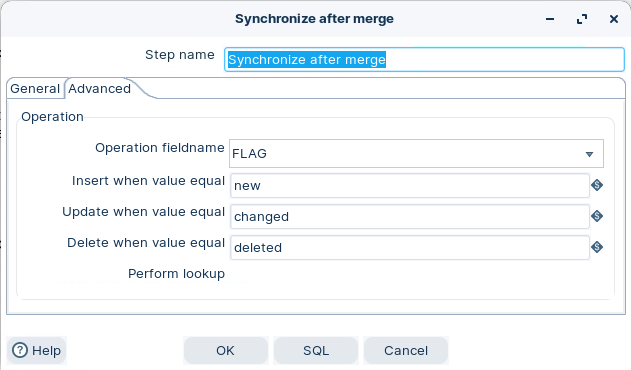
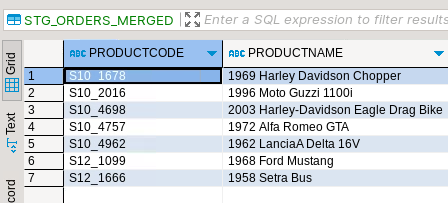
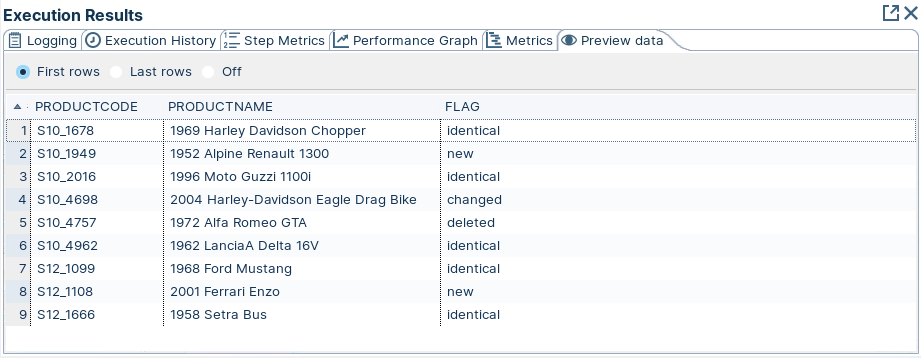
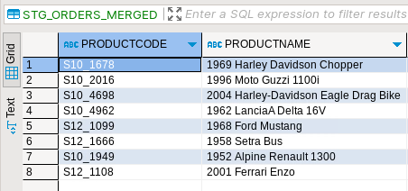

# Merge Rows (diff)

> **Warning:**
>
> #### Workshop - Merge Rows (diff)
> 
> The Merge rows (diff) step compares the values between two merging streams and sets a flag on each row. You compare incoming records with reference 'golden' records to determine whether each record is identical, changed, new, or deleted.
> 
> In this workshop, you build a transformation that merges a reference stream with a compare stream, flags the differences, and synchronises the changes to a database table.
> 
> **What you'll do**
> 
> * Compare reference and compare rows with Merge rows (diff)
> * Apply inserts, updates, and deletes with Synchronize after merge
> * Run the transformation and inspect the CRUD operations on the result
> 
> **Prerequisites:** Understanding of basic transformation concepts (steps, hops, preview). Pentaho Data Integration installed and configured.
> 
> **Estimated time:** 20 minutes

<div class="pcm-embed-card" data-href="https://www.loom.com/share/cd56088673de462998803583425d0488?hideEmbedTopBar=true&amp;hide_owner=true&amp;hide_share=true&amp;hide_title=true" data-title="Data Change Capture and Synchronization Process Demonstration" data-description="In this video, I walk you through a data change capture scenario where we manage product data in a database alongside changes from a text file. We utilize the merge rows diff step to identify new, deleted, and changed products, followed by the synchronize after merge step to update our records accordingly. I demonstrate how to configure these steps, including setting up the flag field for operations like inserts, updates, and deletes. Please ensure that your data is sorted by the specified keys before running the transformation. By the end of this process, our product data will be fully synchronized and up to date in the database." data-thumb="../_assets/embeds/2d94cd73b9b2.png"></div>



> **Note:** **Create a new transformation**
> 
> Use any of these options to open a new transformation tab:
> 
> * Select **File** > **New** > **Transformation**
> * Use `Ctrl+N` (Windows/Linux) or `Cmd+N` (macOS)

:::: tabs

### 1. Merged row (diff)

> **Note:**
>
> #### Merge Rows (diff)
> 
> Let's say we're doing a delta load of new data at specific times.
> 
> Based on keys for comparison, we can use this step to merge reference rows (previous data) with compare rows (new data) to create merged output rows.
> 
> A flag in the row indicates how the values were compared and merged. Flag values include:
> 
> * identical
> 
> The key was found in both rows, and the compared values are identical.
> 
> * changed
> 
> The key was found in both rows, but one or more compared values are different.
> 
> * new
> 
> The key was not found in the reference rows.
> 
> * deleted
> 
> The key was not found in the compare rows.
> 
> If the rows are flagged as `deleted`, the merged output rows are created based upon the original reference rows stream.
> 
> For `identical`, `new`, or `changed` rows, the merged output rows are created based upon the original compare rows stream.

1. Start Pentaho Data Integration (Spoon).

> **Note:** 

::: tabs

### Windows (PowerShell)

> 
> ```powershell
> Set-Location C:\Pentaho\design-tools\data-integration
> .\spoon.bat
> ```
> 
>

### macOS / Linux

> 
> ```bash
> cd ~/Pentaho/design-tools/data-integration
> ./spoon.sh
> ```
> 
>

:::

<button data-launch="spoon" data-path="">Start PDI</button>

2. Configure the **Merge rows (diff)** step like this:

<figure><figcaption><p>Merge rows (diff)</p></figcaption></figure>

### 2. Synchronize after merge

> **Note:**
>
> #### Synchronize after merge
> 
> This step can be used in conjunction with the Merge Rows (diff) transformation step. The Merge Rows (diff) transformation step appends a Flag column to each row, with a value of "identical", "changed", "new" or "deleted".
> 
> This flag column is then used by the Synchronize after merge transformation step to carry out updates/inserts/deletes on a connection table.
> 
> This step uses the flag value to perform the sync operations on the database table.

<figure><figcaption><p>STG_ORDERS_MERGED</p></figcaption></figure>

> **Note:** * Set the Key from both the Table and Stream.
> * Get the Table / Stream Fields and ensure mapping is correct.
> * <mark style="color:red;">Dont</mark> Update the Keys..!!

<figure><figcaption><p>Synchronize after merge - Advanced tab</p></figcaption></figure>

<table><thead><tr><th width="154.66666666666666">Option</th><th width="421">Description</th><th>Default Value</th></tr></thead><tbody><tr><td>Operation fieldname</td><td>This is a required field. This field is used by the step to obtain an operation flag for the current row.</td><td>flagfield</td></tr><tr><td>Insert when value equal</td><td>Specify the value of the Operation fieldname which signifies that anInsert should be carried out.</td><td>new</td></tr><tr><td>Update when value equal</td><td>Specify the value of the Operation fieldname which signifies that an Update should be carried out.</td><td>changed</td></tr><tr><td>Delete when value equal</td><td>Specify the value of the Operation fieldname which signifies that a Delete should be carried out.</td><td>deleted</td></tr><tr><td>Perform lookup</td><td>Performs a lookup when deleting or updating. If the lookup field is not found, then an exception is thrown. This option can be used as an extra check if you wish to check updates/deletes prior to their execution.</td><td></td></tr></tbody></table>

### 3. RUN

> **Note:**
>
> #### Run the transformation
> 
> This step is aimed at reporting data marts .. delta loads to update the cube. Check out which records have undergone CRUD operations.

1. View the data in the Table.

<figure><figcaption><p>STG_ORDERS_MERGED</p></figcaption></figure>

2. Run the Transformation with the hop between the Merge Rows (diff) and Synchronize after merge .. disabled.

<figure><figcaption><p>Synchronize after merge - FLAG</p></figcaption></figure>

> **Under the hood:**
>
> #### It's a merge walk, so both sides must be sorted on the key
>
> **Merge rows (diff)** holds one row from the reference stream and
> one from the compare stream and walks both forward in lock-step,
> exactly like merging two sorted lists. Keys equal: compare the value
> fields, flag `identical` or `changed`, advance both. Reference key
> smaller: that key is gone from the new data, flag `deleted`, advance
> the reference. Compare key smaller: flag `new`, advance the compare
> side. It never holds more than the current pair, which is why it
> copes with any volume — and why it assumes order.
>
> Hand it unsorted input and it doesn't fail. It walks past matches it
> can no longer see and flags the same key `deleted` on one side and
> `new` on the other. Spoon warns about exactly this when you close the
> dialog.
>
> **Why it matters:** a **Sort rows** on each input (or `ORDER BY` in
> the source query) is part of this step, not optional polish. Without
> it, a sync turns every unchanged row into a delete plus an insert.

3. Run the Transformation with the hop enabled.
4. Examine and compare the records.

<figure><figcaption><p>STG_ORDERS_MERGED - Synchronize</p></figcaption></figure>

> **Success:** You should see the reference and compare streams merged, with each record flagged and the database table synchronised.

> **Under the hood:**
>
> #### Identical rows never touched the database
>
> **Synchronize after merge** read the flag on each row and mapped it
> straight to a statement: `new` → `INSERT`, `changed` → `UPDATE ...
> WHERE key = ?`, `deleted` → `DELETE ... WHERE key = ?`. Rows flagged
> `identical` were simply dropped. Compare that with reloading the
> table: on a typical day the vast majority of a feed is unchanged, so
> the vast majority of your write traffic disappears.
>
> The step still executes one statement per changed row and commits
> every **Commit size** rows, so its cost scales with the *delta*, not
> with the feed.
>
> **Why it matters:** this pair — diff, then synchronize — is
> change-data-capture with no triggers, no log mining and no vendor
> feature. Two inputs and the engine works out what changed; that is
> how a reporting mart refreshes in minutes instead of hours.

::::

## Lab Files

Click a file to download. For `.ktr` and `.kjb` files, **Open in Pentaho Data Integration** launches PDI with the file loaded. If PDI is already running, the path is copied to your clipboard — switch to PDI and use Ctrl+O, Ctrl+V, Enter.

[orders_update.txt](./files/orders_update.txt)

[orders.txt](./files/orders.txt)

[tr_merge_streams_database_diff.ktr](./files/tr_merge_streams_database_diff.ktr) <button data-launch="spoon" data-path="files/tr_merge_streams_database_diff.ktr">Open in Pentaho Data Integration</button> <button data-graph="files/tr_merge_streams_database_diff.ktr">View graph</button>

[tr_merge_streams_diff.ktr](./files/tr_merge_streams_diff.ktr) <button data-launch="spoon" data-path="files/tr_merge_streams_diff.ktr">Open in Pentaho Data Integration</button> <button data-graph="files/tr_merge_streams_diff.ktr">View graph</button>
