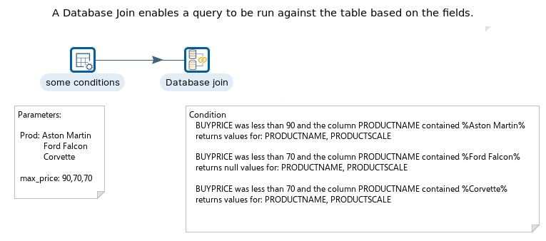
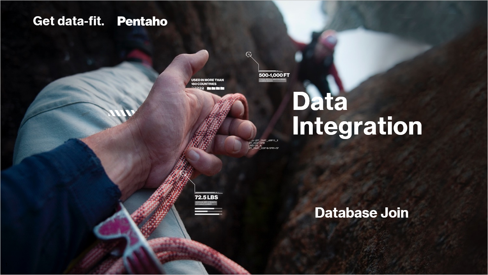
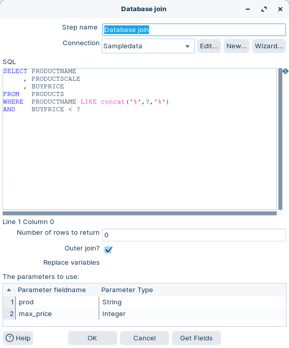
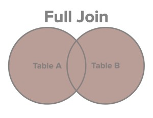
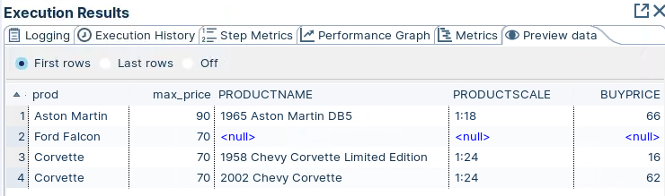

# Database Join

> **Warning:**
>
> #### Workshop - Database Join
> 
> Searching for information in databases, text files, and web services is a common task. The Database Join step is not actually a join — it runs a series of queries against a table based on set conditions, which carries a performance cost.
> 
> In this workshop, you query the Products table to return products listed below a set buy price.
> 
> **What you'll do**
> 
> * Provide static input rows with Data grid
> * Query a database per row with Database Join
> * Run the transformation and preview the result
> 
> **Prerequisites:** Understanding of basic transformation concepts (steps, hops, preview). Pentaho Data Integration installed and configured.
> 
> **Estimated time:** 20 minutes



<figure><figcaption><p>Database Join</p></figcaption></figure>

> **Note:** **Create a new transformation**
> 
> Use any of these options to open a new transformation tab:
> 
> * Select **File** > **New** > **Transformation**
> * Use `Ctrl+N` (Windows/Linux) or `Cmd+N` (macOS)

:::: tabs

### 1. Data Grid

> **Note:**
>
> #### Data grid
> 
> The Data grid step allows you to enter a static list of rows in a grid. This is usually done for testing, reference or demo purposes.

1. Start Pentaho Data Integration (Spoon).

> **Note:** 

::: tabs

### Windows (PowerShell)

> 
> ```powershell
> Set-Location C:\Pentaho\design-tools\data-integration
> .\spoon.bat
> ```
> 
>

### macOS / Linux

> 
> ```bash
> cd ~/Pentaho/design-tools/data-integration
> ./spoon.sh
> ```
> 
>

:::

<button data-launch="spoon" data-path="">Start PDI</button>

2. Drag the Data grid step onto the canvas.
3. Open the Data grid properties dialog box.
4. Ensure the following details are configured, as outlined below:

<div><figure><figcaption><p>Data grid - Meta</p></figcaption></figure> <figure><figcaption><p>Data grid - Data</p></figcaption></figure></div>

### 2. Database Join

> **Note:**
>
> #### Database Join
> 
> The Database Join step allows you to run a query against a database using data obtained from previous steps. The parameters for this query are specified as follows:
> 
> * The data grid in the step properties dialog. This allows you to select the data coming in from the source hop.
> * As question marks (?) in the SQL query. When the step runs, these will be replaced with data coming in from the fields defined from the data grid. The question marks will be replaced in the same order as defined in the data grid.

1. Drag the Database Join step onto the canvas.
2. Open the Database Join properties dialog box.
3. Ensure the following details are configured, as outlined below:

<figure><figcaption><p>Database join</p></figcaption></figure>

> **Note:** The ‘Parameter fieldname’ is where you specify the parameters, therefore the values, for the conditions. Each row in the grid represents a comparison between a column in the table, and a field in your stream, by using one of the provided comparators.
> 
> **LIKE** matches values. You can't alias a column in the select clause and then use it in the where clause
> 
> The question marks you type in the SQL statement represent parameters. The purpose of these parameters is to be replaced with the fields you provide in ‘Parameter fieldname’. For each row in the stream, the Database join step replaces the parameters in the same order as they are in the grid, and executes the SQL statement.
> 
> So, let’s look at the WHERE conditions entered:
> 
> PRODUCTNAME LIKE like\_statement and BUYPRICE < max\_price
> 
> For the first record this translates as:
> 
> WHERE PRODUCTNAME LIKE concat ('%','Aston Martin','%') AND BUYPRICE < 90
> 
> As the Outer Join option is checked The FULL OUTER JOIN keyword returns all rows from the left table and from the right table. The FULL OUTER JOIN keyword combines the result of both LEFT and RIGHT joins.
> 
> 
> 
> The table dataset A is then compared with the stream dataset B. If there’s a match, then values for PRODUCTNAME and PRODUCTSCALE are returned.
> 
> *This is not a database join. Instead of joining tables in a database, you are joining the result of a database query with a dataset.*
> 
> For the second record:
> 
> WHERE PRODUCTNAME LIKE concat ('%','Ford Falcon','%') AND BUYPRICE < 70
> 
> As there is no record, NULL values are returned for:
> 
> PRODUCTNAME and PRODUCTSCALE.
> 
> So far, the results could be achieved using a Database Lookup step. However, there is a significant difference, as illustrated with the third row. For Corvette, the Database join found two matching rows in the database, and retrieved them both. Not possible with a Database lookup step.

### 3. RUN

> **Note:**
>
> #### Run the transformation
> 
> A Database Join involves running a bunch of queries with conditions against a table. Useful when you're expecting to return a few records.

1. Click the Run button in the Canvas Toolbar.
2. Click on the Preview tab:

<figure><figcaption><p>Results</p></figcaption></figure>

> **Note:** Note that there is more than one Corvette product. The database join is querying the table to return all the values, even NULL.

::::

## Lab Files

Click a file to download. For `.ktr` and `.kjb` files, **Open in Pentaho Data Integration** launches PDI with the file loaded. If PDI is already running, the path is copied to your clipboard — switch to PDI and use Ctrl+O, Ctrl+V, Enter.

[tr_database_join.ktr](./files/tr_database_join.ktr) <button data-launch="spoon" data-path="files/tr_database_join.ktr">Open in Pentaho Data Integration</button> <button data-graph="files/tr_database_join.ktr">View graph</button>
