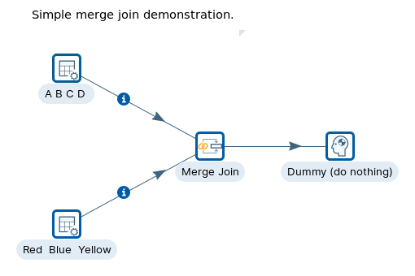
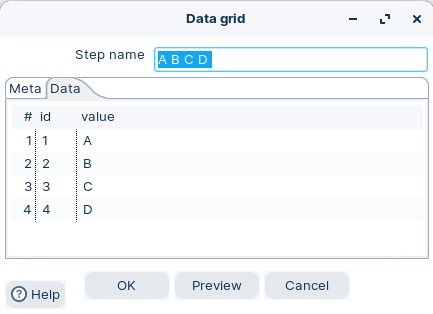
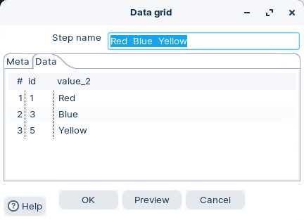
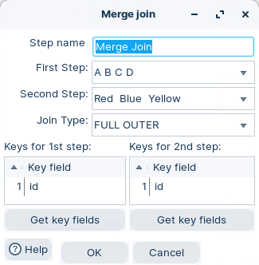
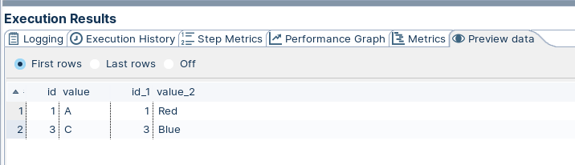
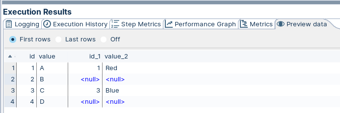
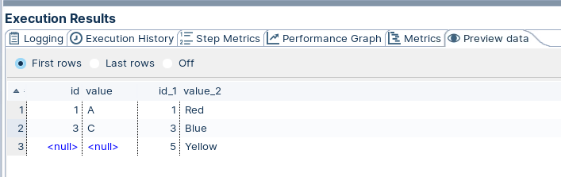
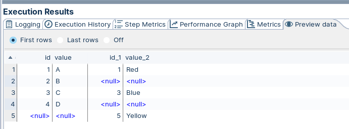

# Merge Join

> **Warning:**
>
> #### Workshop - Merge Join
> 
> A workshop to illustrate various SQL joins. The Merge Join step performs a classic merge join between data sets coming from two different input steps.
> 
> In this workshop, you run through the various join types available in the Merge Join step.
> 
> **What you'll do**
> 
> * Create static test data with two Data Grid steps
> * Join the two streams with Merge Join
> * Compare the INNER, LEFT OUTER, RIGHT OUTER, and FULL OUTER join types
> 
> **Prerequisites:** Understanding of basic transformation concepts (steps, hops, preview). Pentaho Data Integration installed and configured.
> 
> **Estimated time:** 20 minutes

<div class="pcm-embed-card" data-href="https://www.loom.com/share/cdbbff783c7549e09cf9fddef5ccefde" data-title="Optimizing Data Integration with Merge Join in Sales Analysis" data-description="In this video, I walk you through the process of loading our fact sales table at Steel Wheels, highlighting the importance of merging data from our fact inventory table to track item fulfillment schedules. We utilize a merge join step to correlate inventory counts with sales data, ensuring both datasets are sorted by item ID and date ID for accuracy. I demonstrate the configuration of the merge join, emphasizing that we are using an inner join for this scenario. Additionally, I explain how we calculate remaining inventory and add a primary key before inserting the data into our new fact sales table. Please ensure you have your incoming data sorted on the specified keys as we move forward with this process." data-thumb="../_assets/embeds/c78807f4adb4.png"></div>



> **Note:** **Create a new transformation**
> 
> Use any of these options to open a new transformation tab:
> 
> * Select **File** > **New** > **Transformation**
> * Use `Ctrl+N` (Windows/Linux) or `Cmd+N` (macOS)

:::: tabs

### 1. Data Grid

> **Note:**
>
> #### Data grid
> 
> The Data grid step allows you to enter a static list of rows in a grid. This is usually done for testing, reference or demo purposes.
> 
> Options
> 
> * Meta tab: You can specify the field metadata (output specification) of the data
> * Data tab: This grid contains the data. Everything is entered in String format so make sure you use the correct format masks in the metadata tab.

1. Start Pentaho Data Integration (Spoon).

> **Note:** 

::: tabs

### Windows (PowerShell)

> 
> ```powershell
> Set-Location C:\Pentaho\design-tools\data-integration
> .\spoon.bat
> ```
> 
>

### macOS / Linux

> 
> ```bash
> cd ~/Pentaho/design-tools/data-integration
> ./spoon.sh
> ```
> 
>

:::

<button data-launch="spoon" data-path="">Start PDI</button>

2. Drag the Data Grid step onto the canvas.
3. Open the Data Grid properties dialog box.
4. Ensure the following details are configured, as outlined below:

<div align="left"><figure><figcaption><p>ABCD - Data Grid</p></figcaption></figure> <figure><figcaption><p>Red Blue Yellow - data grid</p></figcaption></figure></div>

### 2. Merge Join

> **Note:**
>
> #### Merge Join
> 
> The Merge Join step performs a classic merge join between data sets with data coming from two different input steps. Join options include INNER, LEFT OUTER, RIGHT OUTER, and FULL OUTER.

1. Drag the Merge Join step onto the canvas.
2. Open the Merge Join properties dialog box.
3. Select various Join Types to view the resulting dataset

<figure><figcaption><p>Merge Join</p></figcaption></figure>

> **Warning:** Obviously you need to join on a unique key(s)

### 3. RUN

> **Note:**
>
> #### Run the transformation
> 
> Run the transformation locally and preview the result of each join type.

1. Click the Run button in the Canvas Toolbar.
2. Click on the Dummy step Preview tab:

**INNER Join**

<figure><figcaption><p>INNER Join</p></figcaption></figure>

**LEFT OUTER Join**

<figure><figcaption><p>LEFT OUTER Join</p></figcaption></figure>

**RIGHT OUTER Join**

<figure><figcaption><p>RIGHT OUTER Join</p></figcaption></figure>

**FULL OUTER Join**

<figure><figcaption><p>FULL OUTER Join</p></figcaption></figure>

> **Success:** You should see the four join types produce different result sets. Now give it a go with the 'Merge Streams' scenario.

::::

## Lab Files

Click a file to download. For `.ktr` and `.kjb` files, **Open in Pentaho Data Integration** launches PDI with the file loaded. If PDI is already running, the path is copied to your clipboard — switch to PDI and use Ctrl+O, Ctrl+V, Enter.

[description.txt](./files/description.txt)

[merged_orders.txt](./files/merged_orders.txt)

[orders.txt](./files/orders.txt)

[tr_merge_join_orders.ktr](./files/tr_merge_join_orders.ktr) <button data-launch="spoon" data-path="files/tr_merge_join_orders.ktr">Open in Pentaho Data Integration</button> <button data-graph="files/tr_merge_join_orders.ktr">View graph</button>

[tr_merge_join_overview.ktr](./files/tr_merge_join_overview.ktr) <button data-launch="spoon" data-path="files/tr_merge_join_overview.ktr">Open in Pentaho Data Integration</button> <button data-graph="files/tr_merge_join_overview.ktr">View graph</button>
