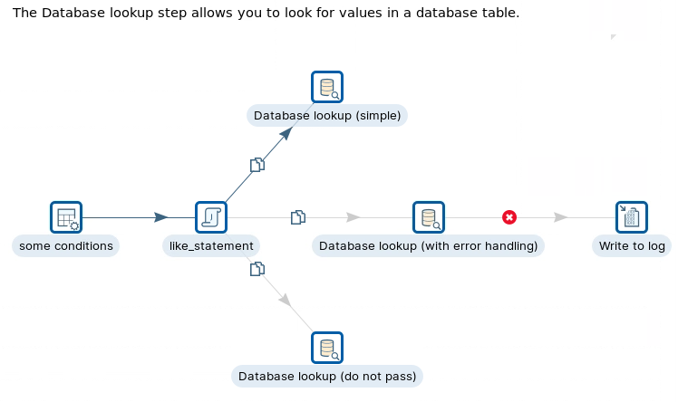
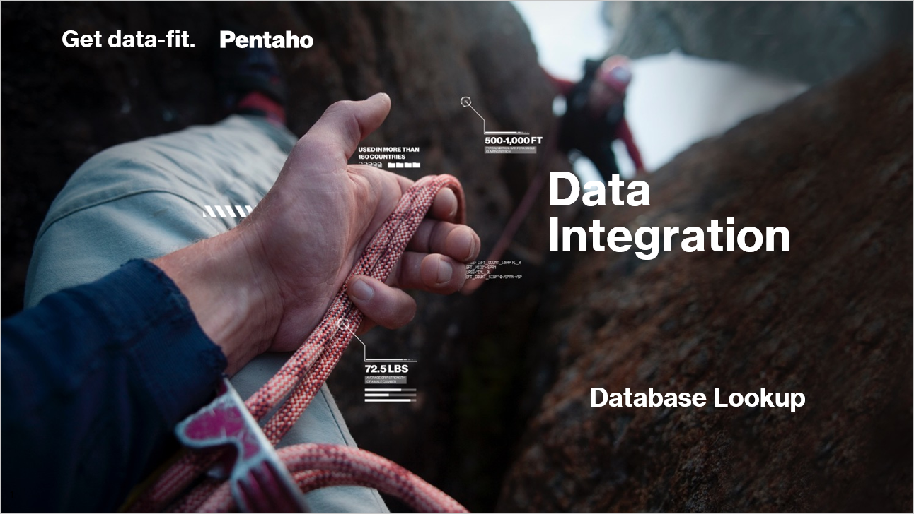
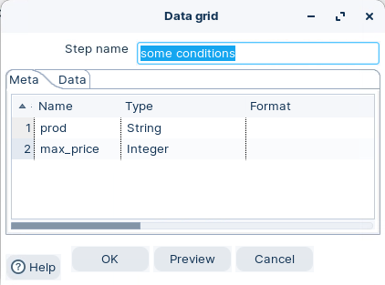
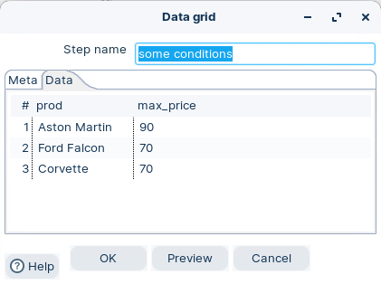
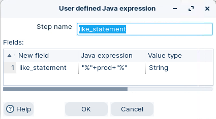
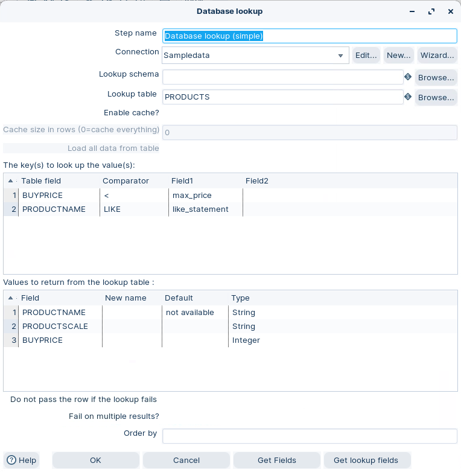
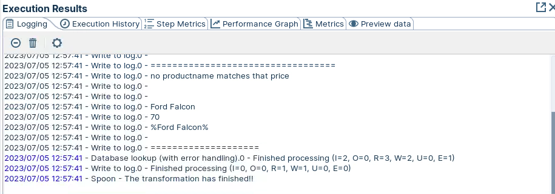
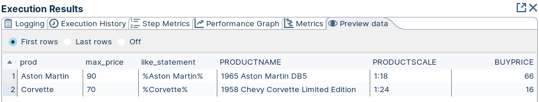

# Database Lookups

> **Warning:**
>
> #### Workshop - Database Lookups
> 
> The Database lookup step allows you to look for values in a database table. Lookup values are added as new fields onto the stream.
> 
> In this workshop, you build a transformation that looks up product values in a database table and explores the step's simple lookup, error handling, and multiple-result options.
> 
> **What you'll do**
> 
> * Build a test dataset with Data Grid
> * Construct a LIKE search pattern with User Defined Java Expression
> * Configure a simple Database lookup to add new fields onto the stream
> * Enable error handling to route failed lookups to a log
> * Handle multiple results with the Do not pass and Fail on multiple results options
> 
> **Prerequisites:** Understanding of basic transformation concepts (steps, hops, preview). Pentaho Data Integration installed and configured.
> 
> **Estimated time:** 30 minutes



<figure><figcaption><p>Database Lookup</p></figcaption></figure>

> **Note:** **Create a new transformation**
> 
> Use any of these options to open a new transformation tab:
> 
> * Select **File** > **New** > **Transformation**
> * Use `Ctrl+N` (Windows/Linux) or `Cmd+N` (macOS)

:::: tabs

### 1. Data Grid

> **Note:**
>
> #### Data grid
> 
> The Data Grid step allows you to enter a static list of rows in a grid. This is usually done for testing, reference or demo purposes.

1. Start Pentaho Data Integration (Spoon).

> **Note:** 

::: tabs

### Windows (PowerShell)

> 
> ```powershell
> Set-Location C:\Pentaho\design-tools\data-integration
> .\spoon.bat
> ```
> 
>

### macOS / Linux

> 
> ```bash
> cd ~/Pentaho/design-tools/data-integration
> ./spoon.sh
> ```
> 
>

:::

<button data-launch="spoon" data-path="">Start PDI</button>

2. Drag the Data Grid step onto the canvas.
3. Open the Data grid properties dialog box.
4. Ensure the following details are configured, as outlined below:

<div><figure><figcaption><p>Data grid - Meta</p></figcaption></figure> <figure><figcaption><p>Data grid - Data</p></figcaption></figure></div>

### 2. UDJE

> **Note:**
>
> #### User defined Java expression
> 
> The User Defined Java Expression step in Pentaho Data Integration allows you to write custom Java code that executes on each row of your data transformation. This step is useful when you need to perform complex calculations or data manipulations that aren't possible with PDI's standard steps.
> 
> You can access field values using the `get("fieldname")` method and create multiple expressions within a single step. Each expression produces a new output field in your data stream. The step handles type conversion automatically, making it flexible for various data operations.
> 
> Common uses include mathematical calculations, string manipulations, conditional logic, and date transformations. It's particularly valuable when you need Java-specific functionality or want to simplify your transformation by replacing multiple basic steps with a single, powerful Java expression.

1. Drag the User Defined Java expression step onto the canvas.
2. Open the User defined Java expression properties dialog box.
3. Ensure the following details are configured, as outlined below:

<figure><figcaption><p>UDJE - like statement</p></figcaption></figure>

> **Note:** The LIKE operator is used in a WHERE clause to search for a specified pattern in a column.

### 3. Database Lookup

> **Note:**
>
> #### Database lookup
> 
> The Database lookup step has 3 options

::: tabs

### 3.1 Simple

> **Note:**
>
> #### Simple Lookup
> 
> The Database lookup step allows you to look up values in a database table. Lookup values are added as new fields onto the stream.

1. Drag the Data Grid step onto the canvas.
2. Open the Data grid properties dialog box.
3. Ensure the following details are configured, as outlined below:

<figure><figcaption><p>Dtabase lookup - simple</p></figcaption></figure>

> **Note:** The ‘key’ fields are where you specify the conditions. Each row in the grid represents a comparison between a column in the table, and a field in your stream, by using one of the provided comparators.
> 
> In this example:
> 
> WHERE PRODUCTNAME LIKE '%Aston Martin%' AND BUYPRICE < 90 WHERE PRODUCTNAME LIKE '%'Ford Falcon%' AND BUYPRICE < 70 WHERE PRODUCTNAME LIKE '%Corvette'%' AND BUYPRICE < 70

> **Note:** The Database lookup step allow us to retrieve any number of columns based on the search criteria. Each database column you enter in the lower grid will become a new field in your dataset.
> 
> You can rename them (this is particularly useful if you already have a field with the same name) and supply a default value if no record is found in the search. In the workflow, you added three fields: PRODUCTNAME, PRODUCTSCALE, and BUYPRICE.
> 
> For values where there’s no match for PRODUCTNAME, ‘not available’ is returned. In the Preview, notice there are no PRODUCTNAMES that match %Ford Falcon% where the max price is less than the max price of 70.

> **Under the hood:**
>
> #### Cache off: one query per row. Cache on: one query, then a hash table
>
> As configured, **Database lookup** prepared `SELECT PRODUCTNAME,
> PRODUCTSCALE, BUYPRICE FROM PRODUCTS WHERE PRODUCTNAME LIKE ? AND
> BUYPRICE < ?` once and executed it for every incoming row, taking
> the first row the database returned and appending its columns (or
> your defaults) to the stream. Three rows, three round trips —
> harmless here, ruinous at a million.
>
> **Enable cache?** changes the engine, not the SQL: results are kept
> in an in-memory map keyed on the lookup values, so a repeated key
> costs a hash probe instead of a query. **Load all data from table**
> goes further and reads the whole table once at start-up, after which
> the database is never asked again — but it needs every comparison to
> be `=`, which a `LIKE` or a `<` is not, and that is why both are off
> in this workshop.
>
> **Why it matters:** the same step is a per-row query or an in-memory
> join depending on two checkboxes. For a dimension that fits in RAM,
> "load all" turns an hour into seconds.

### 3.2 Error Handling

> **Note:** In this workflow, error handling has been enabled, with a write to log step.

1. To see this in action, disable the Hops to Database Lookup (simple) and Database Lookup (do not pass).
2. The error message is written out in the Logging output.

<figure><figcaption><p>Logging Results</p></figcaption></figure>

3. Preview the Database Lookup (with error handling) step.

<figure><figcaption><p>Database lookup - erorr handling</p></figcaption></figure>

> **Note:** The rows for which the lookup fails, go directly to the stream that captures the error, in this case, the ‘Write to log’ step.

### 3.3 Do not pass

> **Note:** Taking some action when there are too many results The Database lookup step is meant to retrieve just one row of the table for each row in your dataset. If the search finds more than one row, the following two things may happen:
> 
> 1. If you check the Fail on multiple results? option, the rows for which the lookup retrieves more than one row will cause the step to fail. In that case, in the Logging tab window, you will see an error similar to the following: ...
> 
> \- Database lookup (fail on multiple res.).0 – ERROR... Because of an error, this step can't continue:
> 
> \- Database lookup (fail on multiple res.).0 – ERROR: Only 1 row was expected as a result of a lookup, and at least 2 were found! Then you can decide whether you want to leave the transformation or capture the error.
> 
> 2. If you don't check the Fail on multiple results? option, the step will return the first row it encounters. You can decide which one to return by specifying the order. You do that by typing an order clause in the Order by textbox. In the Sampledata database, there are three products that meet the conditions for the Corvette row. If, for Order by, you type PRODUCTSCALE DESC, PRODUCTNAME, then you will get 1958 Chevy Corvette Limited Edition, which is the first product after ordering the three found products by the specified criterion.
> 
> If, instead of taking some of those actions, you realize that you need all the resulting rows, you should take another approach—replace the Database lookup step with a Database join or a Dynamic SQL row step.
> 
> Compare this with the Database Join
> 
> As the database join is a full outer, all the records are returned from the database table, rather than just return a single lookup reference value.

:::

::::

## Lab Files

Click a file to download. For `.ktr` and `.kjb` files, **Open in Pentaho Data Integration** launches PDI with the file loaded. If PDI is already running, the path is copied to your clipboard — switch to PDI and use Ctrl+O, Ctrl+V, Enter.

[tr_database_lookup.ktr](./files/tr_database_lookup.ktr) <button data-launch="spoon" data-path="files/tr_database_lookup.ktr">Open in Pentaho Data Integration</button> <button data-graph="files/tr_database_lookup.ktr">View graph</button>
