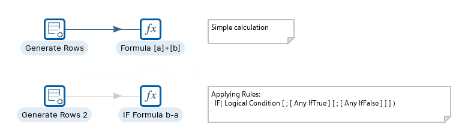
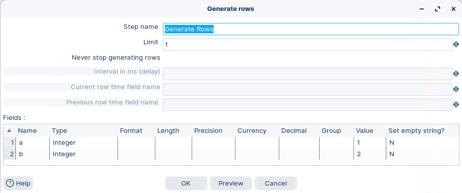
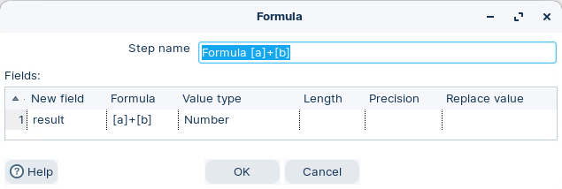
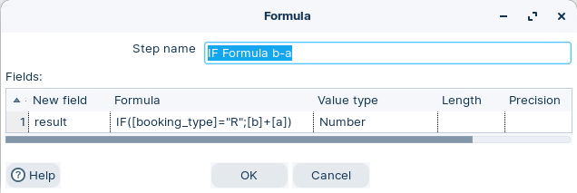

# Formula

> **Warning:**
>
> #### Workshop - Formula
> 
> The Formula step in Pentaho Data Integration (PDI) lets you create new fields or modify existing ones using mathematical expressions, string manipulations, and logical operations.
> 
> In this workshop, you generate test rows and use the Formula step to build calculated fields with both simple arithmetic and conditional business logic.
> 
> **What you'll do**
> 
> * Generate test data with Generate rows
> * Build a simple calculation with the Formula step
> * Add conditional business logic with an IF formula
> * Reference data stream fields using the `[data field]` syntax
> 
> **Prerequisites:** Understanding of basic transformation concepts (steps, hops, preview). Pentaho Data Integration installed and configured.
> 
> **Estimated time:** 20 minutes



> **Note:** **Create a new transformation**
> 
> Use any of these options to open a new transformation tab:
> 
> * Select **File** > **New** > **Transformation**
> * Use `Ctrl+N` (Windows/Linux) or `Cmd+N` (macOS)

:::: tabs

### 1. Generate rows

> **Note:**
>
> #### Generate rows
> 
> Generate rows outputs a specified number of rows. By default, the rows are empty; however, they can contain several static fields. This step is used primarily for testing purposes. It may be useful for generating a fixed number of rows, for example, you want exactly 12 rows for 12 months.
> 
> Sometimes you may use Generate Rows to generate one row that is an initiating point for your transformation. For example, you might generate one row that contains two or three field values that you might use to parameterize your SQL and then generate the real rows.
> 
> Used to generate some testing data:
> 
> a = 1
> 
> b = 2
> 
> booking\_type = R

1. Start Pentaho Data Integration (Spoon).

> **Note:** 

::: tabs

### Windows (PowerShell)

> 
> ```powershell
> Set-Location C:\Pentaho\design-tools\data-integration
> .\spoon.bat
> ```
> 
>

### macOS / Linux

> 
> ```bash
> cd ~/Pentaho/design-tools/data-integration
> ./spoon.sh
> ```
> 
>

:::

<button data-launch="spoon" data-path="">Start PDI</button>

2. Drag **Generate rows** onto the canvas.
3. Double-click the step. Configure it like this:

<figure><figcaption><p>Generate rows</p></figcaption></figure>

### 2. Formula

> **Note:**
>
> #### Formula
> 
> The Formula step can calculate Formula Expressions within a data stream. It can be used to create simple calculations like \[A]+\[B] or more complex business logic with a lot of nested if / then logic.

**Workflow 1**

Simple formula: result = \[a] + \[b]

<figure><figcaption><p>Formula - [a]+[b]</p></figcaption></figure>

**Workflow 2**

Logic: result = IF(\[booking\_type]=”R”;\[b]-\[a])

<figure><figcaption><p>Formula - IF([booking_type]=”R”;[b]-[a])</p></figcaption></figure>

> **Note:** The data stream fields are referenced with the syntax: \[data field]

> **Under the hood:**
>
> #### Same formula engine as Pentaho Reporting, parsed once per run
>
> The **Formula** step doesn't interpret your text row by row. At
> start-up it hands each expression to LibFormula — the OpenFormula
> engine that also powers Pentaho Report Designer — which parses it
> into an expression tree once. Per row the engine binds `[a]`, `[b]`
> and `[booking_type]` to the current row's values by name, walks the
> tree, and writes the result into the output field with the type it
> inferred (or the one you set).
>
> Because the parse happens at initialisation, a typo in a formula
> fails the step before a single row moves, not on row 40,000. And
> because it is OpenFormula, the function catalogue — `IF`, `AND`,
> `OR`, `CONCATENATE`, `ROUND`, `TODAY` — is the spreadsheet vocabulary
> your analysts already know, not a programming language.
>
> **Why it matters:** most business logic — conditional pricing,
> derived flags, string assembly — fits in a Formula step with no
> JavaScript and no Java, and runs a good deal faster than a script
> would.

<div class="pcm-embed-card" data-href="http://docs.oasis-open.org/office/v1.2/OpenDocument-v1.2-part2.html" data-title="**🎥 Embed:** [View external resource"></div>
Link to OASIS Open Document Format](<http://wiki.pentaho.com/display/Reporting/Formula+Expressions>)

::::

## Lab Files

Click a file to download. For `.ktr` and `.kjb` files, **Open in Pentaho Data Integration** launches PDI with the file loaded. If PDI is already running, the path is copied to your clipboard — switch to PDI and use Ctrl+O, Ctrl+V, Enter.

[tr_formula.ktr](./files/tr_formula.ktr) <button data-launch="spoon" data-path="files/tr_formula.ktr">Open in Pentaho Data Integration</button> <button data-graph="files/tr_formula.ktr">View graph</button>
