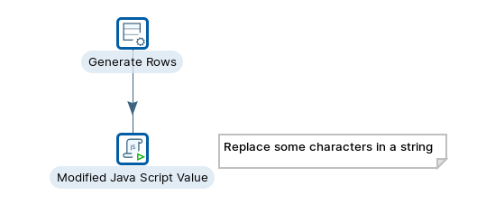
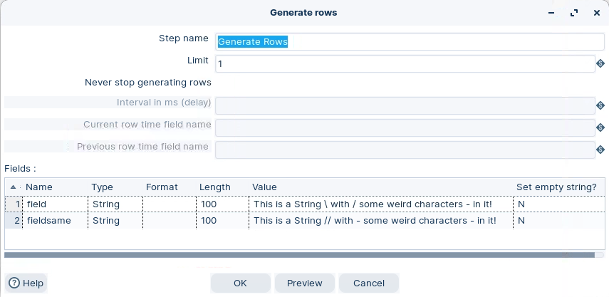
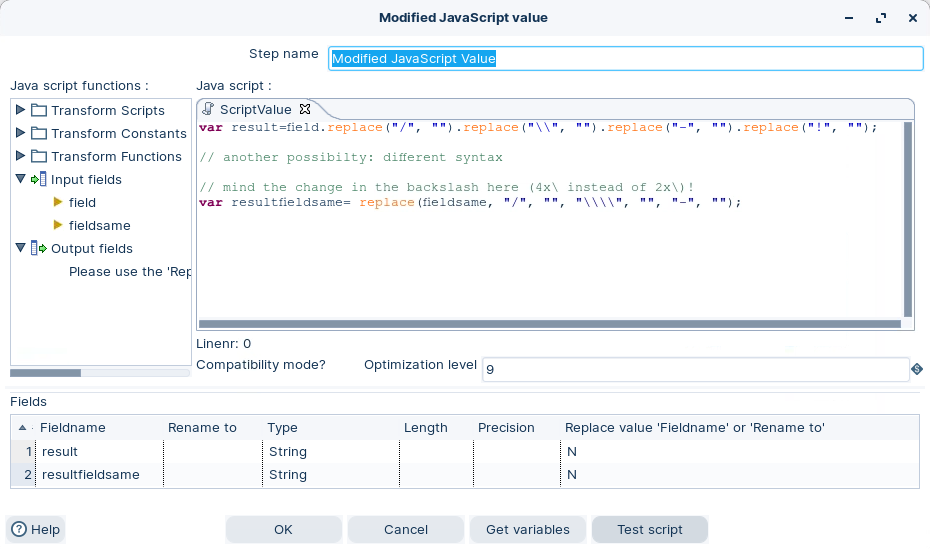

# Modified JavaScript Value

> **Warning:**
>
> #### Workshop - Modified JavaScript value
> 
> The Modified Java Script Expression step lets you execute custom JavaScript code to transform and manipulate data within a transformation. It provides a powerful scripting environment for calculations, validations, string manipulations, and conditional logic that standard steps cannot easily achieve.
> 
> In this workshop, you generate sample rows and run them through a Modified JavaScript Value step to produce new and modified output fields.
> 
> **What you'll do**
> 
> * Generate synthetic test data with Generate rows
> * Write custom JavaScript to transform the rows with Modified JavaScript Value
> * Map script variables to output stream fields
> 
> **Prerequisites:** Understanding of basic transformation concepts (steps, hops, preview). Pentaho Data Integration installed and configured.
> 
> **Estimated time:** 20 minutes



> **Note:** **Create a new transformation**
> 
> Use any of these options to open a new transformation tab:
> 
> * Select **File** > **New** > **Transformation**
> * Use `Ctrl+N` (Windows/Linux) or `Cmd+N` (macOS)

:::: tabs

### 1. Generate rows

> **Note:**
>
> #### Generate rows
> 
> The Generate Rows step is a data generation component that creates synthetic data rows based on user-defined specifications. This step allows you to generate test data, sample datasets, or placeholder records by defining field names, data types, and value ranges or patterns.
> 
> You can specify how many rows to generate and configure various parameters like random number ranges, date intervals, or fixed values for each field. It's particularly useful for testing transformations, creating mock data for development purposes, or generating large datasets for performance testing without requiring an external data source.

1. Start Pentaho Data Integration (Spoon).

> **Note:** 

::: tabs

### Windows (PowerShell)

> 
> ```powershell
> Set-Location C:\Pentaho\design-tools\data-integration
> .\spoon.bat
> ```
> 
>

### macOS / Linux

> 
> ```bash
> cd ~/Pentaho/design-tools/data-integration
> ./spoon.sh
> ```
> 
>

:::

<button data-launch="spoon" data-path="">Start PDI</button>

2. Drag **Generate rows** onto the canvas.
3. Double-click the step. Configure it like this:

<figure><figcaption><p>Generate rows</p></figcaption></figure>

### 2. Modified JavaScript Value

> **Note:**
>
> #### Modified JavaScript value
> 
> The Modified JavaScript value step provides a user interface for building JavaScript expressions that you can use to modify your data. The code you type in the script area is executed once for each input row.
> 
> * The transform allows multiple scripts in a single transform instance.
> * The JavaScript step is not an input step and therefore requires an input stream from the pipeline.

<figure><figcaption><p>Modified JavaScript value</p></figcaption></figure>

> **Note:** Here the name of the var = name of output data stream field. In some cases you will need to 'escape' the character.

::::

## Lab Files

Click a file to download. For `.ktr` and `.kjb` files, **Open in Pentaho Data Integration** launches PDI with the file loaded. If PDI is already running, the path is copied to your clipboard — switch to PDI and use Ctrl+O, Ctrl+V, Enter.

[tr_mjv.ktr](./files/tr_mjv.ktr) <button data-launch="spoon" data-path="files/tr_mjv.ktr">Open in Pentaho Data Integration</button> <button data-graph="files/tr_mjv.ktr">View graph</button>
