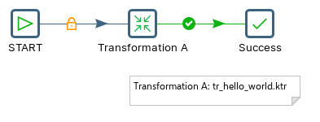
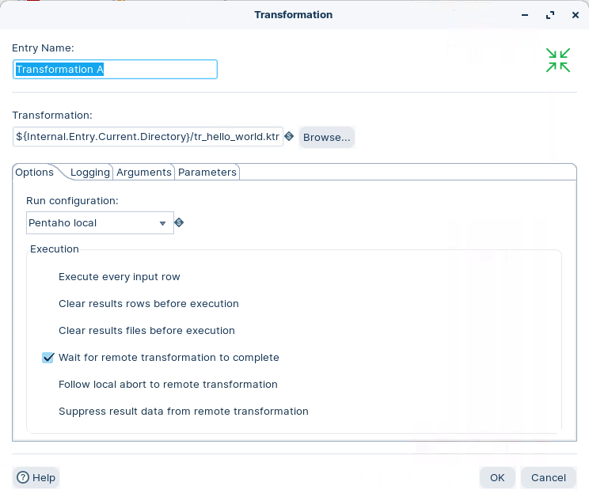
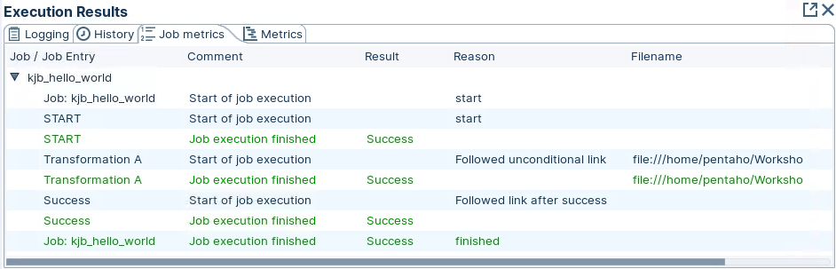
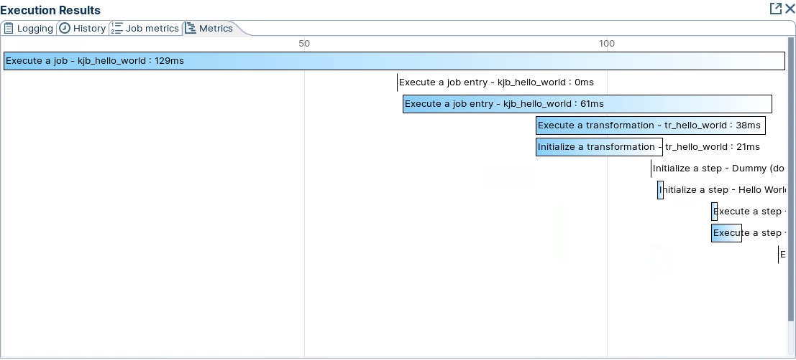

# Job - Hello World

> **Warning:**
>
> #### Workshop - Hello World (Job)
> 
> A job orchestrates the order of execution. It chains together transformations and other entries to build a repeatable process.
> 
> In this workshop, you build a simple job that runs a transformation and forces a success state.
> 
> **What you'll do**
> 
> * Add a START entry to define the job's starting point
> * Run a previously defined transformation with the Transformation entry
> * Force a success state with the Success entry
> * Run the job and review the Job Metrics
> 
> **Prerequisites:** Understanding of basic transformation concepts (steps, hops, preview). Pentaho Data Integration installed and configured.
> 
> **Estimated time:** 20 minutes



> **Note:** **Create a new job**
> 
> Use any of these options to open a new job tab:
> 
> * Select **File** > **New** > **Job**
> * Use `Ctrl+Alt+N` (Windows/Linux) or `Cmd+Alt+N` (macOS)

:::: tabs

### 1. START

> **Note:**
>
> #### START
> 
> START defines the starting point for job execution. Every job must have one (and only one) Start. Unconditional job hops only are available from a Start job entry. The start job entry settings contain basic scheduling functionality; however, scheduling is not persistent and is only available while the device is running.
> 
> The Data Integration Server provides a more robust option for scheduling execution of jobs and transformations and is the preferred alternative to scheduling using the Start step. If you want the job to run like a daemon process, however, enable Repeat in the job settings dialog box.
> 
> Note: The basic scheduling functionality and the repeat option are only functional within the main job and not within a sub job.

1. Start Pentaho Data Integration (Spoon).

> **Note:** 

::: tabs

### Windows (PowerShell)

> 
> ```powershell
> Set-Location C:\Pentaho\design-tools\data-integration
> .\spoon.bat
> ```
> 
>

### macOS / Linux

> 
> ```bash
> cd ~/Pentaho/design-tools/data-integration
> ./spoon.sh
> ```
> 
>

:::

<button data-launch="spoon" data-path="">Start PDI</button>

2. In Spoon, click File > New > Job.
3. Drag the ‘START’ job entry onto the canvas.

### 2. Transformation A

> **Note:**
>
> #### Transformation A
> 
> The Transformation job entry is used to execute a previously defined transformation. For ease of use, it is also possible to create a new transformation within the dialog, pressing the New Transformation button.

1. Drag the ‘Transformation’ job entry onto the canvas.
2. Double-click on the step, and configure the following properties:

<figure><figcaption><p>Configure Transformation Job Entry</p></figcaption></figure>

### 3. Success

> **Note:**
>
> #### Success
> 
> This step clears any error state encountered in a job and forces it to a success state.

1. Drag the ‘Success’ job entry onto the canvas.

### 4. RUN

> **Note:**
>
> #### Run the job
> 
> Run the job locally and review the Job Metrics.

1. Click the Run button in the Canvas Toolbar.
2. Click on the Job Metrics tab.

<figure><figcaption><p>Job Metrics</p></figcaption></figure>

> **Note:** The Job Entries are executed sequentially.

<figure><figcaption><p>Metrics</p></figcaption></figure>

> **Success:** The job runs each entry in sequence and finishes in a success state.

> **Under the hood:**
>
> #### A job runs one entry at a time; a transformation runs every step at once
>
> This is a different engine. Where a transformation starts every step
> on its own thread and streams rows between them, a job walks its
> entries **in sequence** on a single thread: START, then the
> **Transformation** entry, then **Success**. Each entry returns a
> *result* — success or failure, plus row and file lists — and the hop
> colours are conditions on that result: green follows success, red
> follows failure, black follows regardless.
>
> The Transformation entry did something more. It loaded
> `tr_hello_world.ktr`, spun up the full multithreaded transformation
> engine inside the job, waited for it to finish, and turned its
> outcome into the entry's result. **Success** then forced the job's
> final state to success no matter what came before.
>
> **Why it matters:** this split is PDI's design rule. Rows and data
> logic belong in transformations; ordering, conditions, retries and
> notifications belong in jobs. Mix them and you fight the engine;
> keep them apart and each stays simple.

::::

## Lab Files

Click a file to download. For `.ktr` and `.kjb` files, **Open in Pentaho Data Integration** launches PDI with the file loaded. If PDI is already running, the path is copied to your clipboard — switch to PDI and use Ctrl+O, Ctrl+V, Enter.

[kjb_hello_world.kjb](./files/kjb_hello_world.kjb) <button data-launch="spoon" data-path="files/kjb_hello_world.kjb">Open in Pentaho Data Integration</button> <button data-graph="files/kjb_hello_world.kjb">View graph</button>

[tr_hello_world.ktr](./files/tr_hello_world.ktr) <button data-launch="spoon" data-path="files/tr_hello_world.ktr">Open in Pentaho Data Integration</button> <button data-graph="files/tr_hello_world.ktr">View graph</button>
