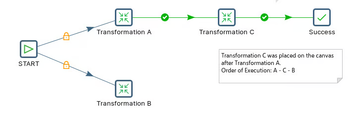
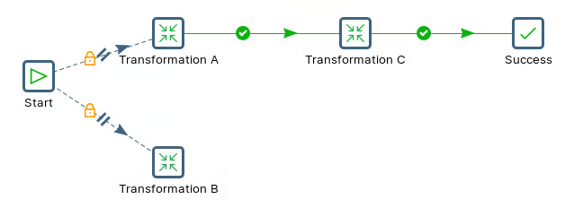

# Order of Execution

> **Warning:**
>
> #### Workshop - Order of Execution
> 
> When a job entry has two hops leaving it, which branch runs first, and does the second wait for the first? This workshop builds one job, runs it, reads the order from the log, then switches the same job to run its branches in parallel.
> 
> **What you'll do**
> 
> * Build a job with two branches from START
> * Read the execution order from the log
> * Run the branches in parallel with **Run Next Entries in Parallel**
> * See what parallel does, and doesn't, guarantee
> 
> **Prerequisites:** Complete **[Hello World Job](../29-mod5-hello-world-job/guide.md)**; this lab reuses its `tr_hello_world.ktr`.
> 
> **Estimated time:** 15 minutes

:::: tabs

### 1. Build the job

1. Select **File** > **New** > **Job** (`Ctrl+Alt+N`), and save it as `kjb_hello_world_backward.kjb` in the folder that holds `tr_hello_world.ktr`.
2. Drag **START** onto the canvas, then three **Transformation** entries, named `Transformation A`, `Transformation B` and `Transformation C`, and a **Success** entry.
3. In each Transformation entry set the transformation file to `${Internal.Entry.Current.Directory}/tr_hello_world.ktr`.
4. Create the hops, in this order:
   * START to Transformation A
   * START to Transformation B
   * Transformation A to Transformation C
   * Transformation C to Success

<figure><figcaption><p>Two branches from START</p></figcaption></figure>

The hops from START are unconditional (a lock icon); the others are green: they follow only on success.

### 2. Run it and read the order

1. Select **Run**.
2. Open the **Logging** tab of **Execution Results**. The entries start in this order:

```text
Starting entry [Transformation A]
Starting entry [Transformation C]
Starting entry [Success]
Starting entry [Transformation B]
```

Transformation B is the second hop out of START, yet it starts last, after the whole A, C, Success branch has finished.

> **Under the hood:**
>
> #### A job walks one branch to its end before it takes the next
>
> A job runs on a single thread and follows its hops depth-first. From
> START it takes the first hop to Transformation A, runs it, follows
> A's hop to C, runs that, then Success. Only when that branch has no
> further hops does it come back to START and take the next hop, to
> Transformation B.
>
> "First" means the order the hops are stored in the job, which is
> broadly the order you drew them. It is not left-to-right or
> top-to-bottom on the canvas, so two jobs that look the same can run
> in different orders.
>
> **Why it matters:** never rely on drawing order for anything that
> must happen in sequence. If B needs A's output, put B *after* A on
> the same branch.

### 3. Run the branches in parallel

1. Save the job as `kjb_hello_world_parallel.kjb`.
2. Right-click **START** and select **Run Next Entries in Parallel**. Read the warning and select **I understand**. The hops from START turn dashed with a parallel marker.

<figure><figcaption><p>Run Next Entries in Parallel on START</p></figcaption></figure>

3. Run the job. In the log, Transformation A and Transformation B now start together:

```text
Starting entry [Transformation A]
Starting entry [Transformation B]
Starting entry [Transformation C]
Starting entry [Success]
```

> **Under the hood:**
>
> #### Parallel applies to everything after the entry, not just the next hop
>
> With the option on, the job starts each branch from START on its own
> thread, so A and B run at the same time. The setting carries on down
> each branch: everything after START is now launched in parallel, not
> only the next entries, which is what the hop's tooltip warns about.
> To go back to running one entry at a time after a parallel split,
> put the parallel part in a sub-job.
>
> The warning is serious: PDI does no locking between parallel
> branches. Two branches writing the same file or table can interfere.
>
> **Why it matters:** parallel branches save time when the work is
> independent, such as loading three unrelated staging tables. When
> one branch needs another's result, keep them serial.

::::

## Lab Files

Click a file to download. For `.ktr` and `.kjb` files, **Open in Pentaho Data Integration** launches PDI with the file loaded. If PDI is already running, the path is copied to your clipboard — switch to PDI and use Ctrl+O, Ctrl+V, Enter.

### Solution <!-- no-step -->

The two finished jobs and the transformation they run. Run each and compare the order of the `Starting entry` lines in the log.

Also on disk at `C:\Workshop-DI-Practitioner\05-enterprise-solution\01-jobs\30-mod5-order-of-execution\solution`.

[kjb_hello_world_backward.kjb](./files/kjb_hello_world_backward.kjb) <button data-launch="spoon" data-path="files/kjb_hello_world_backward.kjb">Open in Pentaho Data Integration</button> <button data-graph="files/kjb_hello_world_backward.kjb">View graph</button>

[kjb_hello_world_parallel.kjb](./files/kjb_hello_world_parallel.kjb) <button data-launch="spoon" data-path="files/kjb_hello_world_parallel.kjb">Open in Pentaho Data Integration</button> <button data-graph="files/kjb_hello_world_parallel.kjb">View graph</button>

[tr_hello_world.ktr](./files/tr_hello_world.ktr) <button data-launch="spoon" data-path="files/tr_hello_world.ktr">Open in Pentaho Data Integration</button> <button data-graph="files/tr_hello_world.ktr">View graph</button>
