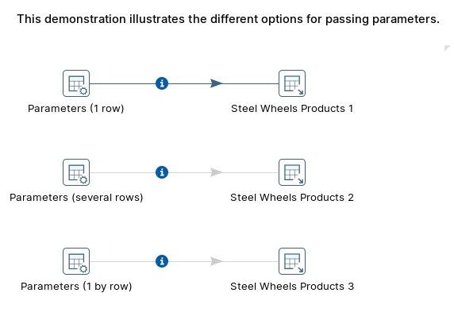
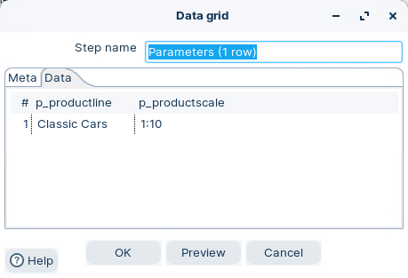
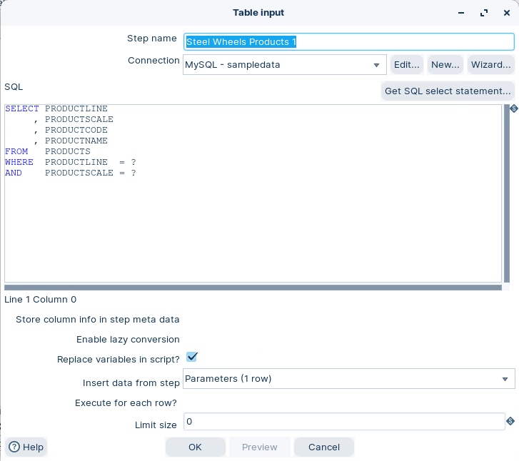
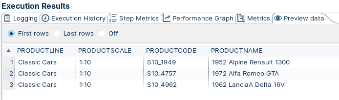
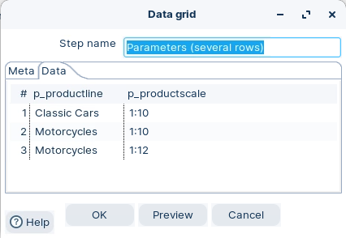
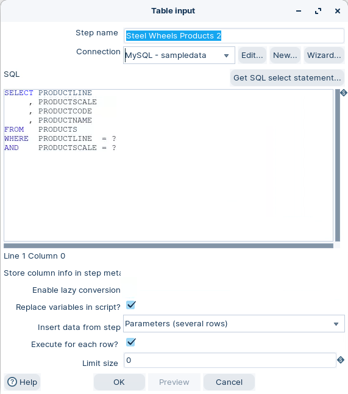
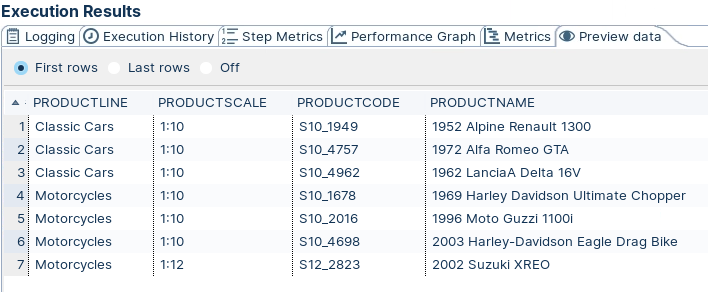
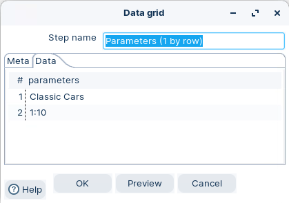
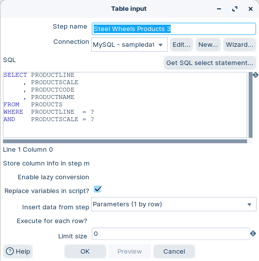

# Parameters

> **Warning:**
>
> #### Workshop - Parameters
> 
> Most of the time you need flexible queries—queries that receive parameters. This workshop shows you how to pass parameters to a SELECT statement in PDI to list all products in Steel Wheels for a given product line and scale.
> 
> In this workshop, you build a transformation that drives a parameterized Table input query from a Data grid, using three different ways of supplying the parameter values.
> 
> **What you'll do**
> 
> * Pass parameters to a Table input query as a single row
> * Pass several rows of parameters in one run
> * Pass parameter values one parameter per row
> * Preview the results for each approach
> 
> **Prerequisites:** Understanding of basic transformation concepts (steps, hops, preview). Pentaho Data Integration installed and configured.
> 
> **Estimated time:** 20 minutes

<div class="pcm-embed-card" data-href="https://www.loom.com/share/6b3348c091764d08806280206bd53434?hideEmbedTopBar=true&amp;hide_owner=true&amp;hide_share=true&amp;hide_title=true" data-title="Defining Parameters in Transformations for Effective Data Management 📊" data-description="In this video, I demonstrate how to define parameters within a transformation using Spoon, highlighting their role as local variables compared to global variables. I walk you through viewing the current parameters and variables in memory, and I create two parameters: one for the delimiter character and another for the output file's extension. It's crucial to provide default values and descriptions for these parameters to avoid potential issues. I also explain how a parameter can override a variable if they share the same name. Please pay attention to these concepts, as they will be applied in the next demonstration video." data-thumb="../_assets/embeds/b2f0f621a6fd.png"></div>



> **Note:** If you need to create a dataset with data coming from a database, you can do it just by using a Table Input step.
> 
> If the SELECT statement that retrieves the data doesn't need parameters, you simply write it in the Table Input setting window and proceed.
> 
> However, most of the times you need flexible queries—queries that receive parameters.

> **Note:** **Create a new transformation**
> 
> Use any of these options to open a new transformation tab:
> 
> * Select **File** > **New** > **Transformation**
> * Use `Ctrl+N` (Windows/Linux) or `Cmd+N` (macOS)

:::: tabs

### 1. Parameters (1 row)

> **Note:**
>
> #### Parameters (1 row)
> 
> As we're passing the parameters in a single row, we have to careful and ensure the datastream fields are mapped in the correct order according to the WHERE clause.

1. Start Pentaho Data Integration (Spoon).

> **Note:** 

::: tabs

### Windows (PowerShell)

> 
> ```powershell
> Set-Location C:\Pentaho\design-tools\data-integration
> .\spoon.bat
> ```
> 
>

### macOS / Linux

> 
> ```bash
> cd ~/Pentaho/design-tools/data-integration
> ./spoon.sh
> ```
> 
>

:::

<button data-launch="spoon" data-path="">Start PDI</button>

2. Open the Data grid step: Parameters (1 row).

<figure><figcaption><p>Data grid - Parameters (1 row)</p></figcaption></figure>

3. Open the Table input step - Steel Wheels Products 1.

<figure><figcaption><p>Table input - parameters ? - single row</p></figcaption></figure>

> **Warning:** * The replacement of the markers respects the order of the incoming fields.
> * Any values that are used in this manner are consumed by the Table Input step. Finally, it's important to note that question marks can only be used to parameterize value expressions just as you did in the recipe.
> * Keywords or identifiers (for example; table names) cannot be parameterized with the question marks method.

<figure><figcaption><p>Preview data - Parameters (1 row)</p></figcaption></figure>

### 2. Parameters (several rows)

> **Note:**
>
> #### Parameters (several rows)
> 
> Suppose that you not only want to list the Classic Cars in 1:10 scale, but also the Motorcycles in 1:10 and 1:12 scales. You don't have to run the transformation three times in order to do this. You can have a dataset with three rows, one for each set of parameters.

1. Open the Data grid step: Parameters (several rows).

<figure><figcaption><p>Data grid - Parameters (serveral rows)</p></figcaption></figure>

2. Open the Table input step - Steel Wheels Products 2.

<figure><figcaption><p>Table input - parameters ? - several rows</p></figcaption></figure>

> **Warning:** * The replacement of the markers respects the order of the incoming fields.
> * Any values that are used in this manner are consumed by the Table Input step. Finally, it's important to note that question marks can only be used to parameterize value expressions just as you did in the recipe.
> * Keywords or identifiers (for example; table names) cannot be parameterized with the question marks method.

<figure><figcaption><p>Preview data - Parameters (serveral rows)</p></figcaption></figure>

### 3. Parameters (1 by row)

> **Note:**
>
> #### Parameters (1 by row)
> 
> It's also possible to receive the parameter values in several rows. Instead of a row, you had one parameter by row.

1. Open the Data grid step: Parameters (several rows).

<figure><figcaption><p>Data grid - Parameters (1 by row)</p></figcaption></figure>

2. Open the Table input step - Steel Wheels Products 3.

<figure><figcaption><p>Table input - parameters ? - 1 by row</p></figcaption></figure>

> **Warning:** * The replacement of the markers respects the order of the incoming fields.
> * Any values that are used in this manner are consumed by the Table Input step. Finally, it's important to note that question marks can only be used to parameterize value expressions just as you did in the recipe.
> * Keywords or identifiers (for example; table names) cannot be parameterized with the question marks method.

<figure><figcaption><p>Preview data - Parameters (1 by row)</p></figcaption></figure>

> **Note:** Note that this approach is less flexible than the Parameters (1 row). For example, if you have to provide values for parameters with different data types, you will not be able to put them in the same column and different rows.

::::

## Lab Files

Click a file to download. For `.ktr` and `.kjb` files, **Open in Pentaho Data Integration** launches PDI with the file loaded. If PDI is already running, the path is copied to your clipboard — switch to PDI and use Ctrl+O, Ctrl+V, Enter.

[tr_parameters_variables_orders.ktr](./files/tr_parameters_variables_orders.ktr) <button data-launch="spoon" data-path="files/tr_parameters_variables_orders.ktr">Open in Pentaho Data Integration</button> <button data-graph="files/tr_parameters_variables_orders.ktr">View graph</button>
