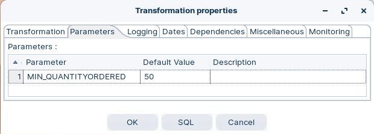

# Parameters

> **Warning:**
>
> #### Workshop - Parameters
> 
> A transformation that reads "the cancelled orders" is a one-off. Give it a **named parameter** and the same file reads whichever order status you ask for: from Spoon, from the command line, or from a job.
> 
> **What you'll do**
> 
> * Define a named parameter, `STATUS`, with a default value
> * Use it in a **Table input** query as `${STATUS}`
> * Run with the default, then with another value
> * Pass the value from the command line with Pan
> 
> **Prerequisites:** **[Reading from a Database](../13-mod3-reading-from-a-database/guide.md)** and the `MySQL:sampledata` connection from **[Database Connections](../12-mod3-connecting-to-database/guide.md)**.
> 
> **Estimated time:** 15 minutes

<div class="pcm-embed-card" data-href="https://www.loom.com/share/6b3348c091764d08806280206bd53434?hideEmbedTopBar=true&amp;hide_owner=true&amp;hide_share=true&amp;hide_title=true" data-title="Defining Parameters in Transformations for Effective Data Management 📊" data-description="In this video, I demonstrate how to define parameters within a transformation using Spoon, highlighting their role as local variables compared to global variables. I walk you through viewing the current parameters and variables in memory, and I create two parameters: one for the delimiter character and another for the output file's extension. It's crucial to provide default values and descriptions for these parameters to avoid potential issues. I also explain how a parameter can override a variable if they share the same name. Please pay attention to these concepts, as they will be applied in the next demonstration video." data-thumb="../_assets/embeds/2d94cd73b9b2.png"></div>

> **Note:** **Create a new transformation**
> 
> Use any of these options to open a new transformation tab:
> 
> * Select **File** > **New** > **Transformation**
> * Use `Ctrl+N` (Windows/Linux) or `Cmd+N` (macOS)
>
> Or open your **Reading from a Database** transformation and save it as `tr_parameters_variables_orders.ktr`: the solution follows the query with the same Calculator, Number range, Sort rows and Select values pattern, and only the query changes.

:::: tabs

### 1. Define the parameter

> **Note:**
>
> #### Named parameters
> 
> A named parameter belongs to the transformation: it has a name, a default value and a description, and whoever runs the transformation can give it a different value for that run.

1. Double-click an empty part of the canvas (or press `Ctrl+T`) to open **Transformation properties**.
2. Open the **Parameters** tab.
3. Add one row:

| Parameter | Default Value | Description            |
| --------- | ------------- | ---------------------- |
| `STATUS`  | `Cancelled`   | `Order status to read` |

4. Select **OK**, and save the transformation.

<figure><figcaption><p>The Parameters tab (shown with the Deleting Records parameter; yours holds STATUS)</p></figcaption></figure>

> **Under the hood:**
>
> #### A parameter is a variable the transformation declares
>
> At run time PDI turns every named parameter into an ordinary
> variable, scoped to this transformation: the value the run was given,
> or the default if it was given none. Everything that reads variables
> (`${...}` in a step setting, **Get Variables**) sees it the same way.
>
> The declaration is what makes it a contract. Spoon's Run dialog lists
> it, `pan -listparam` prints it, and a job entry that calls this
> transformation can pass it a value by name. A variable read from
> `kettle.properties` has none of that: nothing tells the person running
> the file it exists.
>
> **Why it matters:** the default keeps the transformation runnable as
> it stands, and the declaration tells every caller what it can change.

### 2. Use it in the query

1. Drag **Table input** onto the canvas and double-click it.
2. Set **Connection** to `MySQL:sampledata`.
3. Enter the query:

```sql
SELECT
  ORDERNUMBER
, ORDERDATE
, REQUIREDDATE
, SHIPPEDDATE
, STATUS
, COMMENTS
, CUSTOMERNUMBER
FROM ORDERS
WHERE STATUS = '${STATUS}'
```

4. Tick **Replace variables in script?**
5. Select **Preview**: 6 rows, the cancelled orders.

> **Warning:** The quotes are yours. `${STATUS}` is replaced as plain text, so `'${STATUS}'` becomes `'Cancelled'`. Leave the quotes out and MySQL receives `WHERE STATUS = Cancelled`, a column name, and the query fails.

> **Under the hood:**
>
> #### `${}` is text substitution, done before the query is prepared
>
> With **Replace variables in script?** ticked, Table input rewrites the
> SQL text first, swapping each `${NAME}` for its value, and only then
> hands the finished statement to the driver. The database never sees
> a parameter; it sees `WHERE STATUS = 'Cancelled'`.
>
> That is what lets a variable stand anywhere in the SQL, even a table
> or column name, and also why it is not the tool for values that come
> from data: a value containing a quote changes the statement. The
> next workshop, **[Parameters SQL](../35-mod5-parameters-sql/guide.md)**,
> uses `?` markers, which the driver binds as values.
>
> **Why it matters:** named parameters are for configuration you
> control (a status, a date, a schema name); `?` markers are for values
> that arrive in the data.

### 3. Run with another value

1. Select **Run** (or press `F8`, **Run Options...**).
2. In the **Run Options** dialog, open the **Parameters** tab. `STATUS` is listed with its default.
3. Set its **Value** to `On Hold`, and select **Run**.
4. In **Execution Results** > **Step Metrics**, **Table input** wrote 4 rows: the orders on hold.

Leave the value empty and the run uses the default again (6 rows). The other statuses in Steel Wheels are `Shipped` (303), `In Process` (6), `Resolved` (4) and `Disputed` (3).

### 4. Run it from the command line

Pan, the command-line runner for transformations, takes the value with `-param`. On Windows the launcher batch files split arguments at `=`, so the parameter must reach them in quotes; in PowerShell, `--%` passes the rest of the line through untouched:

::: tabs

### Windows (PowerShell)

```powershell
Set-Location C:\Pentaho\design-tools\data-integration
.\pan.bat --% "-file=C:\Workshop-DI-Practitioner\05-enterprise-solution\03-parameters\34-mod5-parameters\solution\tr_parameters_variables_orders.ktr" "-param:STATUS=Resolved" -level=Basic
```

### macOS / Linux

```bash
cd ~/Pentaho/design-tools/data-integration
./pan.sh -file=/path/to/tr_parameters_variables_orders.ktr "-param:STATUS=Resolved" -level=Basic
```

:::

The log ends with `Table input.0 - Finished processing (I=4, O=0, R=0, W=4, U=0, E=0)`: the four resolved orders.

> **Note:** `-listparam` in place of `-param:...` prints the parameters a transformation declares, with their defaults, without running it.

::::

## Lab Files

Click a file to download. For `.ktr` and `.kjb` files, **Open in Pentaho Data Integration** launches PDI with the file loaded. If PDI is already running, the path is copied to your clipboard — switch to PDI and use Ctrl+O, Ctrl+V, Enter.

### Solution <!-- no-step -->

The finished transformation for this lab. It reads the orders for `${STATUS}` (default `Cancelled`: 6 orders), then works out `diff_days` as in Reading from a Database and labels each order Late, On Time or Early.

Also on disk at `C:\Workshop-DI-Practitioner\05-enterprise-solution\03-parameters\34-mod5-parameters\solution`.

[tr_parameters_variables_orders.ktr](./files/tr_parameters_variables_orders.ktr) <button data-launch="spoon" data-path="files/tr_parameters_variables_orders.ktr">Open in Pentaho Data Integration</button> <button data-graph="files/tr_parameters_variables_orders.ktr">View graph</button>
