# Run Configurations

> **Note:** Pentaho Data Integration provides advanced clustering and partitioning capabilities that allow organizations to scale out their data integration deployments.
> 
> In this guided demonstration, you will:
> 
> • Configure Master & Slave Nodes
> 
> • Execute RUN Configurations

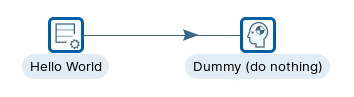

:::: tabs

### 1. Master & Slave nodes

> **Note:** So lets start scaling out by adding some servers (nodes).
> 
> These can be defined as either:
> 
> • Master: node is responsible for distributing work among the worker nodes and ensuring high availability and scalability of the system.
> 
> • Slave (Worker): node in Pentaho is an instance that can execute Pentaho work items, such as PDI jobs and transformations, with parallel processing, dynamic-scalability, load-balancing, and dependency-management in a clustered environment

**Master Node**

> **Note:** You can indiviually start the carte instances or execute the following command to deploy all 3 at the same time .

```bash
cd
cd ~/Scripts
./start_carte.sh
```

1. In a terminal execute the following command.

```bash
cd
cd ~/Pentaho/design-tools/data-integration
sh carte.sh localhost 12000
```

<figure>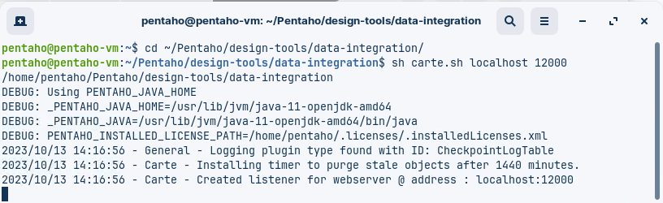<figcaption><p>Master node - port 12000</p></figcaption></figure>

**Slave Nodes**

1. In a new terminal execute the following command (Slave A).

```bash
cd
cd ~/Pentaho/design-tools/data-integration
sh carte.sh localhost 12100
```

<figure>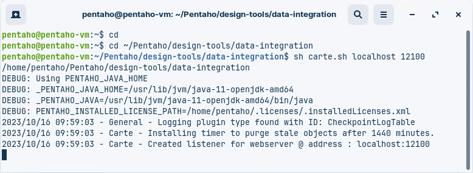<figcaption><p>Slave node A - port 12100</p></figcaption></figure>

2. In a new terminal execute the following command (Slave B).

```bash
cd
cd ~/Pentaho/design-tools/data-integration
sh carte.sh localhost 12200
```

<figure>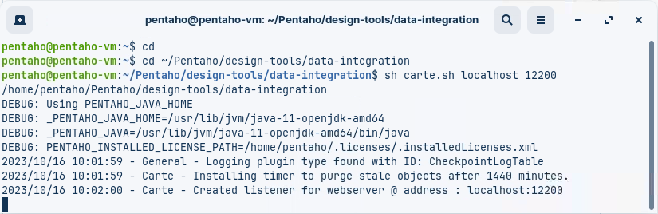<figcaption><p>Slave node B - port 12200</p></figcaption></figure>

> **Warning:** You should now have 3 terminals, each running a Carte instance.
> 
> Please dont close the terminals ..!

### 2. Configure Nodes

1. Open the tr\_hello\_world transformation.
2. Select the View tab
3. Highlight the Slave server option; right mouse click and select: New

<figure>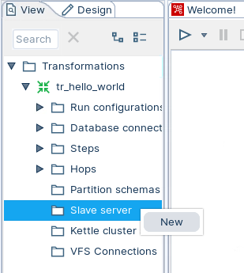<figcaption><p>Configure Nodes</p></figcaption></figure>

<table><thead><tr><th width="253">Option</th><th>Description</th></tr></thead><tbody><tr><td><strong>Server name</strong></td><td>The name of the slave server.</td></tr><tr><td><strong>Hostname or IP address</strong></td><td>The address of the device to be used as a slave.</td></tr><tr><td><strong>Port (empty is port 80)</strong></td><td>Defines the port you are for communicating with the remote server. If you leave the port blank, 80 is used.</td></tr><tr><td><strong>Web App Name (required for Pentaho Server)</strong></td><td>Leave this blank if you are setting up a Carte server. This field is used for connecting to the Pentaho server.</td></tr><tr><td><strong>User name</strong></td><td>Enter the user name for accessing the remote server.</td></tr><tr><td><strong>Password</strong></td><td>Enter the password for accessing the remote server. (cluster/cluster)</td></tr><tr><td><strong>Is the master</strong></td><td>Enables this server as the master server in any clustered executions of the transformation.</td></tr></tbody></table>

Below are the proxy tab options:

<table><thead><tr><th width="255">Option</th><th>Description</th></tr></thead><tbody><tr><td><strong>Proxy server hostname</strong></td><td>Sets the host name for the proxy server you are using.</td></tr><tr><td><strong>The proxy server port</strong></td><td>Sets the port number used for communicating with the proxy.</td></tr><tr><td><strong>Ignore proxy for hosts: regexp | separated</strong></td><td>Specify the server(s) for which the proxy should not be active. This option supports specifying multiple servers using regular expressions. You can also add multiple servers and expressions separated by the ' | ' character.</td></tr></tbody></table>

**Master Node**

1. Enter the following settings to configure the Master node:

<figure>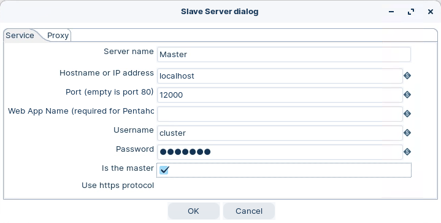<figcaption><p>Master Node</p></figcaption></figure>

**Slave Nodes**

1. Enter the following settings to configure the Slave node A:

<figure>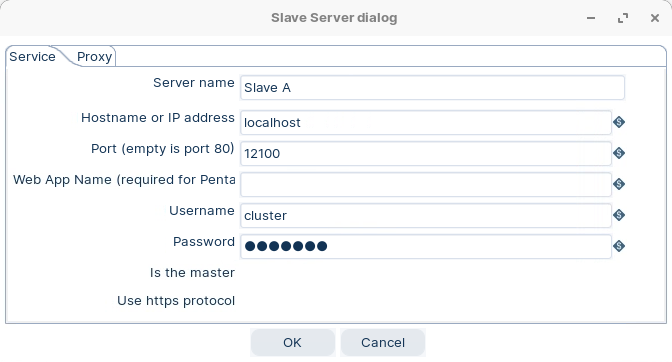<figcaption><p>Slave Node A</p></figcaption></figure>

2. Enter the following settings to configure the Slave node B:

<figure>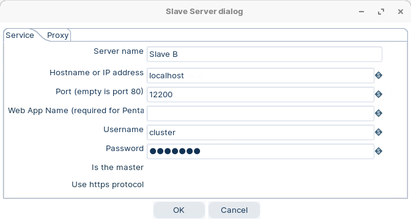<figcaption><p>Slave Node B</p></figcaption></figure>

> **Note:** Ok .. now we're ready to RUN transformations on specific nodes.

### 3. RUN Configurations

> **Note:** Now we have our 3 nodes up and running, lets configure some RUN configurations to execute our Transformations on specific nodes.
> 
> Some ETL activities are lightweight, such as loading in a small text file to write out to a database or filtering a few rows to trim down your results. For these activities, you can run your transformation locally using the default Pentaho engine.
> 
> Some ETL activities are more demanding, containing many steps calling other steps or a network of transformation modules. For these activities, you can set up a separate Pentaho Server dedicated for running transformations using the Pentaho engine.
> 
> Other ETL activities involve large amounts of data on network clusters requiring greater scalability and reduced execution times. For these activities, you can run your transformation using the Spark engine in a Hadoop cluster.

<figure><figcaption><p>tr_hello_world</p></figcaption></figure>

::: tabs

### 3.1 Nodes

> **Note:** Pentaho local is the default run configuration. It runs transformations with the Pentaho engine on your local machine. You cannot edit this default configuration.

1. Ensure you have configured the Nodes.

<figure>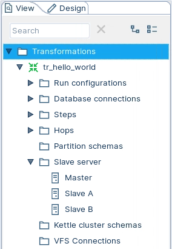<figcaption><p>Slave Nodes</p></figcaption></figure>

2. To create a new run configuration, right-click on 'Run configurations' folder and select New.

<figure>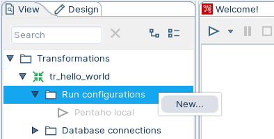<figcaption><p>Run configuration</p></figcaption></figure>

3. Enter the following configuration details, ensuring that you select the Pentaho (KETTLE) engine.

<figure>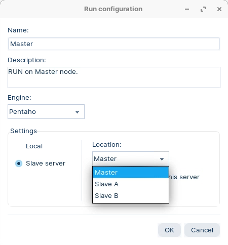<figcaption><p>Master - RUN configuration</p></figcaption></figure>

3. When you come to RUN the transformation, select Master node.

<figure>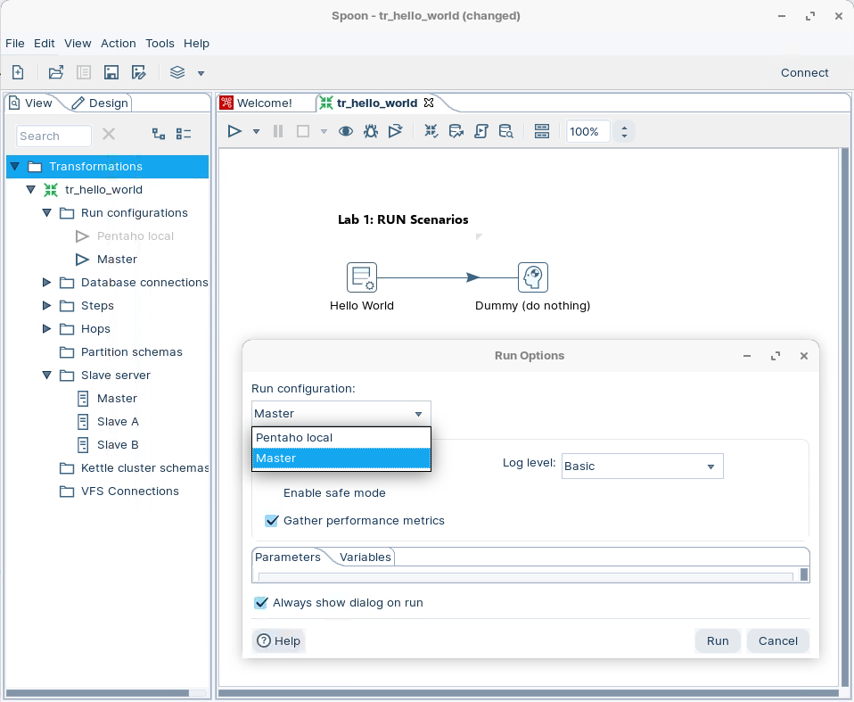<figcaption><p>RUN configuration - Master</p></figcaption></figure>

> **Note:** As you can see from the Results:
> 
> * Transformation is executed on the Master Node
> * As Monitor tab displays the Step Metrics

<figure>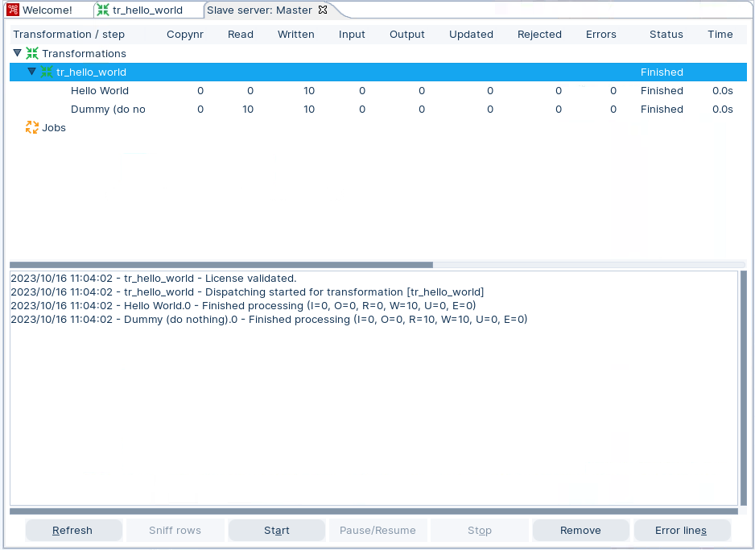<figcaption><p>RUN configuration - Master</p></figcaption></figure>

3. Take a look at the Master Terminal.

<figure>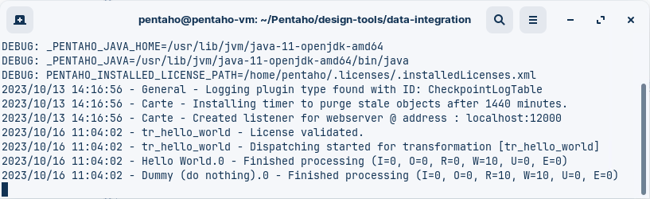<figcaption><p>Master Terminal</p></figcaption></figure>

> **Under the hood:**
>
> #### Spoon shipped the XML over HTTP; Carte ran the same engine
>
> Selecting the *Master* run configuration changed where, not what.
> Spoon serialised the transformation to its XML, posted it to the
> Carte instance on port 12000 at `/kettle/registerTrans`, then called
> `/kettle/prepareExec` and `/kettle/startExec`. Carte — a small Jetty
> web server wrapped around exactly the engine you have been running
> locally — parsed the XML, allocated the same threads and row sets,
> and ran it. The Step Metrics you watched arrived because Spoon then
> polled `/kettle/transStatus` every few seconds.
>
> Nothing was installed on the node and nothing was compiled. The
> terminal shows the same log lines you would see in Spoon because it
> *is* the same code.
>
> **Why it matters:** "deploy to the server" is an HTTP call with a
> file in it. Pentaho Server's scheduler, Kitchen on a cron box and
> this dialog all drive the same API, so what runs in the run dialog is
> what runs in production.

> **Note:** Give it a go with other RUN configurations .. Just Slave A / B

### 3.2 Cluster schema

> **Note:** A cluster schema is essentially a collection of slave servers. In each schema, you need to pick at least one slave server that we will call the Master slave server or master.
> 
> The master is also just a carte instance but it takes care of all sort of management tasks across the cluster schema. In the Spoon GUI, you can enter this metadata as well once you started a couple of slave servers.

> **Note:** The workflow in a clustered Pentaho transformation is as follows:
> 
> • The job entry or the transformation connects to the cluster master node, which is responsible for coordinating the execution of the transformation steps on the cluster slave nodes.
> 
> • The master node sends the transformation metadata and the cluster schema to the slave nodes, and assigns each step to one or more nodes based on the cluster schema.
> 
> • The slave nodes execute the assigned steps and exchange data with each other using sockets or shared files, depending on the partitioning method and the clustering plugin used.
> 
> • The master node monitors the progress and status of the slave nodes, and collects logging information and performance metrics from them.
> 
> • The master node reports the outcome of the transformation execution to the job entry or the transformation that initiated it.

**Cluster Schema**

1. To create a new run configuration, right-click on 'Kettle cluster schemas' folder and select New.

<figure>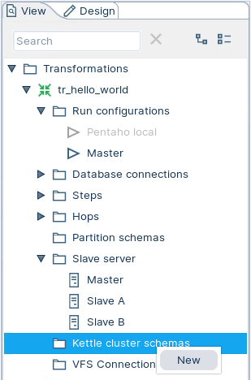<figcaption><p>Kettle cluster schema</p></figcaption></figure>

2. Enter the following configuration details.

<figure>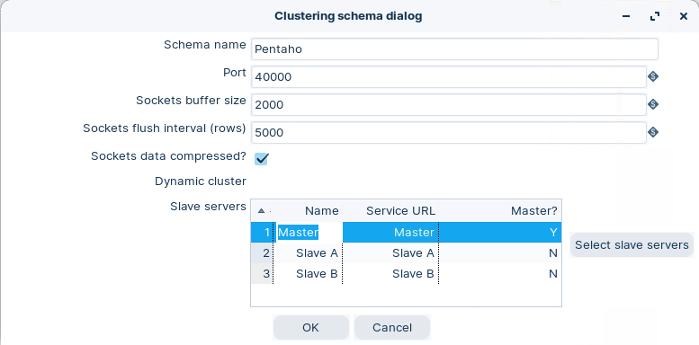<figcaption><p>Pentaho Cluster schema</p></figcaption></figure>

<table><thead><tr><th width="197">Option</th><th>Description</th></tr></thead><tbody><tr><td><strong>Schema name</strong></td><td>The name of the clustering schema</td></tr><tr><td><strong>Port</strong></td><td>Specify the port from which to start numbering ports for the slave servers. Each additional clustered step executing on a slave server will consume an additional port.<br>Note: To avoid networking problems, make sure no other networking protocols are in the same range.</td></tr><tr><td><strong>Sockets buffer size</strong></td><td>The internal buffer size to use</td></tr><tr><td><strong>Sockets flush interval rows</strong></td><td>The number of rows after which the internal buffer is sent completely over the network and emptied.</td></tr><tr><td><strong>Sockets data compressed?</strong></td><td>When enabled, all data is compressed using the Gzip compression algorithm to minimize network traffic</td></tr><tr><td><strong>Dynamic cluster</strong></td><td>If checked, a master Carte server will perform failover operations, and you must define the master as a slave server in the field below. If unchecked, Spoon will act as the master server, and you must define the available Carte slaves in the field below.</td></tr><tr><td><strong>Slave Servers</strong></td><td>A list of the servers to be used in the cluster. You must have one master server and any number of slave servers. To add servers to the cluster, click Select slave servers to select from the list of available slave servers.</td></tr></tbody></table>

3. To create a new run configuration, right-click on 'Run configurations' folder and select New.
4. Enter the following configuration details, ensuring that you select the Pentaho (KETTLE) engine.

<figure>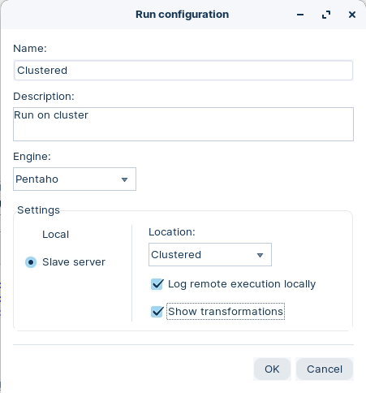<figcaption><p>Clustered - RUN configuration</p></figcaption></figure>

> **Note:** You can set for the logs to be created locally.
> 
> The 'Show transformations' option is useful for documentation, as diagrams illustrating the dataflow are created.

### 3.3 Clustered

> **Note:** A Carte cluster consists of two or more Carte slave servers and a Carte master server. A Carte server is a lightweight web service that can execute jobs and transformations remotely. A Carte cluster can speed up the processing of transformations by distributing the work across multiple Carte slave nodes, while the Carte master node tracks the progress. A Carte cluster can be static or dynamic. A static Carte cluster has a fixed schema that specifies the nodes in advance. A dynamic Carte cluster allows you to add or remove nodes at runtime.
> 
> Pentaho can also connect to other types of clusters, such as Hadoop clusters, to leverage big data processing capabilities. For example, Pentaho can connect to secured and unsecured MapR clusters, which are Hadoop distributions that provide high performance, reliability, and security. To connect to a MapR cluster, you need to configure the cluster, install any required services and service client tools, and test the cluster

1. Highlight the Hello World step, right mouse click and select the option Clusters from the drop down menu.

<figure>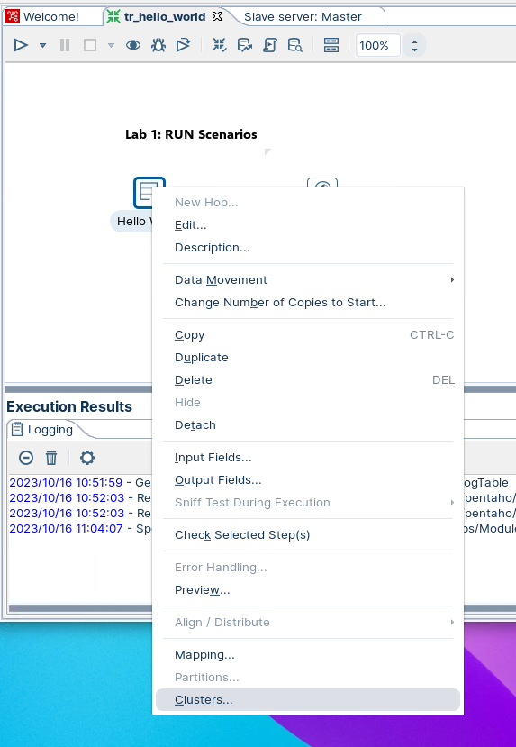<figcaption><p>Clusters</p></figcaption></figure>

4. Select 'Pentaho' cluster schema.

<figure>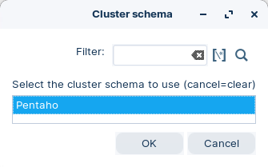<figcaption><p>Pentaho - Cluster schema</p></figcaption></figure>

> **Note:** Notice that the step will indicate the number of Slave nodes it will be executed on.

<figure>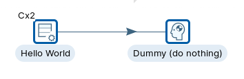<figcaption><p>Indicated nmber of Slave Nodes</p></figcaption></figure>

5. RUN the transformation with Clustered configuration.

<figure>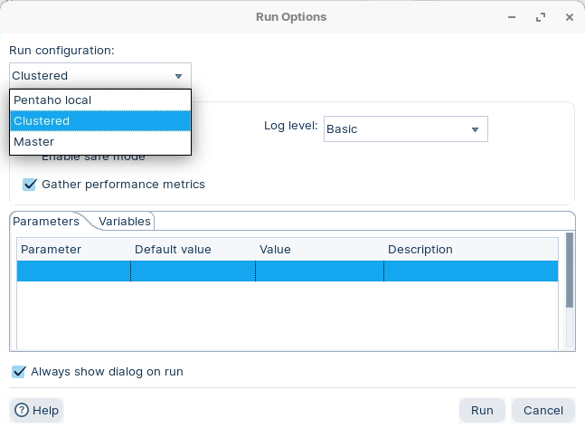<figcaption><p>RUN configuration - Clustered</p></figcaption></figure>

> **Note:** A bunch of Tabs will appear for each node which display the Metrics and Metadata transformations.

6. Take a look at the Tabs (example below is for Slave A).

<figure>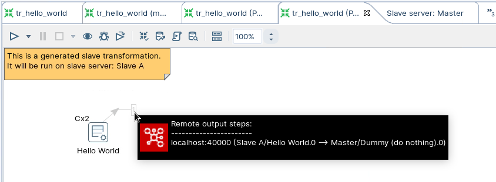<figcaption><p>Metadat transformation - Slave A</p></figcaption></figure>

> **Note:** Here you can see that the records are streamed from Slave node A back to the Master node.

<figure>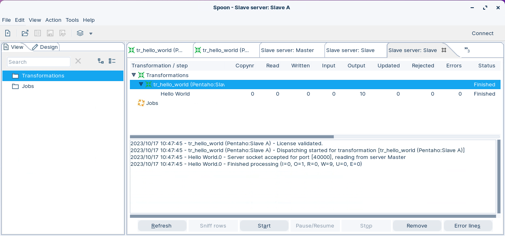<figcaption><p>Metrics - Slave A</p></figcaption></figure>

> **Note:** The metrics indicate that Slave Node A ingested the records.

<figure>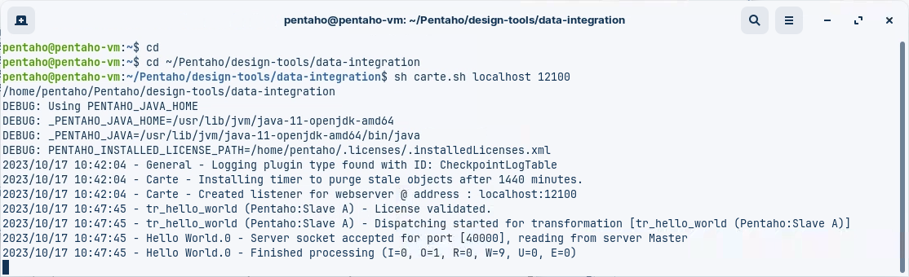<figcaption><p>Logs - Slave A</p></figcaption></figure>

> **Note:** The Logs indicate Slave A successfully read the transformation metadata dispatched from the Master node and executed the step, streaming the resulting dataset back to the Master node.

> **Under the hood:**
>
> #### The engine rewrote your transformation into one per node
>
> Marking a step as clustered told the master to split the
> transformation before running it. For each slave it generated a
> **metadata transformation** — the extra tabs you saw — containing
> only the clustered step plus **Socket reader** and **Socket writer**
> steps inserted at the boundaries where rows must cross machines. The
> master's own copy got the non-clustered steps and the matching
> socket ends. Each slave received its slice over HTTP exactly as in
> the previous tab, and rows then flowed between nodes over TCP on
> ports allocated from the cluster schema's base port.
>
> The generated transformations are ordinary transformations: the Logs
> tab on Slave A is that node running its slice, and its metrics are
> its socket writer sending rows back to the master.
>
> **Why it matters:** you scaled a step across two machines by
> right-clicking it. The partitioning, the network plumbing and the
> reassembly were generated, and the original `.ktr` is unchanged —
> remove the cluster assignment and it runs locally again.

:::

::::

## Lab Files

_No bundled files for this lab._
