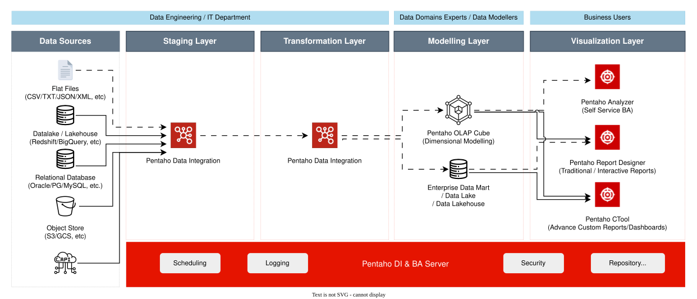
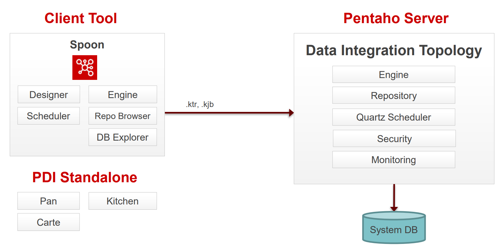
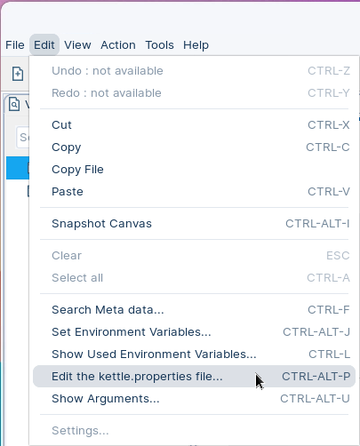
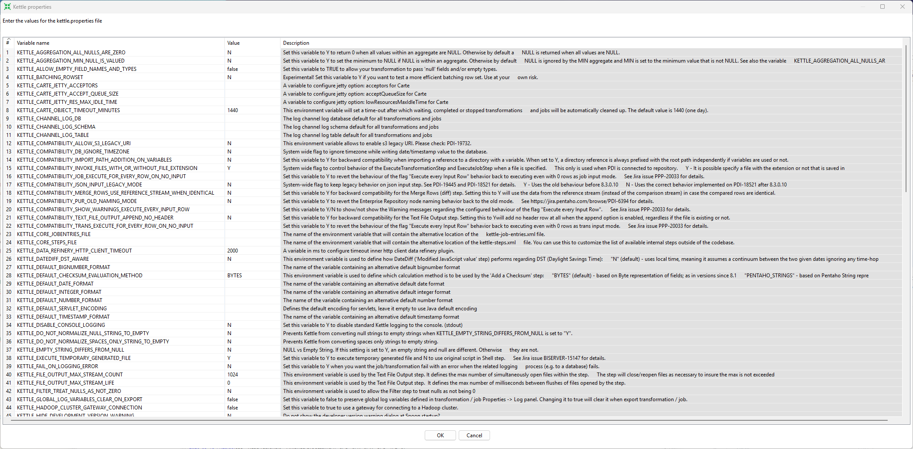
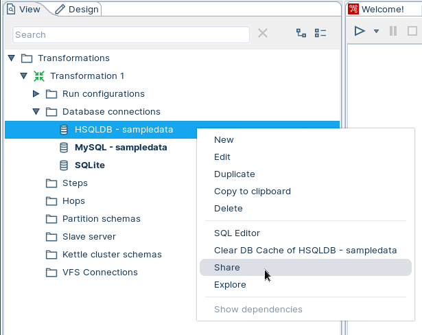

# Components
<div class="pcm-intro">

Before you build anything in Pentaho Data Integration (PDI), you need to know your way around Spoon. This module gets you set up: perspectives, options, and the kettle.properties file that drives variables across every transformation. By the time you finish, you'll feel at home in the design tool.

</div>

Understanding the architecture and components of Pentaho Data Integration (PDI) is fundamental to becoming an effective Pentaho developer and administrator. This section will familiarize you with the building blocks that make up the Pentaho Data Integration ecosystem and how they work together to deliver enterprise-grade data integration capabilities.

**What You'll Learn**

Pentaho Data Integration operates on a **client-server architecture** that separates design-time activities from runtime execution and administration. In this section, you'll explore:

* **Enterprise Components**: The server-side infrastructure that handles execution, security, content management, and scheduling
* **Client Tools**: The desktop applications used to design, test, and deploy your data integration solutions
* **Configuration Framework**: The KETTLE configuration files that control system behaviour and store critical settings
* **Repository Management**: How PDI manages versioning, collaboration, and content organization
* **Database Connectivity**: The process of integrating JDBC drivers to connect to various data sources
<figure>



<div align="center">
<figcaption><em>Pentaho Ecosystem</em></figcaption>
</div>
</figure>

---

Browse to learn about the components:

:::: tabs

### 1. Components
<div align="center">
<figure>



<figcaption><em>Pentaho Architecture - Client / Server</em></figcaption>
</figure>
</div>

::: tabs

### 1. Data Integration
> **Note:**
>
> #### **Data Integration**
>
> **Spoon**
>
> Graphical modelling environment for developing, testing, debugging and monitoring jobs and transformations.
>
> **Designer**
>
> Drag & Drop 'objects' to design your pipelines and workflows.
>
> **Scheduler**
>
> Connects to Quartz scheduler on server. Jobs and transformations must be uploaded to Repository.
>
> **Engine**
>
> Kettle and Spark engines available to execute jobs and transformations.
>
> **Repository Browser**
>
> Connects to Apache Jackrabbit content Repository, pointing to a supported database:
>
> * PostgreSQL
> * MSSQL Server
> * Oracle
> * MySQL
> * MariaDB
>
> **DB Explorer**
>
> Database Explorer that enables you to conduct minimal database operations.

<div class="pcm-embed-card" data-href="https://docs.pentaho.com/pdia-data-integration" data-title="Pentaho Data Integration 11.0 | Pentaho" data-thumb="../_assets/embeds/df6e513be97b.png"></div>

### 2. Pentaho Server
> **Note:**
>
> #### **Pentaho Server**
>
> The Pentaho Server hosts Pentaho-created and user-created content. It is a core component for executing data integration transformations and jobs using the Pentaho Data Integration (PDI) Engine. It allows you to manage users and roles (default security) or integrate security to your existing security provider such as LDAP or Active Directory.

The primary functions of the Pentaho Server are:

| Function                    | Description                                                                                                                                                                                                                        |
| --------------------------- | ---------------------------------------------------------------------------------------------------------------------------------------------------------------------------------------------------------------------------------- |
| **Execution**               | Executes ETL jobs and transformations using the Pentaho Data Integration engine                                                                                                                                                    |
| **Security**                | Allows you to manage users and roles (default security) or integrate security to your existing security provider such as LDAP or Active Directory                                                                                  |
| **Content Management**      | Provides a centralized repository that allows you to manage your ETL jobs and transformations. This includes full revision history on content and features such as sharing and locking for collaborative development environments. |
| **Scheduling & Monitoring** | Provides the services allowing you to schedule and monitor activities on the Data Integration Server from within the Spoon design environment (Quartz).                                                                            |

<div class="pcm-embed-card" data-href="https://docs.pentaho.com/install/components-reference" data-title="Components reference | Pentaho" data-thumb="../_assets/embeds/99d6d0253453.png"></div>

### 3. Carte
> **Note:**
>
> #### **Carte Server**
>
> The Pentaho DI Carte Server is a vital component within the Pentaho data integration suite, designed to facilitate robust data processing operations. It serves as a stand-alone web server and execution environment that allows for the remote execution of ETL (Extract, Transform, Load) tasks, making it a cornerstone for managing data workflows efficiently.

<div align="center">
<figure>


<figcaption><em>Carte Ecosystem</em></figcaption>
</figure>
</div>

> **Note:** **Simplicity and Efficiency**
>
> Carte stands out for its straightforward and user-friendly setup, paired with a highly efficient operation that conserves resources. This makes it the ideal choice for organizations seeking to enhance their data integration workflows efficiently and with minimal operational burden.
>
> **Remote Execution Flexibility**
>
> With Carte, executing ETL tasks remotely becomes effortless, allowing for versatile data integration management from any location. Serving as a powerful remote ETL server, Carte can handle jobs and transformations from afar, broadening the capabilities of data integration strategies.
>
> **Seamless Integration Capabilities**
>
> Featuring an extensive array of built-in connectors, Carte excels in smoothly integrating with a multitude of sources and destinations, including databases and data warehouses. This capability facilitates straightforward data extraction, transformation, and loading processes across various platforms.
>
> **Built for Scalability**
>
> Carte is designed to grow with your needs, enabling deployment in multiple configurations such as Kubernetes, Docker, and cloud-based solutions. Its lightweight design ensures consistent performance, even as data demands increase.
>
> **Intuitive Web Interface**
>
> The Carte web interface offers a clean and efficient way to oversee jobs and transformations. Users gain access to real-time task updates, status reports, and comprehensive execution logs, all through a user-friendly dashboard.

<div class="pcm-embed-card" data-href="https://docs.pentaho.com/pdia-data-integration/advanced-topics-pentaho-data-integration-overview/use-carte-clusters" data-title="Use Carte Clusters | Pentaho" data-thumb="../_assets/embeds/b2bee0a6a9e0.png"></div>

### 4. REST APIs
> **Note:**
>
> #### **PDI REST APIs**
>
> You can use PDI's command line tools to execute PDI content from outside of Spoon. Typically, you would use these tools in the context of creating a script or a Cron job to run the job or transformation based on some condition outside of the realm of Pentaho software.

> **Note:** **Pan**
>
> A standalone command line process that can be used to execute transformations and jobs you created in Spoon. The data transformation engine Pan reads data from and writes data to various data sources. Pan also allows you to manipulate data.
>
> ```bash
> ./pan.sh /file:/home/[pentaho_user]/[path]/[transformation].ktr  /level:[Log Level]
> ```

> **Note:** **Kitchen**
>
> A standalone command line process that can be used to execute jobs. The program that executes the jobs designed in the Spoon graphical interface, either in XML or in a database repository. Jobs are usually scheduled to run in batch mode at regular intervals.
>
> ```bash
> ./kitchen.sh /file:/home/[pentaho_user]/[path]/[job].kjb  /level:[Log level]
> ```

<div class="pcm-embed-card" data-href="https://docs.pentaho.com/pentaho-rest-api/carte-apis-carte-server" data-title="Carte APIs"></div>

:::

### 2. PDI UI
> **Note:** **User Interface**
>
> Within the UI, you can author, edit, run, and debug transformations and jobs. You can also enter license keys, add data connections, and define security (default options - Pentaho or LDAP).
>
> The Welcome page contains useful links to documentation, community links for getting involved in the Pentaho Data Integration project, and links to blogs from some of the top contributors to the Pentaho Data Integration project.

<div align="center">
<figure>


<figcaption><em>Welcome Page</em></figcaption>
</figure>
</div>

> **Note:** There are a few different ways to start PDI. The method that you should use depends on the way you installed Pentaho Data Integration (PDI).

| OS: Windows / Unix       | Action                           |
| ------------------------ | -------------------------------- |
| spoon.bat / spoon.sh     | Starts Spoon                     |
| kitchen.bat / kitchen.sh | Command Line for Jobs            |
| pan.bat / pan.sh         | Command Line for Transformations |

**Launch Data Integration**

1. If Pentaho Data Integration is not up and running:

```powershell
Start-Process "C:\Pentaho\design-tools\data-integration\spoon.bat
```

### 3. Configuration Files
> **Note:** **Configuration Files**
>
> The default Pentaho Data Integration (PDI) home directory is the `.kettle` folder located within the system user's home directory. This directory contains the main PDI configuration files.
>
> * **Windows:** C:\\{user}\\.kettle
> * **Linux:**   $HOME/.kettle
>
> The directory may change depending on the user who is logged on. Thus, the configuration files that control the behaviour of PDI jobs and transformations are different from user to user.
>
> This also applies when running PDI from the Pentaho BI Platform. When you set the KETTLE\_HOME variable, the PDI jobs and transformations can be run without being affected by the user who is logged on. KETTLE\_HOME is used to change the location of the files normally in \[user home].kettle

| File              | Description                                   |
| ----------------- | --------------------------------------------- |
| kettle.properties | main configuration file with global variables |
| shared.xml        | list of shared artefacts                      |
| db.cache          | database cache for metadata                   |
| repositories.xml  | list of repositories                          |
| .spoonrc          | settings for the UI                           |
| .languageChoice   | language settings                             |

::: tabs

### 1. kettle.properties
> **Note:** **kettle.properties**
>
> The kettle.properties file is where you will find all the global variables for KETTLE. You can also set global variables that can be used in Transformations and Jobs. For example, you can define database connections, paths to files, or variables that can be used as parameters in your solution.
>
> * **Windows:** C:\\{user}\\.kettle\\kettle.properties
> * **Linux:**   $HOME/.kettle/kettle.properties
>

The kettle.properties can be edited using a Text Editor or via the Toolbar, select:

<div align="center">
<figure>



<figcaption><em>Edit kettle.properties</em></figcaption>
</figure>
</div>

**Kettle Variables**
<figure>



<div align="center">
<figcaption><em>kettle.proprties file</em></figcaption>
</div>


### 2. shared.xml
> **Note:** **shared.xml**
>
> A variety of objects can now be placed in a shared objects file on the local machine. The default location for the shared objects file is:
>
> * **Windows:** C:\\{user}\\.kettle\shared.xml
> * **Linux:** $HOME/.kettle/shared.xml
>
> Objects that can be shared using this method include:
>
> * Database connections
> * Steps
> * Slave servers
> * Partition schemas
> * Cluster schemas
>
> The location of the shared objects file is configurable on the "Miscellaneous" tab of the Transformation > Settings dialog.

1. To share one of these objects, simply right-click on the object in the tree control on the left and choose share.

<figure><figcaption><p>Shared Object - Connection</p></figcaption></figure>

> **Note:** **Bold Type** indicates the Object is shared.

### 3. repositories.xml
> **Note:** **repositories.xml**
>
> A variety of objects can now be placed in a shared objects file on the local machine. The default location for the shared objects file is:
>
> * **Windows:** C:\\{user}\\.kettle\\repositories.xml
> 8 **Linux:**   $HOME/.kettle/repositories.xml

```xml
<repositories>
<repository>
<id>PentahoEnterpriseRepository</id>
<name>Pentaho</name>
<description/>
<is_default>false</is_default>
<repository_location_url>http://localhost:8080/pentaho</repository_location_url>
<version_comment_mandatory>N</version_comment_mandatory>
</repository>
</repositories>
```

### 4. .spoonrc
> **Note:** **.spoonrc**
>
> Used to store preferences and program state of Spoon. Other Kettle programs do not use this file.
>
> * General settings and defaults
> * User interface settings
> * The last opened transformation/job
>
> The default location for the shared objects file is:
>
> * **Windows:** C:\\{user}\\.kettle\\.spoonrc
> * **Linux:**   $HOME/.kettle/.spoonrc

```
#Kettle Properties file
#Wed Sep 16 17:00:56 BST 2026
AskAboutReplacingDatabases=N
AutoCollapseCoreObjectsTree=Y
AutoSave=N
AutoSplit=N
BackgroundColorB=255
BackgroundColorG=255
BackgroundColorR=255
CustomParameterMergeJoinSortWarning=Y
DefaultPreviewSize=1000
DisableBrowserEnvironmentCheck=N
EnableAntiAliasing=N
FontDefaultName=Segoe UI
FontDefaultSize=9
FontDefaultStyle=0
...
```

> **Note:** These options are set from the main menu: Tools -> Options

:::

### 4. JDBC
> **Note:** **Adding JDBC Drivers**
>
> The PDI & Pentaho Server needs the appropriate driver to connect to the database that stores your data. Your database administrator, Chief Intelligence Officer, or IT manager should be able to provide the appropriate driver. If not, you can download drivers from your database vendor's website.
>
> Once you have the correct driver, copy it to the following directories:
>
> * **Pentaho Server:** /pentaho/server/pentaho-server/tomcat/lib/
> * **PDI client:**     /data-integration/lib

> **Danger:** You must restart the PDI client for the driver to take effect.
>
> There should be only one driver for your database in the directory. Ensure that there are no other versions of the same vendor's driver in this directory. If there are, back up the old driver files and remove them to avoid version conflicts.

<div class="pcm-embed-card" data-href="https://docs.pentaho.com/pdia-try-pdia/jdbc-drivers-reference" data-title="JDBC Drivers"></div>

### 5. Repository

> **Note:** **Pentaho Repository**
>
> The Pentaho+ platform implements its repository using [**Apache Jackrabbit**](http://jackrabbit.apache.org), a fully conforming implementation of the content repository for Java technology API (JCR, specified in JSR 170 and JSR 283)
>
> Apache Jackrabbit needs two pieces of information to set up a runtime content repository instance:
>
> * Repository home directoryThe filesystem path of the directory containing the content repository accessed by the runtime instance of Jackrabbit. This directory usually contains all the repository content, search indexes, internal configuration, and other persistent information managed within the content repository. Note that this is not absolutely required and some persistence managers and other Jackrabbit components may well be configured to access files and even other resources (like remote databases) outside the repository home directory. A designated repository home directory is however always needed even if some components choose to not use it. Jackrabbit will automatically fill in the repository home directory with all the required files and subdirectories when the repository is first instantiated.
> * Repository configuration file
>   The filesystem path of the repository configuration XML file. This file specifies the class names and properties of the various Jackrabbit components used to manage and access the content repository. Jackrabbit parses this configuration file and instantiates the specified components when the runtime content repository instance is created.

> **Note:** [**Hibernate**](https://hibernate.org/) is a Java framework which is used to store the Java objects in the relational database system. It is an open-source, lightweight, ORM (Object Relational Mapping) tool.

> **Note:** [**Quartz**](http://www.quartz-scheduler.org/) is an open source job-scheduling framework written entirely in Java and designed for use in both *J2SE* and *J2EE* applications.

---

> **Note:** **Versioning & Comments (Dev only)**
>
> Pentaho Data Integration (PDI) can track versions and comments for jobs, transformations, and connection information when you save them. You can turn version control and comment tracking on or off by modifying their related statements in the repository.spring.properties text file.
>
> By default, version control and comment tracking are disabled (set to false). Best Practice: manage your ETL workflows with a 3rd party content management tool, e.g. Github; only uploading the production version into the Repository.

1. Exit from the PDI client (also called Spoon).
2. Stop the Pentaho Server.
3. Edit repository.spring.properties file.

```bash
cd
cd ~/Pentaho/server/pentaho-server/pentaho-solution/systems
nano repository.spring.properties
```

4. Edit the versioningEnabled and versionCommentsEnabled statements:

```
versioningEnabled=true versionCommentsEnabled=true
```

::::

