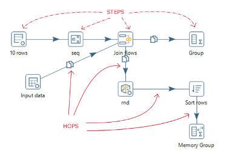
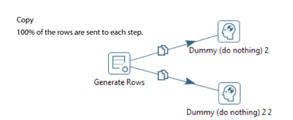
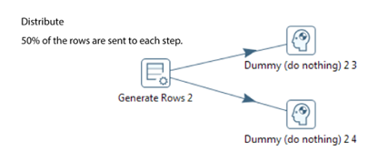
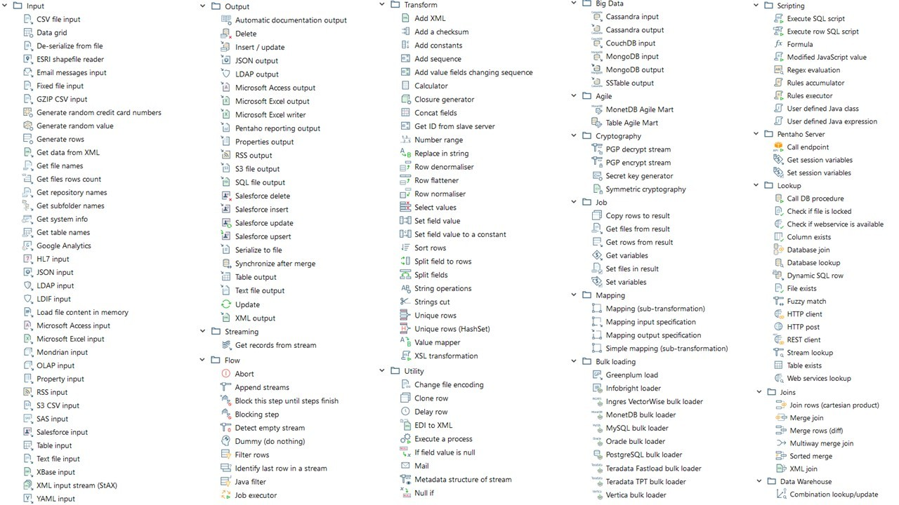
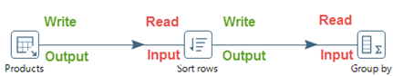
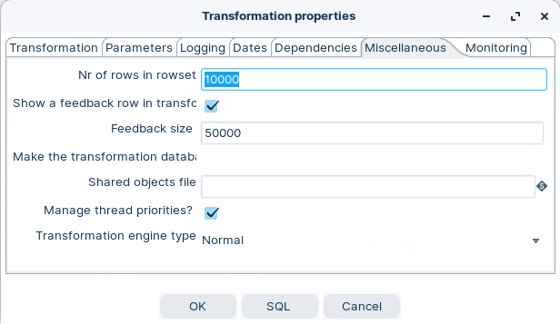
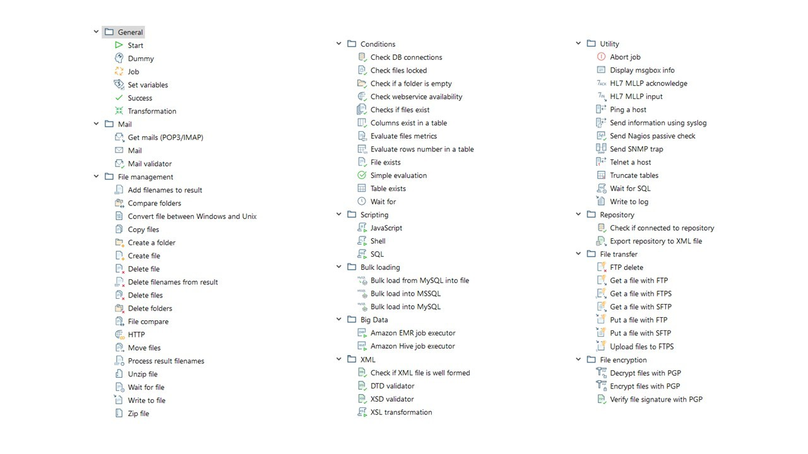

# Key Concepts

Now that PDI is configured, build something with it. You'll create a 'Hello World' transformation — the simplest pipeline possible — and pick up the vocabulary the rest of the course leans on: steps, hops, rows, and the run/preview cycle.

> **Note:**
>
> #### Concepts & Terminology
> 
> The Data Integration perspective allows you to create two basic workflow types:
> 
> **Transformations**
> 
> Transformations are used to describe the data flows for ETL such as reading from a source, transforming data and loading it into a target location.
> 
> **Jobs**
> 
> Jobs are used to coordinate ETL activities such as defining the flow and dependencies for what order transformations should be run, or prepare for execution by checking conditions such as, "Is my source file available?" or "Does a table exist in my database?"

### Transformations & Jobs

::: tabs

### 1. Transformation

> **Note:**
>
> #### **Transformation**
> 
> Transformations are the workhorses of the ETL process. They are comprised of:
> 
> **Steps**
> 
> which provide you with a wide range of functionality ranging from reading text-files to implementing slowly changing dimensions.
> 
> Steps executed in parallel.
> 
> **Hops**
> 
> help you define the flow of the data in the stream. They represent a row buffer between the Step Output and the next Step Input, as illustrated in the below Transformation. Data flows from the Text file input step to Filter rows to Sort Rows, finally to Table output.

<figure><figcaption>
Steps &#x26; Hops = Transformation
</figcaption></figure>

***

> **Note:**
>
> #### **Steps**
> 
> There are some key characteristics of Steps:
> 
> * Step names must be unique in a single Transformation
> * Virtually all Steps read and write rows of data (exception Generate rows)
> * Most Steps can have multiple outgoing hops. These can be configured to either copy or distribute the data. Copy ensures all Steps receive a copy of the row of data; Distribute sends the data in a round robin fashion to each of the Steps.
> * Steps run in their own thread. It’s possible to run multiple copies of the Step, for performance tuning, each in their own thread.
> * All Steps are executed in parallel, so it’s not possible to define an order of execution.

In addition to Steps, Hops, and Notes enable you to document the Transformation.

<figure><figcaption>
copy rows
</figcaption></figure>

<figure><figcaption>
distribute rows
</figcaption></figure>

<figure><figcaption>
Steps
</figcaption></figure>

### 2. Parallelism

> **Note:**
>
> #### **Parallelism**
> 
> When a transformation starts, all steps start at the same time. The hop is configured as a buffer, with generally a 10k row set.
> 
> The flow for the data stream occurs when the first step has initialized, started reading the first row sets, then writing them into the hop (10 k buffer). The row sets are then read by the next step, while the first step is still reading and writing row sets into the stream, and the second step outputs into the stream for the next step, and so on.. The buffer size can be set in Miscellaneous tab, in the Transformation properties panel.

<figure><figcaption>
parallelism
</figcaption></figure>

> **Note:**
>
> #### **Adjusting the Queue Size**
> 
> When trying to optimize performance, you may want to adjust the input/output queue size. Especially if you have a lot of RAM available. The queue size is configured as the “Nr of rows in rowset” in the transformation settings and applies to all transformation steps. Increasing it might finish the opening steps of a transformation more quickly, thus freeing up CPU time for the subsequent steps.

<figure><figcaption>
Changing buffer row set
</figcaption></figure>

### 3. Data Types

> **Note:**
>
> #### **Data Types**
> 
> PDI data types map internally to Java data types, so the Java behavior of these data types applies to the associated fields, parameters, and variables used in your transformations and jobs.

The following table describes these mappings:

<table><thead><tr><th width="176.66666666666666">PDI Data Type</th><th width="149">Java Data Type</th><th>Description</th><th>Example</th></tr></thead><tbody><tr><td>BigNumber</td><td>BigDecimal</td><td>An arbitrary unlimited precision number.</td><td>3.141592653589793238462643383279502884197169399375105820974944</td></tr><tr><td>Binary</td><td>Byte[]</td><td>An array of bytes that contain any type of binary data.</td><td>An image file or a compressed file can be stored as Binary data</td></tr><tr><td>Boolean</td><td>Boolean</td><td>A boolean value <code>true</code> or <code>false.</code></td><td>A boolean value true or false</td></tr><tr><td>Date</td><td>Date</td><td>A date-time value with millisecond precision.</td><td>2023-10-20T10:48:51.123</td></tr><tr><td>
<mark style="color:red;">Hierarchical -</mark>

<mark style="color:red;">EE Plugin 9.5+</mark>
</td><td>BinaryTree</td><td>Data items that are related to each other by hierarchical relationships</td><td>A family tree</td></tr><tr><td>Integer</td><td>Long</td><td>A signed long 64-bit integer.</td><td>42</td></tr><tr><td>Internet Address</td><td>InetAddress</td><td>An Internet Protocol (IP) address.</td><td>192.168.0.1</td></tr><tr><td>Number</td><td>Double</td><td>A double precision floating point value (64bits).</td><td>2.7182818284590452353602874713526624977572470936999</td></tr><tr><td>String</td><td>String</td><td>A variable unlimited length text encoded in UTF-8 (Unicode).</td><td>“Hello world!”</td></tr><tr><td>Timestamp</td><td>Timestamp</td><td>Allows the specification of fractional seconds to a precision of nanoseconds.</td><td>2023-10-20T10:48:51.123456789</td></tr></tbody></table>

### 4. Jobs

> **Note:**
>
> #### **Jobs**
> 
> In a PDI process, jobs orchestrate other jobs and transformations in a coordinated way to realize our business process:

> **Note:**
>
> #### **Job Entries**
> 
> Represent the different tasks or processes that need to be executed as part of the job. Job entries can include Transformations, shell scripts, database operations, file operations, and more. Each job entry performs a specific task and can be configured with various options and parameters.
> 
> Entries executed sequentially.

<figure><figcaption>
Job Entries
</figcaption></figure>

:::

