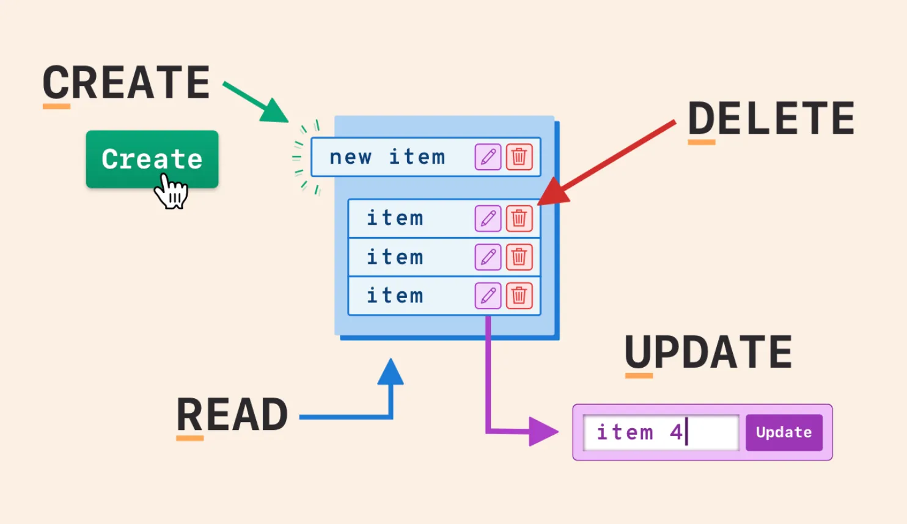

# Review CRUID

> **Note:**
>
> #### Database Operations
>
> Steel Wheels utilizes a straightforward Enterprise Resource Platform (ERP) to manage various Business Units (BUs) including Human Resources, Marketing, Finance, Supply Chain, and others. The upcoming workshops will demonstrate steps that illustrate CRUD (Create, Read, Update, Insert, Delete) operations:
>
> **Create** operations add new records to a database. This might involve inserting a new customer profile, product listing, or transaction record. In SQL, this is typically done using the INSERT statement, while in NoSQL databases, it might use methods like insertOne() or save().
>
> **Read** operations retrieve existing data from the database. This could be fetching a single record by its unique identifier or querying multiple records based on specific criteria. SQL uses SELECT statements for this purpose, while NoSQL databases might use find() or get() methods.
>
> **Update** operations modify existing records in the database. This could involve changing a customer's address, updating a product's price, or modifying any stored information. SQL uses the UPDATE statement, while NoSQL databases might use methods like updateOne() or save() on an existing document.
>
> **Delete** operations remove records from the database. This might involve permanently removing a user account or archiving old data. SQL uses the DELETE statement, while NoSQL databases typically use methods like deleteOne() or remove().

