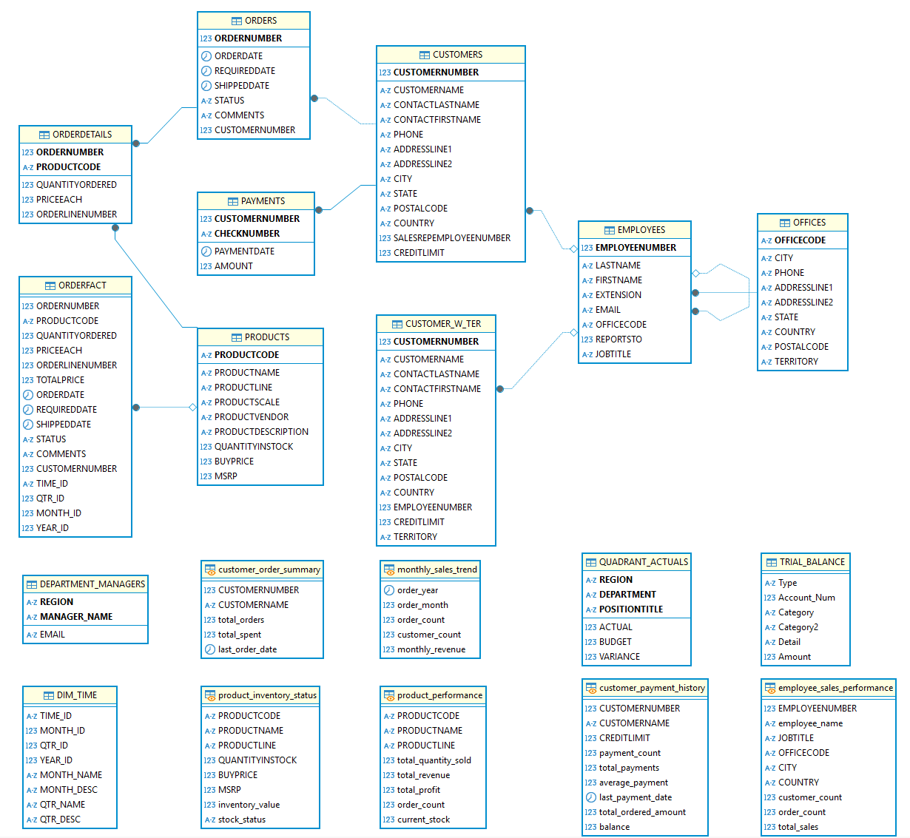

# Review Databases

Relational databases are PDI's most common counterparty. This topic walks the full CRUID surface (Create, Read, Update, Insert-Update, Delete) plus a primer on slowly changing dimensions for warehouse loading.

> **Note:**
>
> #### Steel Wheels - sampledata
> 
> Steel Wheels utilizes a straightforward Enterprise Resource Platform (ERP) to manage various Business Units (BUs) including Human Resources, Marketing, Finance, Supply Chain, and others. The upcoming workshops will demonstrate steps that illustrate CRUD (Create, Read, Update, Insert, Delete) operations:

> **Note:**
>
> #### **Steel Wheels - Schema**
> 
> The Steel Wheels ERP database schema, is designed for a manufacturing or retail company that manages complex product sales and distribution operations. The database centers around order processing, tracking customer purchases through detailed order and order detail records, while maintaining comprehensive customer profiles including contact information, territories, and credit limits.
> 
> The system supports inventory management through product tracking with quantities, pricing, and vendor relationships, and includes employee management with sales performance monitoring across different office locations.
> 
> Additional analytical capabilities are built in through summary tables for customer orders, monthly sales trends, and departmental reporting, along with specialized views for tracking product performance, payment histories, and trial balances, suggesting this ERP system serves a business that requires detailed financial reporting and sales analytics across multiple regions and product lines.
> 
> **Tables**
> 
> **OFFICES**: Stores company office locations with address details
> 
> **EMPLOYEES**: Contains employee information with relationships to offices and reporting structure
> 
> **CUSTOMERS**: Stores customer information including contact details and credit limits
> 
> **PRODUCTS**: Contains product catalog with inventory and pricing information
> 
> **ORDERS**: Tracks customer orders with status and dates
> 
> **ORDERDETAILS**: Contains line items for each order with quantity and price
> 
> **PAYMENTS**: Records customer payments with amounts and dates
> 
> **ORDERFACT**: A fact table for order analytics
> 
> **CUSTOMER\_W\_TER**: Extended customer information with territory
> 
> **DIM\_TIME**: Time dimension table for reporting
> 
> **DEPARTMENT\_MANAGERS**: Stores department manager information
> 
> **QUADRANT\_ACTUALS**: Contains budget vs. actual financial data with a generated VARIANCE column
> 
> **TRIAL\_BALANCE**: Financial accounting data
> 
> **Views**
> 
> **customer\_order\_summary**: Summarizes orders and spending by customer
> 
> **product\_performance**: Analyzes product sales metrics including revenue and profit
> 
> **employee\_sales\_performance**: Tracks sales performance by employee
> 
> **monthly\_sales\_trend**: Shows sales trends over time by month
> 
> **product\_inventory\_status**: Categorizes products by inventory levels
> 
> **customer\_payment\_history**: Summarizes customer payment activity and balances
> 
> **Stored Procedures**
> 
> **GetCustomerOrders**: Retrieves orders for a specific customer
> 
> **UpdateProductStock**: Updates product inventory levels
> 
> **GetProductSalesByQuarter**: Analyzes quarterly product sales
> 
> **GetTopCustomersByRegion**: Identifies top customers by region
> 
> **GetInventoryValueByProductLine**: Calculates inventory metrics by product line
> 
> **Triggers**
> 
> **before\_order\_insert**: Validates date constraints on orders
> 
> **before\_payment\_insert**: Ensures payment amounts are positive
> 
> **Events**
> 
> * **daily\_maintenance**: Scheduled task for database maintenance

