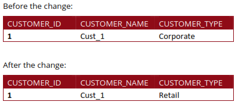
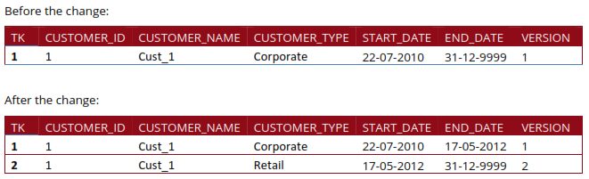
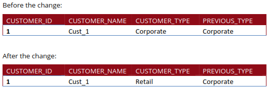
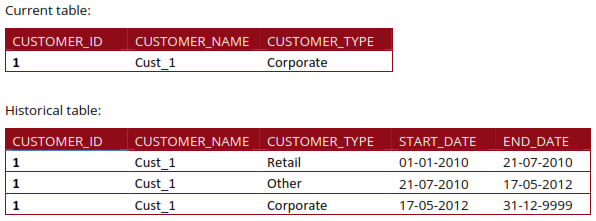
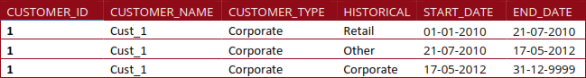

# Review SCDs

> **Note:**
>
> #### **Overview**
> 
> Slowly Changing Dimensions (SCD) - dimensions that change slowly over time, rather than changing on regular schedule, time-base. In a Data Warehouse, there is a need to track changes in dimension attributes in order to report historical data. In other words, implementing one of the SCD types should enable users assigning proper dimension's attribute value for given date. Example of such dimensions could be: customer, geography, employee.
> 
> There are many approaches how to deal with SCD. The most popular are:
> 
> * Type 0 - The passive method
> * Type 1 - Overwriting the old value
> * Type 2 - Creating a new additional record
> * Type 3 - Adding a new column
> * Type 4 - Using historical table
> * Type 6 - Combine approaches of types 1,2,3 (1+2+3=6)

::: tabs

### Type 0

> **Note:** **Type 0 - value does not change over time**
> 
> A type 0 slowly changing dimension is a dimension that never changes its attributes over time.
> 
> For example, the date of birth of a person is a type 0 attribute, because it does not change after it is recorded. A type 0 dimension can be used to store the original values of some attributes that are not relevant for historical analysis.

### Type 1

> **Note:** **Type 1 - Overwrite with new value**
> 
> Overwriting the old value. In this method, no history of dimension changes is kept in the database. The old dimension value is simply overwritten with the new one. This type is easy to maintain and is often use for data which changes are caused by processing corrections (e.g. removal special characters, correcting spelling errors).

<figure><figcaption>
Type 1
</figcaption></figure>

### Type 2

> **Note:** **Type 2 - Historically track the value change**
> 
> Type 2 - Creating a new additional record. In this methodology, all history of dimension changes is kept in the database. You capture attribute change by adding a new row with a new surrogate key to the dimension table. Both the prior and new rows contain as attributes the natural key (or another durable identifier).
> 
> Also 'effective date' and 'current indicator' columns are used in this method. There could be only one record with current indicator set to 'Y'. For 'effective date' columns, i.e. start\_date and end\_date, the end\_date for current record usually is set to value 9999-12-31.
> 
> Introducing changes to the dimensional model in type 2 could be very expensive database operation so it is not recommended to use it in dimensions where a new attribute could be added in the future.

<figure><figcaption>
Type 2
</figcaption></figure>

### Type 3

> **Note:** **Type 3 - Add a column to track value changes**
> 
> Adding a new column. In this type, usually only the current and previous value of dimension is kept in the database. The new value is loaded into 'current/new' column and the old one into 'old/previous' column.
> 
> The history is limited to the number of column created for storing historical data. This is the least commonly needed technique.

<figure><figcaption>
Type 3
</figcaption></figure>

### Type 4

> **Note:** Using historical table. In this method, a separate historical table is used to track all dimension's attribute historical changes for each of the dimension. The 'main' dimension table keeps only the current data e.g. customer and customer\_history tables.

<figure><figcaption>
Type 4
</figcaption></figure>

### Type 6

> **Note:** Combine approaches of types 1,2,3 (1+2+3=6). In this type, we have in dimension table such additional columns as:\ <mark style="color:red;">current\_type</mark> - for keeping current value of the attribute. All history records for given item of attribute have the same current value.\ <mark style="color:red;">historical\_type</mark> - for keeping historical value of the attribute. All history records for given item of attribute could have different values.\ <mark style="color:red;">start\_date</mark> - for keeping start date of 'effective date' of attribute's history. <mark style="color:red;">end\_date</mark> - for keeping end date of 'effective date' of attribute's history. <mark style="color:red;">current\_flag</mark> - for keeping information about the most recent record. In this method to capture attribute change we add a new record as in type 2. The current\_type information is overwritten with the new one as in type 1. We store the history in a historical\_column as in type 3.

<figure><figcaption>
Type 6
</figcaption></figure>

:::

