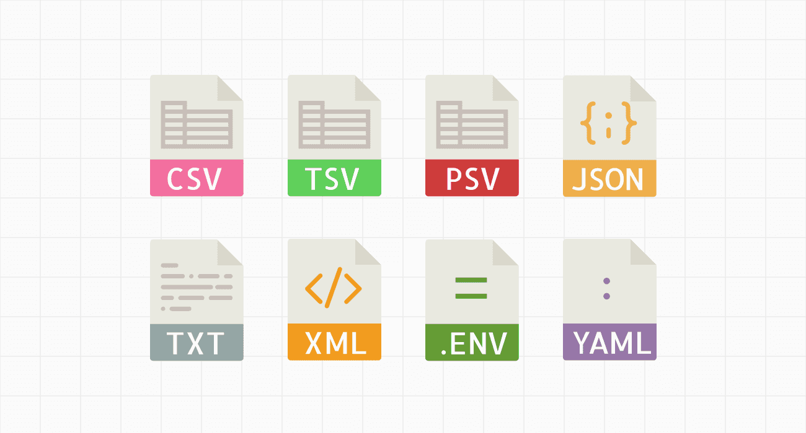

# Review Flat Files

The bread and butter of any pipeline. You'll cover the four formats you'll see most often: delimited text, JSON, XML, and Excel.

> **Note:**
>
> #### **Flat Files**
> 
> **Structured flat files** are the most common type used in data integration, containing data organized in a consistent, predictable format with clearly defined fields and delimiters. Examples include **CSV (Comma-Separated Values)** files where each row represents a record and columns are separated by commas (e.g., `CustomerID,Name,Email,Purchase_Date`), **TSV (Tab-Separated Values)** files that use tabs as delimiters, and **fixed-width files** where each field occupies a specific number of characters (common in legacy mainframe systems). These files are ideal for Pentaho transformations because their predictable structure makes them easy to parse, with each row mapping directly to a database record and each column corresponding to a specific field. 
> 
> **Unstructured flat files**, by contrast, contain free-form text without any predefined schema or organization, such as plain text documents, email bodies, or raw application log files that lack consistent formatting - these require more sophisticated text parsing and natural language processing techniques to extract meaningful data.

> **Note:** **Semi-structured flat files** occupy a middle ground, containing data with some organizational structure but without the rigid schema of databases or structured files. The most prominent examples are **JSON (JavaScript Object Notation)** files, which use key-value pairs and nested objects (e.g., `{"customer": {"id": 123, "orders": [{"item": "laptop", "price": 899}]}}`), and **XML (eXtensible Markup Language)** files that use hierarchical tags to define data relationships. These formats are self-describing and flexible, making them popular for APIs, web services, and modern application data exchange. 
> 
> **Metadata in flat files** refers to descriptive information about the data itself - this can include header rows that define column names in CSV files, schema definitions that specify data types and constraints, file-level documentation about data source and creation date, or embedded comments that explain field meanings. In Pentaho, understanding and properly handling metadata is crucial for accurate data mapping, as it helps define how the ETL process should interpret field types (string vs. integer vs. date), handle null values, and validate data quality during transformation steps.
