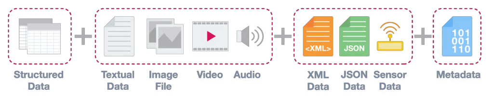
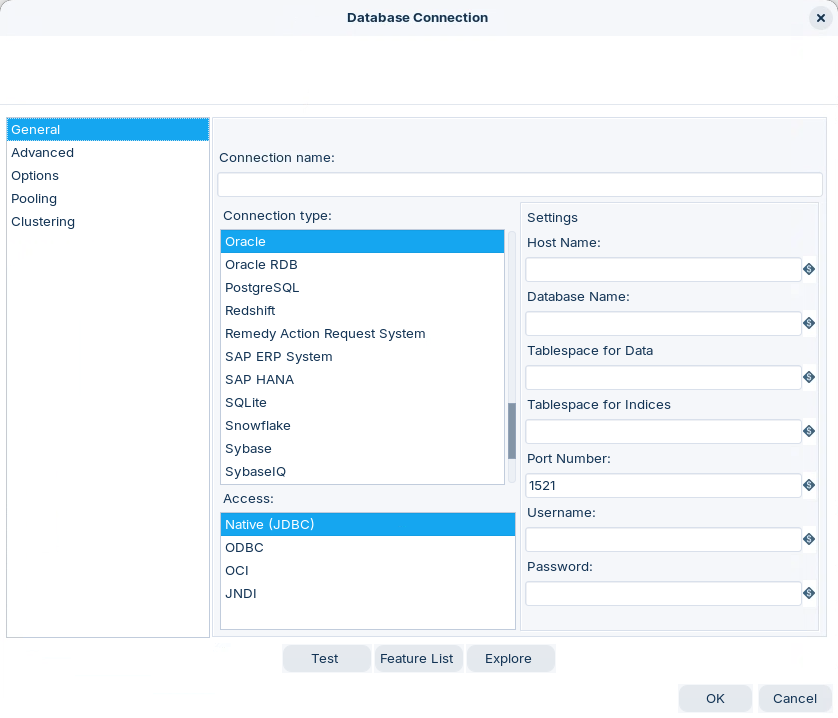
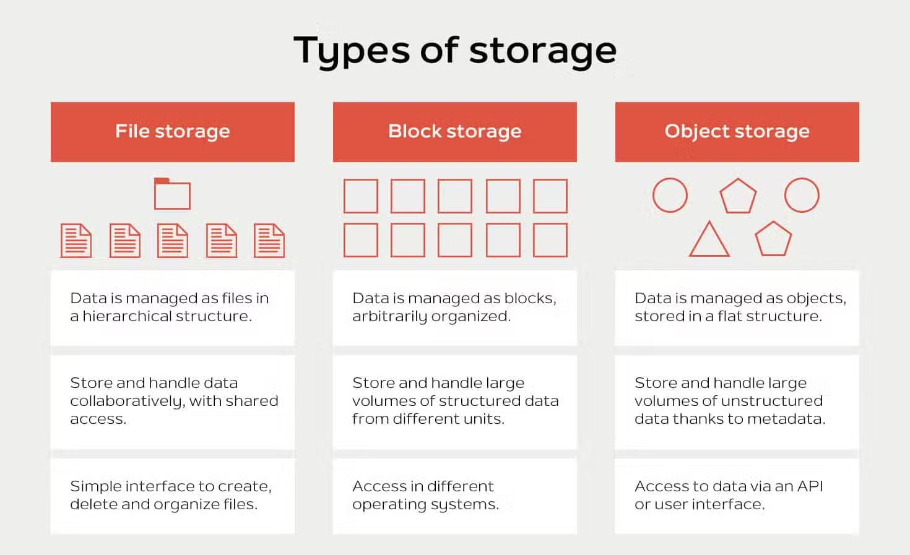
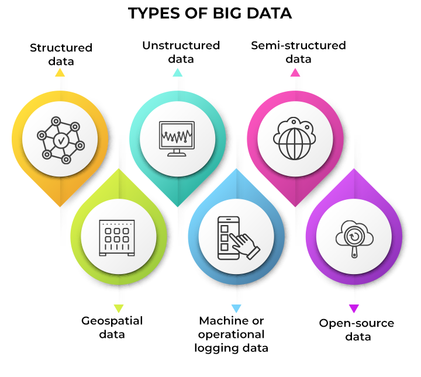
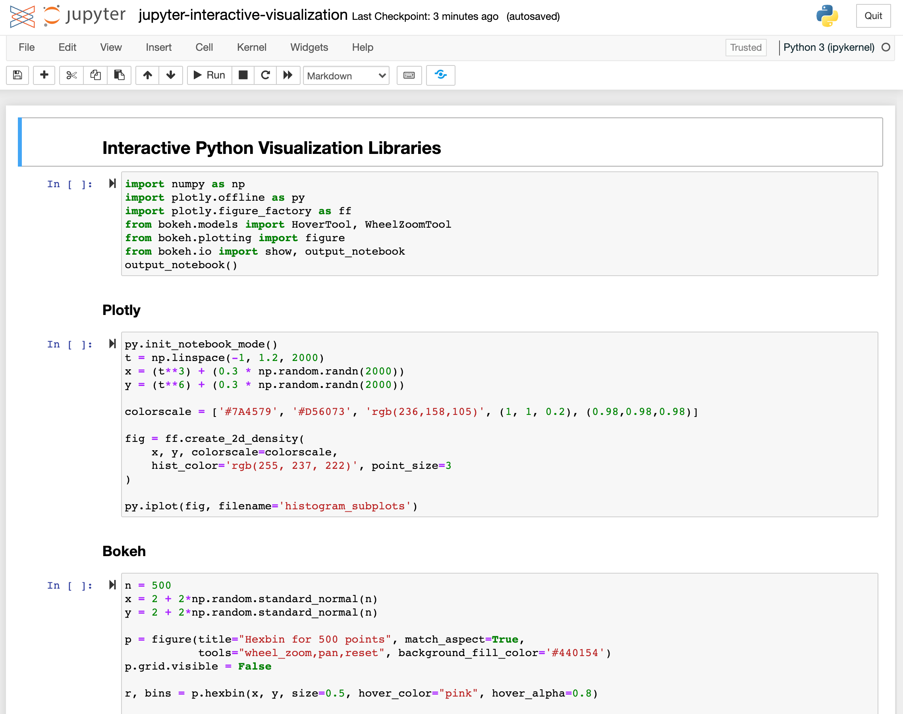

# Overview

Every PDI pipeline starts and ends at a source. This module covers the read/write side for everything you'll meet in production: flat files (text, JSON, XML, Excel, RSS), relational databases (full CRUID coverage and slowly changing dimensions), and the big-data layer — Hadoop, Snowflake, MinIO, SMB, Jupyter.

### Choose a data source

Use this page to orient yourself. Then jump into the specific connector docs:

> **Note:**
>
> #### What “data source” means in PDI
> 
> In practice, a data source is either:
> 
> * A file format you parse (CSV, Excel, JSON, XML).
> * A service you connect to (a DB, object store, cluster, or API).

:::: tabs

### Flat Files

> **Note:**
>
> #### Flat files
> 
> Use flat files when your data arrives as CSV, TXT, fixed-width, JSON, or XML.
> 
> Start here: **Flat Files**.

<figure><figcaption></figcaption></figure>

::: tabs

### Structured

> **Note:**
>
> #### Structured
> 
> Structured data uses a predefined model. It is easy to validate and query.
> 
> Think tables, rows, and columns. Examples include SQL databases and well-formed CSV files.

### Unstructured

> **Note:**
>
> #### Unstructured
> 
> Unstructured data has no consistent schema. Examples include PDFs, images, video, and free-form text.
> 
> You typically need parsing, extraction, or ML to use it.

### Semi-structured

> **Note:**
>
> #### Semi-structured
> 
> Semi-structured data has a loose schema. It uses tags or keys to describe fields and hierarchy.
> 
> Common formats are JSON and XML.

### Metadata

> **Note:**
>
> #### Metadata
> 
> Metadata is “data about data”. Examples include headers, schemas, and data dictionaries.

:::

### Databases

> **Note:**
>
> #### Databases
> 
> Pentaho connects to databases primarily through JDBC drivers. These drivers are the main interface for database communication.
> 
> Start here: **Databases**.

<figure><figcaption>
Database Connection
</figcaption></figure>

### Storage

> **Note:**
>
> #### Storage
> 
> Storage sources are cloud or network repositories. Examples include Amazon S3, Azure Blob Storage, and Google Cloud Storage.
> 
> In PDI, you typically connect through VFS. You can read and write across hybrid environments.
> 
> Start here: **Storage**.

<figure><figcaption></figcaption></figure>

### Big Data

> **Note:**
>
> #### Big Data
> 
> Big data sources require distributed compute. Common examples are Hadoop (HDFS, Hive, HBase), Spark, NoSQL, and Kafka.
> 
> PDI provides specialized steps and adapters for these platforms. This lets you transform data where it lives.
> 
> Start here: **Big Data**.

<figure><figcaption>
Types of Big Data
</figcaption></figure>

### Jupyter Notebook

> **Note:**
>
> #### Jupyter Notebook
> 
> Jupyter is a web-based notebook for code, visuals, and narrative text. It works well for exploratory analysis and prototyping.
> 
> In a PDI workflow, notebooks often handle advanced analysis. PDI handles production orchestration and scheduled pipelines.
> 
> Start here: **Jupyter Notebook**.

<figure><figcaption>
Jupyter Notebook
</figcaption></figure>

::::

