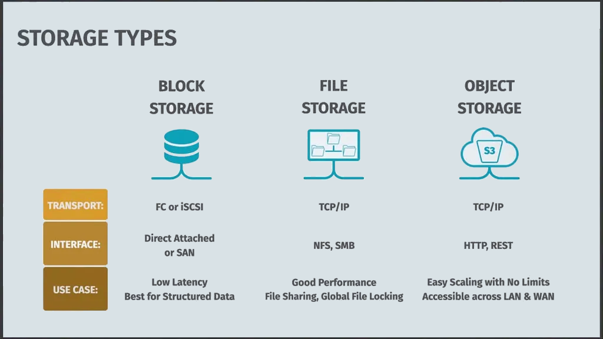

# Review Storage

Object storage as a first-class data source. Read from and write to MinIO over the S3 protocol, the same pattern you'd use for AWS S3 in production.

> **Note:**
>
> #### **Overview**
> 
> **Block Storage** operates at the raw block level using high-performance protocols like Fibre Channel (FC) at 8/16/32 Gbps or iSCSI over Ethernet, providing direct-attached storage or SAN connectivity with sub-millisecond latency. It presents logical unit numbers (LUNs) as raw disk volumes to the operating system, making it optimal for databases, virtual machine disk images, and transactional workloads requiring consistent IOPS performance and low-level disk control.
> 
> **File Storage** operates at the file system layer using network protocols like NFS (supporting NFSv3/v4 with features like client-side caching and Kerberos authentication) or SMB/CIFS (with opportunistic locking and distributed file system capabilities), providing POSIX-compliant file semantics with hierarchical directory structures, metadata management, and concurrent access controls ideal for content repositories and shared application data.
> 
> **Object Storage** uses RESTful HTTP/HTTPS APIs over TCP/IP, storing data as objects with unique identifiers in flat namespaces within buckets or containers, implementing eventual consistency models and offering features like versioning, lifecycle policies, cross-region replication, and virtually unlimited horizontal scaling through distributed hash tables, making it perfect for cloud-native applications, content distribution, backup repositories, and big data analytics requiring petabyte-scale storage with global accessibility.
> 
> MinIO is an open-source object storage solution that's compatible with Amazon S3's API. It's particularly popular for private cloud deployments and can be run on-premises or in any cloud environment. MinIO excels at high-performance workloads and is often used in conjunction with Kubernetes for scalable container deployments.
> 
> Amazon S3 (Simple Storage Service) is the industry standard for cloud object storage, offering virtually unlimited scalability, 99.999999999% durability, and extensive integration with AWS services. It provides different storage tiers (like Standard, Infrequent Access, and Glacier) to optimize costs based on access patterns.
> 
> Hitachi Content Platform (HCP) is an enterprise-grade object storage system that focuses on data governance, compliance, and security. It offers advanced features like data classification, retention policies, and WORM (Write Once, Read Many) capabilities. HCP can be deployed on-premises or in hybrid cloud configurations and supports multiple protocols including S3 compatibility.

