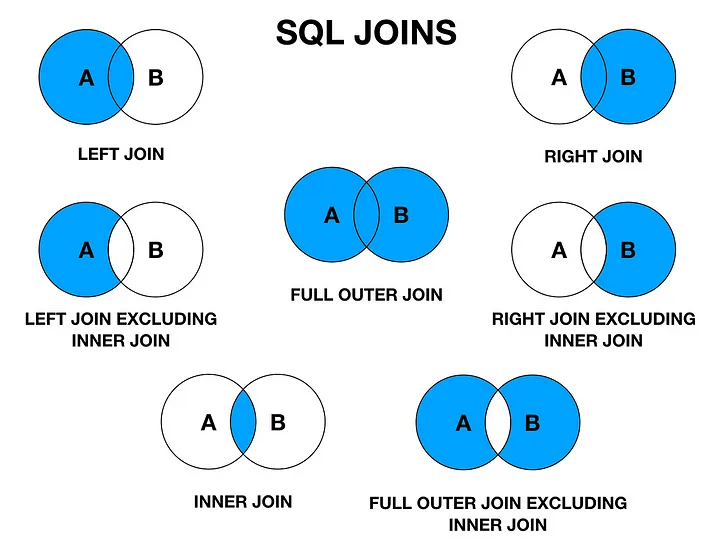
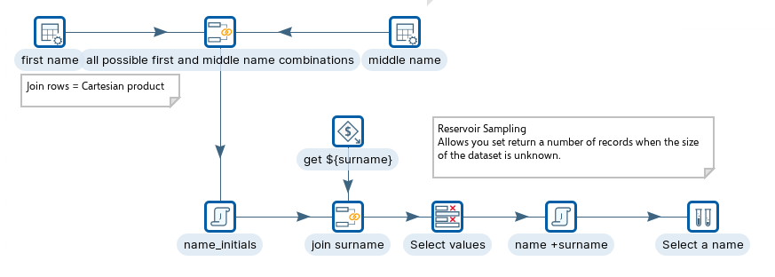
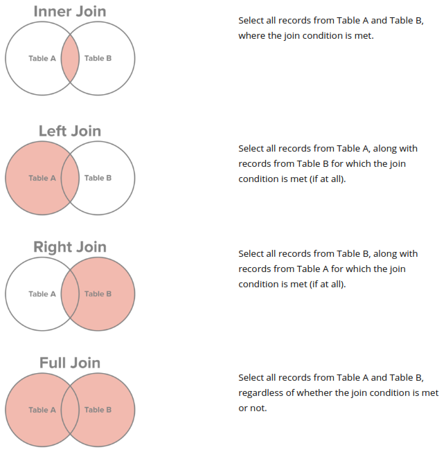

# Review Joins

Bringing two streams together by key. Database joins, join rows (cartesian-style), merge join (sorted), and XML join — pick the right one for the data you have and the size you're working at.

> **Note:** **Introduction**
> 
> Pentaho Data Integration (PDI) offers several join components to combine data from different streams based on specified key fields. Here's a summary of the main join types available:
> 
> **Merge Join**: This is the standard join step that combines two sorted input streams based on matching key fields. It supports inner joins, left outer joins, right outer joins, and full outer joins. Both input streams must be sorted on the join keys for this step to work correctly.
> 
> **Cross Join (Cartesian Product)**: This join creates all possible combinations of rows from two streams (a Cartesian product). It can be filtered to function as other join types by adding conditions. It's memory-intensive but doesn't require pre-sorted input.
> 
> **Database Join**: This specialized join allows you to look up values in a database table for each input row. It performs a database query for each incoming row, using values from the input stream as parameters.
> 
> **Multiway Merge Join**: This advanced join can combine more than two streams in a single operation, allowing for complex data integration scenarios when you need to merge multiple datasets together.
> 
> **XML Join**: A specialized join for combining XML data structures. It allows you to merge XML content from two streams, useful when working with XML-based data sources or targets.
> 
> Each join type has specific use cases and performance characteristics, allowing PDI to handle a wide variety of data integration scenarios efficiently.

> **Note:** **Workshops**
> 
> There are different types of joins that you can use in Pentaho to combine data from different sources based on a common key or condition.
> 
> Here are some joins we are going to cover in this section:

::: tabs

### Cross

> **Note:** **Cross Join**
> 
> A Pentaho cross join is a way of combining two streams of data in a Cartesian product, meaning that every row from one stream is joined with every row from the other stream. This can be useful for creating combinations of values or performing calculations based on multiple inputs.
> 
> However, a cross join can also result in a very large output, especially if the input streams have many rows. Therefore, it is important to optimize the cross join step by using filters, conditions, or lookups to reduce the number of rows or columns in the output.

<figure><figcaption>
Cross Join
</figcaption></figure>

[cross-join](https://academy.pentaho.com/pentaho-data-integration/data-integration/enrich-data/joins/cross-join)

### Merge

> **Note:** **Merge Join**
> 
> There are four basic types of SQL joins: inner, left, right, and full. The easiest and most intuitive way to explain the difference between these four types is by using a Venn diagram, which shows all possible logical relations between data sets.\
> Again, it's important to stress that before you can begin using any join type, you'll need to extract the data and load it into an RDBMS, where you can query tables from multiple sources.

<figure><figcaption>
Joins
</figcaption></figure>

[merge-join](https://academy.pentaho.com/pentaho-data-integration/data-integration/enrich-data/joins/merge-join)

### Database

> **Note:** **Database**
> 
> Database Join is a powerful step in Pentaho Data Integration that allows you to enhance your data stream with information from a database using SQL queries.
> 
> Unlike regular join steps that operate on two data streams, the Database Join connects your transformation's data stream directly to a database. It uses values from the incoming stream as parameters in SQL queries.
> 
> For each row in your input stream, PDI executes a parameterized SQL query against the specified database connection. The query results are then added as new fields to the original row.
> 
> This step is particularly efficient when you need to look up relatively small amounts of data from a database based on values in your stream. It leverages database optimization rather than performing joins within PDI's memory.
> 
> The Database Join requires a valid database connection and a properly formatted SQL query that references input fields as parameters (typically using ? placeholders).
> 
> One key limitation is that each row triggers a separate database query, which can cause performance issues with large input streams. For better performance with significant data volumes, consider using the Table Input step with a cached connection.
> 
> Be careful with the SQL query complexity, as overly complex queries may impact transformation performance. The step works best for simple lookups rather than complex analytical queries.

<figure><figcaption>
Database Join
</figcaption></figure>

[database-join](https://academy.pentaho.com/pentaho-data-integration/data-integration/enrich-data/joins/database-join)

### XML

:::

