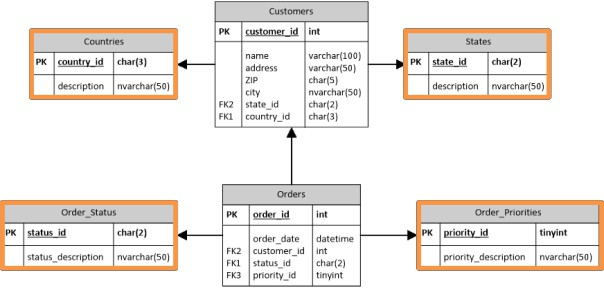

# Review Lookups

Enriching one stream with values from another. Database Lookup is the most common — point at a reference table, fetch one or more columns by key, cache for performance.

> **Note:** **Introduction**
> 
> Besides transforming the data, you may need to search and bring data from other sources. Let us look at the following examples:
> 
> * You have some product codes and you want to look for their descriptions in an Excel file
> * You have a value and want to get all products whose price is below that value from a database
> 
> Searching for information in databases, text files, web services, and so on, is a very common task, and Kettle has several steps for doing it.

> **Note:** For instance, if your database is about sales, you probably have a Customers table and an Orders table, each with its own attributes resolved through a Foreign Key. The lookup tables are usually very small, with just a handful of rows in them.

