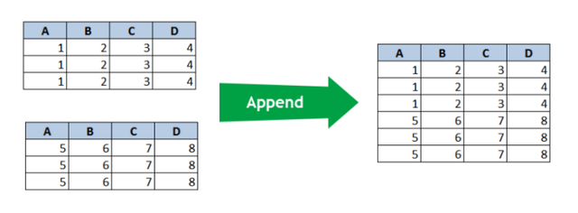
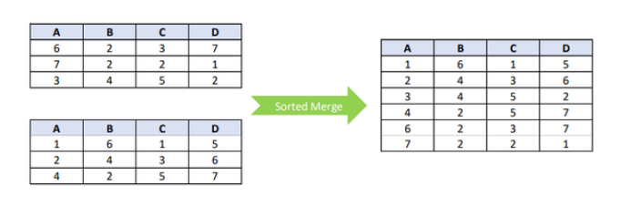

# Review Merge

When you have two streams that should become one. Merge Streams stacks rows; Merge Streams (diff) reconciles changes between two snapshots — the building block for change-data-capture patterns.

> **Note:** **Introduction**
> 
> In Pentaho Data Integration (PDI), true record merging differs from joining and focuses on combining or consolidating duplicate records into single entries:
> 
> The Append operation simply stacks records from two input streams. All rows from both streams appear in the output without any sorting or matching logic applied.
> 
> With Append, the output contains all records from the first stream followed immediately by all records from the second stream. Both input streams must share the same structure with compatible field types.

> **Note:** The Sorted Merge operation interleaves records from both input streams based on a predetermined sort order. This creates an integrated output where records are organized by their values.
> 
> For Sorted Merge to work properly, both input streams must be pre-sorted on the same field(s) before reaching the merge step. The operation preserves all records while maintaining the specified sort order.
> 
> Unlike joining operations, neither of these merging methods matches records based on key fields. They simply combine complete datasets according to different organizing principles - stacking for Append and interleaving by sort order for Sorted Merge.
> 
> Both techniques are valuable when you need to process records from multiple sources while maintaining all original data points.

> **Note:** **Workshops**
> 
> The Dummy step in Pentaho Data Integration is a simple "do nothing" transformation that passes data through unchanged. It serves as a placeholder, helps join multiple streams, creates empty data rows when needed, and improves transformation organization.
> 
> The Merge Rows step compares two input data streams with identical structures to identify differences between them. It requires configuration of reference and compare streams, key fields for matching rows, and value fields to compare. The step outputs a single stream with all rows plus a "flagfield" indicating if each row is identical, changed, new, or deleted. This functionality is particularly useful for change data capture, data synchronization, audit trails, and implementing slowly changing dimensions.

::: tabs

### Merge stream

> **Note:** **Merge stream - Dummy**
> 
> The Transformation underlines the ‘rules’ for manipulating data streams. Each data stream must have the same structure / layout, before they can be merged.
> 
> In this guided demonstration, you will merge data streams based on a set of rules:
> 
> • Add constant step

<figure><figcaption>
Merge streams
</figcaption></figure>

[merge-streams](https://academy.pentaho.com/pentaho-data-integration/data-integration/enrich-data/merge/merge-streams)

### Merge Rows (diff)

> **Note:** **Merge rows (diff)**
> 
> The Merge Rows (diff) compares the values between the merging rows and sets a ‘flag’.
> 
> In this guided demonstration, you will compare incoming records with reference records and then determine whether the record is Identical or needs updating, inserting, deleting:
> 
> • Merge Rows (diff) stream
> 
> • Merge Rows (diff) database

<figure><figcaption>
Merge Rows (diff)
</figcaption></figure>

[merge-rows-diff](https://academy.pentaho.com/pentaho-data-integration/data-integration/enrich-data/merge/merge-rows-diff)

:::

