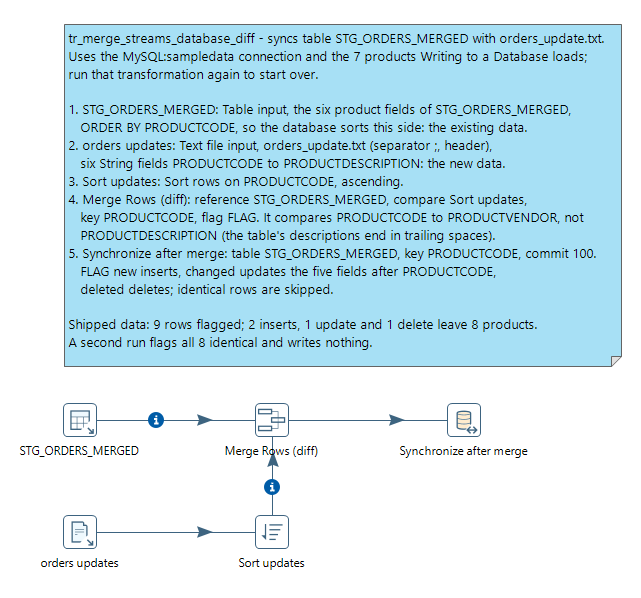

# Review Merge

When you have two streams that should become one. Merge Streams stacks rows; Merge Rows (diff) reconciles changes between two snapshots: the building block for change-data-capture patterns.

**What You'll Learn**

* How to stack two streams, with or without keeping a sort order
* Why streams must share a layout before they meet
* How **Merge rows (diff)** finds the differences between two versions of the same data

> **Note:** **Merging is not joining**
>
> A *merge* stacks rows: every row from each input comes out, and no row is matched with another. A *join* matches rows on a key and combines their fields into one row; that is the [Joins](../topic-mod4-joins-review/guide.md) topic. Either way, rows that meet in one step must have the same layout: the same fields, in the same order, with the same types.

**Append**

**Append streams** outputs every row of its first input (the *head*), then every row of its second (the *tail*). Several hops into any one step stack the rows too, but in arrival order rather than head first.

| Head: A | B | C | D |
| --- | --- | --- | --- |
| 1 | 2 | 3 | 4 |
| 1 | 2 | 3 | 4 |

| Tail: A | B | C | D |
| --- | --- | --- | --- |
| 5 | 6 | 7 | 8 |
| 5 | 6 | 7 | 8 |

| Appended: A | B | C | D |
| --- | --- | --- | --- |
| 1 | 2 | 3 | 4 |
| 1 | 2 | 3 | 4 |
| **5** | **6** | **7** | **8** |
| **5** | **6** | **7** | **8** |

**Sorted merge**

**Sorted merge** interleaves two inputs that are both already sorted on the same key, so the output stays sorted. It doesn't sort; it relies on its inputs being sorted.

| Input 1 (sorted on A): A | B |
| --- | --- |
| 3 | 4 |
| 6 | 2 |
| 7 | 2 |

| Input 2 (sorted on A): A | B |
| --- | --- |
| 1 | 6 |
| 2 | 4 |
| 4 | 2 |

| Merged, still sorted: A | B |
| --- | --- |
| **1** | **6** |
| **2** | **4** |
| 3 | 4 |
| **4** | **2** |
| 6 | 2 |
| 7 | 2 |

::: tabs

### Merge Streams

> **Note:** **Merge Streams**
>
> In the [Merge Streams](../20-mod4-merge-streams/guide.md) workshop you bring two streams with different fields to one layout, with **Add constants** and **Select values**, and merge them in a **Dummy** step.

<figure><figcaption>
Merge Streams
</figcaption></figure>

### Merge Rows (diff)

> **Note:** **Merge Rows (diff)**
>
> **Merge rows (diff)** compares a *reference* stream with a *compare* stream, matched on key fields, and adds a flag to every row: `identical`, `changed`, `new` or `deleted`. **Synchronize after merge** then turns the flags into inserts, updates and deletes on a table. Together they find and apply what changed between two snapshots: change data capture without database triggers.
>
> In the [Merge Rows (diff)](../21-mod4-merge-streams-diff/guide.md) workshop you compare two files, then a file with a table.

<figure><figcaption>
Merge Rows (diff)
</figcaption></figure>

:::
