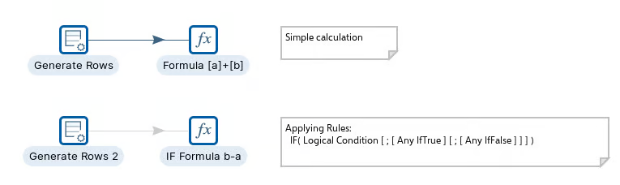
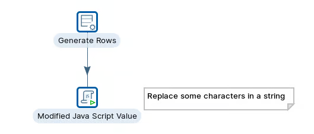
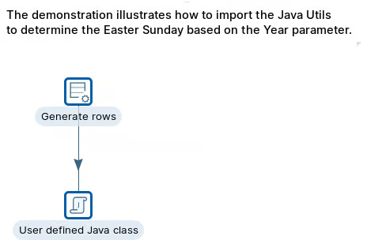

# Review Scripting

When the visual steps don't quite fit. Formula handles spreadsheet-style expressions; Modified JavaScript Value lets you write per-row logic in JavaScript when the transformation needs procedural code.

> **Note:** **Introduction**
> 
> There’s often a careful balancing act to perform with ETL workflows. For example, consider schema changes: new data sources need to be added, and the data model needs to be updated. In the manual route, you would need to go back to the drawing board, make the necessary changes and then run a series of test to make sure you haven’t broken anything; in larger data teams or deployments, multiple people need to be intimately familiar with the code whenever a simple modification is needed.
> 
> On the other hand, a visual ETL layer makes the process much more transparent and easier to modify, as well as troubleshoot in case things go wrong. And more importantly: every change is clearly documented, immediately noticeable and can be retraced – without having to spend hours or days poring over code to locate a change made by one of the developers, who in the meantime has gone on his annual vacation.
> 
> Pentaho Data Integration has several steps / job entries that help you automate the workflow. One of the most flexible, is the job entry:
> 
> **Execute a shell script**
> 
> Use the Shell job entry to execute a shell script on the host where the job is running. For example, suppose you have a program that reads five data tables and creates a file in a specified format. You know the program works. Shell allows you to do portions of your work in Pentaho Data Integration but reuse the program that reads the data tables as needed.
> 
> The Shell job entry is platform agnostic; you can use a batch file, UNIX, and so on. When you use a Shell job entry, Pentaho Data Integration makes a Java call to execute a program in a specified location. The return status is provided by the operating system call. For example, in batch scripting a return value of 1 indicates that the script was successful; a return value of 0 (zero) indicates that it was unsuccessful. You can pass command line arguments and set up logging for the Shell job entry.

#### Workshops

::: tabs

### Formula

> **Note:** The Formula transform allows you to apply Excel-like formulas and functions on fields in a pipeline.
> 
> With a formula you are not limited to comparing to three fields like in the Calculator. This is where you can set and compare Date and Times as well.
> 
> You have the option of creating a new field (use New field column) or replacing a field (use Replace value column).
> 
> Formula Examples using the TEXT function:
> 
> * Int to Text: "size=" & TEXT(\[RowLimitInteger],"0").
> * DateTime to Text: \[StartDateField] & "=" & TEXT(\[StartDateTime], "yyyy-mm-dd")
> * String to Text: "new\_counter=" & TEXT(\[counter]+1, "0")

<figure><figcaption></figcaption></figure>

[formula](https://academy.pentaho.com/pentaho-data-integration/data-integration/enrich-data/scripting/formula)

### Modified JavaScript Value

> **Note:** The JavaScript transform provides a user interface for building JavaScript expressions that you can use to modify your data. The code you type in the script area is executed once for each input row.

<figure><figcaption></figcaption></figure>

[modified-javascript-value](https://academy.pentaho.com/pentaho-data-integration/data-integration/enrich-data/scripting/modified-javascript-value)

### User Defined Java Class

> **Note:** You can use the User Defined Java Class step to enter your own Java class to drive the functionality of a complete step. You can program your own plugin into a step, yet the goal of this step is not to do full-scale Java development inside of a step.
> 
> The goal is for you to just define Java methods and logic. For this step, the [Janino](https://janino-compiler.github.io/janino/apidocs/) project libraries are used to compile Java code in the form of classes at runtime.

<figure><figcaption></figcaption></figure>

[user-defined-java-class](https://academy.pentaho.com/pentaho-data-integration/data-integration/enrich-data/scripting/user-defined-java-class)

### Executors

:::

