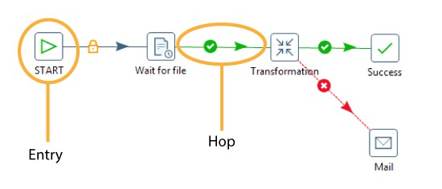
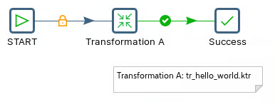
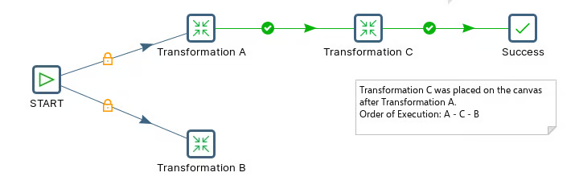
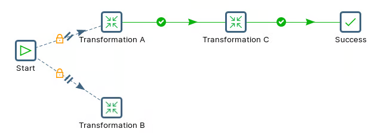

# Review Jobs

Transformations move rows; jobs orchestrate transformations. You'll build a Hello World job, then learn how to control the order of execution — the foundation for any scheduled production pipeline.

> **Note:** **Jobs**
> 
> In most ETL tasks you need to be able to perform maintenance tasks, orchestrate the execution of the transformations, and handle errors and retries. These tasks are handled by Jobs.\
> A job consists of one or more job entry that are executed in a specific order. The order of the execution is determined by the job hops between the job entries as well as the executions themselves. Job entries differ in several ways:
> 
> * You can create shadow copies of a job entry. This allows to place the same job entry in a job on multiple locations.
> * A job entry passes a results object between job entries. This means that once a job entry has been completed all rows are transferred at once, rather than in a streaming fashion.
> * Job entries are executed in a certain sequence (except if set to parallel execution)

> **Note:** Besides the execution order, a hop also specifies the condition on which the next job entry will be executed. You can specify the Evaluation mode by right clicking on the job hop. A job hop is just a flow of control. Hops link to job entries and, based on the results of the previous job entry, determine what happens next.

> **Note:** **Workshops**
> 
> x

::: tabs

### Jobs

> **Note:** Start off with an overview of the components that define a Job.
> 
> Create a Job that executes the 'hello world' transformation.
> 
> * START
> * Job Entry

<figure><figcaption></figcaption></figure>

**Job Hello World**

### Backward Chaining

> **Note:** In Pentaho, a job is a sequence of steps that can be executed in a specific order. A job can contain one or more transformations, which are executed in parallel or sequentially.
> 
> Backward chaining is a technique used to execute a job in which the execution of a transformation depends on the successful execution of another transformation. In other words, it is a technique used to execute transformations in reverse order.

<figure><figcaption></figcaption></figure>

**Backward Chaining**

### Parallel

> **Note:** Running Pentaho jobs in parallel can help improve performance and efficiency in data integration and ETL processes.

<figure><figcaption></figcaption></figure>

**parallel**

:::

