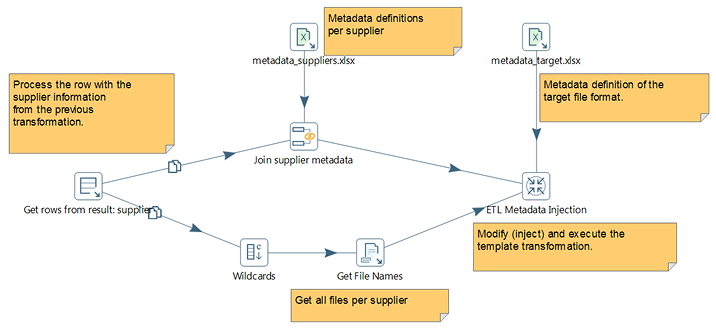

# Review Metadata Injection

> **Note:**
>
> #### **Introduction**
> 
> Metadata injection inserts data from various sources into a transformation at runtime. This insertion reduces repetitive ETL tasks.
> 
> For example, you might have a simple transformation to load transaction data values from a supplier, filter specific values, and output them to a file. If you have more than one supplier, you would need to run this simple transformation for each supplier. Yet, with metadata injection, you can expand this simple repetitive transformation by inserting metadata from another transformation that contains the ETL Metadata Injection step.
> 
> The step coordinates the data values from the various inputs through the metadata you define.
> 
> The repetitive transformation is known as the template transformation. The template transformation is called by the ETL Metadata Injection step.

<figure><figcaption>
MDI
</figcaption></figure>

***
