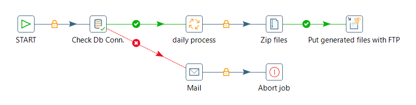
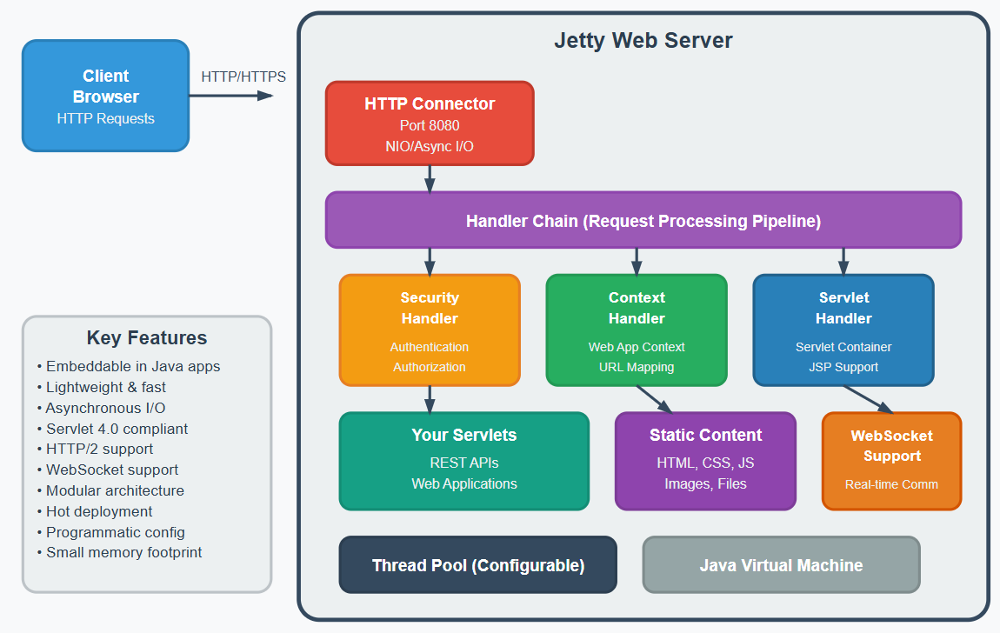

# Overview

Standalone transformations don't survive contact with production. This module is about going from 'it works on my machine' to a maintainable, scheduled, parameterised pipeline that scales: jobs, parameters and variables, and master/slave + partitioning.

> **Note:** **Jobs & Carte Servers**
> 
> Jobs are workflows whose role is to orchestrate the execution of a set of tasks: they generally synchronize and prioritize the execution of tasks and give an order of execution based on the success or failure of the execution of the current task. These tasks are basic tasks that either prepare the execution environment for other tasks that are next in the execution workflow or that manage the artefacts produced by tasks that are preceding them in the execution workflow.
> 
> For example, there are tasks that manipulate files and directories in the local filesystem, tasks that move files between remote servers through FTP or SSH, and tasks that check the availability of a table or the content of a table. Any job can call other jobs or transformations to design more complex processes. Therefore, jobs orchestrate the execution of jobs and transformations into large ETL processes.

> **Note:** Carte is a simple web server that allows you to run transformations and jobs remotely. It receives XML (using a small servlet) that contains the transformation to run and the execution configuration. It allows you to remotely monitor, start and stop the transformations and jobs that run on the Carte server.
> 
> You can set up an individual instance of Carte to operate as a standalone execution engine for a job or transformation. In Spoon, you can define one or more Carte servers and send jobs and transformations to them. If you want to improve PDI performance for resource-intensive transformations and jobs, use Carte cluster.

