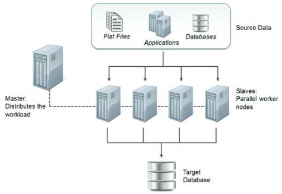

# Review Scalability

Two ways to make PDI go faster: master/slave nodes for distributing work across machines, and partitioning for splitting a stream into parallel pipelines. When one transformation isn't enough.

> **Note:** **Introduction**
> 
> If you want to speed the processing of your transformations, consider setting up a PDI Carte cluster. A PDI Carte cluster consists of two or more Carte slave servers and a Carte master server. When you run a transformation, the different parts of it are distributed across Carte slave server nodes for processing, while the Carte master server node tracks the progress.

> **Note:** **Workshops**

::: tabs

### Slave server

> **Note:** A slave server is essentially a small embedded webserver. We use this web-server to control the slave server. The slave server is started with the Carte program found in your PDI distribution. The arguments used to start a slave server with Carte are discussed elsewhere but the minimum is always an IP-address or hostname and a HTTP port to communicate.
> 
> For example:
> 
> sh carte.sh localhost 8000
> 
> carte.bat localhost 8000

x

x

x

[run-configurations](https://academy.pentaho.com/pentaho-data-integration/data-integration/enterprise-solution/scalability/run-configurations)

### Cluster schema

> **Note:** A cluster schema is essentially a collection of slave servers. In each schema, you need to pick at least one slave server that we will call the Master slave server or master. The master is also just a carte instance, but it takes care of all sort of management tasks across the cluster schema.
> 
> The slave server metadata can be entered in the Spoon GUI by basically giving your Carte instance a name and entering the same data.
> 
> There are two types of Carte clusters:
> 
> **Static Carte** cluster has a fixed schema that specifies one master node and two or more slave nodes. In a static cluster, you specify the nodes in a cluster at design-time, before you run the transformation or job.
> 
> Static clusters are a good choice for smaller environments where you don't have a lot of machines (virtual or real) to use for PDI transformations. Dynamic clusters work well if nodes are added or removed often, such as in a cloud computing environment.
> 
> **A Dynamic Carte** cluster has a schema that specifies one master node and a varying number of slave nodes. Unlike a static cluster, slave nodes are not known until runtime. Instead, you register the slave nodes, then at runtime, PDI monitors the slave nodes every 30 seconds to see if it is available to perform transformation and job processing tasks.
> 
> Dynamic clustering is also more appropriate in environments where transformation performance is extremely important, or if there can potentially be multiple concurrent transformation executions.

**Configure a Static Carte Cluster**

Follow the directions below to set up static Carte slave servers.

1. Copy over any required JDBC drivers and PDI plugins from your development instances of PDI to the Carte instances.
2. Run the Carte script with an IP address, hostname, or domain name of this server, and the port number you want it to be available on:

sh carte.sh \[IP address] \[port]

carte.bat \[IP address] \[port]

3. If you will be executing content stored in a Pentaho Repository, copy the repositories.xml file from the .kettle directory on your workstation to the same location on your Carte slave. Without this file, the Carte slave will be unable to connect to the Pentaho Repository to retrieve content.
4. Ensure that the Carte service is running as intended, accessible from your primary PDI development machines, and that it can run your jobs and transformations.
5. To start this slave server every time the operating system boots, create a startup or init script to run Carte at boot time with the same options you tested with.

### Partitioning

> **Note:** Partitioning data allows you to distribute all the data from a set into distinct subsets according to the rule applied on a table or row, where these subsets form a partition of the original set with no item replicated into multiple groups.
> 
> Partitioning data is an important feature for scaling up and scaling out your Pentaho Data Integration transformations and jobs.Scaling up makes the most of a single server with multiple CPU cores, while scaling out maximizes the resources of multiple servers operating in parallel.

[partition](https://academy.pentaho.com/pentaho-data-integration/data-integration/enterprise-solution/scalability/partition)

:::

