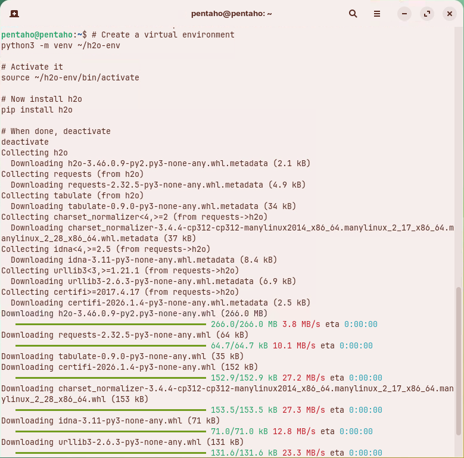
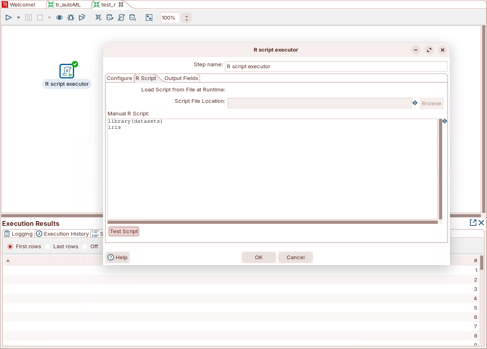
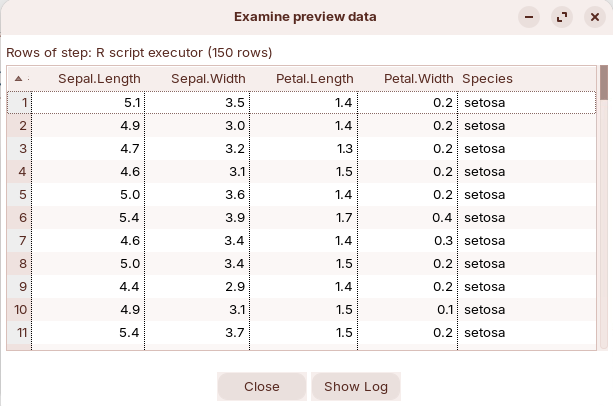

# Prerequisite tasks

> **Note:** You will set up:
> 
> * Python (and common ML libraries)
> * A Google Colab account
> * R (optional) and rJava (for R steps in PDI)
> * PDI environment variables for R integration

### Google Colab

Colab runs Jupyter notebooks in your browser. It includes preconfigured runtimes for common ML libraries.

**🎥 Embed:** [Google Colab](<https://colab.research.google.com/#scrollTo=5fCEDCU_qrC0>)

<figure><figcaption><p>Colab</p></figcaption></figure>

***

> **Note:** These steps configure your environment to run ML pipelines in PDI.

### Linux (Ubuntu/Debian)

> **Success:** This section is for Linux environments that use `apt`.

**Step 1.** **Install or verify Python**

1. Update packages:

```bash
sudo apt update && sudo apt upgrade -y
```

2. Verify Python:

```bash
python3 --version
```

<details>

<summary>Optional: install a newer Python version (deadsnakes PPA)</summary>

Only do this if you must upgrade Python.

```bash
sudo apt install dirmngr ca-certificates software-properties-common apt-transport-https -y
sudo gpg --no-default-keyring --keyring /usr/share/keyrings/deadsnakes.gpg --keyserver keyserver.ubuntu.com --recv-keys F23C5A6CF475977595C89F51BA6932366A755776
echo "deb [signed-by=/usr/share/keyrings/deadsnakes.gpg] https://ppa.launchpadcontent.net/deadsnakes/ppa/ubuntu $(lsb_release -cs) main" | sudo tee /etc/apt/sources.list.d/pythonppa-deadsnakes.list
sudo apt-get update
apt-cache search python3.12
sudo apt install python3.12-full -y
```

If you need multiple versions, use `update-alternatives`:

```bash
ls -ls /usr/bin/python*
sudo update-alternatives --install /usr/bin/python python /usr/bin/python3.10 1
sudo update-alternatives --install /usr/bin/python python /usr/bin/python3.12 2
sudo update-alternatives --config python
```

</details>


**Step 2.** **Install ML libraries (venv)**

Install these libraries:

* `h2o`
* `pandas`
* `numpy`
* `matplotlib`
* `py4j`

**🎥 Embed:** [Python package reference](<https://apmonitor.com/pds/index.php/Main/InstallPythonPackages>)

```bash
python3 -m venv ~/h2o-env
source ~/h2o-env/bin/activate
pip install h2o pandas numpy matplotlib py4j
pip list | grep -E "h2o|pandas|numpy|matplotlib|py4j"
which python
deactivate
```

<figure><figcaption><p>h2o</p></figcaption></figure>


**Step 3.** **Install R and rJava**

R is required only if you plan to run R steps in PDI.

1. Install R:

```bash
sudo apt update && sudo apt upgrade -y
sudo apt install r-base r-base-dev -y
```

2. Verify:

```bash
R --version
```

> **Warning:** Running `R` without `sudo` installs packages for your user. Use `sudo -i R` to install system-wide packages.

3. Install & configure rJava:

```bash
java --version
sudo apt-get update
sudo apt-get install default-jdk libtirpc-dev -y
sudo R CMD javareconf
```

> **Note:** `R CMD javareconf` is a command-line tool used in the R programming environment to detect the current Java installation on your system and update R's configuration files to match it.&#x20;

4. Install rJava from source:

```bash
cd /tmp
wget https://cloud.r-project.org/src/contrib/rJava_1.0-14.tar.gz
tar -xzf rJava_1.0-14.tar.gz
cd rJava
./configure --with-java-home=/usr/lib/jvm/default-java JAVA_LIBS="-L/usr/lib/jvm/default-java/lib/server -ljvm"
cd /tmp
sudo R CMD INSTALL rJava
```

5. Verify rJava:

```bash
R -e "library(rJava); .jinit(); system.file(package='rJava')"
```

<details>

<summary>Optional: install RStudio</summary>

Use RStudio only if you want a dedicated IDE.

1. Download a `.deb` from the [RStudio downloads page](https://posit.co/download/rstudio-desktop/).
2. Install it:

```bash
sudo apt install -f ./rstudio-*.deb
```

</details>


**Step 4.** **Configure PDI for R integration**

Set environment variables

You can get the paths from R:

```bash
R -e "Sys.getenv('R_HOME'); Sys.getenv('R_LIBS_USER')"
```

Edit `/etc/environment` and set the values for your system (new terminal):

```bash
sudo nano /etc/environment
```

Example:

<pre><code><strong># Add ::/usr/lib/R/bin
</strong><strong>PATH="/usr/local/sbin:/usr/local/bin:/usr/sbin:/usr/bin:/sbin:/bin:/usr/games:/usr/local/games:/snap/bin:/usr/lib/R/bin"
</strong>
# R variables
R_HOME=/usr/lib/R
R_LIBS_USER=/home/pentaho/R/x86_64-pc-linux-gnu-library/4.3
</code></pre>

Ensure `PATH` includes your /usr/lib/`R/bin` directory:

PATH="/usr/local/sbin:/usr/local/bin:/usr/sbin:/usr/bin:/sbin:/bin:/usr/games\:/usr/local/games\:/snap/bin<mark style="color:red;">:/usr/lib/R/bin</mark>"

Copy `libjri.so` into Spoon’s native lib directory:

```bash
cd /usr/local/lib/R/site-library/rJava/jri
cp libjri.so ~/Pentaho/design-tools/data-integration/native-lib/linux/x86_64/
sudo chown pentaho:pentaho ~/Pentaho/design-tools/data-integration/native-lib/linux/x86_64/libjri.so
```


**Step 5.** **Validate with a simple R transformation**

> **Danger:** You may need to restart your machine to register the libraries.

1. Start PDI:

```bash
cd ~/Pentaho/design-tools/data-integration
./spoon.sh
```

2. Create a transformation with an **R Script Executor** step:

<figure><figcaption><p>R Script Executor</p></figcaption></figure>

3. Use this script:

```r
library(datasets)
iris
```

4. Click **Test Script**:

<figure><figcaption><p>Preview</p></figcaption></figure>
