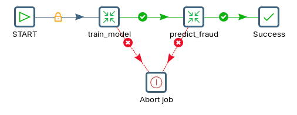
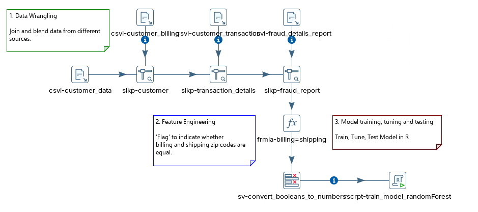
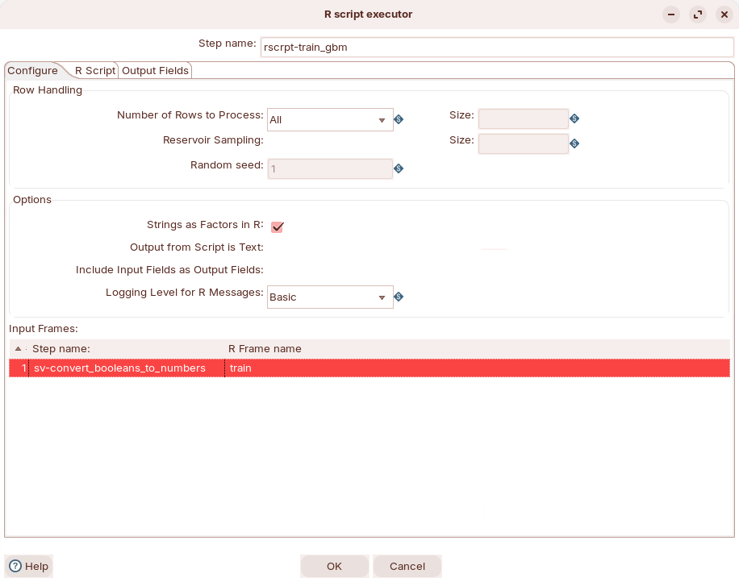
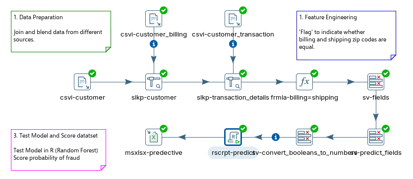
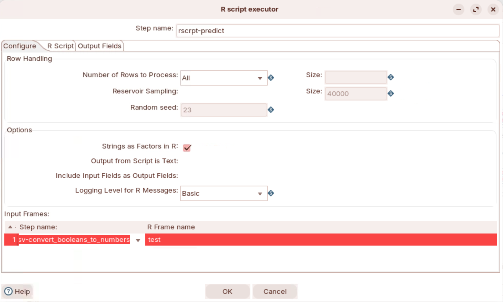
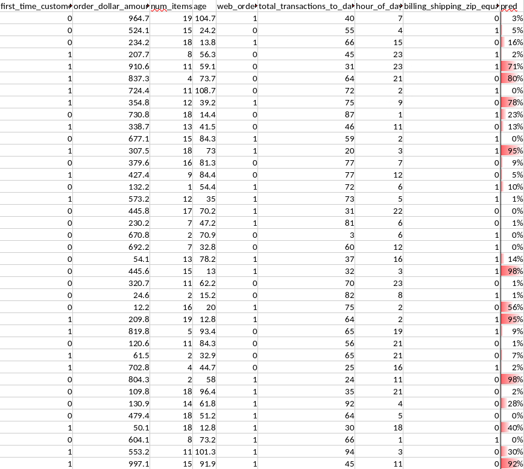

# Credit Card

> **Note:** The results from H2O point to using a **Gradient Boosting (GBM)** algorithm.
> 
> In this lab, you operationalize that choice in PDI:
> 
> * Train a GBM model in R.
> * Save the model artifact.
> * Predict fraudulent credit card transactions.
> 
> You will use the R `gbm` package.

**🎥 Embed:** [Walkthrough (video)](<https://www.loom.com/share/9da8c5b2d19245a780b402abbde5f00c?hideEmbedTopBar=true&hide_owner=true&hide_share=true&hide_title=true>)

::: tabs

### Train the Model

> **Note:** Train a GBM model with the same dataset.

<figure><figcaption><p>main_job.kjb</p></figcaption></figure>

1. In Spoon, open the following main job:

```
~/Workshop--Data-Integration/Labs/Module 7 - Workflows/Machine Learning/Credit Card Fraud/solution/jb_fraud_main_job.kjb
```

2. Right-click the **train\_model** transformation.
3. Select **Open referenced object > Transformation**.

<figure><figcaption><p>train model</p></figcaption></figure>

***

**R Script Executor**

1. Open the `rscrpt-train_gbm` step.
2. On the **Configure** tab, set:
   * **Input frames**: `sv-convert_booleans_to_numbers`
   * **R frame name**: `train`

<figure><figcaption></figcaption></figure>

3. Set **Row handling > Number of rows to process** to **All**.
4. On the **R script** tab, paste this script:

```r
# ============================================================
# GBM Model Training - Credit Card Fraud Detection
# ============================================================
# This script trains a Gradient Boosting Machine (GBM) model
# to predict fraudulent credit card transactions.
# It runs inside the PDI R Script Executor step.
# ============================================================

# Load the GBM library for gradient boosting
library(gbm)

# Convert the incoming PDI data frame ("train") to a standard R data frame
# The "train" variable is automatically created by the R Script Executor
# from the input step: sv-convert_booleans_to_numbers
train.df <- as.data.frame(train)

# Convert the target variable to binary 0/1
# as.factor() creates levels, as.numeric() assigns 1 and 2, then subtract 1
# Result: 0 = not fraud, 1 = fraud
train.df$reported_as_fraud_historic <- as.numeric(
  as.factor(train.df$reported_as_fraud_historic)
) - 1

# Train the GBM model
# --------------------------------------------------------
# Note: We use OOB (out-of-bag) estimation instead of
# cross-validation (cv.folds) because JRI runs R inside
# the JVM process. Cross-validation spawns additional
# processes that exceed the FD_SETSIZE limit (1024) in
# Linux's select() system call, causing the JVM to abort.
# --------------------------------------------------------
gbm_model <- gbm(
  reported_as_fraud_historic ~ .,   # predict fraud using all other columns
  data = train.df,                  # training data
  distribution = "bernoulli",       # binary classification (fraud yes/no)
  n.trees = 500,                    # number of boosting iterations
  interaction.depth = 4,            # max depth of each tree
  shrinkage = 0.01,                 # learning rate (smaller = more robust)
  n.minobsinnode = 10,              # min observations per terminal node
  bag.fraction = 0.5                # use 50% of data per tree (stochastic GBM)
)

# Determine the optimal number of trees using OOB error
# This avoids overfitting by finding where performance plateaus
best_trees <- gbm.perf(gbm_model, method = "OOB")

# Save the trained model and optimal tree count to disk
# The predict transformation will load this file to score new transactions
save(gbm_model, best_trees,
  file = "/home/pentaho/Workshop--Data-Integration/Labs/Module 7 - Use Cases/Machine Learning/Credit Card Fraud/solution/train_model_output/gbm_fraud.rdata"
)

# Return a status message to PDI
# The R Script Executor expects a data frame as output
ok <- "Finished"
ok.df <- as.data.frame(ok)
ok.df
  )

  # Determine the optimal number of trees using Out-of-Bag (OOB) estimation.
  # gbm.perf() analyzes the OOB improvement curve and returns the iteration
  # (tree count) where the OOB error is minimized. Using more trees than this
  # would overfit; using fewer would underfit. This value will be used during
  # scoring to make predictions with only the best-performing subset of trees.
  best_trees <- gbm.perf(gbm_model, method = "OOB")

  # Save the trained model object and the optimal tree count to an .rdata file.
  # This file will be loaded later by a separate PDI scoring transformation
  # to apply the model to new/unseen transactions for real-time fraud detection.
  save(
    gbm_model,
    best_trees,
    file = "/home/pentaho/Workshop--Data-Integration/Labs/Module 7 - Use Cases/Machine Learning/Credit Card Fraud/solution/train_model_output/gbm_fraud.rdata"
  )

  # If we reach this point, training completed successfully.
  # This string is returned as the value of 'ok' by tryCatch().
  "Finished"

# Error handler: if ANY step above throws an R error, this function catches it
# and returns the error message as a string. This ensures the script always
# produces the 'ok' output column that PDI expects, while preserving the
# actual error details for troubleshooting in the PDI log.
}, error = function(e) {
  paste("ERROR:", e$message)
})

# Create a single-column data frame with the status result.
# The R Script Executor step in PDI expects a data frame as output.
# The column name 'ok' must match what is configured in the step's output fields.
#   - "Finished"       = training completed successfully
#   - "ERROR: <msg>"   = training failed; check the message for the root cause
# This allows downstream PDI steps (e.g., a Filter or Switch/Case) to route
# the flow based on success or failure of the model training.
ok.df <- as.data.frame(ok)
ok.df
```

> **Note:** This step writes the model artifact to:
> 
> `/home/pentaho/Workshop--Data-Integration/Labs/Module 7 - Use Cases/Machine Learning/Credit Card Fraud/solution/train_model_output/gbm_fraud.rdata`

### Predict Fraud

> **Note:** Use the saved GBM model to score new transactions.

<figure><figcaption><p>main_job.kjb</p></figcaption></figure>

1. In Spoon, open the following main job:

```
~/Workshop--Data-Integration/Labs/Module 7 - Workflows/Machine Learning/Credit Card Fraud/solution/jb_fraud_main_job.kjb
```

2. Right-click the transformation labeled **predict fraud**.
3. Select **Open referenced object > Transformation**.

<figure><figcaption><p>predict fraud</p></figcaption></figure>

***

**R Script Executor**

1. Open the `rscrpt-predict` step.
2. On the **Configure** tab, set:
   * **Input frames**: `sv-convert_booleans_to_numbers`
   * **R frame name**: `test`

<figure><figcaption><p>Configure R script</p></figcaption></figure>

3. Set **Row handling > Number of rows to process** to **All**.
4. On the **R script** tab, paste this script:

```r
# ============================================================
# GBM Prediction - Credit Card Fraud Detection
# ============================================================
# This script loads the trained GBM model and scores new
# transactions with a fraud probability (0 to 1).
# It runs inside the PDI R Script Executor step.
# ============================================================

# Load the GBM library
library(gbm)

# Convert the incoming PDI data frame ("test") to a standard R data frame
# The "test" variable is automatically created by the R Script Executor
# from the input step: sv-convert_booleans_to_numbers
test.df <- as.data.frame(test)

# Load the trained model artifact saved during the training step
# This file contains: gbm_model (the trained model) and best_trees (optimal tree count)
load(file = "/home/pentaho/Workshop--Data-Integration/Labs/Module 7 - Use Cases/Machine Learning/Credit Card Fraud/solution/train_model_output/gbm_fraud.rdata")

# ============================================================
# Score each transaction with a fraud probability
# ============================================================
# type = "response" returns probabilities on the 0..1 scale
# (since the model was trained with distribution = "bernoulli")
# Values closer to 1 indicate higher likelihood of fraud
fraud_prob <- predict(
  gbm_model,
  newdata = test.df,
  n.trees = best_trees,
  type = "response"
)

# ============================================================
# Build the output data frame
# ============================================================
# fraud_probability  : raw probability from the model (0 to 1)
# fraud_pct          : probability as a percentage for readability
# predicted_fraud    : binary flag using a 50% decision threshold
#                      adjust threshold based on business rules
#                      (e.g., 0.3 for more aggressive fraud catching)
pred.df <- data.frame(
  fraud_probability = fraud_prob,
  fraud_pct         = round(fraud_prob * 100, 2),
  predicted_fraud   = ifelse(fraud_prob >= 0.5, 1, 0)
)

# Combine the original test data with the predictions
# This preserves all input fields so downstream PDI steps
# can filter, sort, or write results with full context
submission <- cbind(test.df, pred.df)

# Return the combined data frame to PDI
submission
```

> **Note:** This script returns a probability. Use a threshold to flag fraud.

### Results

> **Note:** AObviously can be used to trigger further events downstream..

1. Open:

```
~/Workshop--Data-Integration/Labs/Module 7 - Workflows/Machine Learning/Credit Card Fraud/solution/output/credit_card_predict.xlsx
```

<figure><figcaption><p>Fraud prediction</p></figcaption></figure>

:::

## Lab Files

Click a file to download. For `.ktr` and `.kjb` files, **Open in Pentaho Data Integration** launches PDI with the file loaded. If PDI is already running, the path is copied to your clipboard — switch to PDI and use Ctrl+O, Ctrl+V, Enter.

[jb_fraud_main_job.kjb](./files/jb_fraud_main_job.kjb) <button data-launch="spoon" data-path="files/jb_fraud_main_job.kjb">Open in Pentaho Data Integration</button> <button data-graph="files/jb_fraud_main_job.kjb">View graph</button>

[tr_train_model_fraud.ktr](./files/tr_train_model_fraud.ktr) <button data-launch="spoon" data-path="files/tr_train_model_fraud.ktr">Open in Pentaho Data Integration</button> <button data-graph="files/tr_train_model_fraud.ktr">View graph</button>

[tr_predict_fraud.ktr](./files/tr_predict_fraud.ktr) <button data-launch="spoon" data-path="files/tr_predict_fraud.ktr">Open in Pentaho Data Integration</button> <button data-graph="files/tr_predict_fraud.ktr">View graph</button>
